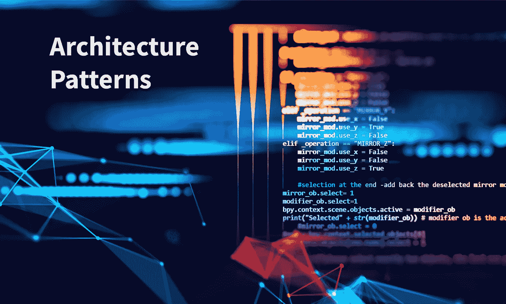
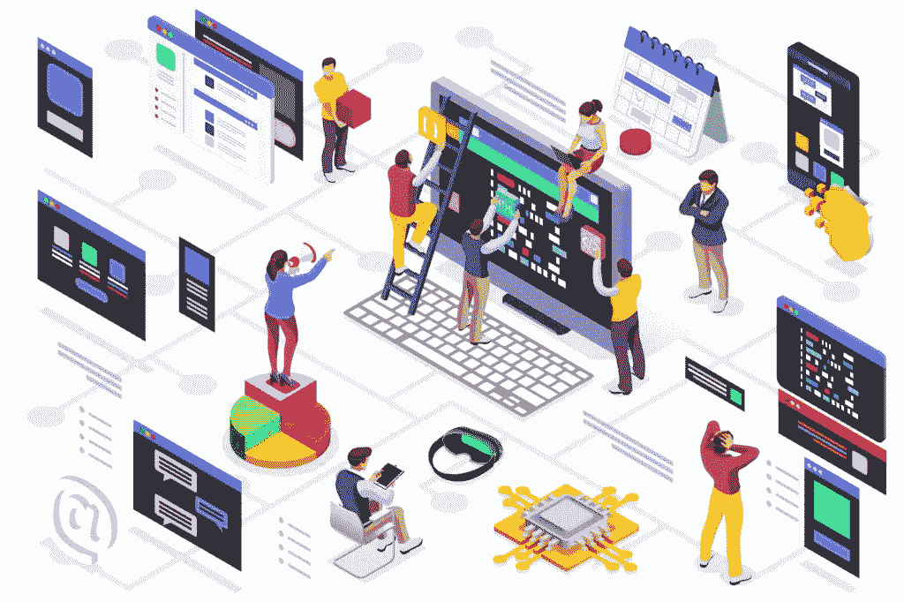

# 7 大软件架构模式——如何选择正确的模式

> 原文：<https://medium.datadriveninvestor.com/top-7-software-architecture-patterns-how-to-choose-the-right-one-8f3da4ca49b1?source=collection_archive---------2----------------------->

虽然许多人喜欢使用企业级系统，但没有多少人知道它们是如何设计的。事实上，甚至在开发开始之前，您就必须选择合适的架构来产生您需要的功能。这就是为什么在将软件架构应用到设计中之前，理解所有不同的软件架构设计模式是至关重要的。在这篇文章中，我们将看看前七种模式，以便您选择最适合您需求的模式。然而，在进入所有细节之前，让我们先了解一下软件架构的定义。

# 什么是软件架构？

通俗地说，软件架构就是获取软件的特征，并将其转换成满足您的业务需求和技术需求的结构化解决方案。这些特征包括可伸缩性、可重用性、灵活性和许多其他特征。有了这个定义，我们需要开始考虑会对架构设计产生影响的软件质量。

 [## 2019 年最值得学习的编码语言|数据驱动的投资者

### 在我读大学的那几年，我跳过了很多次夜游去学习 Java，希望有一天它能帮助我在…

www.datadriveninvestor.com](https://www.datadriveninvestor.com/2019/02/21/best-coding-languages-to-learn-in-2019/) 

这一点非常重要，因为很多时候你的产品负责人会告诉你，商业模式必须快速调整，因为公司正试图在一个不断发展的快节奏市场中竞争。换句话说，软件需要具有可扩展性、可维护性和模块化。作为一名软件架构师，您知道为了满足业务需求，架构必须具有低容错性、可伸缩性和可靠性，以产生必要的性能。

既然您知道了将要处理的一些问题，那么您可以开始考虑架构模式了。这些模式将解决诸如最小化业务风险、维护高可用性等问题。请记住，决定使用哪种架构将取决于您的独特需求。因此，可能需要一些[定制软件编程](https://skywell.software/)。现在让我们来看看七大架构模式:

# 分层模式

这种模式将有助于创建可以分解为子任务的东西，并且所有子任务都处于一定的抽象层次。这种类型的软件系统架构常用于桌面应用和电子商务 web 应用。

# 客户机-服务器模式

正如您可能已经猜到的那样，这里有两个方面。它的工作方式是服务器向客户机组件提供客户机需要的服务，后者将把正确的服务提供给那些客户机。此外，服务器会一直监听客户端发出的请求。你会在一些日常使用的在线应用中遇到这样的编程架构，比如电子邮件和文件共享服务。

# 主从模式

就像上面的模式一样，这里也有两个实体。主组件将所有作业分配给从组件，并从从组件编译的内容中计算出最终结果。这种架构模式用于数据库复制和将外围设备连接到总线。

# 管道过滤模式

如果您希望创建一个生成和处理数据流的系统，这将是一个不错的选择。各个处理步骤包含在过滤器中，需要处理的数据通过管道流动。您可以使用这些管道来缓冲或同步数据。这种架构的好例子可以在数据编译器生物信息工作流程中找到。

# 经纪人模式

如果您需要将自治计算机与其他系统连接起来，而这些系统又不是直接相连的，那么这是一个很好的模式。这些组件可以通过远程过程调用相互通信。代理的工作是协调所有元素之间的信息流。服务器将把它们所有的功能发送给代理。当代理收到客户端请求时，它会将客户端重定向到适当的服务。如果您熟悉 Apache Kafka，这是最广为人知的代理模式的例子之一。

# 对等模式

所有独立的组件都称为“对等体”它们可以像客户端一样请求对等体执行特定功能，或者像服务器一样向对等体提供它们需要的一切。对等体的角色可能会随着时间而改变。这种模式在文件共享网络中很常见。

# 事件总线模式

与这个列表中的其他一些模式不同，这个模式有四个实体:总线、侦听器、源和通道。源将消息发送到事件总线上的某些通道，而侦听器将调谐到它们需要的通道。当消息被发布到收听的频道时，收听者将被通知。这种架构在 Android 应用程序和各种通知服务中非常普遍。

我们希望所提供的信息在您设计软件时对您有用。重要的是要记住，除了我们提到的所有架构模式，软件开发方法也将扮演重要的角色。因此，在创建您需要的软件时，一定要考虑到所有的需求和约束。

*最初发布于*[*https://sky well . software*](https://skywell.software/blog/top-7-software-architecture-patterns-how-to-choose-the-right-one/)*。*