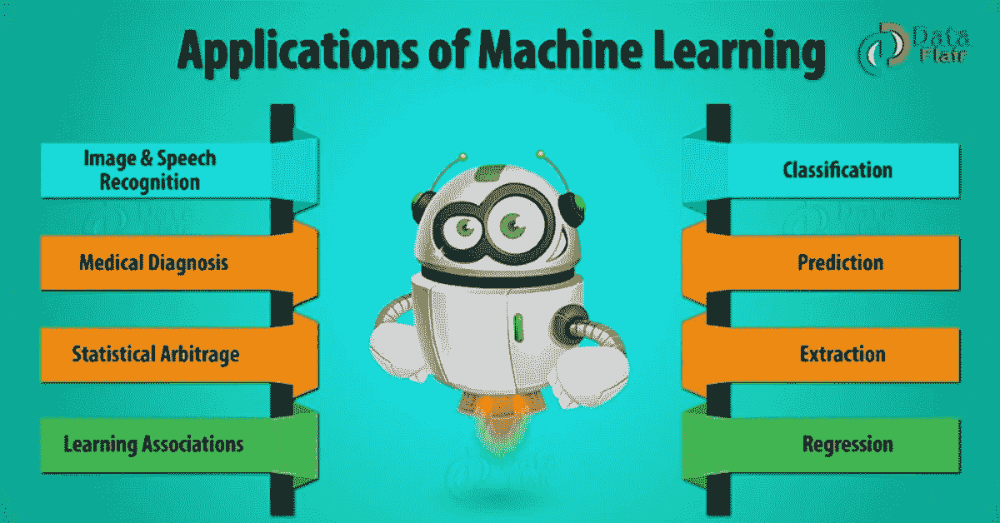

# 机器学习的 9 大应用

> 原文：<https://medium.datadriveninvestor.com/top-9-applications-of-machine-learning-4425aaae2f93?source=collection_archive---------3----------------------->

机器学习是一门让机器能够自己做出决定的科学。这些系统还能够学习过去的经验或分析历史数据。它根据自己的经验提供结果。在这里，我们将探索机器学习的应用。机器学习的这些应用显示了机器学习的领域或范围。

所以，让我们开始机器学习应用。

*现实世界中 9 大机器学习应用*

# 1.机器学习应用

随着我们进入数字时代，我们看到的现代创新之一是机器学习的产生。这种令人难以置信的人工智能形式已经在各种行业和职业中得到应用。例如，图像和语音识别、医疗诊断、预测、分类、学习关联、统计套利、提取、回归。今天，我们来看看当今世界中所有这些机器学习应用。

 [## DDI 编辑推荐:5 本机器学习书籍，让你从新手变成数据驱动专家…

### 机器学习行业的蓬勃发展重新引起了人们对人工智能的兴趣

www.datadriveninvestor.com](https://www.datadriveninvestor.com/2019/03/03/editors-pick-5-machine-learning-books/) 

这些是真实世界的机器学习应用，让我们一个一个来看——

# 1.1.图像识别

它是最常见的机器学习应用之一。在许多情况下，您可以将对象归类为数字图像。对于数字图像，测量描述图像中每个像素的输出。

在黑白图像的情况下，每个像素的强度作为一个度量。因此，如果一幅黑白图像有 N*N 个像素，那么像素的总数和度量就是 N2。

[我们来讨论一下机器学习中的 ANN](https://data-flair.training/blogs/artificial-neural-network/)

在彩色图像中，每个像素被认为提供了 3 个主要颜色分量(即 RGB)的强度的 3 个测量值。所以 N*N 个彩色图像有 3 个 N2 测量值。

*   对于人脸检测，类别可以是人脸对无人脸。在几个人的数据库中，每个人可能有一个单独的类别。
*   对于字符识别，我们可以将一段文字分割成更小的图像，每个图像包含一个字符。类别可能由 26 个英文字母、10 个数字和一些特殊字符组成。

# 1.2.语音识别

语音识别(SR)是将口语单词翻译成文本。它也被称为“自动语音识别”(ASR)，“计算机语音识别”，或“语音到文本”(STT)。

在语音识别中，软件应用程序识别说出的单词。该机器学习应用中的测量值可能是一组表示语音信号的数字。我们可以将信号分割成包含不同单词或音素的部分。在每一段中，我们可以用不同时频带的强度或能量来表示语音信号。

虽然信号表示的细节超出了本程序的范围，但我们可以用一组实数值来表示信号。

[你知道人工神经网络模型](https://data-flair.training/blogs/artificial-neural-network-model/)吗

语音识别、机器学习应用包括语音用户界面。语音用户接口例如语音拨号、呼叫路由、家用电器控制。它还可以用作简单的数据输入、结构化文档的准备、语音到文本处理和平面。

# 1.3.医疗诊断

ML 提供的方法、技术和工具可以帮助解决各种医学领域中的诊断和预后问题。它被用于分析临床参数及其组合对预后的重要性，例如疾病进展的预测，用于提取医学知识以进行结果研究，用于治疗计划和支持，以及用于整体患者管理。ML 还用于[数据分析](http://data-flair.training/blogs/data-analytics-comprehensive-guide/)，例如通过适当处理不完整数据来检测数据中的规律性，解释重症监护室中使用的连续数据，以及智能报警，从而实现有效和高效的监控。

有人认为，成功实施最大似然法有助于将基于计算机的系统集成到医疗保健环境中，为促进和加强医学专家的工作并最终提高医疗保健的效率和质量提供了机会。

[让我们来看看神经网络算法](https://data-flair.training/blogs/neural-network-algorithms/)

在医学诊断中，主要的兴趣是确定疾病的存在，然后对其进行准确的识别。每种疾病都有一个单独的类别，没有疾病的病例也有一个类别。在这里，机器学习通过分析患者的数据来提高医疗诊断的准确性。

这种机器学习应用中的测量通常是某些医学测试(例如血压、温度和各种血液测试)或医学诊断(例如医学图像)的结果、各种症状的存在/不存在/强度以及关于患者的基本身体信息(年龄、性别、体重等)。根据这些测量的结果，医生们缩小了病人所患疾病的范围。

# 1.4.统计套利

在金融领域，统计套利是指自动交易策略，这是典型的短期交易，涉及大量证券。在这种策略中，用户试图基于诸如历史相关性和一般经济变量之类的数量来实现一组证券的交易算法。这些测量可以被视为分类或估计问题。基本假设是，价格将向历史平均水平移动。

我们应用机器学习方法来获得指数套利策略。特别是，我们对交易所交易基金和股票流的价格采用线性回归和支持向量回归(SVR)。通过使用主成分分析(PCA)降低特征空间的维数，我们观察了 SVR 在应用中的好处和注意的问题。为了生成交易信号，我们将之前回归的残差建模为均值回复过程。

在分类的情况下，每种证券的类别可能是卖出、买入或什么都不做。在估计的情况下，人们可能试图预测每种证券在未来时间范围内的预期收益。在这种情况下，人们通常需要使用预期回报的估计值来做出交易决策(买入、卖出等)。)

# 1.5.学习协会

学习关联是深入了解产品之间各种关联的过程。一个很好的例子是看似不相关的产品如何揭示彼此之间的联系。当分析顾客的购买行为时。

[我们来讨论机器学习中的深度学习和神经网络](https://data-flair.training/blogs/deep-learning/)

机器学习的一个应用——经常研究人们购买的产品之间的关联，这也被称为购物篮分析。如果一个购买者购买了 X，他或她会因为他们之间的关系而强迫购买 Y 吗？这导致了鱼和薯条之间的关系。当新产品投放市场时，了解了这些关系，就会发展出新的关系。了解这些关系有助于向客户推荐相关产品。为了提高客户购买的可能性，它还可以帮助捆绑产品以获得更好的包装。

机器对产品之间关联的学习就是学习关联。有一次我们通过考察大量销售数据发现了关联，[大数据](http://data-flair.training/blogs/why-learn-big-data-use-cases/)分析师。在学习条件概率时，它可以开发一个规则来导出一个概率测试。

# 1.6.分类

分类是将研究群体中的每个个体分成许多类的过程。这被确定为独立变量。

[看看卷积神经网络架构](https://data-flair.training/blogs/convolutional-neural-networks/)

分类有助于分析师使用对象的度量来识别该对象所属的类别。为了建立有效的规则，分析师使用数据。数据由许多具有正确分类的对象示例组成。

例如，在银行决定发放贷款之前，它会评估客户的还贷能力。通过考虑客户的收入、年龄、储蓄和财务历史等因素，我们可以做到这一点。这些信息取自贷款的过去数据。因此，搜索者使用来创建客户属性和相关风险之间的关系。

# 1.7.预言；预测；预告

考虑这样一个例子，一家银行计算任何贷款申请人无法偿还贷款的概率。为了计算故障的概率，系统将首先需要将可用数据分类到某些组中。它由分析师规定的一套规则来描述。

一旦我们做了分类，根据需要，我们可以计算概率。这些概率计算可以出于各种目的跨所有扇区进行计算

当前预测是最热门的机器学习算法之一。让我们以零售业为例，之前我们能够获得上个月/年/ 5 年/排灯节/圣诞节的销售报告等洞察。这些类型的报告被称为历史报告。但目前企业更感兴趣的是了解我下个月/年/排灯节的销售额，等等。
以便企业能够做出所需的决策(与采购、库存等相关)。)准时。

# 1.8.提取，血统

信息抽取(IE)是机器学习的另一个应用。它是从非结构化数据中提取结构化信息的过程。例如网页、文章、博客、商业报告和电子邮件。关系数据库维护信息提取产生的输出。

提取过程将输入作为一组文档，并生成结构化数据。这种输出是一种汇总形式，例如关系数据库中的 excel 表和表格。

如今，提取正在成为大数据行业的关键。

正如我们所知，大量数据正在生成，其中大部分数据是非结构化的。第一个关键挑战是处理非结构化数据。现在，基于某种模式将非结构化数据转换为结构化形式，以便将其存储在 [RDBMS](https://data-flair.training/blogs/sql-rdbms/) 中。

除此之外，目前的数据收集机制也在发生变化。以前，我们在一天结束时(EOD)分批收集数据，但现在，业务部门希望数据一生成就立即收集，即实时收集。

# 1.9.回归

我们也可以将机器学习应用于回归。

假设 x= x1，x2，x3，… xn 是输入变量，y 是输出变量。在这种情况下，我们可以使用机器学习技术在输入变量(x)的基础上产生输出(y)。您可以使用模型来表示各种参数之间的关系，如下所示:

Y=g(x)其中 g 是一个依赖于模型特定特征的函数。
在回归中，我们可以利用机器学习的原理来优化参数。以减少近似误差并计算最接近的可能结果。

我们也可以用机器学习进行函数优化。我们可以选择改变输入来得到更好的模型。这提供了一个新的和改进的模型。这就是所谓的响应面设计。

所以，这都是关于机器学习的应用。希望你喜欢我们的解释。

# 2.结论

总之，机器学习是人工智能领域一个不可思议的突破。当你想到它时，它确实有一些可怕的含义，这些机器学习应用是这项技术可以改善我们生活的许多方式中的几种。

如果你发现了任何其他机器学习应用，那么，请在评论中告诉我们！

*最初发布:*[*https://data-flair . training/blogs/machine-learning-applications*](https://data-flair.training/blogs/machine-learning-applications/)