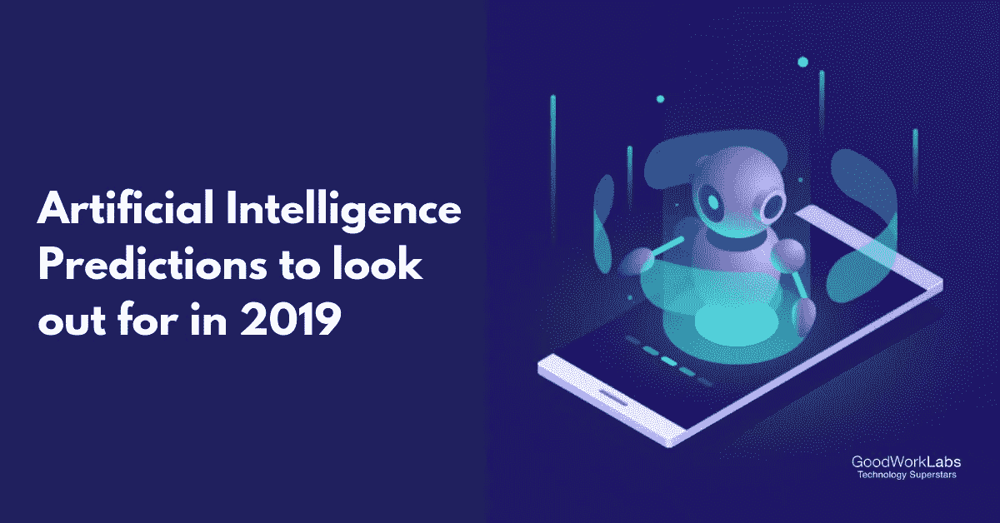

# 2019 年顶级人工智能(AI)预测

> 原文：<https://medium.datadriveninvestor.com/top-artificial-intelligence-ai-predictions-for-2019-b7d120c59f89?source=collection_archive---------17----------------------->

当我们说[人工智能](https://www.goodworklabs.com/artificial-intelligence-solutions/)或 AI 是全球所有公司创新的主导力量时，这不是谎言。全球人工智能市场正在崛起。从 2016 年的区区 40，650 亿美元，预计到 2025 年将达到高达 1694.118 亿美元。

AI Trends in 2019

根据在线统计和商业智能门户 [Statista](https://www.statista.com/) 的说法，面向企业应用市场的人工智能将产生很大一部分收入。然而，随着 2019 年的到来，[人工智能](https://stopad.io/blog/artificial-intelligence-facts)预计只会在受欢迎程度上跨越另一个门槛。让我们来看看人工智能对 2019 年的顶级预测:

在包括语音识别在内的众多领域中，机器学习是人工智能的强大力量，它让 Alexa 能够说话，让脸书能够自动标记，让谷歌的无人驾驶汽车能够检测到路过的人。当谈到机器学习时，现有的人类决策数据库有助于它做出适当的决定。

但有时，即使是数据也无法描绘出一个广泛群体的清晰图景。这就产生了一个问题，因为如果数据集没有被适当和充分地标记，捕捉数据集更广泛的细微差别是一项困难的工作。

2019 年肯定会见证一些公司拥有致力于解锁结构更具包容性的数据集的产品，从而减少人工智能的偏见。

曾经有一段时间，人工智能所做的决定依赖于算法，这些算法可以在没有太多麻烦的情况下做出判断。不管输出是对还是错；它可以解释决策的事实具有很大的重要性。

在医疗保健等服务领域，机器的决策事关生死。这使得评估设备推出特定决策背后的原因变得至关重要。这同样适用于金融领域。你应该知道为什么一台机器拒绝向某个人提供贷款。

今年，我们将看到人工智能被用来促进这些机器预测的自动化，并提供对此类预测的黑匣子的洞察。

假新闻和假图像只是在误导机器学习算法方面事情发展的几个便利例子。这将对机器算法达成或破坏交易的情况下的安全性构成挑战，比如无人驾驶汽车。到目前为止，唯一的担忧围绕着假新闻、误导性的图像、视频和音频。

更重要的、统一的和有计划的攻击将以非常令人信服的方式展示。这只会使评估数据的真实性和更精确地提取数据变得困难。

当我们说大多数围绕人工智能的项目也需要有一系列好标签的最高质量的数据时，这是真的。但是，大多数这些项目甚至在没有启动的情况下就失败了，因为解释手头问题的数据不存在，或者存在的数据很难标记，因此不适合人工智能考虑。

然而，深度学习有助于解决这一挑战。有两种方法可以利用深度学习技术，即使数据量远远少于所需。

第一种方法是转移学习——这是一种方法，其中模型通过适用于大量数据的领域进行学习，然后在数据非常少的不同领域引导教学。迁移学习最好的一点是，即使对于不同的数据类型，这些领域也是完美的。

第二种选择是模拟和生成合成数据。敌对网络有助于创造非常现实的数据。我们再次考虑自动驾驶汽车的例子。生产这些汽车的公司制造了实际情况，这些实际情况关注的是比汽车在现实中行驶的距离要远得多的距离。

这就是为什么预计许多公司将利用模拟和虚拟现实在机器学习方面取得巨大进步，而这在以前由于许多数据限制是不可能的。

随着客户对在互联网上向公司提供数据的前景变得越来越谨慎，企业需要转向人工智能和机器学习来获取这些数据。虽然这一举措仍处于早期阶段，但苹果已经在他们的移动设备上运行一些机器学习模型，而不是在他们的云系统上，这是对事情即将发生变化的描述。

可以肯定的是，2019 年这一趋势将会加速。包括智能手机、智能家居以及物联网环境在内的电子集团中更重要的一块，将把机器学习的操作带到一个需要自适应和自发的地方。

在 GoodWorkLabs，我们不断致力于最新的人工智能技术，并为企业开发机器学习模型以提高性能。我们的[人工智能组合](https://www.goodworklabs.com/ai-portfolio/)将向您简要介绍我们开发的人工智能解决方案。

如果您的企业需要定制的人工智能解决方案，请在下面给我们发一条短信:

*原载于 2019 年 2 月 15 日*[*【www.goodworklabs.com】*](https://www.goodworklabs.com/artificial-intelligence-trends-2019/)*。*

# DDI 特色数据科学课程:

*   [**用于数据科学的 Python**](http://go.datadriveninvestor.com/intro-python/mb)
*   [**Scikit-Learn**](http://go.datadriveninvestor.com/scikitlearn/mb)
*   [**深度学习**](http://go.datadriveninvestor.com/deeplearningpython/mb)

**DDI 可能会从这些链接中收取会员佣金。我们感谢你一直以来的支持。*