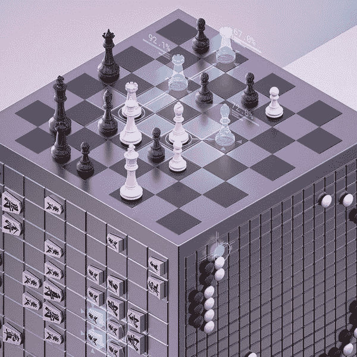

# 冠军:AlphaZero / AlphaStar

> 原文：<https://medium.datadriveninvestor.com/top-dog-alphazero-alphastar-7b2730a6431a?source=collection_archive---------2----------------------->

AlphaZero 和 [AlphaStar](https://deepmind.com/blog/alphastar-mastering-real-time-strategy-game-starcraft-ii/) 是谷歌 DeepMind 打造的两款人工智能，用于在专业水平上玩游戏。构建人工智能以在游戏中击败人类(或现在以前的人工智能)一直是评估人工智能系统的一种方式，因为这是一种低风险的测试，但仍能抓住头条新闻和兴趣。

AlphaZero 于 2017 年底问世，是一个下棋的人工智能， [shogi](https://en.wikipedia.org/wiki/Shogi) 和 [Go](https://en.wikipedia.org/wiki/Go_(game)) ，它能够在每场比赛中击败之前的顶级人工智能。

围棋是一个很难攻克的游戏，第一个打败人类的人工智能 AlphaGo 于 2015 年 10 月问世。而第一个在国际象棋中击败人类的人工智能“深蓝”出现在 1996 年。这几乎是 20 年的差距，并给出了一个很好的图片的复杂性，游戏围棋超过国际象棋。AlphaGo 也是 DeepMind 做的，是 AlphaZero 的前身。

> [DDI 编辑推荐 Google 云平台上 TensorFlow 的机器学习](http://go.datadriveninvestor.com/tensorflowML/matf)

AlphaZero 的独特之处在于它学会了如何玩游戏。AlphaZero 使用深度神经网络[,这些网络只被赋予游戏规则。它没有使用人类玩的“真实”游戏进行训练，也没有任何击败游戏的策略。相反，它只利用与自己对抗的游戏进行训练。](https://en.wikipedia.org/wiki/Artificial_neural_network)

让 AlphaZero 和自己对弈的过程叫做[强化学习](https://en.wikipedia.org/wiki/Reinforcement_learning)。这是一个未经训练的神经网络系统与自己进行数百万次游戏，并被编程为对输赢进行“奖励”和“惩罚”，就像心理学中的操作性条件反射一样。游戏一开始完全是随机的，但是随着系统从它的赢和输中学习，它开始调整它的游戏性，试图赢。根据游戏的复杂程度，训练所需的时间会有所不同。国际象棋花了 9 个小时，松木花了 12 个小时，围棋花了 13 天。

过去的棋盘游戏人工智能使用不同种类的[树搜索](https://en.wikipedia.org/wiki/Game_tree)结合人类创造的[试探法](https://en.wikipedia.org/wiki/Heuristic)来修剪搜索空间。AlphaZero 能够在几个小时的训练时间内，在不同的游戏中击败以前的顶级人工智能，建立真正好的机器创建的启发式算法。

下图显示了训练结束后，AlphaZero 如何在每场比赛中与顶级人工智能进行比赛:

AlphaStar 于 2019 年 1 月问世，是《星际争霸 2》中第一个击败职业选手的 AI。《星际争霸》是一款自 1998 年问世的游戏，是有史以来第五大畅销电脑游戏。它被认为是最复杂的即时战略(RTS)游戏之一，也是时间最长的 RTS 游戏之一。这使得它成为一个伟大的游戏来测试更多真实世界类型的挑战。

星际争霸 2 是一款非常复杂的游戏。有 3 个不同的种族可供玩家选择，而这些种族恰好彼此不同，以至于大多数职业玩家只专注于玩一个特定的种族。玩家还必须构建一些东西，以便能够在游戏后期使用它们来管理大型经济系统，平衡短期目标和长期目标。竞争对手还必须积极侦察，找出对手正在做什么的信息；与国际象棋和围棋不同，棋手之间的信息是不完全的。

AlphaStar 的训练方式与 AlphaZero 类似，使用神经网络和强化学习，但它也使用了[监督学习](https://en.wikipedia.org/wiki/Supervised_learning)。在训练的初始监督学习阶段，它使用了来自真实人类锦标赛的游戏数据。这使得 AlphaStar 能够模仿玩家为游戏使用的基本策略，并使其能够击败大多数像样的爱好玩家和游戏内置的“精英”级人工智能，但不能击败职业玩家。

他们能够为每个代理人模拟 200 年的游戏，每个代理人在仅训练 14 天后就有稍微不同的游戏策略。下图显示了一旦从监督学习切换到多智能体强化学习(下面称为 AlphaStar 训练联盟)，AI 的智能体效应的增加。TLO 和马纳是 AlphaStar 在比赛中能够击败的两位职业选手。

AlphaStar 能够克服许多困扰人工智能多年的挑战:

*   **博弈论**:星际争霸没有单一的最佳策略。因此，人工智能需要不断尝试新的策略，以找到有效的方法，从而帮助扩展其战略知识。
*   **不完全信息**:与 AlphaZero 处理完全信息游戏不同，在 alpha zero 的游戏中，双方玩家可以随时看到整个游戏棋盘，而《星际争霸》的信息不完全，对手玩家需要积极侦察，以发现对方玩家在做什么。
*   **长期规划**:玩星际争霸游戏大约需要一个小时左右。在游戏早期采取的一些行动，可能直到游戏后期才会产生结果。
*   **实时**:与 AlphaZero 不同的是，alpha zero 的游戏采用基于回合的系统，对于人类来说，在做出每个动作之前花时间思考并不罕见，而《星际争霸》需要实时进行，双方玩家在同一时间采取行动(每分钟数百个行动)，并在整个游戏中持续进行。
*   大的行动空间:虽然在 19x19 的棋盘上围棋比 8x8 的棋盘进步了一大步，但星际争霸的游戏使用了更大的空间，有数百个不同的单位可以修改。在每个时间步，平均有 10 个⁶动作。

通过能够为更复杂的游戏环境克服这些挑战，这推动 AI 能够在现实世界环境中有更多的可能性。AlphaZero 和 AlphaStar 能够证明改进他们的算法和使用强化训练如何对人工智能的有效性产生巨大影响。测试这些理论，看看他们是否在游戏中工作，是一个很好的概念证明，希望其他人可以采取和制造人工智能来帮助解决现实世界的问题。

来源:

[https://deep mind . com/blog/alpha zero-sheding-new-light-grand-games-chess-shogi-and-go/](https://deepmind.com/blog/alphazero-shedding-new-light-grand-games-chess-shogi-and-go/)

[https://deep mind . com/blog/alpha star-mastering-real-time-strategy-game-starcraft-ii/](https://deepmind.com/blog/alphastar-mastering-real-time-strategy-game-starcraft-ii/)