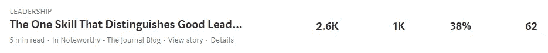

# 写作妙招

> 原文：<https://medium.datadriveninvestor.com/top-helpful-tips-for-fab-writing-247768ae4125?source=collection_archive---------10----------------------->

## 通过使用这些有效的技术，开始达到关键的里程碑

Photo by [Hannah Olinger](https://unsplash.com/@hannaholinger?utm_source=unsplash&utm_medium=referral&utm_content=creditCopyText) on [Unsplash](https://unsplash.com/s/photos/woman-writing?utm_source=unsplash&utm_medium=referral&utm_content=creditCopyText)

在庆祝我最近达到的一个里程碑的同时，我也想分享我在过去几个月写文章中学到的最重要的经验，这将使你想起一些事情，并为你提供一些投入。

纯粹的满足。到达一个里程碑，确认我们正在写一些对很多人真正有用的东西，这是一种怎样的感觉。

当我第一次开始写作时，唯一的读者是我的家人和密友，通过使用我以前与他们分享的朋友链接。他们持续的支持鼓励我继续写作，尽管统计数据并不令人鼓舞。

我经常检查我的文章是否有更多的浏览，尤其是更多的阅读。当我看到浏览量与阅读量之比非常低的时候，我会感到沮丧。

久而久之，我们都学会了静下心来，寻找下一篇文章的改进方法。

如果你想知道，我提到的文章是:

 [## 区分优秀领导者和平庸老板的一项技能

### 在我过去的工作中，我工作过的每一位领导、经理或老板都非常有才华，有丰富的经验，是…

blog.usejournal.com](https://blog.usejournal.com/the-one-skill-that-distinguishes-good-leaders-from-mediocre-bosses-3c8f73d034e3) 

以下是目前的统计数据:

Statistics from Medium

对于像香农·阿什利、[杰夫·戈因斯](https://medium.com/u/b176436e91b1?source=post_page-----247768ae4125--------------------------------)、[蒂姆·丹宁](https://medium.com/u/b6d641be1066?source=post_page-----247768ae4125--------------------------------)和其他许多有成就的作家来说，这个里程碑和这篇文章可能会让他们想起他们最初的旅程。

## 只关注一篇文章中的一点或关键要点

在我早期的一篇文章中，我关注了三个不同的场景——一个来自商业世界，一个来自个人生活，还有一个试图将它们联系在一起。一个最好的朋友很快告诉我，他不能在一篇文章中关注这些不同的品种。他提到他不能从中得到要点，并在两者之间失去了兴趣。

这对我来说是早期学习。读者希望从一篇文章中获得一个关键的收获。只需要足够的支持点来阐述一个主要观点。这些天来，读者的注意力持续时间已经很短了，因为有许多其他人和许多活动需要占用每个人几秒钟的时间。

 [## 成功人生的 25 种自我提升方式|数据驱动的投资者

### “我活得越久，学到的就越多。学的越多，体会的越多，知道的越少。”―米切尔·莱格兰德时间到…

www.datadriveninvestor.com](https://www.datadriveninvestor.com/2019/03/12/25-self-improvement-ways-for-a-successful-life/) 

关于这一点，在 Wyzowl.com 有一个非常好的信息图表。根据他们的说法，基于几年前的一项研究，*我们的注意力持续时间在短短 15 年内显著缩短。2000 年的时候是 12 秒。现在，15 年过去了，它明显缩短到了 8.25 秒。事实上，科学家认为我们现在的注意力持续时间比金鱼短，金鱼能够专注于一项任务或一个物体 9 秒钟。*

## 关注“对读者有什么好处？”

每个人都在寻找对自己有什么好处。仅仅因为你正在写一篇文章并不意味着你关注你将从中获得什么。如果他们已经知道的东西有一些新的关键点或解释，但以一种非常吸引人的方式提出，那将会引起读者的注意。

一个人的时候，专注于自己；但是当你和某人在一起或者你在为别人写作的时候，就把注意力集中在他们身上。

## 确保使用好的标题——使用标题分析器

标题就像某人穿的引人注目的服装。当你穿过人群时，只有少数人会引起你的注意。这些人通常穿得非常好，或者与众不同，以至于你无法阻止自己去看他们。

故事的标题也需要从大量其他文章中吸引读者的注意力。有各种标题分析器可供免费使用。只要把你的标题放在这些网站上，他们就会反馈你的标题有多吸引人。我使用 [Sharethrough 标题分析器](https://headlines.sharethrough.com/)，也使用[上的标题分析器大写我的标题](https://capitalizemytitle.com/)。花些时间看看他们提供的建议，并不断提高分数，以确保足够好。

## 使用优秀的图片来吸引注意力

一张图胜过千言万语。花些时间寻找适合标题的图片。当然，使用免费提供的图片，这样你就不会陷入版权问题。你可以在 Pexels、Unsplash、Pixabay 上获得大量免费选择，或者只使用你的照片。

如果你只是在搜索中查看这些网站的前几张图片，那么很可能其他人(或许多其他人)已经使用过同样的图片。所以在搜索标准上要有创新，花时间向下滚动来找到合适的吸引人的图片。

## 记得使用语法检查工具

拼写和语法检查对每篇文章都至关重要。有固有的编辑器工具以及在线语法检查工具可用于此。我已经在大多数文章中成功地使用了[划线器](https://www.scribens.com/)并且在这篇文章中使用了[语法](https://www.grammarly.com/)，这仍然是更好的。

你不希望基本的错误妨碍你。点击发布按钮之前值得花费时间。

## 使用正确的标签

为了确保文章到达合适的读者群，使用正确的标签是很重要的。每件物品允许有五个标签，所以要充分利用这个设施。标签需要合适，否则我们是在愚弄读者。

你可以参考[这篇关于 Medium 上最受欢迎标签的文章](https://findingtom.com/most-popular-tags-medium/)、[这篇关于 LinkedIn 上伟大标签的文章](https://www.sendible.com/insights/how-to-use-hashtags-on-linkedin)来获得一些线索。

## 偶尔正确地使用引语

在文章中提及名人和名人的优秀相关引用总是好的。但是在一篇文章中使用多少应该是有限制的。否则，它就变成了一个引用的集合，而不是你的文章。

> 引用语在同一篇文章中起着引子的作用。

使用引用工具时，请确保您理解引用是如何在同一篇文章中充当某种东西的引子的，如上例所示。但是当你引用别人的话时，就这样写:

> *“写。重写。不写或重写时，阅读。我不知道有什么捷径。”
> —拉里·l·金，WD*

## 确保这些观点得到一些外部研究或文章的支持

媒体策展人似乎在寻找相关领域知名人士所做的支持性研究、文件、统计数据和研究。如果我们只是表达我们的想法，那么可信度可能是基于谁在阅读它的一个因素。但是当文章中的观点有一个外部基线时，整体可信度就会提高。

确保在文章中有一些这样的参考，以获得更多的文章被策划的机会，以及吸引一些媒体平台上最好的出版物。

## 加入个人风格

在上述观点的另一面，如果没有一些发生的个人经验，一些学习，从你个人遇到的情况中的关键观察，这往往只是指出一些研究人员已经得出的结论。

更好的是，如果你写一些你个人经历的故事，那会提供额外的参与。

伟大的故事，吸引人的标题和图片的结合，文章提出了一个关键点，并有证据支持，一定会成功。

这些要点将有助于你的文章在媒体上策划。你会注意到许多大出版商会开始联系你，在文章上留言，要求在他们的出版物上发表文章。

但是还有别的东西。我把最好的留到了最后——这是一种对我大部分时间都有用的重要学习方法。

## 在你的文章中创造你自己的个性和风格

在我的大多数文章中，我都保持了一种典型的方法。我引用我所知道的语言中的一个著名的谚语、谚语、格言或公理，目前有四个，不久将再增加一个。然后，我对这句格言做了一个变形，通过在上面提到的所有方面提供支持来解释我的观点。

你需要为文章找到一些你喜欢的风格。

## 总之，最有用的提示是:

1.  *只关注一篇文章中的一点或关键要点*
2.  *关注“这对读者有什么好处？”*
3.  *确保使用精彩的标题——使用标题分析器*
4.  *使用出色的图片来吸引注意力*
5.  *记得使用语法检查工具*
6.  *使用正确的标签*
7.  *偶尔正确使用引号*
8.  *确保观点得到一些外部研究或文章的支持*
9.  *加入个人风格*
10.  *在你的文章中创造你自己的个性和风格*

2019 沙希·库尔卡尼。保留所有权利。

