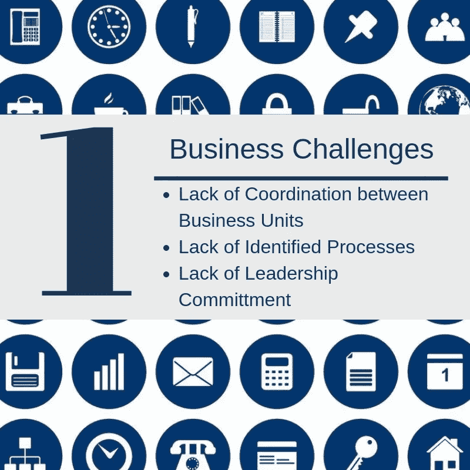
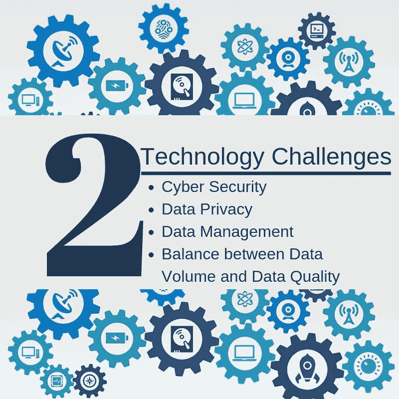
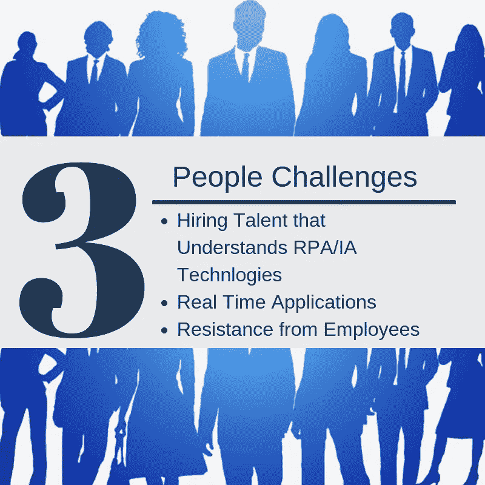

# 银行业、金融业和保险业面临的最大 IA 挑战

> 原文：<https://medium.datadriveninvestor.com/top-ia-challenges-for-banking-finance-and-insurance-a9dea652a20a?source=collection_archive---------18----------------------->

随着数字革命继续占据主导地位，智能自动化显然正在改变每个行业。银行、金融服务和保险 [(BFSI)](https://intelligentautomationbfsi.iqpc.com/landing/intelligent-automation-for-banking-financial-services-and-insurance-agenda?utm_source=topiachallenges2019&utm_medium=ad&utm_campaign=-external-ad&utm_term=topiachallenges2019&utm_content=text&mac=medium_aguis&disc=medium_aguis) 也不例外。据说，在某些情况下，使用人工智能和机器学习被证明可以节省公司的时间和金钱。但所有的变化都伴随着挑战和恐惧……以下是 2019 年[对](https://intelligentautomationbfsi.iqpc.com/downloads/challenging-bfsi-to-change-the-opportunities-and-challenges-that-lie-ahead-for-ia-in-banking-financial-services-and-insurance-in-2019?-ty-m&utm_source=topiachallenges2019&utm_medium=ad&utm_campaign=-external-ad&utm_term=topiachallenges2019&utm_content=text&mac=medium_aguis&disc=medium_aguis)[银行业、金融服务和保险业的三大挑战](https://intelligentautomationbfsi.iqpc.com/?utm_source=topiachallenges2019&utm_medium=ad&utm_campaign=-external-ad&utm_term=topiachallenges2019&utm_content=text&mac=medium_aguis&disc=medium_aguis)。

[点击此处查看完整报告](https://intelligentautomationbfsi.iqpc.com/downloads/challenging-bfsi-to-change-the-opportunities-and-challenges-that-lie-ahead-for-ia-in-banking-financial-services-and-insurance-in-2019?-ty-m&utm_source=topiachallenges2019&utm_medium=ad&utm_campaign=-external-ad&utm_term=topiachallenges2019&utm_content=text&mac=medium_aguis&disc=medium_aguis)