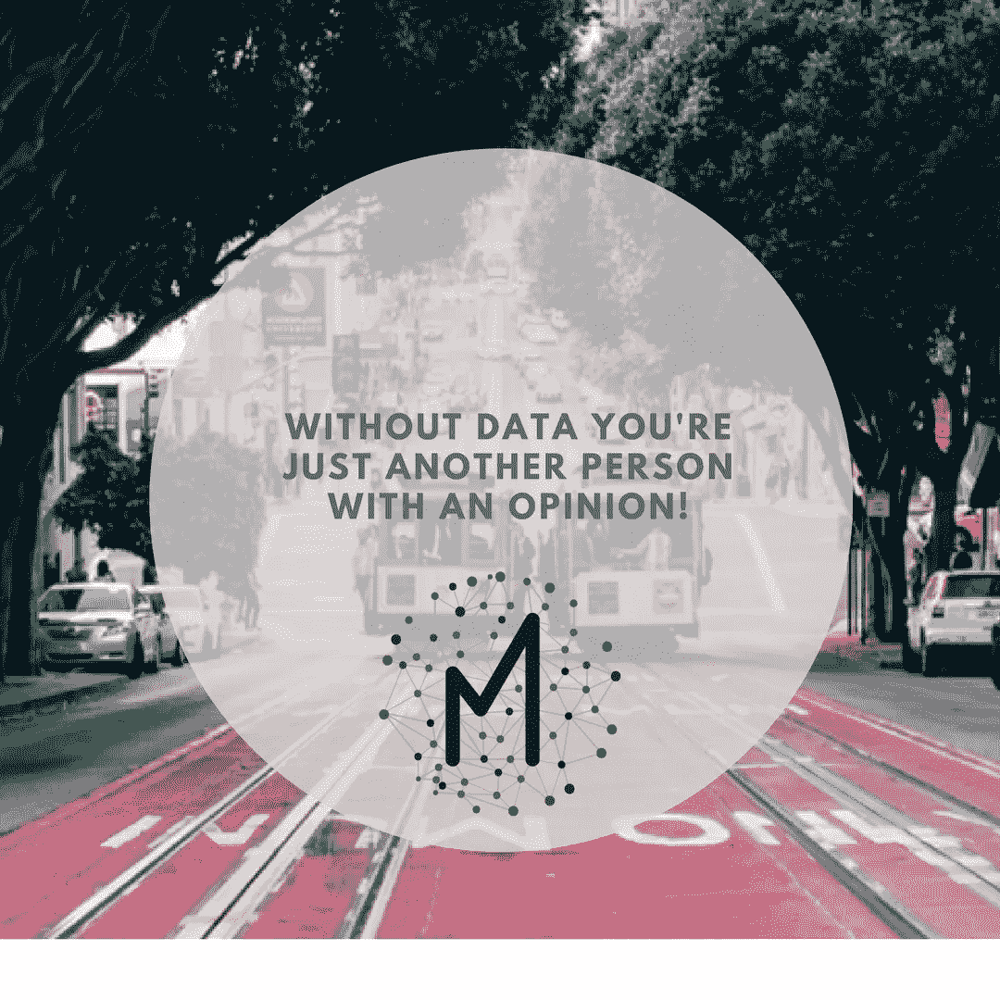
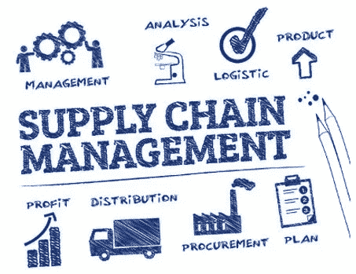
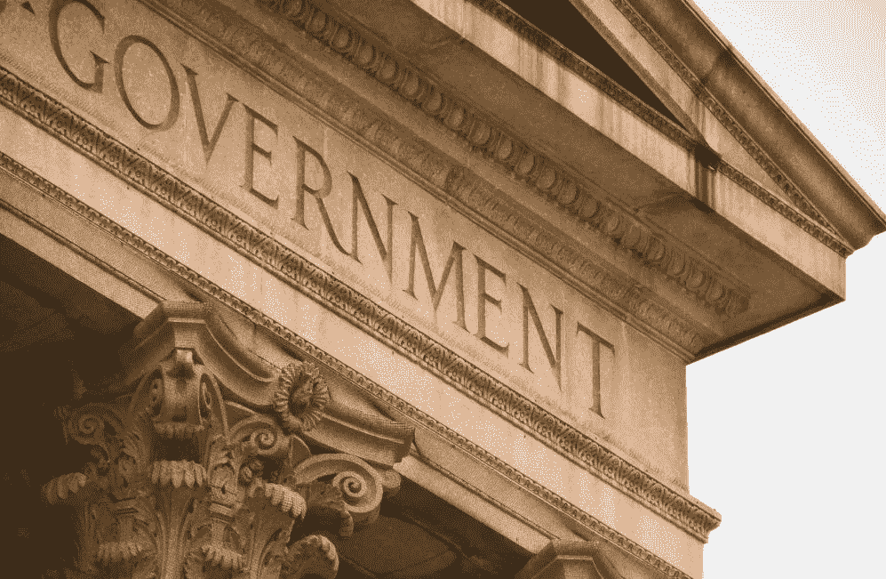

# 区块链将颠覆的顶级产业

> 原文：<https://medium.datadriveninvestor.com/top-industries-blockchain-will-disrupt-c50bfb7a6e1e?source=collection_archive---------1----------------------->

公司迫切需要这些新技能。企业家正在用区块链专业知识做不可思议的事情。你知道塞尔维亚拥有世界上最多的区块链开发者吗？还有很多未开发的潜力。

你有没有听说过一些事情在它进入日常生活之前很久..但什么也没做。当你看到信息技术革命，移动应用等。也许你会因为没有关注脸书、谷歌或亚马逊而自责。或者可能是最近，当像区块链这样的颠覆性技术永远改变了我们的生活？

大多数人很快就会在这个“如果……会怎样”的清单上添加另一件事——一件可能和其中任何一件一样具有变革性的事。美国国务院宣称它“有潜力成为我们这个时代的变革性技术”。那个区块链是什么？这将彻底改变一切。最重要的是，它将让整个商业模式成为历史。如果有一种现象有可能改变人们的生活和互动方式，那就是区块链。为什么会有这样的应用产生的嗡嗡声。

“通过教育，这些区块链先驱将塑造社会并留下他们的印记。对于那些学习、驾驭和使用这项新技术的人来说，机会是无穷无尽的。加入像 IBM 或微软这样的公司，拼命寻找你所拥有的技能来推动下一代的创新想法。

*   作为一名数字企业家，你可以利用这项技术，创造颠覆者，摆脱中间商，颠覆过时的商业模式
*   了解加密货币和初始硬币发行(ico)的秘密，帮助您制定投资决策
*   采取行动了解一项将世界带入 21 世纪的技术

作为真正理解并能够使用区块链的少数先驱之一，你掌握着所有这些机会的地图——甚至更多。”(基里尔·叶列缅科)

# 区块链将颠覆的顶级产业:

# 1.银行和金融

是的，你没看错，这个世界上最受资助的领域即将发生根本性的变化。我真的很高兴现在我不是在银行做经济学家。:)

作为区块链框架下的加密货币，比特币已经成为一种低交易费用的首选结算方式。

# 2.医疗保健服务

担心你的病史落入坏人之手？

不用再担心了，因为许多医疗机构**正在转向区块链技术。**

# **3.媒体和娱乐**

****

**厌倦了假新闻？对持续不断的知识盗窃感到愤愤不平？**

**那么你应该对**新秩序抱有希望，因为媒体和机构在管理、认证和对新闻和娱乐行业的创造力给予适当奖励方面接受区块链技术。****

# ****4.供应和物流****

********

****人为的失误、刁钻的做法以及[T5【工序】T6](https://www.eft.com/logistics/what-blockchain-and-how-it-going-benefit-logistics-ind...)**的不良影响可能很快就会被禁锢在历史的垃圾箱里，随着区块链技术的全面使用。******

******通过该系统，公司和企业可以在一个分散的存储库中记录交易和库存水平，以实现安全和透明的监控。******

# ******5.不动产******

************

******[**房地产**](https://www.weforum.org/.../how-disruptive-technology-could-solve-real-estate-s-tran...) 部门遭受欺诈个人的活动，他们犯罪并在虚假的房地产交易中骗取人们的血汗钱。******

****区块链技术敲响了此类活动的丧钟，交易透明度更高，所有权文件认证更容易，财产契约转移更快。****

# ****6.众筹****

********

****众筹作为一种为初创企业融资的可靠方式，已经获得了巨大的支持。****

****然而，他们收取高昂的交易费用，并存在少报募集资金的情况。区块链将会伸出援手，让用户有机会从参与区块链交易获得的信任中获得价值(资金)。****

# ****7 **。**零售****

********

****区块链使我们有可能享受一个 [**零售系统**](https://www.insider-trends.com/retail) ，在这个系统中，买家和卖家无需中间人和事件费用就可以进行互动。****

****零售交易所需的信任商数来自透明的网络，它建立在一个分散的系统上，该系统提供了交易的高度可靠性和安全性。****

# ****8.合法的****

********

****你可以期待有一天，区块链技术能够分散和透明地访问过去的法院判决/裁决，以及结构化文件的标题，所有权和其他行为；婚姻和死亡证明等公共信息；和有关知识产权的细节。****

****换句话说，不受操纵和不当干扰的电子法律账簿将标志着在**法律面前人人平等！******

# ******9.政府******

************

******[**治理**](https://www.huffingtonpost.com/.../blockchain-will-disrupt-every-industry_us_59638...) 的官僚作风导致了效率低下、腐败和对公民不负责任。借助区块链技术，政府现在可以大幅降低服务交付的成本，增加透明度，并提高政府活动的安全性。******

# ****10.保险****

********

****随着区块链科技在该行业站稳脚跟，您对 [**保险**](https://medium.com/.../how-blockchain-technology-can-benefit-insurance-policyhold...) 行业的信任度将得到提升。区块链的开放性将确保你的身份等重要数据与其他机密数据一起存储在安全的存储库中。一个永恒引领着保险行业区块链平台的发展。****

****_________****

****所以你有了，你自己列出的 ***区块链将会破坏的行业，*** 以及那些将会感受到区块链技术的灾难性影响的人，这种技术消除了国界，让世界成为一个更安全、更公平的居住地。你所能做的就是拥抱潮流，随波逐流，在这里，我们装备你一路前行，学习更多关于区块链的知识，以及它将如何对你的行业产生影响。少做就是否定自己采用区块链技术带来的诸多机遇和挑战。****

****直到下一次快乐分析，****

****曼亚****

****超级数据科学的二手资料，基里尔·叶列缅科。****

****在 insta gram[或 Linkedin](http://wwww.instagram.com/manjabogicevic/) 上关注我****

********