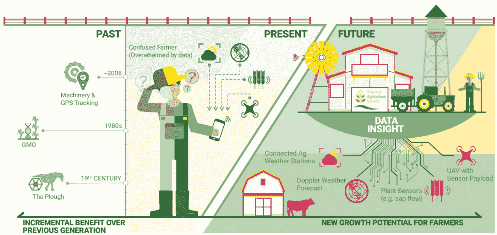
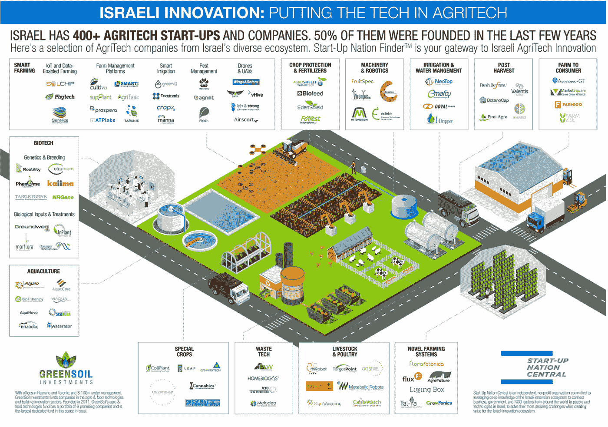
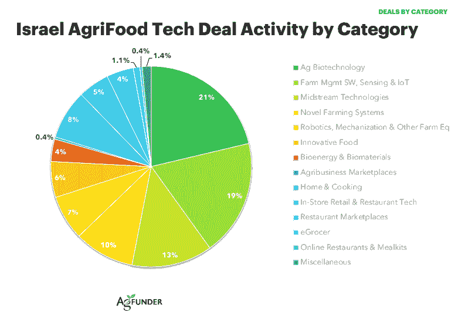

# 2019 年以色列农业技术方向

> 原文：<https://medium.datadriveninvestor.com/top-israel-agritech-direction-in-2019-98a47caf513a?source=collection_archive---------5----------------------->

以色列是一个拥有强大农业能力的国家，它现在正在生产世界领先的食品技术。在政府的大力支持下，以色列获得了军用级技术和一些最先进的科学发展，正在努力成为世界农业科技之都。该国正致力于在农业、农业食品区块链、创新农业技术动物健康技术等领域实施机器学习项目。未来几年，以色列预计将吸引更多投资进入其农业部门。请继续阅读，了解如何做到这一点。

# 以色列农业概况

以色列是一个壮丽的国家，山脉、沙漠、平原和肥沃的土地相互接壤，国土长约 470 公里，宽约 135 公里。以色列的气候也非常多样，从温带到热带都有。这个地区有两个主要季节，多雨的冬天和干燥晴朗的夏天。以色列北部经常下大雨，而南部几乎不下雨。

这里有一个令人惊讶的以色列农业事实:尽管如此多样的自然和小的领土，以色列目前有一个农业食品技术创新的[未来世界领导者的名声。这个拥有 900 万人口的国家在五年时间里(2014 年至 2018 年)成功地为 700 多家初创公司获得了](https://agfundernews.com/new-report-israel-agrifood-tech-startups-raise-759m-in-five-years.html)[7.59 亿美元的风险投资](https://agfundernews.com/new-report-israel-agrifood-tech-startups-raise-759m-in-five-years.html)。仅在 2017 年，以色列为上游技术筹集的投资([$ 1 . 87 亿](https://agfundernews.com/new-report-israel-agrifood-tech-startups-raise-759m-in-five-years.html))就超过了中国，在五年内几乎与印度一样多，尽管该国的人口是中国的 150 倍。此外，以色列现在是全球大麻研究中心，这是一个价值百万美元的产业，需要最具创新性的农业技术解决方案。

该国不断增长的人口、干旱的气候和该地区由来已久的地缘政治紧张局势促使以色列政府支持国家的粮食安全。目前，以色列拥有军用级别的数据、世界级的科学、研究以及航空和成像技术能力，其他任何国家都不可能很快超越。所有这些因素使以色列成为捕捉创新农业技术解决方案机会的理想之地。

# 什么是农业科技？

AgriTech 代表致力于提高效率或扰乱全球食品和农业行业的创业公司。目前，农业食品科技初创公司的股份很小，但世界领导人的目光都集中在它们身上。在全球范围内，[食品和农业是一个价值 7.8 万亿美元的行业](https://agfundernews.com/what-is-agrifood-tech.html)，雇佣了超过 40%的世界人口。随着[全球人口预计在未来三十年达到 97 亿](https://www.businessinsider.sg/the-worlds-population-is-expected-to-hit-9-7-billion-in-30-years-soar-to-11-billion-by-2100/)，农业必须想出办法养活所有这些人。

事情不那么光明的一面是，农业是温室气体排放的最大来源。它在环境损耗和污染中起着重要的作用。食物浪费、消费者健康问题和不断变化的消费者需求也是不容忽视的问题。

现代世界对现代技术寄予厚望。农业技术工程和软件解决方案可以使农业食品行业更加高效、可持续、经济、灵活和透明。

# 农业技术方向

农业科技创业公司可以分为几类:

[Israeli Innovation](https://agfundernews.com/israels-agritech-market-map-400-startups-putting-the-tech-in-agritech.html)

*   **AgriTech 生物技术**(种子、农药、肥料、动物药品)
*   **人工智能和大数据**(用于优化精准农业中作物和牲畜管理的传感器和机器学习)
*   **垂直农业**(用于在有限空间种植作物的软件和传感器解决方案)
*   **农业市场**(农民、零售商和分销商的在线平台)
*   **机器人**(在无人驾驶飞机、机器人和机械的帮助下实现农业操作的自动化)
*   **生物材料和生物能源**(农业副产品的提取、加工和用于其他行业)
*   **电子商店**(农业企业的网上商店和市场)
*   **农业管理软件、传感和物联网**(传感器、卫星图像、农业技术无人机、在线农场管理工具、精准农业的机器学习、农业中的物联网和计算机视觉技术)

今天，这个国家是一个主要的全球农业科技中心。以色列的农业创新令人印象深刻，它有望成为确保世界粮食安全的第一个国家。

# 以色列农业技术交易类别

让我们跳到 2019-2020 年的以色列农业技术交易，看看企业可以抓住的机会。

[Israel AgriFood Tech Deal Activity](https://agfunder.com/research/israel-agrifood-tech-investing-report-2014-2018/)

在过去的五年中，这些方向获得了最多的投资:

*   物联网
*   农业生物技术
*   感觉
*   农场管理软件
*   中游技术
*   机器人学
*   机械化
*   创新的农业设备
*   生物能
*   生物材料

在接下来的几年里，在这些方向工作的现有企业和初创公司有望筹集更多的投资。

在整个 2019 年和 2020 年，在以色列经营农业技术的企业将需要应对以下挑战和要求:

*   食品保障和安全
*   手工劳动力短缺
*   环境压力(气候/土地/资源)
*   水荒
*   当地对食物需求的增加
*   全球对食品需求的增长

尽快采取行动是保证你的农业企业可持续发展和盈利的必要条件。农业已经存在了许多世纪，现在是抛弃导致资源和竞争力损失的过时耕作方法的时候了。

传感器、计算机视觉、区块链、无人机和人工智能等技术可以解决以色列的主要农业问题。对于这样一个小国来说，无论条件如何，精准农业都是实现粮食安全和农业市场领先地位的最佳途径。

# 软件可以解决的农业商业问题

在以色列，**农业无人机**可以帮助大大提高粮食产量。无人机可以绕场飞行，并拍摄不易经常到达的区域的高分辨率图像。在无人机的帮助下，农民们可以即时获得农作物的最新信息。

[**土壤中的传感器**](https://www.quantumobile.com/case-studies/predicting-oil-felds-using-solids-dna/) 可以给农民准确的光照、水分和肥料的实时信息。当来自传感器和无人机的数据被发送到计算机并由机器学习解决方案进行分析时，农民可以根据实际数据优化他们的努力。无人机和传感器可以替代人工，这是另一种降低成本和增加利润的方式。

[**卫星作物监测系统**](https://www.quantumobile.com/case-studies/precision-farming-ai-solution/) 可以帮助农民远程观察田地，而不必频繁进行长时间的侦察访问。结合智能农业中的机器学习，卫星作物监控系统可以帮助农民远程管理他们的田地，在早期阶段检测问题并预测未来的发展。有了每个领域的最新信息，农民就能更好地应对环境挑战。

农业项目中的 [**机器学习**](https://www.quantumobile.com/case-studies/smart-livestock-farming-solution/) 是有效管理农场的另一种方法。在 ML 的帮助下，农民将能够节约水、肥料、牛粮和能源。更重要的是，机器学习有助于最大限度地减少人类劳动，并在可能的情况下消除劳动。例如，定制的机器学习解决方案可以精确预测和评估农业参数，如未来的牛体重、牛奶产量等。根据这些数据，农民可以做出明智的决定。

机器学习可以帮助农民从他们拥有的资源中获得更多，从而满足全球不断增长的粮食需求。[在全球范围内，每年有三分之一为人类消费而生产的食物被浪费或损失](https://www.israel21c.org/the-top-12-ways-israel-feeds-the-world/)，机器学习可以通过提供精确的管理和预测工具来帮助我们最终解决这个问题。

**计算机视觉和图像理解**可以帮助解决以色列农业目前面临的一些主要问题，如食品安全和农作物监控。在计算机视觉解决方案的帮助下，农民可以检测作物疾病，识别杂草，计算疾病和杂草面积，对农产品进行分级和分类。

**计算机视觉人体检测**可以帮助处理农场的安全问题。在一个与邻国既没有贸易也没有外交关系的国家，计算机视觉人脸识别可能是授予战略性农业和农业技术场所安全性和不可侵犯性的最佳选择。

**物联网解决方案**可以实现直接泵灌、喷灌和滴灌等传统农业方法的自动化。通过这种方式，自动化系统将监控田地条件，并在需要时只消耗所需的水量。智能物联网解决方案也可以减少田间的日常人工劳动。

# 最后的想法

从事农业的企业仍有时间抓住机会加入农业科技潮流。依靠手工劳动和个性化销售的传统农场不可能在竞争激烈的高科技农业环境中生存。重要的是在农业中使用机器学习，并通过其他智能技术进行控制，以确保农业企业和整个农业部门的可持续发展。

*撰稿* [*玛丽安娜·韦奇科*](https://ua.linkedin.com/in/mariana-vechirko-a94063b1) *校对* [*尤利安娜·克莱恩斯卡*](https://www.linkedin.com/in/uliana-krainska)