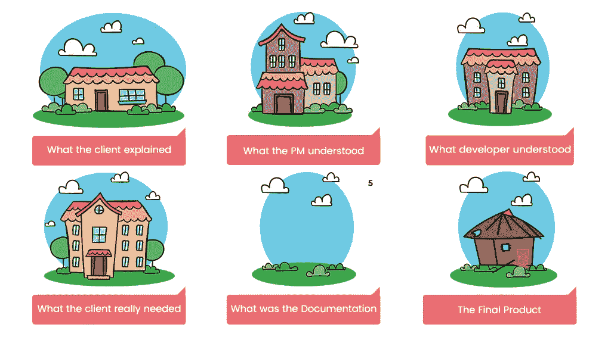

# 外包移动开发时的首要问题

> 原文：<https://medium.datadriveninvestor.com/top-issues-when-outsourcing-mobile-development-5f91c92a7979?source=collection_archive---------6----------------------->

Source: www.aronamaskil.com

如今，外包已经成为几乎任何行业的普遍做法，但 IT 行业是这一领域的领导者。根据 Statista 的数据，[截至 2017 年，外包最多的 IT 职能](https://www.statista.com/statistics/662991/worldwide-cio-survey-outsourced-it-functions/)是软件开发和维护，其次是数据中心和 IT 基础设施。

外包包括将业务流程外包给第三方，这不仅是为了避免或降低成本或以更具竞争力的价格找到合适的产能，也是为了[更多的原因](http://zesium.com/remote-vs-in-house-pros-and-cons/)。

如果你决定外包，看看一些潜在的问题，这样你就可以及时预防，确保工作流程顺畅:

## **问题# 1——选择谁**

如果你考虑走上外包的道路，在与特定的公司合作之前，一定要花时间和研究。

它指的是检查将被分配到您的项目的多个参考和开发团队，因为它们会影响交付的质量。如果您想要加快项目开发的过程，您将需要一个专门的开发团队，因为拥有一个跨多个项目的团队可能最终无法在约定的时间内交付期望的成果。

通常，一旦人们找到了可靠的合作伙伴，他们就会移交项目，但是，如果你不想让你的整个项目冒险，你就需要从小项目开始，成为' **PILOT** '项目——这样，你可以确保减少任何潜在的风险，并能够跟踪发展。

## **问题# 2——沟通不畅**

因为你不在现场，无法看到整个过程，所以也很难确定过程的速度和结果。

如果碰巧时区差异或语言障碍是额外的障碍，那么仅仅依靠公司的话会更加困难，所以在一起投入开发冒险之前，一定要花一些时间对潜在的移动合作伙伴进行[研究。一旦你做到了这一点，建立适当的沟通工具(](http://zesium.com/how-to-choose-a-high-quality-mobile-app-company-to-increase-your-roi/)[懈怠](https://slack.com/)、[吉拉](https://www.atlassian.com/software/jira)等)。)并定期举行站立会议(视频),以确保团队之间的清晰沟通。

与团队、管理层和创始人的沟通是基石，所以确保为成功的合作奠定基础，因为这是最重要的事情。

如果你要外包，在沟通时要精确——要具体和详细地说明你想要什么，否则，你可能会在这个过程中面临大量返工的情况。

## **问题# 3——业务分析不足**

在采取任何行动之前，应该从一开始就进行适当的业务分析，越快越好。这可以帮助您在以后的开发阶段节省时间和资源，因为业务分析可以预防和预测潜在的威胁和风险。

业务[分析师可以](https://www.velvetech.com/blog/business-analysis-for-mobile-app/)帮助维护利益相关者之间的沟通，将客户的业务需求解释为开发人员的任务，将未来的开发任务呈现给客户以便于理解，在需要时进行调整，并对项目进行验证。

Source: [www.apptunix.com](http://www.apptunix.com)

## **问题# 4——技术文件质量差**

在任何外包之前，您需要考虑流程的哪些部分应该在内部开发，哪些部分可以外包。

[技术文档](https://apro-software.com/writing-specifications-for-a-mobile-app-development-project/)包括定义您的移动应用理念的要求。使用并遵循这些规范是为了准确地完成相同的要求。

对你来说，有明确的技术文件是至关重要的，以防止任何风险或超支。技术规范是你的外包开发团队的路线图，最好写得尽可能详细，包括主要观点，如想法或介绍、总体描述、具体要求、支持信息、关注点等。

不要忘记硬件和性能需求——你不能指望你的外包团队猜到你想要什么，如果你这样做，你就为项目失败开了一个处方。

你不需要写下所有的细节，但是如果你为你的外包团队制定了标准化的程序，这将会促进整个过程，并且防止编码发生时的任何延迟。

## **问题# 5——你不保护你的知识产权**

你的应用创意是你自己的财产，你应该保护它——不要假设你的外包合作伙伴会默认这样做，因为一些国家根本没有这样的规定。

第一优先是 NDA ( [保密协议](https://en.wikipedia.org/wiki/Non-disclosure_agreement))——确保所有参与者签署 NDA 为你的想法提供法律保护，并让人觉得你的秘密信息只属于你的公司，不属于其他人。创建 NDA 时，您可以自由地将源代码分成独立的部分，根据具体情况限制对数据库的访问或控制机密信息的共享。

如果你没有签署 NDA，没有指定每个参与者的确切职责的文件的版权转让，你就把你的[知识产权](https://en.wikipedia.org/wiki/IP_address)置于风险之中。此外，不要假设你的外包供应商的知识产权是安全的——总是适当地检查。额外的安全措施可以是在开始工作之前检查供应商是否与其员工达成了适当的协议。

## **第 6 期——平庸的应用开发方法**

遵循移动应用程序开发流程非常重要，但也有一些地方你可能做得不恰当:CTO 或开发人员来管理应用程序开发，或者雇佣一个技术知识有限的人来代替合适的项目经理。

很多时候，你没有为你的外包团队设定里程碑，或者对他们规定发布过程，从而导致了空洞的承诺和额外的压力。

如果你没有清楚地设定每个参与者的角色，他们会对自己的任务和优先事项感到困惑。

使用适当的编码标准，让你的工程师记录他们的[源代码](https://en.wikipedia.org/wiki/Source_code)。要记住的重要一点是，你的两个团队(内部团队和外包团队)必须共同努力来实现目标——不要在他们之间制造太大的差异，因为你可能会导致缺乏团队合作和沟通失败。

## **问题#7 —延迟的质量保证**

QA ( [质量保证](https://en.wikipedia.org/wiki/Quality_assurance))是移动应用开发过程中至关重要的一部分。如果你不立即使用错误跟踪系统，而把它留着以后用，你会引起更大的问题。跟踪问题、错误或缺陷对于这个过程来说是必不可少的，缺少 QA 肯定会影响你的整体应用质量。

如果你等到发布前才开始 QA，你可能会仓促行事，把不合适的产品推向市场——这样，你的用户会自己发现错误，他们的用户体验可能会产生负面评价，导致你的应用失败。

不要等待[自动化测试](https://medium.com/intuz/top-10-automated-testing-tools-for-mobile-apps-8d9380e1757f)的实施，因为你可以发现大量的错误，这将导致大量的返工和应用发布的延迟。

## **第 8 期—时区差异**

我们生活在一个全球市场中，但是如果您需要即时反馈或更新，而您的外包团队离线了，该怎么办？让我们面对现实吧，外包团队经常位于你自己的[时区](https://en.wikipedia.org/wiki/Time_zone)之外。这意味着这个问题要到明天才能解决，它可能会在项目的最后期限内造成延误。

但是，不要担心，这个障碍也是可以克服的——你的外包团队可以在你晚上接受任务，你可以在第二天检查输出结果。这样，您可以节省时间并防止项目开发过程中的任何延迟。

有时候，在两个不同的时区管理敏捷方法和 Scrum 会很棘手，所以也要准备好应对这些挑战。

## **问题# 9——外包给落后于全球趋势的公司**

如果您的应用程序需要根据最新的趋势或技术进行设计，您必须关注外包移动应用程序开发公司的政策、其设计和 [UI/UX](https://hackernoon.com/what-is-ui-ux-design-1f01e9dbbf02) 。如果它们对你来说已经过时了，很可能它们已经落后于全球趋势。便宜的价格背后是为什么不要屈服于诱人的价格，而是选择了解技术创新、跟上当前趋势并努力遵循贵国文化的公司。

此外，有些公司可能会向您提供他们最了解的技术，而不是更适合您的技术。务必检查外包供应商是否提出了能带来最佳结果并节省您资源的解决方案。

# **最后一句话**

在你决定外包你的移动应用开发之前，你必须熟悉随之而来的潜在风险和危险。

随着外包的使用快速增长，确保您能够降低风险将为您带来巨大的好处——节省成本(*包括伴随成本:招聘、管理费用、办公和设备成本等*。)，有机会将杰出的专家带到项目中，并有可能找到可靠的长期外包合作伙伴。

外包您的移动应用程序开发并不比其他类型的移动应用程序开发带来更多的风险——只要记住与您的团队合作时的潜在风险，加上更好的规划和更好的持续管理，您将充满信心地外包。