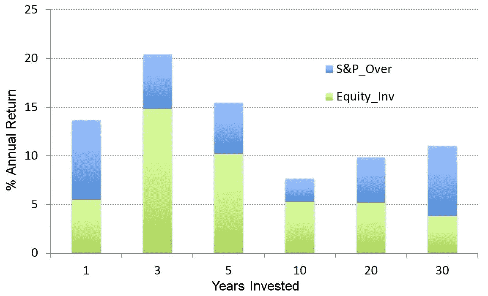
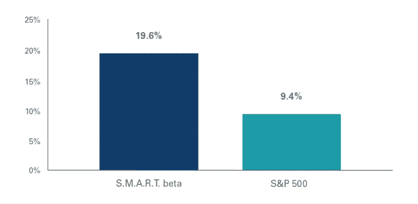

# 回溯测试投资策略时的主要错误

> 原文：<https://medium.datadriveninvestor.com/top-mistakes-when-backtesting-investment-strategies-2d583a0ff453?source=collection_archive---------3----------------------->

市场指数为任何投资策略提供了一个难以逾越的障碍。使用指数几乎总是比系统地选择其空间或时间子集的策略更好(例如，选择投资组合或市场时机)。预先设定指数的成本很低，因为不需要思考，而且上个世纪主要市场指数的长期结果令人印象深刻。因此，论点是:“为什么要浪费你的钱去雇佣昂贵的经理人，他们可能只是靠运气跑赢市场？”

约翰·博格尔，全球最大的共同基金集团先锋集团的创始人，[实施了第一个指数基金](http://www.philly.com/philly/business/20161101_John_Bogle_invented_the_index_fund_and_founded_Vanguard.html)——历史上最简单的十亿美元想法之一。令人惊讶的是，就在最近——1975 年——尽管道琼斯工业平均指数已经有将近一个世纪的历史了。像道琼斯指数和标准普尔 500 指数被发明来说明整个市场的表现。道琼斯指数汇总了 30 家美国大型上市公司的股价。与标准普尔不同，它没有考虑它们的规模(市值),因此它不是一个很好的市场表现指标，但更容易计算。很难相信 90 年来你能看到道琼斯指数的表现，却不能轻易投资它！

当一个对冲基金策略被引入时，每个人最关注的是它的回溯测试——它在过去是如何做的。显然，没有哪只上市基金的回溯测试看起来不好！但是，这些过去的结果对未来会发生什么有多大的代表性呢？这是一个基本问题，也是一个非常难回答的问题。我将分享一些来自 Vanguard 的智慧，并对其进行扩展，关于在回溯测试中寻找错误。当然，你必须记住，先锋“有一只狗在狩猎”。当他们提供有用的评论时，他们在暗地里说“你知道，可能没有对冲基金真的有效！”

在 Vanguard 简洁的两页文档中，“评估回溯测试投资策略的快速指南”链接自一些[文章/广告/博客](https://vanguardadvisorsblog.com/2017/11/14/back-tested-strategies-real-or-random/comment-page-8/#comment-17296)，Vanguard 提供了关于投资策略的三类问题:

*   它的原理是什么？
*   经验证据是什么？
*   其实施效果如何？

首先，让我们看看市场的实际结果(“真实回测”)。上个世纪的许多重大事件，如大萧条、二战和 2008 年的全球金融危机，都自然地反映在股市的表现中(图 1)，尽管一些主要是金融事件的影响似乎比震撼世界的全球大火更大！请注意，作为一项规则，随着时间的推移，股票总体上呈上升趋势，平均长期回报率约为每年 9%——这是一个令人惊讶的强劲数字。该图是对数标度，因此恒定回报率将是一条直线；如果是线性标度，图表将只由最近的信息主导。(因此对数标度是绘制投资结果的最佳方式。)

*Figure 1\. Log scale of annual stock market return based on S&P composite index.*

股市的复合增长率相当惊人，尽管也有过真正的恐慌时期。在低迷时期，没有办法知道它会持续多久。由于我们都受到恐惧和贪婪的影响，我们个人投资者通常会做出比指数更糟糕的投资决策。研究反复表明，随着时间的推移，股票投资者的平均回报比标准普尔 500 差得多。如图 2 所示，从 2014 年 [Dalbar 的投资者行为量化分析(QAIB)报告](http://www.dalbar.com/Portals/dalbar/cache/News/PressReleases/2014QAIBHighlightsPR.pdf)来看，持有股票一年的投资者平均获得 6%的回报，而标准普尔&500 的回报率为 14%。即使对于那些投资股票 30 年的人来说，标准普尔 500 指数的年回报率为 11%,而投资者的年回报率仅为 4%。30 年来，标准普尔&公司返还的钱是个人所得的 7 倍。这是对人类厌恶损失的成本的一个有力而又可悲的衡量；我们往往不会坚持度过艰难时期，因此，如果随后出现强劲上涨，我们也不会投资。感情上，我们承受不了压力。

*Figure 2\. Average equity Investor performance over different periods of years compared to the S&P 500 Index (from Dalbar)*

大盘指数的基准表现难以超越。如果指数是你的竞争对手，那你已经在面对一个非常强悍的对手了。相反，如果你不打算成为全职投资专家，这是一个很好的默认投资策略。在 Elder Research，如果你没有为你的利润分成设定一个退休投资选项，默认的退休投资选项是将这种指数智慧与年轻时投资股票的可靠建议结合起来，随着年龄的增长和“投资视野”的缩小，转向债券；因此，我们的默认做法是将你放入一个按年龄调整的“目标日期退休基金”(最早发明于 90 年代)。

嗯，你可能会觉得指数基金很无聊。比股票多得多的共同基金也没什么不同，但比指数贵，因为它们的经理做了很多艰苦的工作来挑选他们认为的赢家和输家。当不景气发生时，它们都会受到影响，所有行业都变得相互关联，它们都会大幅下跌。那时，对冲基金等另类投资看起来特别有吸引力。另类投资会做出不寻常的事情，而且与整体市场无关。所以，你发现自己开始关注一些有趣的回溯测试…

先锋想帮你。防止你跳下悬崖。花一分钟看看这些危险。坦率地说，他们简洁的两页纸在捕捉常识点以及大多数人忽略的一些微妙危险方面做得很好。官方只提供给投资专业人士，不过我在这里总结一下。

Vanguard 对评估新投资系统的建议:

**1。这个策略有合理的理由吗？**

**数据窥探偏差**——策略是在回溯测试之前预先计划好的吗？它是否有合理的解释，而不仅仅是事后的随机发现？

**多余的主题**——是源于文学中的一种策略吗？如果是这样的话，为什么它仍然有效(因为任何“低效率群体”都会被抓住并因此而被消灭)？

**2。该战略是否有广泛的实证支持？**

**前瞻偏差** —其信息在交易时间公开吗？例如，模型是否基于不同时区的收盘价？

**时间段偏差** —为什么回溯测试会开始和停止？结果对不同时间段的敏感度如何，例如低波动性市场与高波动性市场、增长期、低利率与高利率等。？

**过度自信和确认偏差** —该策略是否经过独立、公正的第三方审核？

[**选择(多重测试)偏差**](https://www.elderresearch.com/company/blog/selection-bias-in-analytics) —测试了多少策略？如果不止一个，是否进行了调整，以说明标准统计显著性水平仅在进行单一测试时适用？(*这个很优秀；大多数研究人员忽略了这个微妙但重要的问题。这就是为什么* [*目标洗牌*](https://www.elderresearch.com/company/target-shuffling) *被发明出来的原因；为了避免过度自信，我们必须校准统计测试，以解释我们所看到的所有事情。*)

**过度拟合偏差** —假设某种程度的随机噪声会在任何一段时间内影响策略结果，那么该策略是如何构建的，以避免有太多可能导致过度拟合风险的参数？如何确定自己不仅仅是很好的拟合了训练数据？你做了样品外测试吗？

**3。有真实世界的实现测试吗？**

**代表性偏差**——考虑该策略自首次发布以来的表现，以及它在其他市场或资产类别中的表现。例如，它对债券和股票都有效吗？该战略背后的理念是否稳健？

**实施成本** —实施战略的成本是否被忽略了？确认是否考虑了佣金、买卖差价、费用和市场影响。

在分享这一建议的过程中，在最近出现在许多地方的付费文章/广告中，一位先锋高管指出了这个(太聪明了)反例:

> 一个人可能会考虑研究另一个人可能会称之为数据挖掘，这两者之间可能有细微的差别。但是不管你怎么想，发现一个随机的异常和确定一个可行的基于规则的策略是有区别的。作为一个有趣的例子，几年前我的同事 Joel Dickson 和 Chuck Thomas 进行了一次假设模拟，比较了标准普尔 500 指数与股票投资组合的表现，股票投资组合中所有股票的加权组合以 S、M、A、R 或 t 开头。如图 3 所示，这种简单、基于规则的策略在很长一段时间内表现非常好。然而，说实话，没有充分的理由证明在未来采取这种策略是一个好主意。”

*Figure 3\. Annualized return of S.M.A.R.T. Beta strategy from Dec. 31, 1994, to Oct. 31, 2013*

这种假想的投资组合是为了模仿一种类似伪指数的竞争性投资类别而创建的，被称为 SMART Beta。 ***Beta*** 代表一个策略与市场的相关性， ***Alpha*** 是其相对于市场的超额收益。其他供应商正在提供倾向于波动性或外国市场敞口等的指数。—拥有“智能”的“beta ”,而不是完全被动的，像普通的香草指数。

在图 3 中，Vanguard 试图证明，你当然可以(以某种方式)想出一个可以击败标准普尔 500 指数的策略，但仅仅因为它退出了并不意味着它在未来会这样做。他们暗示，这一次的起源是荒谬的，所以它当然不会继续跑赢大盘。但是他们的例子太可怕了！(首先，他们在嘲笑一个长期表现如此出色的投资组合，我敢打赌，一些人会被他们的数字说服，投资于它！在大约 18 年的时间里，它的复合回报率大约是该指数的 5 倍。)一个批评(也是我看到其他人在这篇广告/文章刊登的在线评论部分提到的唯一一个批评)是，他们的例子对股票进行了同等加权，而 S&P 指数资本化对股票进行了加权。这是不公平的，因为同等权重投资于更小和更不稳定的股票，因此将提高一个人在上涨市场中的回报。

但是最致命的攻击是幸存者偏见。请注意，在他们对投资组合创建方式的上述描述中，有“当前”一词。他们使用了当前指数中的所有现有证券，并在时间上倒退！Vanguard 打破了自己的规则，选择了 18 年前标准普尔 500 指数的当代成份股作为他们的投资组合；但是，当然，当时的投资者并不知道未来的标准普尔 500 指数将由哪些股票组成。这个问题——[**幸存者偏差**](https://www.elderresearch.com/company/blog/what-is-bias-in-analytics)——是投资模型和许多其他领域的一个重要问题。这对一个统计模型来说是致命的，所以我们必须强迫自己去思考它可能在哪里，以及如何消除它。最好是就模型中可能存在的缺陷进行激烈的头脑风暴，如果有必要的话，尽早将其扼杀，而不是在部署之后，因为那样做的成本要高得多。

为什么 S&P 现在的成员比历史上真正的成员有如此大的优势？因为一只表现不佳的股票要么失败，要么在 S&P 被一只新的或更成功的股票所取代。回顾历史，S&P 现在的成员将会成为全明星。

一个曾经是对冲基金经理的朋友(现在是尼加拉瓜的传教士，做着惊人的工作)发给我这篇文章，作为一个很酷的研究成果。我马上就发现了这个缺陷，可能是因为我已经(制造并)看到了太多的错误例子，并在寻找和编目错误的过程中成就了自己的写作生涯。但是网上还没有人注意到它。我把这个例子发给了很多人——没有暗示可能有错误，也没有人注意到。当我提出可能有问题时，到目前为止只有一个人马上诊断出来——ERI 大学的科林·托马斯。所以在野外识别这些错误并不容易。但是如果我们能做到，它可以让我们省去很多心痛。

那么是什么帮助我们注意到了呢？由于 SMART beta 投资组合占标准普尔 500 的 20%以上，这应该是一个危险信号，这个股票子集粉碎了标准普尔 500 指数的总回报。如果这是一个真实的研究结果，指数中的大多数人肯定做得非常糟糕，而少数人却做得如此之好。这么多股票(500 只)持续了这么长时间(18 年),随机性允许这种背离是不合理的。

具有讽刺意味的是，Vanguard 关于如何判断回溯测试的优秀建议附有一个例子，这个例子违反了最重要的原则:策略必须在当时能够实现！

我有一些有趣的故事，我将在以后的笔记中分享，关于对冲基金策略(活的和还没活的)出了问题，这些都被这个练习唤起了记忆。与此同时，记得尽可能多地寻求“外界的眼光”来评论你的工作！这是最好的方法。

了解更多常见的数据挖掘错误。下载电子书[十大数据挖掘错误](https://www.elderresearch.com/top-ten-data-mining-mistakes)

# 有关系的

阅读博客[接受来自未来的泄露是一个错误](https://www.elderresearch.com/company/blog/avoid-leaks-from-future)

阅读博客[只听数据是错误的](https://www.elderresearch.com/company/blog/listen-only-to-the-data)

*原载于*[*www.elderresearch.com*](https://www.elderresearch.com/company/blog/top-investment-strategy-backtesting-mistakes)*。*