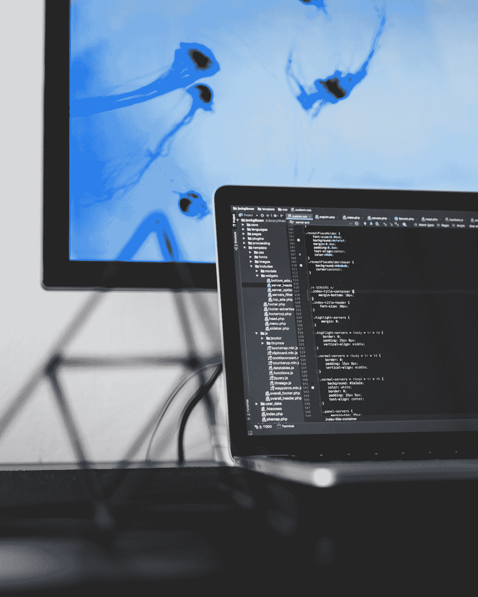

# 班级第一并不意味着世界第一:决定成功的不是你有多聪明

> 原文：<https://medium.datadriveninvestor.com/top-of-the-class-doesnt-translate-to-top-of-the-world-it-s-not-how-smart-you-are-that-determines-33153d7f7e7c?source=collection_archive---------9----------------------->

“woman throwing her academic hat” by [JodyHongFilms](https://unsplash.com/@jhong8?utm_source=medium&utm_medium=referral) on [Unsplash](https://unsplash.com?utm_source=medium&utm_medium=referral)

高中毕业生代表的角色是崇高的。他们就是成功的典范，当然还有那些了不起的成绩、出色的表现和值得称赞的课外活动。

传统观点认为，这些人会继续改革世界，对吗？

毕竟他们很聪明。

梅丽莎·楚写了一篇关于她所谓的“智力门槛”[的文章。她提出了一个非常合理的问题:](https://medium.com/@melissachu/the-intelligence-threshold-how-smart-do-you-need-to-be-to-succeed-a1b78bc150c3)

为了成功，你需要有多聪明？

回答:没有你想的那么多。(好吧，感谢上帝)

如果你想知道你的毕业生代表发生了什么，他们现在是否是亿万富翁和颠覆者，这里有你的答案:
https://www . CNBC . com/2017/05/24/what-occurrent-to-your-class-breedict orient-possible-not-more . html。

似乎传统的智慧和传统的测量方法(比如智商)都不足以预测成功。

by [Rhone](https://unsplash.com/@rhone?utm_source=medium&utm_medium=referral) on [Unsplash](https://unsplash.com?utm_source=medium&utm_medium=referral)

而你的湾景高中毕业生代表可能在郊区过着适应良好的生活。5 个孩子，两辆汽车和多台电视，不要指望听到他们与比尔·盖茨(他从大学辍学)和其他抓住世界的人相提并论。

每次我回去参加高中同学聚会(我的下一次聚会将是 50 号，所以拜托了)，我都会想起这一点。我们学校有一对双胞胎女孩，从各方面来看，她们聪明、能干、漂亮、多才多艺。女孩们没有做不好的事。他们是啦啦队员，受欢迎，制作精美，他们聪明、有教养(多么好的一个词)而且彬彬有礼。他们在高中成绩优异。一个嫁给了保险业务员，在同一家保险公司干了几十年。几个孩子。从各方面来看，都很满意。另一个受到身体问题的困扰，因为大声宣布自己是同性恋而震惊了全班(我的意思是这是她的完美权利，但这是在南方腹地)，并且是残疾人。他们两人都没有改变世界，而这正是我所期待的。其他人也是。

*他们两个人的人生轨迹都没有错*。这就是生活。我只是支持楚的观点。预测者——我们喜欢使用的预测者——充其量是站不住脚的。往坏里说，一文不值。CV 暗示他们将改变世界。他们很可能像我们一样改变了个人生活的份额，但他们都没有为他人带来巨大的变化，为世界和平而战，或找到阿尔茨海默氏症的治疗方法。再说一遍，让我说清楚。这没什么不对。我在这里要说的是，通过标准化测试或通过将我们自己与那些在学校轻而易举就能上学的人进行比较来评判我们的孩子或我们自己，是极其不公平和短视的。

by [Doug Linstedt](https://unsplash.com/@douglinstedt?utm_source=medium&utm_medium=referral) on [Unsplash](https://unsplash.com?utm_source=medium&utm_medium=referral)

虽然基本智力可能有助于我们通过测试，但已经接管我们学校系统的对考试的大规模上瘾，对于任何类型的创造性、灵感和激进思维来说，都是非常糟糕的预测或训练基地。尤其是对于我们目前面临的各种世界问题，从气候变化到巨大的收入差距。

我们需要大胆、勇敢、大胆的*颠覆者*。传统的智力测试、对规则的严格遵守以及在学校可预见的、安全的行为不太可能是一个愿意质疑现状的打架者的良好指标。

*如果有什么不同的话，那就是正好相反。*

这个人，简而言之，就是我的丈夫，智商高达 160+。他确实是天才。然而，愤怒、糟糕的童年和对自身价值的深深怀疑让他步履蹒跚。他浪费了大量的精力研究问题，只是为了证明他的世界观是正确的。

他的事业？他修理复印机。

by [Fabian Grohs](https://unsplash.com/@grohsfabian?utm_source=medium&utm_medium=referral) on [Unsplash](https://unsplash.com?utm_source=medium&utm_medium=referral)

虽然摆弄你的办公室佳能没有错，但对我来说，这似乎是一种巨大的浪费。所有的脑力都被用来激起愤怒和在我的干墙上打孔。

这个世界充满了未实现的潜力。

智力测试可以追溯到法国和阿尔夫莱德·比奈([https://www . verywell mind . com/history-of-intelligence-testing-2795581](https://www.verywellmind.com/history-of-intelligence-testing-2795581))虽然最初的测试已经经历了多年的重大变化，但我们西方社会仍然过于依赖这个单一的数字，将其作为一种隐含的优越性的声明和成功的预测。

by [Priscilla Du Preez](https://unsplash.com/@priscilladupreez?utm_source=medium&utm_medium=referral) on [Unsplash](https://unsplash.com?utm_source=medium&utm_medium=referral)

他们两个都错了。原因如下:智力有不同的领域，每个领域本身都可以预测成功，这取决于我们是谁以及我们在生活中做什么。

例如，当谈到语言学时，我天生的、天生的和精心培养的用词能力使我处于一种稀薄的空气中。然而，我在数学和逻辑方面是个笨手笨脚的白痴。这并没有让我变得愚蠢，就像一个天赋异禀的 NFL 运动员因为不擅长英语或微积分而愚蠢一样。他的大脑和身体与我的不同。

这并不意味着我们谁比谁强。我们是不同的，我们的天赋是不同的，两者都是有价值的。

by [Keith Johnston](https://unsplash.com/@acfb5071?utm_source=medium&utm_medium=referral) on [Unsplash](https://unsplash.com?utm_source=medium&utm_medium=referral)

正如美国消费者新闻与商业频道的文章所说:

对 700 多名美国百万富翁的调查发现，他们大学的平均绩点是 2.9。“大学成绩，”巴克写道，“并不比掷骰子更能预示未来生活的成功。”

我们很聪明，并以非常不同的方式取得成功。因为智商没有达到一定水平而轻视任何人，这不仅是愚蠢的，而且是彻头彻尾的虐待。这是因为我们的教育体系倾向于压制那些在考试中失败的品质。为什么？

因为老师就是这样被衡量的，在很多情况下，也是这样被支付的。人们会推动任何对他们有利的事情，这对我们所有人都不利。整个社会。

智商测试经常被用作确定优势的武器，这是非常容易上瘾的。这种一刀切的成功判定方法可能会对那些在不需要完美考试成绩的领域有巨大潜力的孩子造成巨大伤害，而不是对我们每个人进行单独评估，以确定我们每个人在哪些独特和特别的方面是杰出的*。*

朱在她的文章中讨论的部分内容与智力领域直接相关，而智力领域与我们是否会在很多事情上取得成功有着更大的关系。例如，她提到了坚持不懈，而不是因为一个障碍而全盘放弃一个困难的项目。

这说明了情感的成熟，或情商。

丹尼尔·戈尔曼已经写了很多关于这个话题的文章([https://www . Amazon . com/emotion-Intelligence-Matter-More-Than/DP/055338371 x](https://www.amazon.com/Emotional-Intelligence-Matter-More-Than/dp/055338371X))。他不是一个人。随着这个话题的流行，现在它已经成为一个时髦词，有了自己的培训研讨会和项目。

问题是，无论是看书还是参加研讨会，都不会把情商传递给你、我或者其他任何人。他们要做的是让我们意识到它是什么。不是它的感觉或味道。那需要艰苦的工作。

“girl holding umbrella on grass field” by [J W](https://unsplash.com/@emotional_discord?utm_source=medium&utm_medium=referral) on [Unsplash](https://unsplash.com?utm_source=medium&utm_medium=referral)

拥有它的人往往更成功，因为他们有同理心、同情心和对他人的关怀。有些人天生就有这种感觉。

我们大多数人都是通过车祸、岁月、伤害、事故、损失、失败赢得的。情商不会在某一天神奇地出现，就像褚描述的那样，我们认为成功只是……突然出现。

更糟糕的是，同理心正在迅速消失。

在一篇为 GrowingLeaders.com 撰写的文章中，研究显示，在过去十年左右的时间里，大学生的同理心下降了 40%以上。

在我和其他人看来，这很容易与学生每天花在网上的近 9 个多小时联系起来。那就是成长。因为同情心像两吨重的石头一样下降。

我们最需要的技能将确保我们的成功，无论我们在哪个智能领域表现出色，这种技能正被我们的上网时间部分吞噬。此外，我们自己的父母已经消失在网络不可用的黑洞中，没有教他们的孩子去关心。

任何在网上研究人类行为的学生——即使你不是——每天都可以看到。

如果我们想要成功，我可能会认为牢记考试分数在很大程度上是没有意义的。它们本身并不能预测甚至暗示成功，除非你计划参加考试。祝你好运找到那个。

相反，探索我们擅长的领域，我们的激情是什么，我们喜欢的领域和发现我们能力的领域更有价值。此外，你和我可以在其他领域建立我们的能力，这是我作为一个大器晚成的运动员所拥有的。

关于这一点很少是一成不变的(好吧，我撒谎了。我永远也学不好微积分。)

我要补充的是，上网时间大大减少了。学会融入和处理生活。欣赏我们的失败，并借此对他人的缺点保持耐心。

在我看来，这是一个非常好的成功秘诀，就其本身而言，与金钱本身没什么关系。

这与美好的生活有关。如何定义完全取决于你自己。

by [Ambreen Hasan](https://unsplash.com/@ambreenhasan?utm_source=medium&utm_medium=referral) on [Unsplash](https://unsplash.com?utm_source=medium&utm_medium=referral)