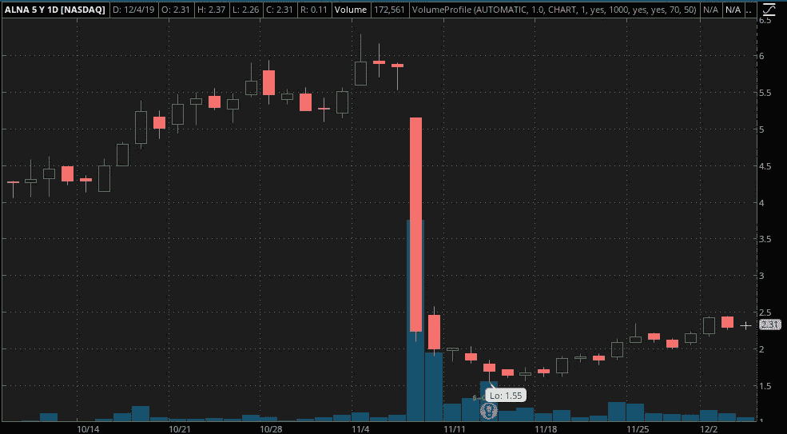
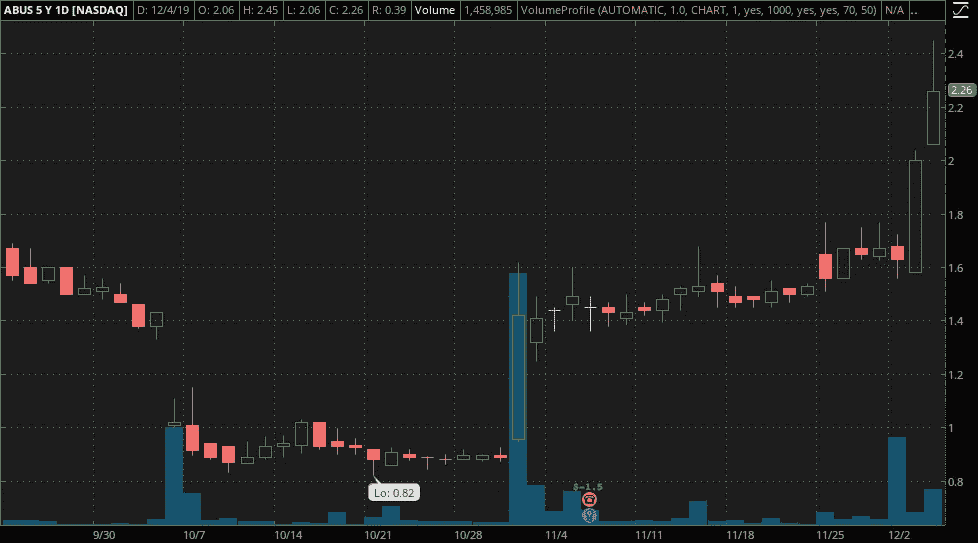
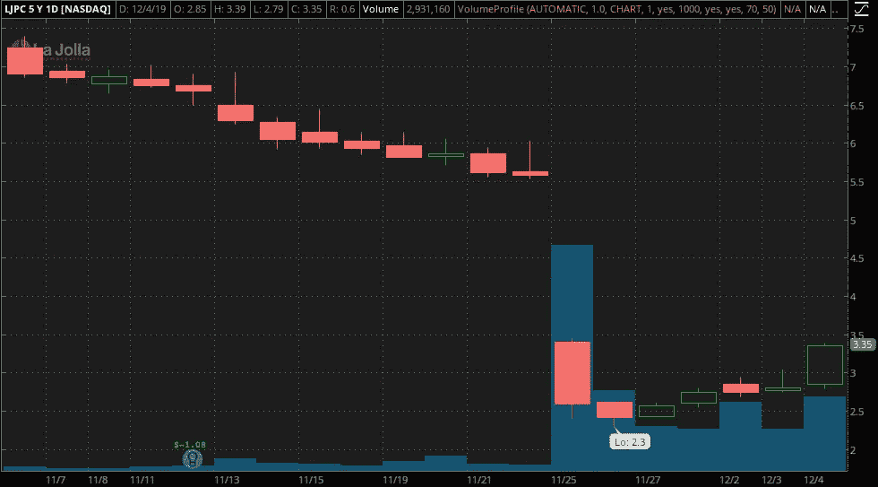
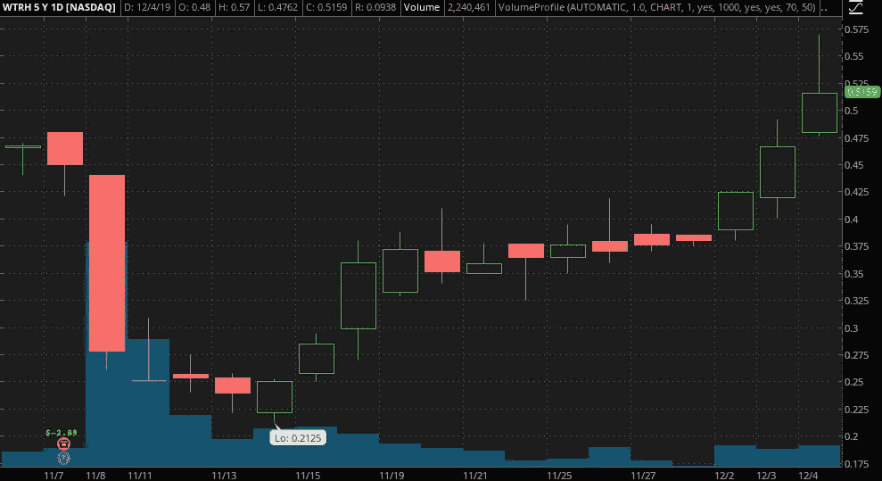

# 现在交易的顶级细价股？要看的 5 张图表

> 原文：<https://medium.datadriveninvestor.com/top-penny-stocks-to-trade-now-5-charts-to-look-at-b6091c85c62c?source=collection_archive---------14----------------------->

当你听说[细价股](https://pennystocks.com/featured/2019/12/04/penny-stocks-to-buy-under-1-dollar-right-now-december-2019/)时，通常人们会首先提到技术指标和动量。当然，有一个催化剂可以作为短期走势的触发因素。但是，一般来说，普通的日内交易者看的是股票交易量和技术水平。我们从阅读和写作无数的**低价股**中知道，通过观察不止一个具体的东西，比如技术指标，不仅仅是看起来那么简单。

你也需要考虑基本面。假设有一只低价股在没有任何消息的情况下大幅上涨。这种变化是大于还是小于股票所能承受的，以维持这种波动？

在许多情况下，如果没有某种基本面因素的推动，仅仅依靠交易动力的细价股很难长期保持牛市。今天我们来看看一些[细价股图表](https://pennystocks.com/featured/2019/12/03/sprint-corporation-nyse-s-at-risk-of-becoming-a-penny-stock-2019/)，同时也会考虑这些公司实际上在做什么。

 [## 算法交易的机器学习|数据驱动的投资者

### 当你的一个朋友在脸书上传你的新海滩照，平台建议给你的脸加上标签，这是…

www.datadriveninvestor.com](https://www.datadriveninvestor.com/2019/01/30/machine-learning-for-stock-market-investing/) 

主要原因是这些不是你典型的**细价股票图**。这些趋势持续了数周，有时甚至数月。

# 最好交易的低价股(或忽略不计)#4:阿莱娜制药公司

这是本月最受欢迎的生物技术细价股之一。Allena Pharmaceuticals ( [ALNA 股票报告](https://pennystocks.com/featured/2019/12/04/best-penny-stocks-to-trade-now-december-5-2019/#m1))在 11 月中旬之前经历了一个艰难的第四季度。在该公司实际上宣布了两项评估其 reloxaliase 的研究的积极结果后，股价从 6 美元以上暴跌至不到 1.60 美元。

这些研究评估了肠道高草酸尿症和晚期慢性肾病的高危患者。在公布第三季度收益后，该股最终跌至 1.55 美元的 52 周低点。但是这里可能有一线希望，因为 ALNA 的股票在 11 月的下半月继续上涨。

现在看什么？该公司在本周的 Evercore ISI HEALTHCONx 会议上展示了该产品。从表面上看，反应似乎是积极的。更何况。然而，该公司计划重新与 FDA 接触，以评估简化其 URIROX-2 疗法的机会。

具体来说，该公司希望“讨论通过修改自适应 URIROX-2 试验设计来简化其正在进行的 URIROX 计划的措施。”为了实施这些计划，他们也在减少劳动力以保存资本。在一份 8K 文件中，该公司估计第四季度将产生约 50 万至 60 万美元的遣散费。但是，它指出，这些都是一次性支出。无论如何，自去年 11 月下跌以来，ALNA 一直在稳步走高，而这一最新进展让该股在 12 月 4 日的尾盘交易中甚至跳得更高。

# 交易的最佳低价股(或忽略)#3:杨梅生物制药

这个细价股名单上的下一个是杨梅生物制药公司。与 Allena 不同， **ABUS 的股票**尽管在第一周下跌，但第四季度表现出色。10 月初，股价为 1.50 美元，但在该公司宣布将停止开发一种药物(AB-506)后，股价跌至 0.82 美元的低点。自那以后，这家生物技术公司的股票在周三强劲反弹至 2.45 美元的高点。即使这是在第四季度开始时的“[细价股观察](https://pennystocks.com/category/penny-stocks-watch-list/)”清单上，该股仍然上涨了 60%以上；较第四季度低点上涨近 200%。

那么，除了市场势头之外，是什么让杨梅采取了这一举措呢？首先，该公司报告了第三季度的财务状况，显示账面上有超过 9000 万美元的巨额现金头寸。这很重要，因为根据该公司的说法，它可以为“2021 年初”的运营提供足够的资金

目前的新闻或备案文件并未显示本周可能出现狂潮的股票。到目前为止没有新的东西出来。但在财报电话会议上，比尔·科利尔确实表示，该公司希望“在今年 12 月前选择一种化合物进行 IND 启动研究。”这会有助于推动现在的猜测吗？

# 交易(或忽略)的最佳低价股#2:拉霍亚制药公司

另一只值得关注的生物技术细价股是本月的拉荷亚制药公司(LJPC 股票报告)。接近 11 月底时，LJPC 股票的股价受到了冲击。该股从 6 美元以上跌至 2.30 美元的低点，此前该股遭遇了与杨梅类似的情况。拉荷亚也报道了一些额外的项目。

该公司首先发布了一份关于其首席执行官离职的声明，这对股票来说不是好兆头。它还报告说，在发现 LJ401-BT01 缺乏疗效后，它将停止其研究。这就是有趣的地方。如果你只看标题，你会错过公司目前正在发生的一些大事。

本周早些时候的一系列 Form 4s 文件显示，一些内部人士正在买入该股。尽管首席合规官、首席财务官和 CMO 的购买量不大，但仍值得注意。同样根据图表模式， **LJPC 股票**在过去的 5 个交易日中保持了最新的涨势。这种内部收购和该公司目前的管理层搜索是否足以推动事情暂时向前发展？

# 最好交易的低价股(或者忽略)#1: Waitr Holdings Inc .

我们在 11 月初曝光了[这只小股票](https://pennystocks.com/featured/2019/11/18/4-penny-stocks-to-watch-this-week-2-up-big-this-month/)。Waitr Holdings Inc. ( [WTRH 股票报告](https://pennystocks.com/featured/2019/12/04/best-penny-stocks-to-trade-now-december-5-2019/#m1))在创下 52 周新低后受到关注。从那时起，公司就没有发布任何消息。然而，在第四季度中期上升趋势的最近一段时间里，有几份 4 号表格显示有内幕交易。

那么，除了这些内幕交易，最近还发生了什么？这很难，因为除了一系列集体诉讼新闻稿之外，还没有太多其他东西。如果你通读了一遍或听了 Waitr 的收益电话会议，有几件事需要了解。首先，该公司正在经历管理层的大规模重组。这有助于构建“未知”但是根据 Karl Meche 的说法，该公司正在朝着提高效率和实现盈利的方向发展。

> *“展望未来，与过去几个季度相比，你应该会看到现金流的稳步改善。你也应该期待看到对现有市场的重新关注，那里有强大的用户基础、良好的品牌知名度和很大的增长潜力。”*
> 
> *亚当·普莱斯*

这种微涨势能否持续，WTRH 股票**可能通过定向动量实现什么？在我看来，考虑到盈利后缺乏新的信息，可能仍有很多想象空间。然而，在这种情况下，WTRH 自触及 0.21 美元的 52 周低点以来，已设法回升了近 170%**

*原载于 2019 年 12 月 5 日*[*【https://pennystocks.com】*](https://pennystocks.com/featured/2019/12/04/best-penny-stocks-to-trade-now-december-5-2019/)*。*