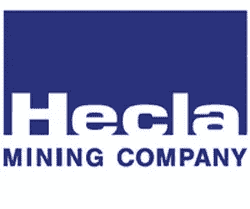
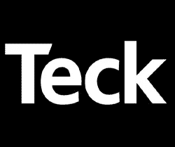
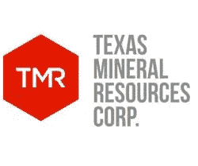

# 目前值得关注的表现最佳的矿业股票

> 原文：<https://medium.datadriveninvestor.com/top-performing-mining-stocks-to-watch-right-now-49d077250704?source=collection_archive---------12----------------------->

矿业股的总体市场趋势是，当更广泛的标准普尔指数攀升时，贵金属、矿业和 T2 黄金股往往会下跌。然而，本周我们已经看到一些因素引发了对采矿业不那么悲观的情绪。这在很大程度上与中美之间最新“第一阶段”交易的细节很少有关。

 [## 数据驱动投资的兴起|数据驱动投资者

### 当 JCPenney 报告其 2015 年 2Q 的财务结果时，市场感到非常震惊。美国零售巨头…

www.datadriveninvestor.com](https://www.datadriveninvestor.com/2019/02/28/the-rise-of-data-driven-investing/) 

还有其他一些全球事件可能支持对股市更为悲观的观点。这对黄金和安全投资来说是好事。目前，黄金交易价格约为每盎司 1，475 美元，较过去几年大部分时间的交易价格大幅上涨。

尽管它仍低于略高于 1900 美元的历史高点，但它仍然回避了下一步该怎么办的问题。我们仍然看到全球金融领域的不确定性，因为玻利维亚银行评级最近被下调。与此同时，作为全球最大的货币之一，石油本月表现不温不火。它也跟随了全球利润率下降的趋势。

**阅读更多**

*   [黄金股:5 个看涨案例&如何在 2020 年保持领先趋势](https://goldstocks.com/featured/2019/12/05/gold-stocks-5-bullish-cases-how-to-stay-ahead-of-trend-2020/)
*   [矿业&黄金股在 12 月贸易不确定性中值得关注](https://goldstocks.com/featured/2019/12/16/mining-and-gold-stocks-to-watch-us-china-trade-december-2019/)
*   [富裕投资者青睐的黄金股票](https://goldstocks.com/featured/2019/12/13/gold-stocks-preferred-among-wealthy-investors-december-2019/)

“所有地区的利润率都在继续下降，亚洲的利润率为负，而在西北欧，利润率接近负值。这种低利润率持续的时间越长，我们就越有可能看到它们开始拖累炼油厂的开工率，这显然会对原油需求产生负面影响，”荷兰金融公司 ing 报告称。

# 眼下值得关注的矿业股:赫克拉矿业公司(Hecla Mining)

自今年夏季开始以来，Hecla ( [HL 股票报告](https://goldstocks.com/featured/2019/12/16/top-performing-mining-stocks-to-watch-right-now-december-2019/#m1))一直是[表现最佳的矿业股票](https://goldstocks.com/category/mining-stocks-to-watch/)之一。本周，股价从 1.21 美元的低点反弹至 3.10 美元的高点。这也是本周表现最好的矿业股之一。

尽管一些黄金股有所回落，但 Hecal 仍然坚挺，本周开始时交易范围狭窄。InsiderMonkey 称，对冲基金可能开始对该股感到乐观。

截至 9 月份的申报文件，HL 股票出现在 10 只对冲基金投资组合中。文艺复兴科技是 Hecla 的最大持有者。截至 9 月份的一份报告，其持股价值为 880 万美元。Citadel 当时还持有价值超过 500 万美元的大量股份。假设银、金、铅和锌的当前环境，Hecla 可能仍然处于有利地位，以利用价格上涨。

# 眼下值得关注的矿业股:泰克资源有限公司(Teck)

与 Hecla 不同，Teck Resources ( [TECK 股票报告](https://goldstocks.com/featured/2019/12/16/top-performing-mining-stocks-to-watch-right-now-december-2019/#m1))在 2019 年度过了艰难的一年。股价从近 26 美元跌至近 14.50 美元的低点。本周泰克股票的表现好于矿业板块的股票。

事实上，这是周一下午会议期间为数不多的绿色。自 12 月 3 日以来，该股已上涨逾 15%，达到 17.48 美元的月度新高。推动市场的因素来自分析师群体。

**【更多阅读】** [本周最擅长挖掘&黄金股看点；1 超过 115%](https://goldstocks.com/featured/2019/12/12/best-mining-gold-stocks-to-watch-this-week-december-13-2019/)

本周，花旗集团提高了对该股的评级。在此之前，该公司对 Teck 的评级为中性，但本周将其上调至“买入”。除此之外，花旗集团还将目标价从 25 加元上调至 27 加元。智利最近罢工的结束提振了该公司的人气。智利 Teck Carmen de Andacollo 工厂的大约 473 名工人举行了罢工。该公司实施了一份为期 36 个月的新协议。结果，该项目的“灯又亮了”。

# 眼下要关注的矿业股:德克萨斯矿产资源公司(TMRC)

这份矿业股票清单上第一只交易价格低于 1 美元的股票，德克萨斯矿产资源公司(TMRC 股票报告)这个月到目前为止表现不错。事实上，TMRC 股票今年到目前为止已经达到了一个里程碑。2019 年初，该公司股票交易价格在 0.23 美元左右；今年 5 月，该指数甚至跌至 0.12 美元的低点。自那以后，股价飙升至本周 0.638 美元的 52 周新高。

该公司专注于重稀土金属。本周，该公司宣布，它开始在科罗拉多州试点工艺开发设施。该项目是与该公司的资金和开发伙伴美国稀土有限责任公司合作进行的。

“丹佛地区长期以来一直是美国的矿产技术中心，为采矿业提供了良好的基础设施和支持，”TMRC 首席执行官兼美国稀土公司 Round Top 项目经理丹·格尔斯基说。另外需要注意的是，据路透社上周报道，美国陆军正在寻求资助稀土加工设施的建设。这是自曼哈顿计划以来政府第一次做出这样的举动。

*原载于 2019 年 12 月 16 日*[*【https://goldstocks.com】*](https://goldstocks.com/featured/2019/12/16/top-performing-mining-stocks-to-watch-right-now-december-2019/)*。*