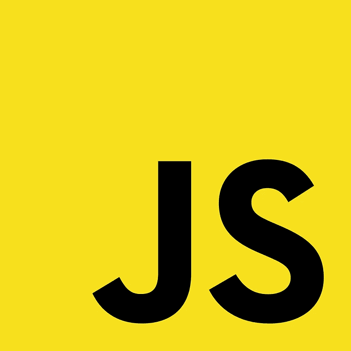
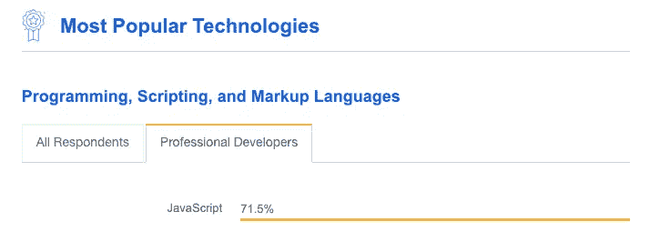
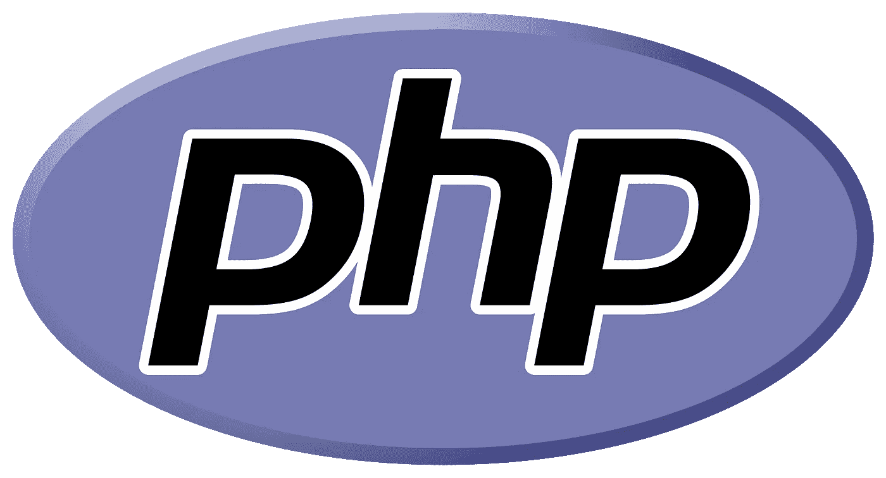
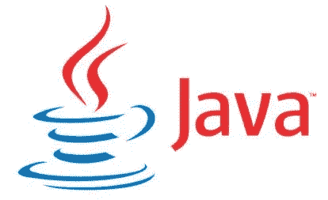
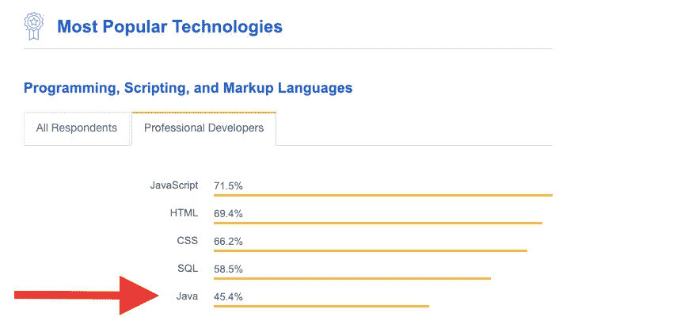
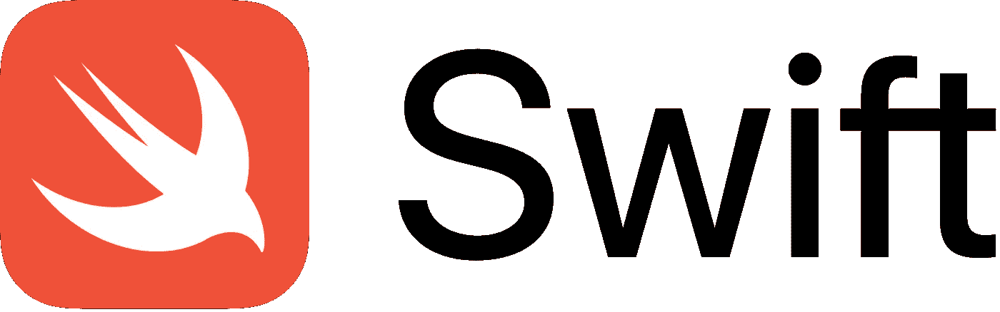
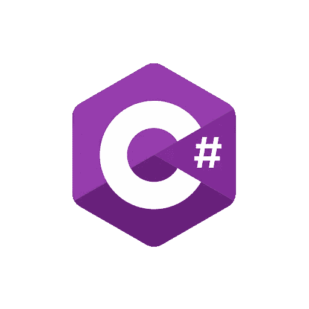
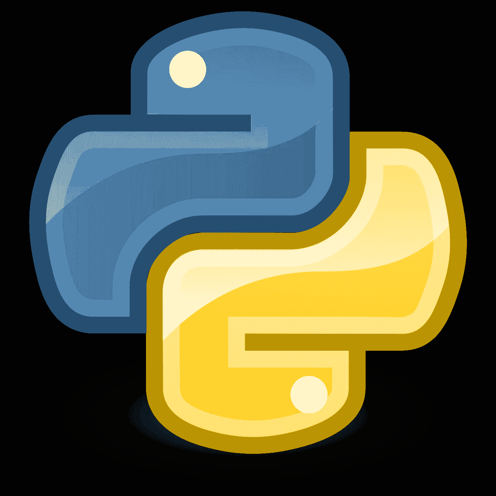

# 2019 年要学的顶级编程语言。

> 原文：<https://medium.datadriveninvestor.com/top-programming-languages-to-learn-in-2019-c2260e47bf0f?source=collection_archive---------6----------------------->

编程语言是人类与计算机交互的工具。

Photo by [Chris Ried](https://unsplash.com/@cdr6934?utm_source=medium&utm_medium=referral) on [Unsplash](https://unsplash.com?utm_source=medium&utm_medium=referral)

在这篇文章中，我们将探索各种编程语言，这些语言在最受欢迎的网站上有很好的社区和很高的市场趋势，如 StackOverflow、GitHub 等

> 基于不同的领域和领域，我将列出需要学习的编程语言，并启动你的职业生涯。

## Web 开发:

当我们谈论 web 开发时，我们需要首先考虑两件事，即前端和后端。就前端而言，最流行和最广泛使用的编程语言是 JavaScript，而就后端而言，则是 PHP。

## JavaScript:

Source: Google.

JavaScript 是前端开发中最常用的编程语言。它是一种高级的、解释的和动态类型的编程语言，支持多范例特性。JavaScript 最著名的库有 node.js、electron.js、react.js、angular.js 等等。这些库在后端、移动应用程序和桌面应用程序开发中更有用。这是一种初学者友好的编程语言。

StackOverflow insights 开展的开发者调查如下:

Source: StackOverflow.

在 StackOverflow 的社区开发者调查中，JavaScript(JS)名列前茅。JS 不仅用作前端工具，也用于后端和全栈开发。node.js 是后端开发最流行的 js 框架。

> 【JavaScript 开发人员平均工资:$ 103001 年薪。

## PHP:

Source: Google.

PHP 是一种为 web 开发设计的服务器端脚本语言。很长一段时间以来，它一直是后端开发的优秀编程语言。PHP 中有许多非常酷的框架，对开发者的日常生活非常有帮助。如果你想学习 PHP，那么你必须掌握一些关于 HTML 和 CSS 的基本知识。

最流行的框架有:

1.  拉弗尔。
2.  Symfony。
3.  费尔康。
4.  CakePHP。
5.  FUELPHP。

*当你想开始你的自由职业生涯时，这种编程语言是一个很好的起点。*

StackOverflow insights 开展的开发者调查如下:

Source: StackOverflow.

> **PHP 开发人员平均薪资:**$ 99983 年薪。

## 移动开发:

在移动开发中，我们需要考虑两个领域，即 Android 和 IOS。用于构建原生应用的编程语言对于 Android 和 IOS 是不同的。

**安卓:**

要在 Android 中构建原生应用，你必须选择一种合适的编程语言。几十年来占统治地位的编程语言是 Java。还有一种不太流行的编程语言叫做 KOTLIN。

**JAVA:**

Source: Google.

Java 是一种通用的面向对象编程语言，用于开发 Android 应用程序、大数据应用程序、服务器端应用程序、嵌入式应用程序、企业级应用程序以及许多更科学的应用程序。它拥有高级内存管理技术，并严格遵循面向对象的范例。它是一种健壮且高度安全的编程语言。所以这些特性有助于 java 在市场上站稳脚跟。学起来容易，掌握起来难。

StackOverflow insights 开展的开发者调查如下:

Source: StackOverflow.

> 【Java 开发人员平均工资:$ 104441 年薪。

## IOS 开发:

为了开发 IOS 应用程序，我们需要转向一种独立的编程语言，称为 Swift 或 Objective-C，但 Objective-C 是开发 IOS 应用程序的一种非常古老的编程语言。但是由于技术日益升级和发展，技术的发展导致了一种新的语言叫做 Swift。它是构建 IOS 应用程序的非凡编程语言之一。

**雨燕:**

Source: Google

Swift 是一种强大而直观的编程语言，适用于 macOS、iOS、watchOS 和 tvOS。编写 Swift 代码是交互式的和有趣的，语法简洁而富有表现力，Swift 包括开发人员喜欢编码的现代功能。Swift 代码在设计上是安全的，但也能产生运行速度极快的软件。

StackOverflow insights 开展的开发者调查如下:

Source: StackOverflow.

> **IOS 开发人员平均年薪:**:118783 美元。

## 游戏开发:

说到游戏开发，它真的依赖于游戏引擎。许多开发者使用的最流行的游戏引擎是 UNITY。要开发好的、多功能的游戏，我们需要编程语言的帮助。Unity 支持 C++，Java，C#。游戏行业中最流行和最通用的是 C#。

**C#:**

Source: Google

C-Sharp 是一种通用的高级编程语言，支持微软在其。NET 倡议由安德斯·海尔斯伯格领导。它被广泛用于使用 Unity 游戏引擎创建游戏，正如前面所讨论的，Unity 是当今最流行的游戏引擎。超过三分之一的顶级游戏是由 Unity 制作的，大约有 7.7 亿活跃用户使用 Unity 引擎制作游戏。Unity 还用于虚拟现实，90%的三星设备和 53%的 Oculus Rift VR 游戏都是使用 Unity 开发的。

> C#是创建这些应用程序的一个非常流行的工具，因此对于大多数希望进入游戏开发行业的程序员或任何对虚拟现实感兴趣的人来说，这是一个很好的选择。

StackOverflow insights 开展的开发者调查如下:

Source: StackOverflow.

C#开发人员的平均年薪:$ 69006/年。

## 人工智能和数据科学:

人工智能和数据科学领域最流行的编程语言是 Python。人工智能和数据科学是现代计算机行业的两个热门词汇。为了制造人工智能产品，我们使用

## Python:

Source: Google

它是一种通用的高级编程语言，支持各种类型的编程范例。它是一种动态类型的编程语言。它有一个很好的社区来帮助初学者。它是最好的初学者友好的编程语言之一。这种语言被数据科学家、道德黑客、数据分析师和研究人员使用。

有一个最强大的库堆栈，有助于处理大量数据和机器学习模型，例如:

1.  Numpy。
2.  熊猫。
3.  Matplotlib。
4.  海博恩。
5.  请求。
6.  好喝的汤。
7.  sci kit-学习。
8.  张量流。
9.  Pytorch。
10.  NLTK。

StackOverflow insights 开展的开发者调查如下:

Source: StackOverflow.

> **Python 开发者平均工资:**$ 116379 年薪。

## 结论:

根据您的领域和技术兴趣，上面的列表将帮助您在编程生涯中取得成功。以上所有编程语言在市场上都有一个很好的开发者社区，如果你在开发或学习这种特定的编程语言时遇到了困难，它可以澄清你的疑虑。网上有很多资源可以指导你。