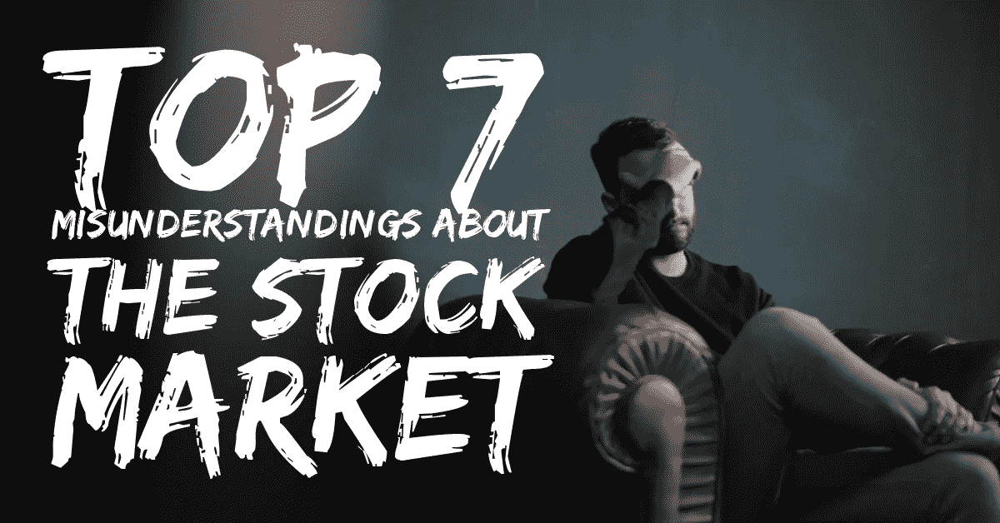
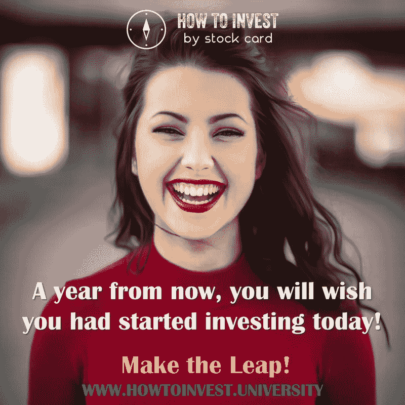

# 成功投资者克服的七大股市误区！

> 原文：<https://medium.datadriveninvestor.com/top-seven-misunderstandings-about-the-stock-market-that-successful-investors-have-overcome-e4053a6f1eda?source=collection_archive---------27----------------------->

我已经和[股票卡](https://stockcard.io/)用户进行了 100 次甚至 1000 次的对话。我们总是坦诚地谈论他们对股市的看法。他们分享什么让他们兴奋，什么让他们害怕。虽然每一次谈话都有自己的焦点，但对股市有一些广为接受的误解，这是几乎所有此类谈话的潜在主题。这些误解流传甚广，以至于许多人把它们作为避免投资股市的理由。

在今天的[股票卡周刊](https://blog.stockcard.io/)中，我们来看看关于股票市场的七大误解。所有成功的投资者都找到了克服这种误解的方法。有吗？

在我们继续之前，11 月 8 日你在做什么？最后几天，利用您的 **40%早鸟票**参加[如何投资研讨会](https://www.howtoinvest.university/)。11 月 8 日，让我们一起学习、实践、讨论、社交、吃喝，构建一个个性化的长期投资路线图。​

[以 40%的折扣购买机票](https://www.eventbrite.com/e/how-to-invest-workshop-stock-market-investing-simplified-registration-49908563858)

**第七:股票市场对我不利**

关于股票市场的第一个误解是，这个系统对我们不利。我听过太多次了。尤其是对年轻人。你知道鳄梨吐司一代；)我有时也有这种感觉。当你听说金融危机，或者伯尼·麦道夫诈骗投资者并偷走他们的钱，或者你了解到富国银行的骗局时，很容易就认为如果你投资股票市场，就会有一个邪恶的公司坐在电话线的另一端敲诈你。但事实上，这些只是市场的一小部分。股票市场是一个与其他市场相似的市场。就像 AirBnb 是人们额外卧室的市场一样，股市是公司股票和其他金融产品的市场。这些市场没有好坏之分。作为用户，你如何使用它们可能是好的，也可能是坏的。但是，市场只是市场。他们没有被操纵，也没有偏袒。尤其是在股市方面，多年的政府监管和公众监督迫使他们清除任何不良玩家或行为。

**第六:交易和投资一样**

你可能会听到你的朋友谈论他们如何在 22 岁时在股票市场上损失了 10，000 美元，他们不得不搬回来和父母一起住，以及其他类似的故事。虽然这些故事是真的，但它们大多与那些想交易而不想投资的人有关。用最简单的话来解释，当你交易的时候，你所关心的就是图表和股价。并且，你试着使用你能使用的任何东西来预测未来的价格。也许在接下来的 2 分钟或 30 天内。这只是极快的速度，太技术性，甚至可以说是妄想。但是，还有另一种参与市场的方式。这叫投资。你并不真正关心价格。你更关注你投资的公司的实力。你知道风险投资家是怎么投资的吗？他们没有投资，因为公司的估值将在接下来的两个小时内上涨。他们挑选一个好的团队，一个好的产品，一家有成功指标的公司，让公司成长多年后再考虑出售。你可以参与股市，就像投资一家初创企业、房地产或你朋友的餐馆一样。你永远不会在接下来的 30 分钟内卖出投资。你投资是因为你相信这家公司及其长期潜力。

**第五:投资和赌博一样**

这个太让我烦了！因为人们认为投资股市就像玩老虎机。你把你的钱，要么“丁丁丁”你有美钞飞过你，或者你失去你所有的钱，所以继续下注。同样，如果你试图预测一只股票在未来 30 分钟或 30 天内的价格，这有点类似。但是，如果你在投资，你是基于事实和信息来做的，而且你投资得很慢。当然，有时候整个股市都会下跌。他们说，三年之内，股市会下跌。但是，股票市场永远不会在一天之内失去所有的价值。据 CNN Money 报道，在 1987 年的“黑色星期一”，道琼斯指数暴跌 22.6%，仍是历史上最大的单日百分比跌幅。即使在黑色星期一，单日价格跌幅也没有大多数人想象的那么大。

**第四:投资股票市场需要数学天才或博士学位**

想投资需要知道的和想在金融行业工作需要知道的有一个误区。最简单的思考方式就像买房子一样。买房是一种投资。但是，你不会去成为一名建筑师或工程师去买房子。即使没有建筑学学位，你也要运用自己的判断，做研究，收集信息，做出明智的决定。投资也是如此。要成为一个好的投资者，你不需要有金融学位。如果你想开发一种金融产品或者在银行和证券交易所工作，金融学位是必需的。但是，投资需要对世界如何运转以及公司如何赚钱有共同的理解。你可以学习如何衡量一家公司的收入或利润的基本知识。大概有 10 个金融方面的事情你需要知道，仅此而已。在那之后，剩下的就是太多的技术细节了，你不需要成为一个长期投资者。此外，现在你可以谷歌一切。你不懂一个金融术语，谷歌一下就知道了。在 Investopedia 或 Investopedia 等网站上，你需要学习的一切都已经以简单的方式解释清楚了。

第三:你需要时刻关注新闻，才能在股市中获胜

这个很难跳过。因为财经媒体无处不在。甚至非金融媒体也在谈论这些公司在做什么。但是，你需要记住，新闻并不是真正设计来通知我们，而是娱乐我们。它会对正在发生的事情产生过于积极或过于消极的光环。例如，如果一家公司发布了季度收益，一切都很顺利，除了用户的增长比分析师预期的低了一点，头条新闻将是“X 公司没有达到分析师的预期”。这对媒体来说是好事，因为人们对这样的新闻表现出情绪化的反应，而不是对这样的新闻说，X 公司的一切都很好，没有什么值得关注的。也许在接下来的几个季度里，我们会关注用户的增长。没人会点击这个话题。所以，很自然地，标题被设计成让我们表现出一种情绪反应。在我们[智能投资者 FB 群](https://www.facebook.com/groups/IntelligentStockMarketInvestors/)的一个帖子上分享了一篇非常有趣的文章。是关于 CNN 如何报道体育之类的政治新闻。这也适用于金融媒体如何像报道戏剧和名人新闻一样报道事实。你看到评论员之间的争论，你看到倒计时，以及让你做出情绪反应的视觉线索。点击给媒体火上浇油。因此，如果你真的理解金融媒体背后的动机，你真的应该退后一步，关闭这些新闻通知，不要根据这些做出投资决定。

第二:某人，某地可以预测股票市场

随着技术的进步以及人工智能和算法的讨论，很容易相信在某个地方有一种叫做水晶球的工具可以预测市场。但是，现实是这样的事情并不存在。听着，有两种系统。这是来自[乔治·索罗斯](https://www.georgesoros.com/)，他是一个非常著名的交易者，他因为在世界政治投机上下了大注而变得富有。顺便说一下，他也损失了很多钱。但是，他赚的比他失去的多。不管怎样，他说有些系统的预测会影响结果，而这些几乎是不可预测的。他的意思是，当你预测股票价格走向，并对其采取行动时，你知道并对其采取行动会影响市场的方向。所以，在某个地方没有隐藏的恶棍知道市场如何每秒移动，他或她正在赚完美的钱。另一件要记住的事情是，所有这些市场预测算法都需要数据才能预测市场。股票市场正受到数百万玩家的影响。我们只是没有算法 100%工作所需的输入。也许在未来的某个时候，一股新的技术浪潮会到来，它可以阅读互联网，理解互联网上发布的每一篇文本、文档、评论和对话，并拥有每一个元素的足够的历史数据，以了解它对公司价格的影响。在那之前，就我们而言，没有办法预测股价。你认识的某个人可能已经幸运了 5 次，但迟早他/她会失败。在看到可靠的结果流之前，不要相信任何人的说法。

**第一条:个人不应该投资个人公司**

哦耶，所有误解之母，所有困惑之源！任何个人都不应该投资于单个公司，你能做的最好的事情就是投资指数基金，赚取市场平均水平。我其实有一个关于这个的故事。你想听吗？我记得我告诉过我的一个朋友，他曾经是现在仍然是我工作的一家技术公司的副总裁。他是个聪明人，有咨询背景，通过为项目和想法分配资金等方式为公司做出投资决策。但是，当我告诉他，我要离开这家公司去创办自己的公司[股票卡](https://stockcard.io/)时，他回答说，有一个学派认为，个人不应该投资个别公司。有那么多人，那么多聪明的、受过良好教育的人全心全意地相信他们不应该投资个别公司。你看到同样聪明的人为他们的公司做资金决策，他们投资创业公司和其他项目，但当涉及到股票市场时，他们的大脑中铭刻着他们不应该碰它。

现实中，看看成功的投资者，大部分都是自己做投资决策的。当然，你必须学习一些基础知识，学会不要对投资情绪化。但是，你可以说任何事情。因为，你可能会暴饮暴食，几个星期不去健身房，你不应该试图保持健康。你可能在一次考试中得了一个糟糕的分数，或者只是不擅长一门学科，所以你应该停止上学。这根本说不通。也许 10 年前，20 年前，日常生活中的人们无法获得我们现在手头拥有的大量免费信息。也许很难把它们汇总起来，也许订购它们很贵。但是，现在，有了我们手头的所有技术，使用互联网和所有的工具，我们可以订阅少量的钱，没有借口。没有借口说，个人不应该渴望和敢于在投资单个公司方面表现出色。

就是这样！你有这样的误解吗？请在评论区告诉我们。你越早消除这些误解，你就会越早成为一个聪明的投资者。我们开始吧！