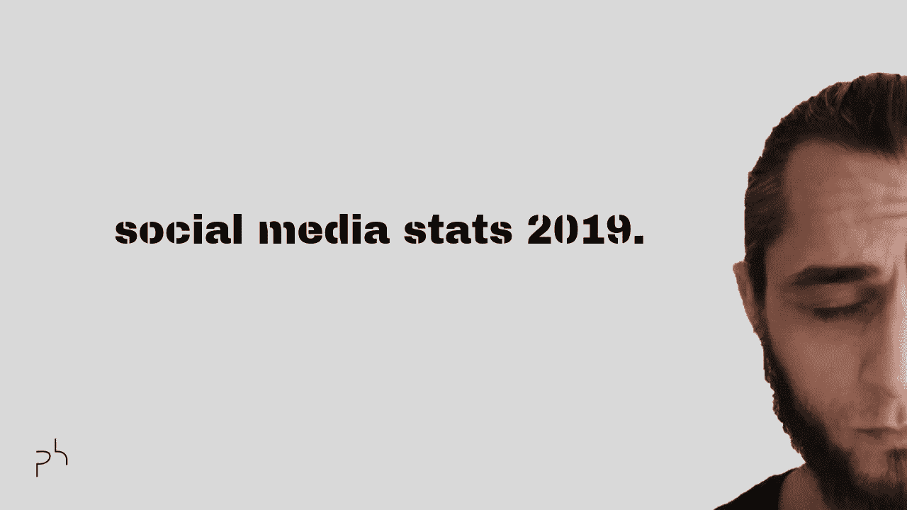

# 2019 年每个企业家都必须知道的顶级社交媒体统计数据

> 原文：<https://medium.datadriveninvestor.com/top-social-media-stats-every-entrepreneur-must-know-in-2019-1fa4ba22fc3c?source=collection_archive---------8----------------------->

让我们谈谈脸书、Instagram、YouTube、LinkedIn、Twitter 和 Reddit stats，来帮助你发展品牌和业务。

# 常规统计

*   全球 42%的人使用社交媒体
*   利用社交销售的公司获得了 119%的投资回报率
*   90%的企业使用社交媒体来提高品牌知名度
*   全球 46.8 亿手机用户
*   全世界每天有 116 分钟花在社交媒体上
*   **决策者在最终做出购买决定之前，一般会阅读 10 篇内容**

 [## 社交媒体倾听让你时刻保持联系——数据驱动的投资者

### 虽然社交媒体倾听是一种顶级趋势，但它应该是每个现代营销策略的一部分。保持和谐…

www.datadriveninvestor.com](https://www.datadriveninvestor.com/2019/02/26/social-media-listening-keeps-you-plugged-in/) 

# 脸书统计

*   22 亿用户
*   52%是男性，48%是女性
*   70%的前置视频广告会一直被观看到结束
*   美国的 Android 用户每天在 FB 上花费 58 分钟。自 2018 年初以来，用户总数增长了 15%
*   64%的美国人活跃在 FB 上

# YouTube 统计

*   19 亿用户
*   51%的营销人员使用 YT 视频广告
*   70%的观看时间来自移动设备
*   55%男性，45%女性
*   YT 是美国青少年中最受欢迎的社交网站
*   每周每天都有 10 亿小时的视频内容被观看

# Instagram 统计

*   10 亿用户
*   带有位置标签的帖子的参与度提高了 79%
*   80%的客户遵循业务概况
*   顶级客户每周发布 5 篇帖子
*   一周中每天有 5 亿用户使用故事
*   58%是女性，42%是男性

# Twitter 统计

*   3.35 亿用户
*   46%的用户每天活跃在该平台上
*   93%的视频是在移动设备上观看的
*   Twitter 广告的价格正在下降，而不是上升
*   每天发送 5 亿条推文
*   64%男性，36%女性

# Reddit 统计

*   3.3 亿用户
*   平均就诊时间为 15 分钟
*   58%的用户年龄在 18-29 岁之间
*   每天 5800 万次投票
*   每天 28 亿条评论
*   69%的男性和 31%的女性

# LinkedIn 统计

*   超过 5 亿会员
*   每月有 2.6 亿 LinkedIn 用户登录
*   40%的月活跃用户每天使用 LinkedIn
*   6100 万 LinkedIn 用户是高层影响者，4000 万用户处于决策层
*   LinkedIn 是财富 500 强公司中使用最多的社交媒体平台
*   微软以超过 250 亿美元的高价收购了 LinkedIn
*   **全球 20 亿千禧一代中，有 8700 万人使用 LinkedIn**
*   **在这 8700 万千禧一代用户中，有 1100 万人处于决策层**
*   每月 6300 万独立移动用户
*   94%的 B2B 营销人员使用 LinkedIn 作为内容分发渠道，相比之下，Twitter 为 89%，脸书和 YouTube 均为 77%
*   LinkedIn feed 中每周有 90 亿次内容展示
*   在 LinkedIn 的 5 亿用户和 2.5 亿月活跃用户中，只有 300 万人每周分享内容——略高于月用户的 1%
*   LinkedIn 占 B2B 网站和博客社交流量的 50%以上
*   91%的营销主管将 LinkedIn 列为寻找优质内容的首选
*   **只有 100 万用户在 LinkedIn 上发表了一篇文章**
*   这仅占用户总数的 0.2%
*   大约 45%的 LinkedIn 文章读者处于上层职位(经理、副总裁、董事、首席级)
*   80%的 B2B 销售线索来自 LinkedIn，相比之下，Twitter 和脸书的这一比例分别为 13%和 7%
*   59%的 B2B 营销人员表示，LinkedIn 为他们的业务带来了商机
*   71%的 B2B 营销人员表示 LinkedIn 是他们广告战略的一部分
*   企业网站 46%的社交流量来自 LinkedIn
*   90%的 B2B 营销人员使用 LinkedIn lead gen 表单降低了每条线索的成本
*   LinkedIn 产生的转化率是 Twitter 和脸书的 3 倍

**另外，如果你是一个小企业主，有销售&服务客户的工作流程；你想要尊重你、不抱怨你的价格的终身顾客；**你想要的线索、询问或拜访超出了你的能力范围；你意识到了社交媒体广告的力量；你没有时间自己做，或者你以前尝试过但没有成功，那就去 farukdeveci.com 吧。

如果有道理，就在 [LinkedIn](https://urlgeni.us/linkedin/farukdeveci) 、 [Instagram](https://urlgeni.us/instagram/thefarukdeveci) 、 [Twitter](https://urlgeni.us/twitter/thefarukdeveci) 、 [YouTube](https://urlgeni.us/youtube/channel/faruk) 、[苹果播客](https://itunes.apple.com/us/podcast/the-perpetual-underdog-show/id1443582129?mt=2&app=podcast)、[谷歌播客](https://www.google.com/podcasts?feed=aHR0cHM6Ly9hbmNob3IuZm0vcy8xZGQ2MDM0L3BvZGNhc3QvcnNz) & [Spotify 上抓我。](https://open.spotify.com/show/6DmZtJdq53Bsod8alw8f2D)

感谢您的关注，感谢您的喜欢、评论和分享。

要伟大！

资源:

*   [https://www.statista.com/topics/1882/instagram/](https://www.statista.com/topics/1882/instagram/)
*   [https://awario . com/blog/36-surcing-social-media-statistics-you-should-know-in-2019/](https://awario.com/blog/36-surprising-social-media-statistics-you-should-know-in-2019/)
*   [https://foundationinc.co/lab/b2b-marketing-linkedin-stats/](https://foundationinc.co/lab/b2b-marketing-linkedin-stats/)
*   [https://business . LinkedIn . com/marketing-solutions/blog/LinkedIn-B2B-marketing/2017/10-surviving-stats-you-not-know-on-LinkedIn-marketing](https://business.linkedin.com/marketing-solutions/blog/linkedin-b2b-marketing/2017/10-surprising-stats-you-didnt-know-about-marketing-on-linkedin)