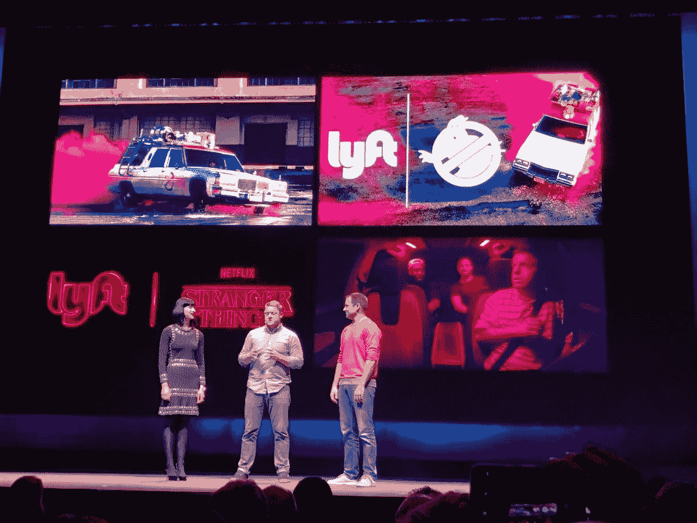

# 2018 年要回顾的 3 大技术趋势(来自我的个人经历)

> 原文：<https://medium.datadriveninvestor.com/top-tech-trends-to-recap-in-2018-bacc7c387360?source=collection_archive---------36----------------------->

在新的一年里期待什么:

The keynote at #UniteLA

1.  **合作和异花授粉:**

我们在 [#UniteLA](https://unite.unity.com/2018/los-angeles) 与 [Lyft](https://www.lyft.com/) 、 [REWIND](http://rewind.co/) 和 [Unity Technologies](https://unity3d.com/) 的合作中看到了这一点，在主题演讲中:“[使用增强现实来增强 Lyft 骑手的体验。](https://www.youtube.com/watch?v=hio-3R61k3I)“这是不同行业的品牌之间合作的一个很好的例子，这些品牌拥有不同的优势，可以为客户创造更大的整体价值。

根据主题演讲，Lyft 品牌负责人 Ethan Eyler 提到，“去年，他们启动了研发(R&D)，以试验沉浸式增强现实(AR)/虚拟现实(VR)体验和车内娱乐。”

> [DDI 编辑推荐——新一切的黎明:与现实和虚拟现实的相遇](http://go.datadriveninvestor.com/vrdawn/matf)

他提出了几个问题:

> “我们如何衡量这些经历？我们如何确保每一位骑手和每一次骑行都能感受到这种魔力？”

如果不再需要开车和注意路况，那么长时间呆在密闭的空间里会有什么其他的机会呢？在这段额外的时间里，你还会做些什么？

**2。沉浸式体验正变得越来越主流:**

a.正如在《美国之声》上看到的:海莉·斯坦菲尔德最近在电视直播上表演了她即将上映的电影《大黄蜂》中的新单曲。品牌现在更多地参与创造体验来讲述他们的品牌故事。[大黄蜂](https://twitter.com/bumblebeemovie?ref_src=twsrc%5Egoogle%7Ctwcamp%5Eserp%7Ctwgr%5Eauthor)在[好声音](https://www.nbc.com/the-voice)半决赛中出现在观众的前排，那里的座位被腾出来给他与观众一起观看表演的空间。

b.时尚界的数字影响者 Chriselle Lim 最近在博客上发表了关于 [SK-II 面部护理精华](https://www.google.com/url?q=http://spr.ly/festivered3832-03&sa=D&ust=1543723870140000&usg=AFQjCNFf8-J5KNe8Ro4POnFOzu0qpXKH7g)的文章。根据她的博客，SK-II [“给了她一个增强现实工具包来增强体验，并把设计变成现实。”](https://thechrisellefactor.com/2018/12/the-best-asian-beauty-secret-i-learned-from-my-mom/)

**3。为拥有 AR/VR 体验的企业带来价值:**

我们在 [#OC5](https://www.oculusconnect.com/) 看到，小组讨论了沃尔玛的案例研究——“培训，转型:沃尔玛探索大规模虚拟现实”沃尔玛正在朝着一个大目标前进，即在未来 12-18 个月内培训 100 万名虚拟现实(VR)人员。他们正在使用 VR 来创建可能发生在商店地板上的真实体验(如溢出、事故、糟糕的客户体验)，并在受控环境中测试这些体验，以更好地培训员工。更好的员工培训的一个重要结果是降低成本和增加利润。这将有助于为企业内的 AR/VR 体验创建一个真正的商业案例。

> “它变成了体验式学习；员工会觉得他们就在那里，但记忆中却不同”——沃尔玛(Brock McKeel，Walmart；安迪·特雷纳，沃尔玛)

沃尔玛专注于通过利用便携式 [Oculus Go 耳机](https://www.oculus.com/go/)进行虚拟现实员工培训来提高员工的[“合规和软技能】](https://www.digitalbodies.net/virtual-reality/walmart-expands-its-vr-training-with-17000-oculus-go-headsets/)。

随着理念和技术的不断进步，AR/VR 正在为企业增加更多价值。看到新的一年中出现的机遇和挑战将是令人兴奋的。

一如既往的感谢您的阅读！祝你节日快乐！