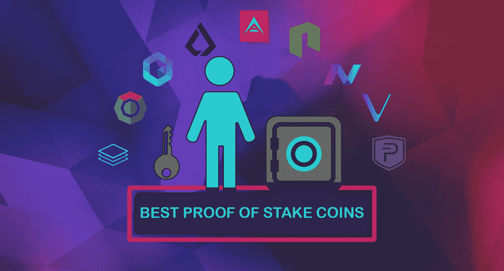

# 2019 年投资的十大赌注硬币证明:开始用红利加密货币赚钱

> 原文：<https://medium.datadriveninvestor.com/top-ten-proof-of-stake-coins-to-invest-in-2019-start-earning-with-dividend-cryptocurrency-441a45c42047?source=collection_archive---------2----------------------->

(披露:下面的一些链接可能是推荐链接，这将有助于支持作者的工作。)

*(免责声明:文章所表达的观点和意见仅属于作者，并不一定代表 DDI 的立场。这篇文章无意成为投资建议。我们建议你通过多种渠道进行自己的独立研究。)*

 [## 5 行业转型区块链应用|数据驱动投资者

### 除非你一直生活在岩石下，否则我相信你现在已经听说过区块链了。而区块链…

www.datadriveninvestor.com](https://www.datadriveninvestor.com/2019/02/13/5-real-world-blockchain-applications/) 

在加密货币市场上对股权证明算法的探索在市场上非常成功。股权证明加密货币的投资回报非常好。通过向用户提供诸如主节点、赌注硬币和可堆叠钱包之类的选项，PoS 也有经济和技术利润。

用户或投资者 PoS 还可以以较低的价格获得分布式共识，并且这些也是生态友好的。PoS 小账户持有者也可以从仅仅成为网络的参与者中获得奖励。这里我们要讨论的是加密货币市场十大股权加密货币证明。

[**NAV coin(NAV)**](https://navcoin.org/en)**:**NAV coin 是基于隐私的加密货币，是开源的区块链技术。这种加密货币是第一种为私人交易提供双区块链的货币，功能齐全。这种加密货币自 2014 年以来一直在市场上出现，它基于比特币的核心代码。

这种货币提供了更快的交易(大约 30 秒)，为用户提供了 PoS 赌注奖励，可选的隐私保护，并且成本较低。这种货币还有冷赌注的特点。NAV COIN 的投资回报率是每年 5%,交易者可以在币安购买。

NAV 的主要功能和优点是:

*   它很快。
*   它很便宜。
*   它提供了极好的隐私。

立即购买[导航币](https://www.binance.com/?ref=37011809)

[**Neo(Neo)**](https://www.thecoinrepublic.com/neo-neo/)**:**该货币之前被称为 AntShares，在加密货币市场非常受欢迎。近地天体区块链有一个名为“气体”的加密令牌，他们使用这个令牌进行交易和奖励。每当一个节点发现一个新的区块，NEO 用户将获得 7 个气体令牌，这些令牌将自动平均分配给用户。如果用户获得更多 NEO 令牌，他们将获得更大份额的奖励。这种货币很容易使用。

NEO 的年投资回报率为 2.5%。用户可以在币安，eToro，Kucoin，OKEx 和 Bit-Z 购买 NEO。货币的优点是:

*   这是一个聪明的经济。
*   身份和证书是数字的。
*   dApps 种类繁多，易于使用。

立即购买[新硬币](http://coinbase-consumer.sjv.io/ov07E)

[**VeChain(VET)**](https://www.thecoinrepublic.com/vechain-ven/)**:**VeChain 是加密货币社区中另一个非常受欢迎的 PoS。它也非常像 NEO，提供智能支付交易。职业教育和培训的区块链现在更关注其供应链行业。今年，该货币的区块链计划与沃尔玛中国和亚马逊网络服务结盟。

它有与 PoS 相似的区块链，它有权威区块链硬币的证明，它有不同的共识模型。作为回报，你会因为监视你的兽医而得到报酬。VTHO 也用于交易，投资回报率约为 2%或更高。用户得到额外的不同的节点，X 节点，经济和易于使用的水平。

这种货币的投资回报率是每年 2-6 %,交易者可以在币安和库科恩购买。职业教育和培训的优点是:

*   它很容易使用。
*   它有很多合作伙伴。
*   它还有其他的好处和节点。

立即购买 [Vechain](http://coinbase-consumer.sjv.io/ov07E)

[**PIVX**](https://www.thecoinrepublic.com/pivx-pivx/)**:**PIVX 代表私人即时验证交易，也是赌注虚拟货币的重要证明之一。这种货币主要关注用户的安全和交易过程中的隐私。此外，破折号帮助用户获得了不错的回报。

用户之间的块奖励根据谁发现了块而不同。用户以 PIV 和 z-PIV 代币的形式接收奖励。PIVX 上的交易快速、便宜且安全。

PIVX 的投资回报率是每年 10%，交易者可以在币安购买。PIVX 的主要功能有:

*   安全和高度保密的交易。
*   又便宜又快。
*   该系统是自治的。

立即购买[PIV xcin](http://coinbase-consumer.sjv.io/ov07E)

[**方舟**](https://www.thecoinrepublic.com/ark-ark/) **:** 方舟是一个完整的生态系统，而不仅仅是一种货币，借助其智能“SmartBridge”技术，货币目标将不同的区块链相互关联起来。它提供快速和可扩展的服务，使用的平台无关紧要。它依赖于它的持有者作为投票者，方舟上的用户为 51 个代表投票，然后他们发现新的区块。被选中的代表负责认证交易并获得奖励。基于投票在用户之间分配奖励。

在这个世界上，行业内的竞争如此激烈，方舟与他们合作，专注于提供更好的服务。

方舟的投资回报率是每年 10%，交易者可以在比特 z，币安和 OKEx 购买货币。ARK 的主要优点是:

*   这是一键区块链技术。
*   它的交易速度非常快。
*   它具有非常出色的 SmartBridge 功能。

即刻购买[方舟](https://www.binance.com/?ref=37011809)

[**Lisk**](https://www.thecoinrepublic.com/lisk-lsk/)**:**Lisk 和方舟很像。Lisk 的区块链程序非常容易使用，对于开发者、企业和虚拟货币分配非常方便。开发者可以使用 JavaScript 创建 dApps，适应性很强。与 ARK 类似，它也使用委托 PoS 系统。在 Lisk 中，只有前 101 名代表可以发现方块并获得奖励。

其他用户投票给代表和 LSK，然后在收到奖励代表与选民分享。投票和赌注都在 Nano 钱包上完成。

这种货币的投资回报率是 4%，交易者可以在币安、OKEx、Bit-z 和 Kucoin 购买这种货币。Lisk 的优点是:

*   可扩展性不是问题。
*   侧链和主 Lisk 区块链的互操作性。
*   易于使用和方便。

立即购买 [Lisk](https://www.binance.com/?ref=37011809)

[**【NEBL】**](https://nebl.io/)**:**这是现代下一代区块链技术。区块链正在开发功能和服务，以使所有企业都能使用区块链技术。专注于使其快速、简单和安全。它具有由 NEBL 启用的利益相关者共识模型的证据，以保护区块链或 DLT 的数据库。

客户端可以非常容易地为不同的目的创建和运行 dApps。NEBL 的赌注也很容易，如果你的硬币在钱包里的时间更长，奖励会更高。

加密货币的年投资回报率为 10%，交易者可以在库科恩和币安购买。Neblio 的优点是:

*   易于使用，面向企业使用。
*   不错的投资回报率。
*   快速、简单且安全。

立即购买 Neb lio

[**本体(ONT)**](https://www.thecoinrepublic.com/ontology/) **:** 本体的区块链也专注于企业使用，就像内布利欧和 ONT 的区块链也协助其他区块链技术一样。区块链为其他人提供了更好的可访问性和灵活性，用户可以在私人和公共部门完全安全和私密地存储他们的数据。

新学派的共同创始人达和埃里克·张创立了本体论。然而，NEO 是开源的，并且是基于企业的。

ONT 的投资回报率是 5%，取决于其他奖金和节点。商人可以在币安、比特兹、奥克兹和库科恩买到它。ONT 的优点是:

*   由经验丰富的团队打造。
*   面向企业
*   到处都是好的服务和聪明的合同。

即刻购买[本体](https://www.binance.com/?ref=37011809)

[**科莫多(KMD)**](https://www.thecoinrepublic.com/komodo-kmd/) **:** 这也是一个简单方便的区块链平台，他们正在为他们的用户创建全方位服务的区块链解决方案。它正试图成为一个区块链生态系统，他们希望每一项服务都能够提供这种分散的交流和全方位的功能和产品。他们还计划为他们的用户提供分散的 ICO 筹款舞台。

区块链具有原子交换、交叉链、桥接和出色的安全性等特性。用户使用 KMD 硬币下注。

加密货币的投资回报率为 5%，交易者可以在币安购买。KMD 的优势在于:

*   隐私和高级安全性。
*   原子交换帮助区块链实现互操作性。
*   ICO 众筹和交易所大大分散，增加了区块链。

立即购买[科莫多](https://www.binance.com/?ref=37011809)

[**【Stratis(STRAT)**](https://www.thecoinrepublic.com/stratis-strat/)**:**这种区块链技术有助于业务和公司，它是引入 dApps 的交钥匙解决方案。区块链帮助企业创建他们的区块链结构。最令人惊讶的功能，如应用程序开发利用 C#和侧链托管事务。它提供快捷方便的交易。

以前它开始时是 PoW，但后来变成了 PoS 项目。对于赌注，Stratis 赌注钱包客户端的本地副本是必要的。

战略的投资回报率是 1.46%，交易者可以在币安购买。Stratis 的优点是:

*   企业安全。
*   一键式部署，易于使用。
*   它还可以记录一个人的医疗记录和金融技术的使用。

立即购买 [Stratis](https://www.binance.com/?ref=37011809)

赌注和被动收入加密货币的列表不限于此，但还有一些货币可以提供丰厚的收益，这里没有提到，因为这是 10 大赌注和分红加密货币的列表，所以我们选择了 2019 年持有/投资的最佳赌注加密货币。

但是，如果你们中的一些人有这些货币，并赚取被动收入，请在下面的评论部分让我知道你的经历。这都是我在这篇文章里说的。我将焦急地等待你的评论。

新闻来源:[the confirpublic](https://www.thecoinrepublic.com/twitter-ceo-jack-dorsey-we-love-you-bitcoin/)

/