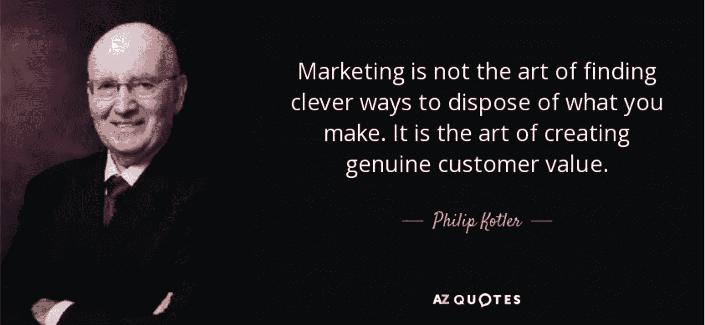

# 关于走向市场(GTM)的三个常见问题，并举例说明。

> 原文：<https://medium.datadriveninvestor.com/top-three-faq-questions-on-go-to-market-gtm-explained-with-example-3d6f4e29c25f?source=collection_archive---------0----------------------->

## 1 —什么是走向市场战略？

虽然走向市场战略有很多定义，但我最喜欢的一个来自劳伦斯·弗里德曼的书——《走向市场战略:向更多客户销售更多产品的高级技术和工具》

> 达成并服务于 ***右*** **客户**中的 ***右*** **市场**，通过 ***右*** **渠道**，拥有 ***右*** **产品**和 ***右*** **价值**走向市场战略的目的是创造强大、成功的 ***总体客户体验*** ，它将:
> 
> a)吸引、赢得和保留最理想的顾客；
> 
> b)在推动高销售额和市场份额增长的同时，
> 
> c)以尽可能低的成本。

## **那么什么是*总体客户体验呢？:***

> *你的客户对你的公司的每一次体验都必须是积极的、一致的、高质量的、难忘的，无论客户是在买东西、寻找信息、面对面的会面、浏览你的网站、打电话等等。如果你能做到这一点，那就是总体客户体验。这是走向市场战略的全部意义。—*
> 
> *Gene McCluskey 是 Cognos 的主管，拥有 15 年的渠道和合作伙伴管理经验*

## *2—为什么我们需要上市计划？*

*你将**根据几个重要问题评估你的 GTM 需求**。*

***a .你想在新市场推出现有产品吗？***

*如果一家公司的产品在一个市场上做得非常好，为什么不尝试用同样的产品进入一个新的市场？例如，为了成为世界上最大的家具零售商之一，宜家在过去几十年里做了很多。[在瞄准更具挑战性的地理区域(如中国和中东)之前，宜家开始向与其祖国(瑞典)文化相对接近的市场扩张。](https://www.business-to-you.com/ansoff-matrix-grow-business/)*

***b .你想在现有市场推出新产品吗？***

*例如，公司可以对现有产品进行一些修改，以增加客户的购买价值，或者在公司现有产品的基础上开发和推出新产品。[产品开发](https://www.business-to-you.com/ansoff-matrix-grow-business/)的一个经典例子是苹果每隔几年就推出一款全新的 iPhone。*

***c .你想在新的市场推出新产品吗？***

*起源于美国的全球咖啡连锁店星巴克正在向一个新市场推出新产品，有可能大幅增加销售额。然而，这是最冒险的策略。[星巴克推出新食品系列的最新计划是一项多样化战略](https://manifestedmarketing.wordpress.com/tag/starbucks-ansoff-matrix/)，因为该公司正在使用一种新产品来开拓新的餐饮市场。*

> *根据哈佛商学院教授 Clayton Christensen 的说法，每年有超过 30，000 种新的消费品推出，其中 80%都失败了。*

*每天都有新产品诞生，每天都有新产品失败。一些营销人员说，市场还没有准备好。我们还听说定价太高，与我们的买家预测相差甚远。最频繁的反映，产品真的没有解决对的问题。如果你在研究阶段加入某些元素，上市计划可以帮助你避免这些问题。*

## *3 —如何制定走向市场战略？*

*在制定走向市场战略时，可以考虑以下关键因素:*

*a) **市场**—*

> *举一个简单的例子，如果你发现制药公司迫切需要你的产品，并会迫不及待地排队购买，只要你有合理、有效的方式与他们做生意，你通过什么渠道接触这些客户并不重要。但是，如果制药行业的公司不需要你的产品，那么通过一个昂贵的、完全集成的数据库驱动的 Teleweb 渠道进入该市场，并由一个连接电话销售代表和国家客户经理的计算机系统提供支持，是不会有任何帮助的。—劳伦斯·弗里德曼*

*有必要问这样一个问题:我是否真的专注于正确的市场，我是否有正确的信息可以了解？*

*b) **客户—***

> *即使是对市场非常了解的公司，对客户的了解也往往是肤浅的、轶事般的。这是一个大问题。原因是市场不买东西；顾客有。*

***那么，如何理解并符合目标客户的需求和购买行为呢？***

*提出并回答一些非常重要的问题，例如:*

*1.你的目标市场的客户是谁，他们需要什么？*

*2.是什么驱使他们购买？*

*3.他们希望从供应商那里获得什么样的体验？*

*4.在销售过程中，什么对他们真正有价值——他们愿意支付的价值？*

*5.他们现在使用哪些渠道开展业务，他们计划在未来一两年内迁移到哪些渠道？*

*6.您的哪些具体行动或活动会导致他们大幅增加在贵公司的采购量？*

*c) **渠道和合作伙伴—***

***渠道策略让你在顾客想购买你产品的地方教育和销售你的产品。**您如何制定渠道战略？嗯，首先要为你的新产品找到合适的渠道。*

*例如，亚马逊的主要渠道当然是 Amazon.com。然而，他们也有附属合作伙伴。*

> *航空公司提供了几个购买机票的渠道。当然，你可以上 united.com 网站，通过网站预订。然而，也有客户喜欢直接打电话给代表预订旅行。如果你有美国运通信用卡，你可以去他们的旅游服务机构预订行程。你也可以使用旅游聚合器，如 kayak.com 或 expedia.com，找到最便宜的航班。*

***d)产品和价值主张***

1.  ***产品愿景——GTM 计划必须包括产品愿景，该愿景包含您的产品目的及其存在的原因。产品愿景需要来自市场营销、品牌团队、销售、产品经理、客户服务和支持的输入。***

*2.**价值** **主张** —为什么客户会购买你的产品或服务而不是其他公司的？你的**价值主张**让你在同类产品中脱颖而出*

*3.。**定位**声明—*

*你的定位陈述还可以根据其他公司如何向你的潜在客户交付产品来揭示你相对于他们的竞争优势。为了更简单，这里有一个由 *Deirdre Breakenridg* 制作的模板，你可以用它来创建你的定位陈述。*

*有了我们的产品， ***插入产品名称*** ，我们帮助， ***添加在目标受众*** ，那些需要的，现在 ***添加在他们需要的，想要的，需要的*** ，这些都可以帮助他们， ***添加在*** 解决方案中，通过做以下操作，现在 ***添加在*** 中。*

***4。定价—** 在推出新产品之前，定价是产品策略中的一个重要考虑因素。*

***5。反馈回路—** 你的上市计划的一个重要部分是准备一个反馈回路，以评估你的客户对你的新产品的感受。*

## *结论:*

*如果你想要真正的销售增长，市场份额的显著增加，更多的忠诚客户，以及高额利润，你的出发点必须是，走向市场就是要找到、吸引并最终留住最好的客户。*

***客户想要*总体客户体验*——一种积极、一致、高质量和难忘的体验，符合他们自己的需求和购买方式。***

> *劳伦斯·弗里德曼(Lawrence Friedman)将完美的客户体验模式描述为:“你可以在任何时候、以任何方式、在任何地方、以任何方式与我们做生意。想亲自拜访我们吗？好吧。想要使用网络吗？太好了。更喜欢用电话？那也很好。客户选择是一个非常非常强大的走向市场的概念，它可以在销售增长、客户保持以及最终的利润方面产生切实可见的收益。*

## *进一步阅读*

*[https://www . Amazon . com/Market-Strategy-Techniques-Customers-Profitably/DP/0750674601](https://www.amazon.com/Market-Strategy-Techniques-Customers-Profitably/dp/0750674601)*

*[https://www . Lynda . com/Marketing-tutorials/Create-Go-Market-Plan/578090-2 . html](https://www.lynda.com/Marketing-tutorials/Create-Go-Market-Plan/578090-2.html)*

* [## 安索夫矩阵举例说明| B2U | Business-to-you.com

### 发展企业有不同的方式。安索夫矩阵中总结了四种增长战略(或…

www.business-to-you.com](https://www.business-to-you.com/ansoff-matrix-grow-business/) 

[https://manifested marketing . WordPress . com/tag/Starbucks-ansoff-matrix/](https://manifestedmarketing.wordpress.com/tag/starbucks-ansoff-matrix/)*