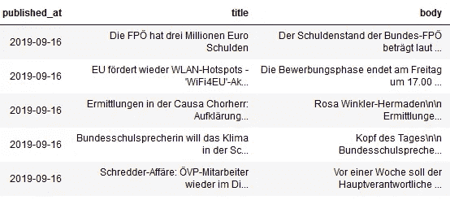
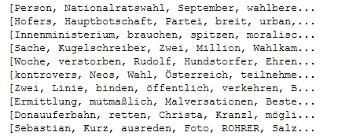
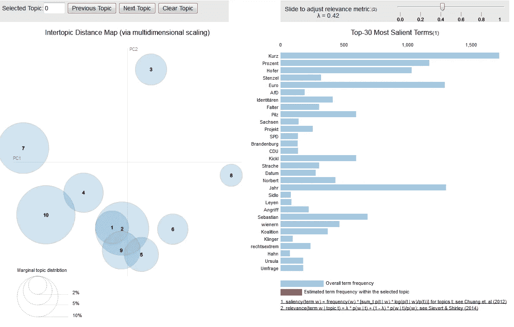
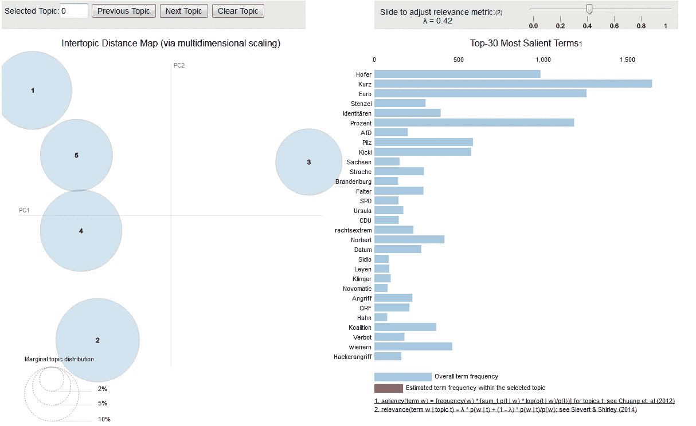
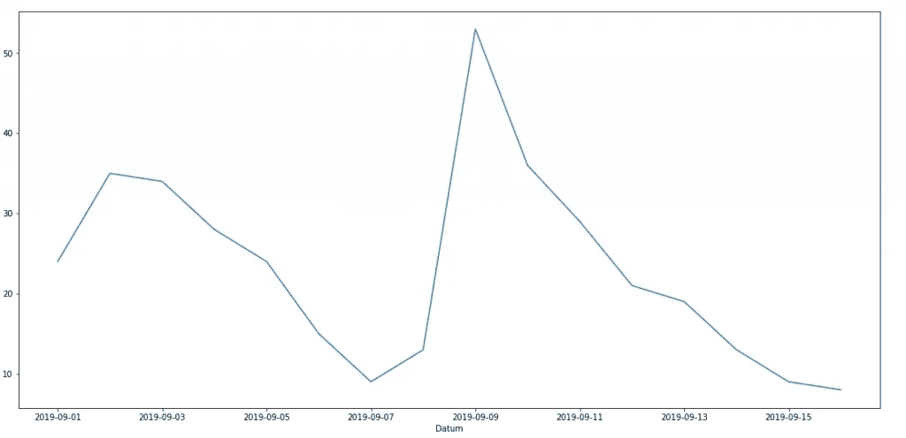
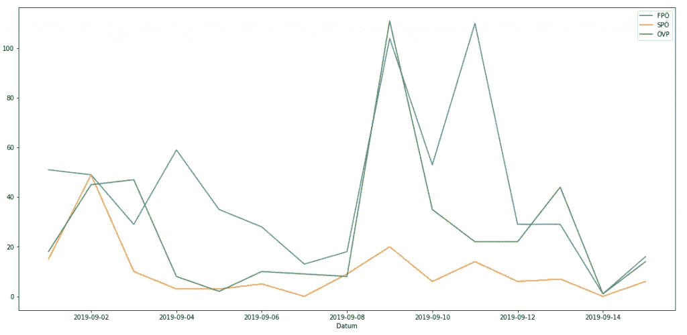

# 2019 年奥地利大选前的在线新闻话题

> 原文：<https://medium.datadriveninvestor.com/topics-in-online-news-before-the-austrian-elections-2019-d981facbd0dd?source=collection_archive---------12----------------------->

在早些时候的一篇文章中，我描述了 http://politradar.stoeckl.ai/ T2 的项目，我在那里监控奥地利政党在线报纸的出版物。现在有了几个月来近 10，000 篇新闻文章的数据，我有兴趣发现在 9 月底的选举之前哪些话题是最重要的。

所以我尝试用 LDA 算法对数据进行主题建模。LDA 是一种识别文本文档中主题的方法。如需更深入了解 LDA 聚类，请阅读[https://medium . com/@ Jonathan _ hui/machine-learning-latent-Dirichlet-allocation-LDA-1 d9d 148 f13 a 4](https://medium.com/@jonathan_hui/machine-learning-latent-dirichlet-allocation-lda-1d9d148f13a4)

 [## 保护主义、政治和经济动荡|数据驱动的投资者

### 美国股市昨日出现 400 多点的大幅反转，为未来的事情发出了警告信号。市场…

www.datadriveninvestor.com](https://www.datadriveninvestor.com/2018/06/28/protectionism-politics-economic-turmoil/) 

首先，将数据从数据库加载到熊猫([https://pandas.pydata.org/](https://pandas.pydata.org/))数据帧中，用于处理数据。

Data from online news

然后，我选择我想要检查的时间跨度(例如，九月的前两周)，并按时间跨度过滤数据帧。合并并清理了文章正文和标题的文本。

为了清理“SpaCy”([https://spacy.io/](https://spacy.io/))与在新闻数据上训练的德语语言模型一起使用。它做词性标注，词汇化和删除几种类型的标记。

因此，为我们想要分析的每个新闻文档获取一个单词列表。

Lists of tokens

在开始计算之前，我用“Gensim”包([https://radimrehurek.com/gensim/](https://radimrehurek.com/gensim/))建立了所有单词的字典和语料库。聚类的计算是通过 LDA 实现的多聚类版本来完成的。

LDA with Gensim

为了解释聚类，我使用了模块 LDAvis([https://www.aclweb.org/anthology/W14-3110](https://www.aclweb.org/anthology/W14-3110))来可视化计算结果。

LDAvis

我从 10 个集群开始，但是可视化显示了一些重叠的主题，这表明 10 对于那个语料库来说太高了。

LDA with 10 topics

我尝试了不同的集群编号值，发现 5 是本例中的最佳解决方案。

LDA with 5 Topics

LDAvis 的界面现在可以用来识别集群背后的主题。

我们看到关于不同丑闻的话题占据了整个场景。5 个话题中的 3 个可以被确定为关于一些政治丑闻。

*   议题 1:"有抱负的缔约方和联盟"
*   主题 2:“蒂罗尔和驾驶禁令”
*   主题 3:“围绕奥地利赌场和 Novomatic 赌场的丑闻”
*   话题 4:似乎是“黑掉 VP”和关于 AFD 和 Sachsen 的新闻的混合体
*   话题 5:关于“欧盟和哈恩委员”以及“斯滕泽尔”和“身份”丑闻的混合体

这表明该算法不能分离主题 4 和主题 5 中的两个主题。但是随着在计算中更高的主题数量，重叠的主题出现在图片中。

我们现在更深入地研究主题 3，并绘制一段时间内与该主题相关的文章数量:

Number of articles on topic 3 —“Scandals surrounding Casinos Austria and Novomatic”

在这里，您可以看到 9 月 9 日的增长，因为 Novomatic 与检察官发生了冲突:

 [## razz ien:Novomatic f HRT schwere geschütze gegen statsanwalt auf

### 奥地利赌场股份有限公司(Casag)成立于 2005 年，是奥地利的一家高等法院。恩…

www.derstandard.at](https://www.derstandard.at/story/2000108427229/razzien-novomatic-faehrt-schwere-geschuetze-gegen-staatsanwalt-auf) 

## 丑闻的报道对当事人的影响不同吗？

这里是 sp0、VP 和 FP 显示的关于“Novomatic”丑闻的文章，而数字是“加权的”(政党被叫得越频繁的文章权重越高，计数越多)。不出所料，关于 FP 的丑闻报道越来越多。VP 部分受到影响。

同样的方法和数据可以回答许多其他问题，例如:

*   其他时期呢？
*   不同的媒体报道不同的话题吗？
*   文章的正负调性呢？
*   …

但在以后的帖子中会更多。