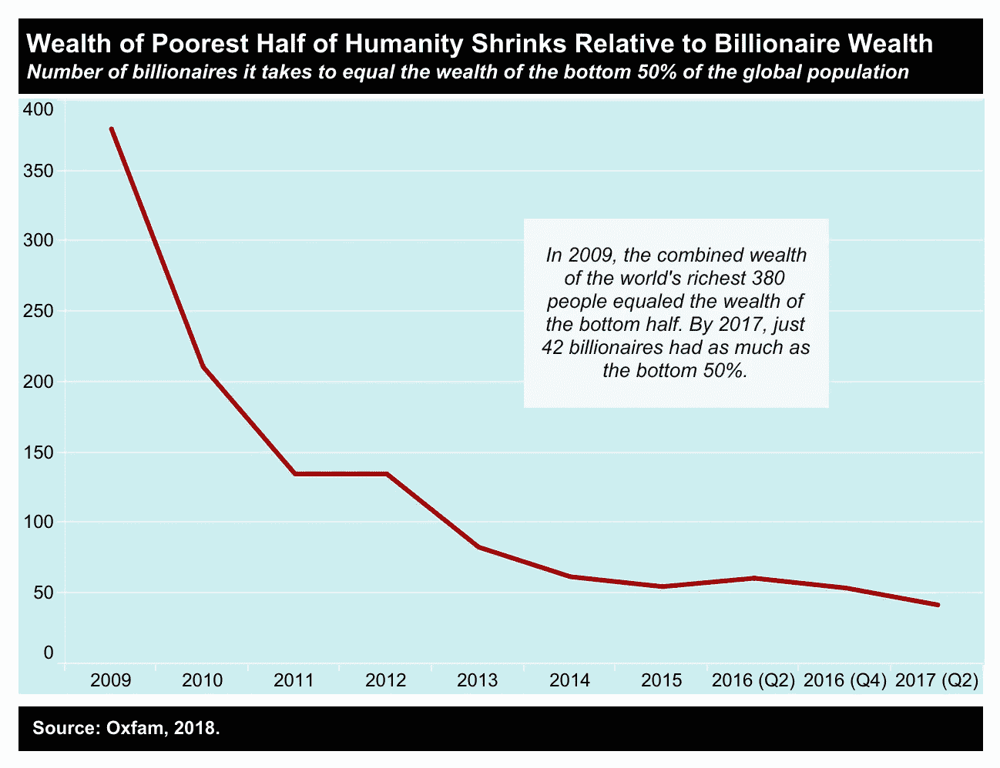

# 走向人工智能:个人预算、自我控制和全球不平等

> 原文：<https://medium.datadriveninvestor.com/towards-ai-personal-budgeting-self-control-and-global-inequality-951443f7304a?source=collection_archive---------11----------------------->

许多人希望获得财富

*个人理财可以积累财富*

*只有少数人做个人预算*

从上面的题词可以清楚地看出，对财富的渴望并不是让个人做个人预算的充分动机。在这篇文章中，我希望证明个人预算不是获取财富的手段，而是控制“自我”的手段。

**自制力:问题**

心理学家发现，跨期选择——涉及在不同时间点发生的成本和收益权衡的决定——对人们的整体幸福感有直接影响。跨期选择的例子包括:自发约会外出与储蓄体验 Vestrahorn 日落；漫长的一天过后，喝一杯冰啤酒还是一杯果汁；甚至，出卖你的选票或者投票给你的良心。在每一种情况下，决策者都需要权衡眼前的结果和未来的结果。上述例子中的直接结果可能包括两个人通过自发约会更紧密地联系在一起，在酒吧喝啤酒时结交更多的朋友，并通过投票销售获得现金；虽然未来的结果可能是在 Vestrahorn 的一次难忘的经历，但喝果汁的健康益处和凭良心投票的更好治理。

毫不奇怪，有压倒性的证据表明，由于自我控制问题，大多数人短视地做出错误的选择，偏好眼前而非未来的结果(这被称为当前偏见)。因此，在面对这种诱惑时，有必要进行自我控制。自我控制装置有助于将一个人锁定在一个行动过程中，可以有效地对个人施加自我控制。

**个人预算:解决方案？**

从更经济学的角度来看，个人预算被定义为将不同类别的支出限制在适用于特定时间段(周、月等)的支出限额内的实践。).现有的研究表明，个人使用个人预算来管理自我控制问题，这往往是由目前的偏见造成的。我特别喜欢一位研究员将财富积累、个人预算和自我控制联系起来的方式。他说，“连接财富积累和计划倾向的渠道是通过一种努力的自我控制来运作的。”这一点意义深远，因为它正确地表明，在财富积累之前，个人预算必须伴随着自我控制。当个人以个人预算的形式制定计划，并努力实施时，自我控制的需要是不可避免的。因此，个人预算应该是一种有效的自我控制手段。

**那又怎样？**

几十年来，全球不平等一直在加剧，因为最富有的少数人依靠在危险条件下拿着低工资工作的人积累了前所未有的财富。根据乐施会的数据，在 2009 年至 2017 年期间，相当于世界上最贫穷的 50%的财富的亿万富翁人数从 380 人下降到 42 人！

Number of billionaires it takes to equal the wealth of the bottom 50% of the global population

随着人工智能和其他技术变革的即将到来，全球不平等预计将成为一个更大的问题。必须对各国的经济结构进行重大调整。个人可能会在一段较长的时间内适应缓慢的变化，但当变化的速度很快且发生在相对较短的时间内时，这是不太可能的。越早支持个人应对转型，社会就能越快适应创新的步伐。否则，社会应该预料到落后者会变成卢德分子，造成不确定的社会后果。

我希望这篇文章能给那些在我们的社会转型过程中被我们的创新所迫而落在后面的人提供一些支持，不管这种支持有多小。