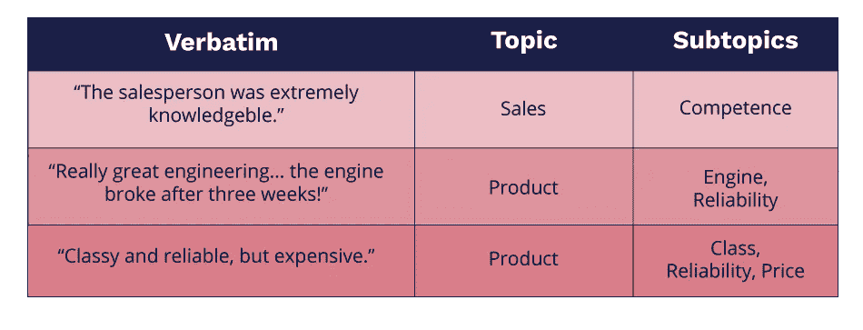
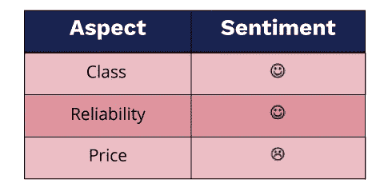

# 市场研究中文本数据的轻松编码

> 原文：<https://medium.datadriveninvestor.com/towards-effortless-coding-of-text-data-in-market-research-anacode-bc63c81b2523?source=collection_archive---------12----------------------->

市场研究调查通常由两类问题组成，即“封闭式”和“开放式”问题。封闭式问题限制了可能的回答范围，并导致结构化数据。相比之下，“开放式”问题允许回答者用自由文本回复，表达他们成熟、真实的观点。这种灵活性使得开放式问题在市场研究中很有吸引力:如果措辞恰当，开放式问题可以引发更广泛、更深入的回答，并提供比刻板、非黑即白的选择题更真实的见解。

# 开放式问题分析的挑战

那么，为什么开放式问题在市场研究中没有被广泛采用呢？原因之一是由于它们的非结构化特征而难以分析。大多数研究人员使用手动编码，其中开放式问题根据它们所代表的主题被手动构造成一个分类方案(“编码框架”)。下表显示了一些示例:

手动编码有几个问题:

*   **成本高**:人工编码劳动强度大，因而成本高。
*   **错误**:根据他们的精神和身体形态，人类编码员会在不同的时间点犯错误或提供不一致的判断。
*   **主观性**:由于人类语言固有的模糊性和微妙性，不同的人可能会以不同的方式对相同的反应进行编码。

最后但同样重要的是，编写数百甚至数千个开放式问题可能是一项令人沮丧的工作。在当今世界，人工智能被用来自动化和优化几乎每一个重复的任务，转向自动化处理来消除编码的单调部分似乎是很自然的。除了自动化的几个好处之外，这也为更复杂的挑战创造了时间，这些挑战需要人类大脑的创造力、经验和智力多样性。

# 使用自然语言处理作为解决方案

自然语言处理(NLP)自动化了研究人员在编写开放式问题时所做的手工工作。它根据讨论的主题和概念以及其他相关指标(如频率、相关性和情感)来构建文本。除了加速编码过程之外，NLP 还可以用来发现数据中的其他见解，丰富最终结果。机器从整体上看待大型数据集并发现关联、规律性和异常值的能力大于人脑。

三种算法——主题建模和分类、概念提取和情感分析——在编码过程中特别有用。

# 主题建模和分类

主题建模检测文本中的抽象主题。主题建模是一种类似于聚类的无监督学习方法，在没有预定义的一组类的情况下学习文本之间的词汇相似性。因此，它在构建编码帧的初始阶段特别有用。以下单词云显示了在关于舒适性的文本中经常提到的单词:

主题分类类似于主题建模。但是，它使用给定的编码框架，并将每个文本分类到预定义的类别中。这意味着，在编码帧已经被构建之后，它可以被用于编码。

# 概念抽取

概念提取匹配文本中的具体字符串。主题建模和分类处理的是分布在文本各处的词汇信息(通常是隐含的)，而概念抽取处理的是文本中出现的精确单词和短语。在更高级的水平上，概念提取也使用词典的结构，并且可以处理词汇关系，例如:

*   同义词:等于关系，例如*大众*等于*大众*
*   上下级关系:IS-A-关系，如*轿车* IS-A *车辆*
*   部分关系:关系的一部分，例如*发动机*汽车*的一部分*

概念抽取通常集中在名词和名词短语上(*发动机，大众*)。在评估(开放式问题)的上下文中，提取“隐藏”在形容词(*快速* ➤速度、*舒适* ➤舒适)和动词(*多付* ➤价格、*失败* ➤可靠性)中的概念也是有用的。

在实现方面，有两种主要的概念提取方法:基于字典的方法和机器学习方法。基于字典的方法使用每个类别的预定义术语列表(也称为“gazeteers”)。另一方面，机器学习方法从大量带注释的数据中学习特定类型的概念。根据经验，可用的数据集越小、越具体，预定义的概念和语言表达式列表的使用就越有效。

# 情感分析

情感分析检测给定文本具有正面还是负面含义。情感分析可以进一步细化到文本中提到的各个方面的级别，从而允许在短语级别上检测混合情感:

经典可靠，但价格昂贵

情感分析是在情感的、主观的和隐含的语言层面上进行的。这种微妙之处给自动化带来了几个挑战。例如，情绪分析是高度依赖于上下文的:一个很糟糕的吸尘器可能会得到一个中性到积极的情绪；相比之下，汽车中的互联网连接通常不应该“糟糕”。另一个复杂因素是讽刺和挖苦:在词汇层面上，讽刺性的陈述通常使用极性取向明确的词汇。然而，当放在周围的环境中，这种极性是相反的:

“真是伟大的工程……仅仅三个星期后引擎就坏了！”

讽刺通常是从相邻文本片段之间的极性对比异常中检测出来的。例如，在上面的例子中，“真正伟大的工程”得到了一种强烈的积极情绪，这种情绪与“发动机仅用了三周就坏了”的消极情绪完全冲突。由于这两个短语是直接并置的，没有诸如“但是”或“虽然”之类的连词，所以机器能够识别整体的负面含义。

# 结合人类和人工智能

总之，使用 NLP 对开放式问题进行编码利用了自动化的几个好处:它加快了过程，并节省了“令人沮丧”的人工。它实现了更好的一致性和客观性，减轻了疲劳和判断不一致等人为因素的影响。最后，机器在高细节水平上处理大量数据的能力允许了人类大脑可能无法达到的粒度水平。

尽管 NLP 自动化无疑提高了逐字编码的效率，但请记住，当前的人工智能技术并不完美，应该始终有一个人在驾驶座上。像 NLP 这样的方法可以立刻处理大量的数据，但是它们还没有完全掌握语言的复杂性。高质量的 NLP 与精心设计的持续优化流程相结合，将确保深入了解最终消费者的意见、需求和愿望的旅程富有成效。

*关于作者:迦娜·利彭科娃拥有计算语言学博士学位，是国际市场情报技术解决方案提供商*[*【Anacode*](http://www.anacode.de/)*的首席执行官。了解更多关于我们的解决方案* [*这里*](http://anacode.de/products/) *。*

*原载于 2018 年 11 月 22 日*[*anacode . de*](http://anacode.de/towards-effortless-coding-of-text-data-in-market-research/)*。*

