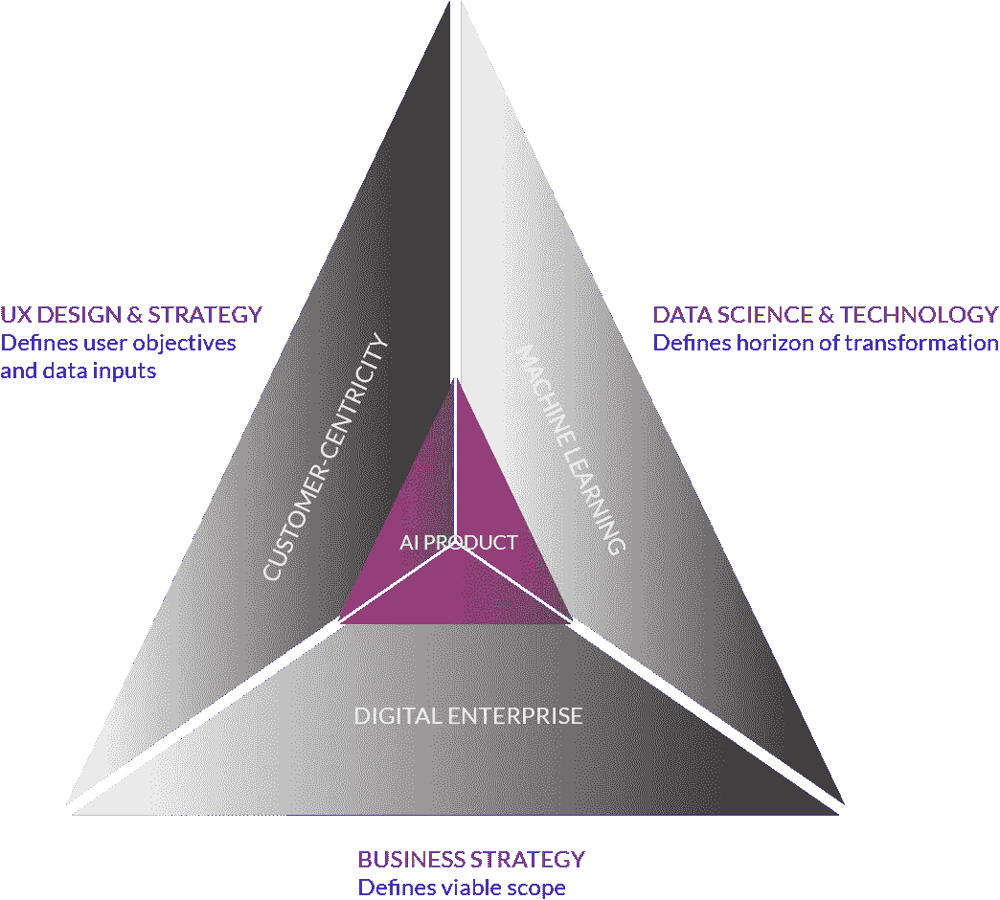
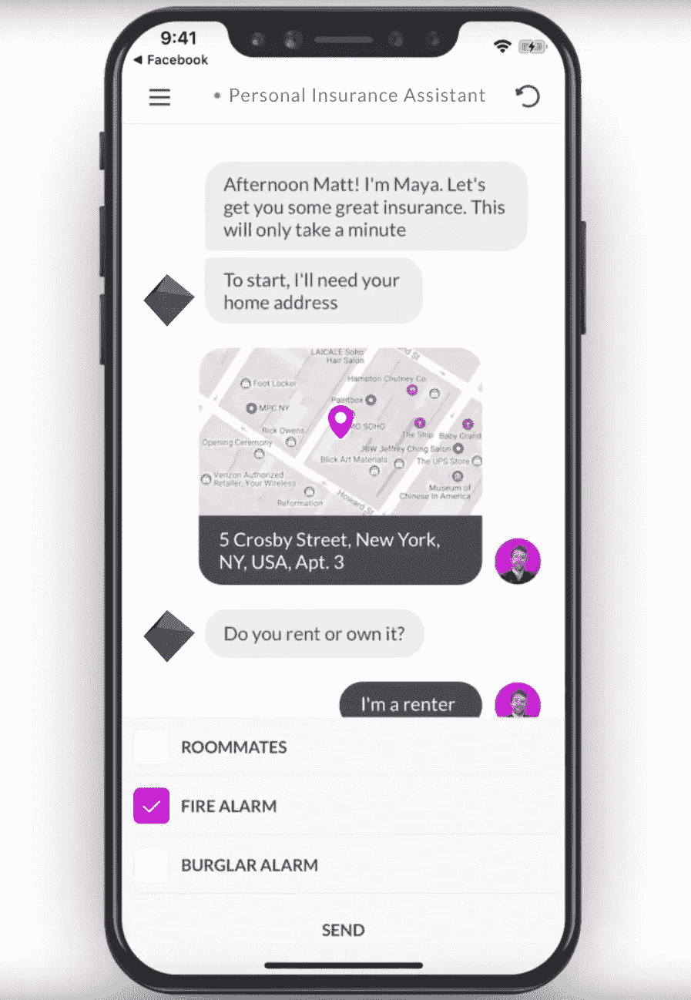
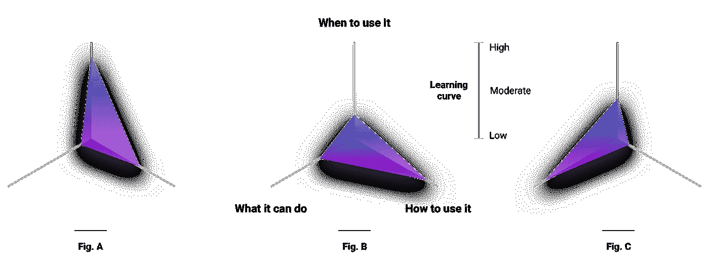
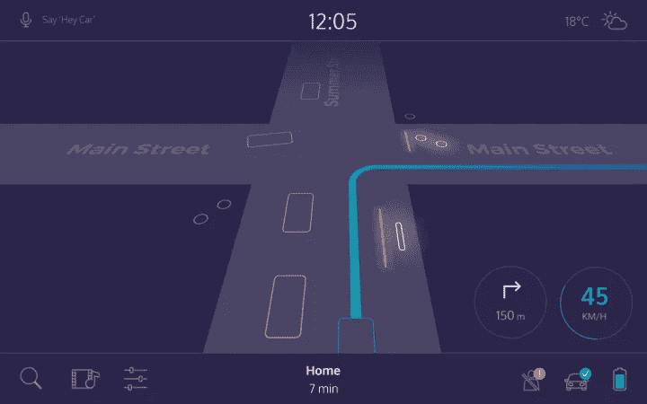

# 走向以人为中心的人工智能:UX 与设计策略

> 原文：<https://medium.datadriveninvestor.com/towards-human-centered-ai-ux-and-design-strategy-76bf35d8a144?source=collection_archive---------3----------------------->

认知技术的进步正促使我们重新思考和重构我们构建的每一种体验，将其作为基于机器增强用户交互的动态模型。机器学习的成功高度依赖于用户的参与，而用户的参与又依赖于实现用户目标的无缝认知增强。在设计和开发阶段理解这一过程的两个方面会导致产品具有基于人类需求的人工智能，并通过机器学习以独特的可能方式为他们解决**。**

**我的任务是指导 Noetos 的 UX 设计，这是一个领先的开源机器学习和人工智能平台，帮助数据科学家建立可解释的模型，并为企业智能提供可共享的见解，以建立和维持一个被称为“更多数据>>更好的人工智能>>更多大规模采用，重复”的正反馈循环**

****

****个性化人工智能 UX****

**网站变得越来越智能，并考虑到用户数据点的多个星座，为访问者提供更加个性化的体验。从用户研究中提取的多个数据点有助于获得关于用户更可能寻找什么的创造性见解。随着机器接管用户研究过程的一部分，扩展用例并使其高度个性化的能力对更多公司来说变得更加可行和可行。**

**人工智能聊天机器人正在推动各行各业的 UX 个性化。在人工智能的帮助下，聊天机器人或智能代理正在进化，在处理复杂任务时变得更加智能。智能代理可以实时回答用户的查询，而不是使用脚本对话来回答用户。**

****

**认知技术的进步正促使我们重新思考和重构我们构建的每一种体验，将其作为基于机器增强用户交互的动态模型。机器学习的成功高度依赖于用户的参与，而用户的参与又依赖于实现用户目标的无缝认知增强。在设计和开发阶段理解这一过程的两个方面会导致产品具有基于人类需求的人工智能，并通过机器学习以独特的可能方式为他们解决**。****

****我的任务是指导 Noetos 的 UX 设计，这是一个领先的开源机器学习和人工智能平台，帮助数据科学家建立可解释的模型，并为企业智能提供可共享的见解，以建立和维持一个被称为“更多数据>>更好的人工智能>>更多大规模采用，重复”的正反馈循环****

******个性化人工智能 UX******

****网站变得越来越智能，并考虑到用户数据点的多个星座，为访问者提供更加个性化的体验。从用户研究中提取的多个数据点有助于获得关于用户更可能寻找什么的创造性见解。随着机器接管用户研究过程的一部分，扩展用例并使其高度个性化的能力对更多公司来说变得更加可行和可行。****

****人工智能聊天机器人正在推动各行各业的 UX 个性化。在人工智能的帮助下，聊天机器人或智能代理正在进化，在处理复杂任务时变得更加智能。智能代理可以实时回答用户的查询，而不是使用脚本对话来回答用户。****

****与 AI 保持一致，UX 有着更深的影响力，它始终以最大限度的客户满意度为目标，包括并关注“客户体验”的所有方面，这涉及一个迭代过程，包括以下几点:****

*   ****理解使用的背景****
*   ****详细说明用户的要求****
*   ****提供设计解决方案****
*   ****对照要求进行评估****

****对于人工智能优先的产品，设计师、开发人员和数据科学家之间的紧密合作是必须的。工程师需要训练数据，UX 团队帮助获取数据，并定义预期的客户结果，包括人工智能主观结果的麻烦，如推荐的电影是可取的。UX 团队旨在通过人类的理解来定义这些标准。工程师利用训练数据和明确定义的结果作为他们输入到机器学习算法中的不同输入。在收集了初始数据集后，工程师们可以训练算法，UX 团队可以用早期原型开始用户测试，用真人验证第一个训练好的模型。****

******人工智能镜头:整合人工智能和 UX 的信息架构******

****人工智能的进步取决于以人为中心的设计以及相关的信息架构。信息架构对于基于与用户的相关性的内容映射/标记非常重要，而 AI 通过识别趋势来生成数据之间的关系。交叉链接两个数据层可以实现无缝功能，并有助于关注最终用户的需求，并通过允许界面浏览海量数据来获取有效的结果。****

******以人为中心的镜头:对准人工智能与 UX******

****如果人工智能和 UX 没有正确结合，认知增强会产生扭曲，导致误用和挫折。人工智能本身不能决定解决哪些问题。如果它不符合人类的需求，一个强大的系统就会解决边缘问题。用户经常开发适合他们想象的人工智能理论的模型，导致误用和缺乏信任。这种现象通常是由与 AI 目标定义不足相关的设计缺陷引起的，导致缺乏对用户在校准该系统中的角色的理解。****

****为了蓬勃发展，人工智能需要获得一种多维度的方法，包括社会和技术视角。机器学习是基于数据中自动发现的模式和关系进行预测的科学。从模型开发到数据、样本和描述符的来源，一直到成功的标准，人工智能的每个方面都受到人类判断的影响。从以人为中心的角度来看待人工智能可以提高质量(对于企业来说，可以转化为可量化的回报)。****

****与 UX 结盟的人工智能翻译成强大的认知增强，并以人类需要的方式解决真正的人类需求。 Google Clips 团队将这种一致性定义为“让人们做他们最擅长的事情，让机器做人们最不擅长的事情……因为对于我们来说，要建立对人工智能影响的信任，我们必须感到放心、被包容和知情。”****

********

****Google Clips 生成的上述图表说明，尽管大多数产品至少有一些学习曲线，但随着人工智能的额外开销，明智地“花费”用户的认知负荷尤为重要。当使用环境对用户来说是新奇的[图 A]时，对可靠性的偏好是有保证的。当有很多新的 UI 元素需要学习时[图 B]，需要强调对用例的熟悉程度。产品的动态功能[图 C]要求在用户界面中强化熟悉的模式。****

****通过添加上下文控件和认知支持来最小化 UI 的复杂性，从而降低用户的认知负荷，可以极大地提升用户体验。在定义 AI 需要解决哪个问题及其成功标准时，通过设计一个理论人类专家的模型来指导 AI 往往是有用的。如果我们不能生成这样一个模型，人工智能很可能会让我们的客户失望。****

******在设计人工智能优先的产品时，重要的是要考虑交互、透明、参与和适应性优化。******

****UX 团队帮助人工智能开发者决定优化什么。提供关于人类反应和人类优先事项的有意义的见解可以证明是人工智能项目中设计师最重要的工作。****

*   *****优化召回*意味着机器学习产品将使用它找到的所有正确答案，即使它显示一些错误的答案。假设我们构建了一个可以识别猫图片的 AI。如果我们优化召回，算法将列出所有的猫，但狗也会出现在结果中。****
*   *****为精确而优化*意味着机器学习算法将只使用正确的答案，但它会错过一些边缘阳性的情况(看起来有点像狗的猫？).它只会显示猫，但会漏掉一些猫。它不会找到所有的正确答案，只会找到明确的案例。****

******人工智能与人类信任******

****人类之间的信任与人类和机器之间的信任基于不同的标准。人类基于可靠性、真诚、能力和意图等因素相互信任。另一方面，人类对机器的信任依赖于准确性、一致性和易错性，对许多人来说，依赖于人类成功解释系统如何工作的能力。人工智能引入了缺乏可解释性以及认知增强，这可能导致有缺陷的算法学习做错误的事情，从而导致不良后果并破坏人类信任。****

*******对 AI 缺乏信任是 UX 设计的一个根本性挑战*** *。*****

****人工智能已经成为许多公司以客户为中心的战略的重要组成部分。它实现了更大的个性化、更多的支持访问和更快的服务，所有这些都是更好的客户体验的组成部分。客户很难在不信任人工智能的情况下对其产生积极的体验。解决这个问题的一个方法是给客户提供人工智能操作的线索。没有必要解释 AI/ML 理论的所有错综复杂之处，而是让客户了解机器学习在相关上下文中使用的数据。这种透明性允许理解，从而促进积极的认知交流，训练人工智能并提升用户体验。在自动驾驶汽车中，积极互联的人工智能和 UX 由乘客屏幕代表，这些屏幕基于共享相对认知环境(在这种情况下，是汽车对其位置和周围环境的理解)来提高客户信任。****

********

****从视觉上区分人工智能生成的内容通常很有用。在很多情况下，我们使用 AI 和机器学习来更深入地挖掘数据，并生成新的有用的内容。尽管人们很容易相信一个给定的模型可以解决任何场景，人工智能生成的内容可以证明对一些人非常有用，但在某些情况下，这些建议和预测超出了预期准确性的可接受模糊性。由于没有提供足够的数据或反馈给系统学习，这个问题会进一步恶化。让客户知道内容是人工智能生成的，可以让他们调整自己的预期，从而减少挫折感。提供反馈机会允许 AI 收集它需要改进的数据。****