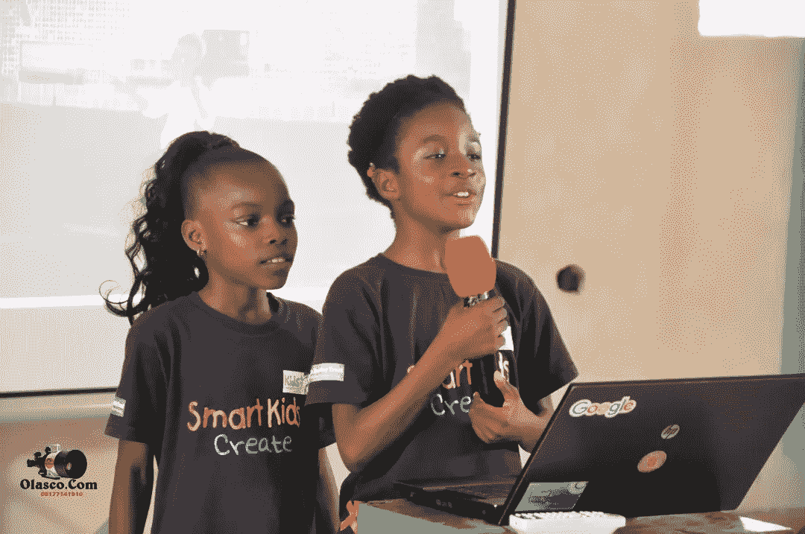

# 走向技术创新

> 原文：<https://medium.datadriveninvestor.com/towards-technological-innovation-fd23f3aebaa1?source=collection_archive---------38----------------------->

寻求培养年轻的非洲人成为全球技术创新者，为他们的未来做好准备，并降低失业率。在不到两年的时间里，我们通过各种学校(公立和私立)、社区和非政府组织激励了 2000 多名非洲年轻人编写代码。其他计划包括 TechGen 挑战、指导、代码节和代码营。

去年夏天也不例外，我们通过与命运信托基金(托管 135 名未被充分代表的人)、杏仁学校和特定家庭的合作，渗透了 150 名年轻的非洲人。

今年的代码营进行了 5 周。我们还创造了历史，在尼日利亚为孩子们举办了第一次区块链培训，在肯尼亚之后，在非洲举办了第二次。

除了编码、区块链技术和 scratch 编程，学生们还参加了领导力课程、运动和远足。

在为期 5 周的代码营结束时，一些学生使用获得的编码技能解决了他们观察到的一些本地问题。

学生们的创新包括移动医院、交通出纳、cgpa 计算器、语言翻译器和多米诺披萨计算器。这的确是一个令人惊奇的夏天！

随着学校的恢复，我们的编码俱乐部也在许多学校和家庭恢复。

如果你想让你的学校或孩子与专业人士一起学习未来的技能，请联系我们。

该计划还得到了@mindthegap、garmelial 和 Susan onosode 基金会(Gamsuf ) [安德拉](https://medium.com/u/a4d81c24b23?source=post_page-----fd23f3aebaa1--------------------------------)、[飞行医生](https://medium.com/u/f8f688473bed?source=post_page-----fd23f3aebaa1--------------------------------)、firstwealth 的赞助。

值得注意的是，TechGen Code camp 将转变为 code festival，明年将在几乎所有非洲国家举办，因为该计划对于本地化非常重要。

这难道不是一次值得的旅行吗？