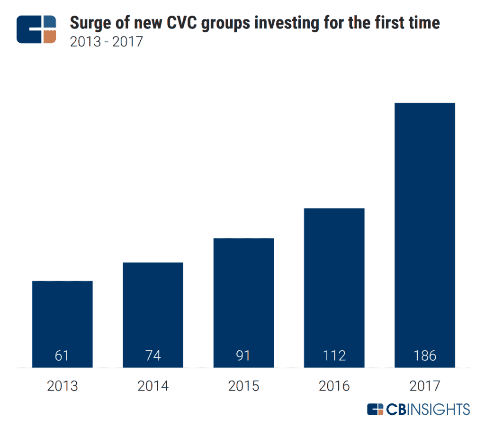

# 城镇和长袍——在创业时协调产业和学术界

> 原文：<https://medium.datadriveninvestor.com/town-and-gown-reconciling-industry-and-academia-when-building-a-startup-23ed0f844c4b?source=collection_archive---------23----------------------->

看看世界上许多顶尖的公司，你会发现一些甚至所有的创始人都有很强的学术背景。以基因泰克、谷歌、雅虎和 VMware 为例，它们都是博士生或教授。这应该是有意义的，因为大学是我们社会中少数几个可以萌发长期伟大想法的地方之一，当它们萌发时，就会产生一家大公司。然而，将一个伟大的想法变成一家大公司的过程并不简单。这篇文章将阐明三个关键的挑战，以及它们的发展趋势。

**知识产权——越来越容易获得许可，甚至放弃专利**

谷歌是在斯坦福大学孵化的，该大学持有该技术的专利，并根据一项多年协议授权给该公司。这在历史上是典型的，尽管最近一些机构开始对知识产权更加放手，包括将其完全交给公司。这种想法是为了优化一家公司的光环效应，在这家公司里，创始人的表现甚至更出色，因为他们不受大学专利的限制。

在谷歌 2004 年首次公开募股时，不太常见的是大学直接持有该公司的股份。斯坦福大学有 180 万股——至少在 2015 年之前，任何人都行使了未披露的一部分，获得了 3.36 亿美元的净收益。自那以后，学术界走得更远，在分拆中持有股权已成为常态。

**步伐——大学试图快速前进是好的，但有一个警告**

学术界尽可能与市场压力绝缘，并提供当今世界上最稀有的证券——一旦你获得终身职位，就能得到一份有保障的终身工作。所有这些都可以解释学术界的刻板印象，即他们是不可思议的创意创造者，但不是最强的执行者，这是投资者普遍担心的一个问题。研究创业的学者们发现了两种主要的非相互排斥的方法来缓解这种担忧。首先是彻底离开大学，而不仅仅是休假。第二种是和业内知名人士或者商业背景更强的人合伙。

尤其是在过去的十年里，大学比以前更加接受商业化。如今，世界上几乎每所优秀的大学都有加速器、创业项目、商学院的创业专业，有些甚至有风险投资基金，通常会投资于由学生、教师和校友领导的公司。所有这些都是好事吗？争论的另一面是，这使得大学更加目光短浅，这对整个社会都是有害的。

**时间视野——行业思维更长远**

大学致力于为研究而研究，因此他们的项目比工业有更长远的视野。但是问任何一个研究人员，他们都会告诉你他们花了一半的时间寻求资助。另一方面，与学术界相比，上市公司依靠不断的季度收益运行，更有可能减少资金或完全取消项目。那么，如何调和这两种截然不同的时间线和期望呢？

行业赋予大学教授职位，以及通过学术建议和咨询进行交叉授粉是长期趋势。更多的情况是，行业本身正在采纳学术界的一些规则，将创新部门与市场压力隔离开来。像迪士尼和安海斯布施、J&J 和耐克这样的多元化公司在内部孵化创意方面做出了重大承诺，为员工提供了足够的资源来建立长期的合作关系。企业风险部门的增长反映了行业越来越接受开放式创新，即许多好的创新发生在企业之外。与学术界的长期时间范围相匹配的行业是一个令人耳目一新的趋势，尽管好的计划被糟糕的收益扼杀的风险始终存在。

对工业界和学术界还有其他看法吗？评论离开。

这些是专注于实践见解的短文(我称之为 GL；dr —良好的长度；确实读过)。如果它们能让人们对某个话题产生足够的兴趣，从而进行更深入的探索，我会感到非常兴奋。我在三星的创新部门 [*NEXT*](http://samsungnext.com/) *工作，专注于深度科技领域软件和服务的早期风险投资，这里表达的所有观点都是我自己的。*