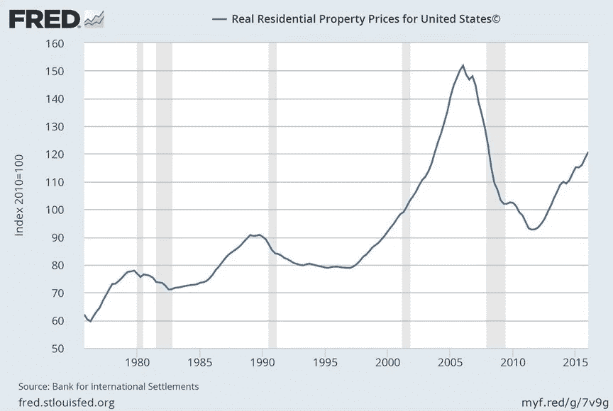
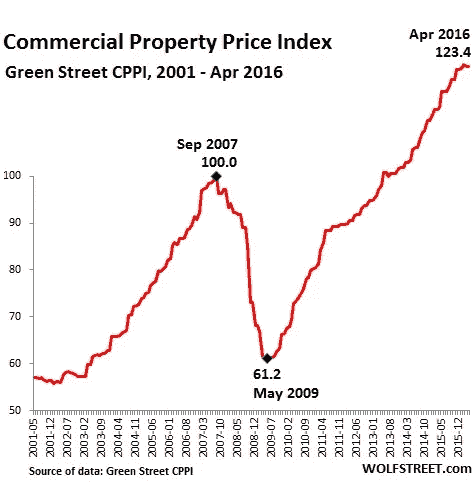

# “玩具反斗城公司收购案表明我们为什么需要认真对待区块链”

> 原文：<https://medium.datadriveninvestor.com/toys-r-us-corporate-takeover-shows-why-we-need-to-take-blockchain-seriously-4b9a08a92153?source=collection_archive---------3----------------------->

## 玩具反斗城的最后告别是一系列商店关闭中的最新一起，这说明了为什么零售业现在比以往任何时候都更需要区块链。

Photo by [Joia de Jong](https://unsplash.com/@joyground?utm_source=medium&utm_medium=referral) on [Unsplash](https://unsplash.com?utm_source=medium&utm_medium=referral)

每个人都预见到它的到来。它没有*有*成为玩具反斗城，但当它成为玩具反斗城时，没有人感到惊讶。玩具反斗城是数十家宣布在一年内关闭店铺的大牌零售商之一。

西尔斯、K-Mart、Brookstone 和 Bonton 是一些最著名的关闭。这还不包括规模较小的夫妻店零售商。这份名单也不包括在某些地方关闭商店的零售商，比如 60 家 [Abercrombie 和 Fitch](https://clark.com/shopping-retail/major-retailers-closing-2018/) 关闭或 110 家 Foot Locker 关闭。星巴克将在 2019 年关闭 150 家门店。

见鬼，连苹果都在大西洋城关了一家店，但毕竟*是*大西洋城。

**零售正在改变。**

“A mail person sitting in a mail truck sorting mail parked outside of a house in Tulsa” by [Pope Moysuh](https://unsplash.com/@pope_moisa?utm_source=medium&utm_medium=referral) on [Unsplash](https://unsplash.com?utm_source=medium&utm_medium=referral)

# 现代购物中心的三个阶段

如果自 1956 年第一家购物中心成立以来，现代零售格局被分为三波，那将是以下三波:终端零售商的发展和增长，互联网-零售投资的蓬勃发展，然后是后互联网阶段。

购物中心的发展阶段包括末期零售空间的增长、普及和增值。

然后互联网出现了。

与此同时，上世纪 90 年代，科技行业和房地产之间创造了大量财富。

当大多数现代购物中心建立时，互联网的潜力并没有被完全认识到。与今天价值 5 万亿美元的产业相比，电子商务还是个婴儿。在后互联网阶段，购物中心正在左右下降；现在，购物中心的生活轨迹有了很大的不同。

购物中心的数量从 2016 年的[1200 家](https://www.theguardian.com/us-news/2017/jul/22/mall-of-america-minnesota-retail-anniversary)下降到现在的[1100 家](http://time.com/4865957/death-and-life-shopping-mall/)。到 2023 年，预计超过 50%的美国购物中心将会关闭。

**为什么数量破纪录的购物中心关门了？**

一家名为亚马逊的小书店在 1994 年打开了它的数字之门，二十年后，这家书店已经发展成为一家近万亿美元的公司。亚马逊有意或无意地延续了末期零售店和购物中心的崩溃。玩具反斗城是亚马逊的最新受害者，但这不完全是亚马逊的错。

手机的使用也摧毁了像手持玩具这样的行业(尽管在这个假期你可能会找到一些便宜的)。除非你从小就受到严重的屏幕时间限制，否则手机游戏比玩具更刺激。移动订购也促成了零售业的灭亡。

零售业呈现出缓慢而稳定的崩溃。有一些商店已经能够重组自己或以某种方式保护自己，以维持运营。许多案例没有这么幸运，比如玩具反斗城。

玩具反斗城的重组受阻

尽管[做了最后的重组努力](https://www.wsj.com/articles/who-killed-toys-r-us-hint-it-wasnt-only-amazon-1535034401?mod=hp_lead_pos4)，控制玩具反斗城债务的五家对冲基金决定清算比重组更好。据说是这样。

然而，事实可能是，正是[一家对冲基金对其他四家基金施加的压力](https://www.wsj.com/articles/who-killed-toys-r-us-hint-it-wasnt-only-amazon-1535034401?mod=hp_lead_pos4)导致 33，000 名员工失业，供应商损失了超过 3 . 5 亿美元的商品。

Solus 另类资产管理公司迫使其他四家对冲基金做出决定，认为玩具反斗城不可救药。一些人认为，这不是一个糟糕的决定，因为这些基金持有面值超过 6 亿美元的证券债务，但这只是所拥有的 53 亿美元债务的一小部分。毕竟，Solus 在破产程序中没有同意支付[工人的遣散费](https://www.google.com/amp/www.mcall.com/business/retail/mc-biz-toys-r-us-workers-benefits-20180824-story,amp.html)。

**区块链如何帮助**

你可能听说过区块链这个词在提到比特币时使用，但它的用例在加密货币之外更容易理解。除了加密货币，区块链本身作为一个产业，预计在未来 5 年内将从 3.39 亿美元增长到 23 亿美元。

你应该了解一下区块链。技术壁垒一开始很难理解，但理解它将有利于你理解未来是如何构建的。

区块链更多的是一个基础设施，而不是别的。类似于如何在互联网上建立网站，去中心化应用程序(dApp)可以建立在区块链上。dApps 可以在没有中央集权的控制下运行，中央集权限制和分配权力的集中。

Photo by [Maik Jonietz](https://unsplash.com/@der_maik_?utm_source=medium&utm_medium=referral) on [Unsplash](https://unsplash.com?utm_source=medium&utm_medium=referral)

区块链可以帮助内部决策达成共识，这可能有助于克服对冲基金的压力，就像玩具反斗城的情况一样。

公共账本是区块链最值得注意的应用，可以帮助供应商维护物流和供应链信息。第三，网络公司正在创造下一代市场，允许公司直接向供应商销售。

区块链协议正在开发中，允许社交批量购买交易和个人价格折扣，这将是继购物中心之后的下一个商业阶段。他们可能会减少，直到他们成为新奇。购物中心包含最终阶段的零售商，这些零售商通常是全国性的连锁店。由于给定连锁店内全国商店数量的需求，连锁店能够得到最好的交易。现在，区块链可以允许制造商直接向消费者销售产品。

**新的末期零售商**

区块链可以是分散的、自治的交易市场。Buying.com[和](http://buying.com)等项目为区块链提供了这种用例，该公司利用其平台主办社交大宗购买交易。

个人能够将他们的购买力集中在一起，创造与末期零售商曾经创造的需求水平相同的需求水平。制造商、分销商、清算人和供应商可以在 Buying.com 的网站上进行交易。所有交易都要求满足最低订单数量。

该项目旨在为下一代企业家提供从制造到交付的全方位服务生态系统。一旦完成， [Buying.com 的](http://buying.com)分散分销网络类似于优步和 Airbnb，允许个人租用家中、车库、商店、加油站等的额外空间。住宅或商业地产中的任何额外空间都可以出租作为潜在的存储空间。

存放运输中产品的存储空间是一个分散的定位节点系统。作为一个分销点，你要提供一笔押金作为你所储存的货物的抵押担保。

**在关闭**

玩具反斗城将会被许多作为真正的“玩具反斗城孩子”长大的 90 年代的孩子怀念，不管这有多么怀旧和悲伤。如果零售商能够再坚持一会儿，那么零售技术的最新技术进步可能会拯救他们。然而，商店现在只是末期零售商遗产的另一部分，所有这些都可能很快灭绝。

[重新定义资本主义](https://medium.com/u/627af3c7f65b?source=post_page-----4b9a08a92153--------------------------------)，[币安](https://medium.com/u/57600910a883?source=post_page-----4b9a08a92153--------------------------------)