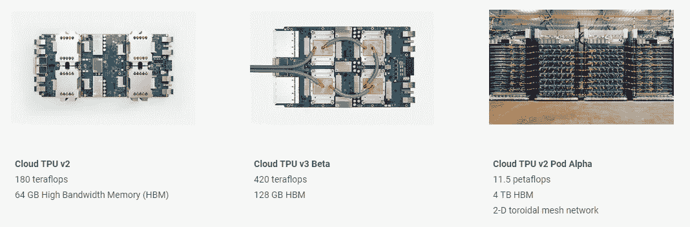
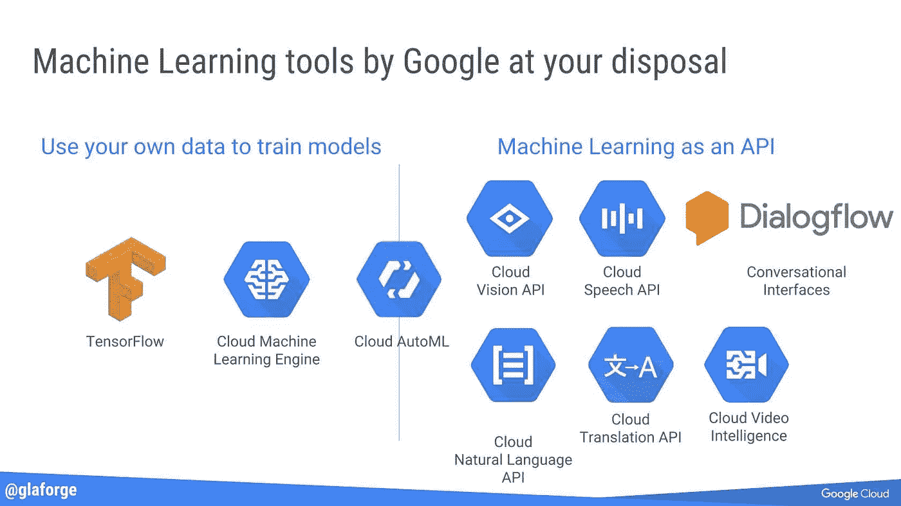

# Google Cloud 上的 TPU(张量处理单元)

> 原文：<https://medium.datadriveninvestor.com/tpus-tensor-processing-units-on-google-cloud-86169fc7fcd6?source=collection_archive---------7----------------------->

谷歌已经开发了自己的定制芯片，以加速其机器学习算法。该公司在 2016 年 5 月的 I/O 开发者大会上首次披露了这些被称为张量处理单元(TPU)的芯片，但它从未透露关于它们的所有细节，只是说它们是围绕该公司自己的 [TensorFlow](https://www.tensorflow.org/) 机器学习框架进行优化的。如今，编程云 TPU 的最佳方式是使用 Tensorflow。Tensorflow 是一个广泛而庞大的机器学习开源框架。编程 TPU 以获得最高性能，您通常会使用 tensorflow APIs 的子集。例如 tf.data 来管理你的输入处理，层，估计器，然后你通过 XLA 编译器。Tensorflow 是深度学习中开发模型使用最多的库。

谷歌已经将 TPU 仅用于处理张量，并已将一类名为 TPU 的独立实例用于处理张量流的深度学习模型，该实例具有最强大的驱动计算能力。

维护可以在 CPU/GPU 或云 TPU 上运行的模型的最简单方法是在 model_fn 之外定义模型的推理阶段(从输入到预测)。然后维护 Estimator setup 和 model_fn 的独立实现，两者都包装了这个推断步骤。比较一下 [tensorflow/models](https://github.com/tensorflow/models/tree/master/official/mnist) 中的 mnist.py 和 mnist_tpu.py 实现，就可以得到这个模式的一个例子。

[tf.estimator.Estimator](https://www.tensorflow.org/api_docs/python/tf/estimator/Estimator) 是 TensorFlow 的模型级抽象。标准估算器可以在 CPU 和 GPU 上驱动模型。您必须使用[TF . contrib . tpu . TPU estimator](https://www.tensorflow.org/api_docs/python/tf/contrib/tpu/TPUEstimator)来驱动 TPU 上的模型。

TPUEstimator 类与 Estimator 类有些不同。

最近，Google 宣布了与 Keras 框架的初步集成，这为使用 Keras 代码提供了更多的灵活性。Keras 是基于 TensorFlow 构建的高级 API。与 **Tensorflow 相比，它更加用户友好和易于使用。**

**比较云 TPU API:**

**张量流 TPU 估计器-优势**

*   在 CPU、GPU 或 TPU 上导出推理模型
*   从错误中恢复
*   无需更改代码即可扩展至 pod

**Keras-优势**

*   非静态形状的轻松部署
*   Numpy 输入
*   实验 tf .数据集成

这些 API 不是特定于 TPU 的。如果你以这种方式实现你的模型，你可以在 GPU 或 CPU 上运行你的代码。

您可以使用云 TPU 来构建许多现实世界问题的解决方案，包括图像识别、对象检测、图像分割、语音识别、机器翻译、问答等等。您还可以使用高级 TensorFlow APIs 从头构建自己的模型，包括 [Keras](https://github.com/tensorflow/tpu/tree/master/models/experimental/keras) 。

云 TPU 是为训练和运行尖端 ML 模型而从头设计的。每个云 TPU v2(现在[正式推出](https://cloud.google.com/tpu/))提供高达 180 万亿次浮点运算的计算能力，并包括 64 GB 的高带宽内存，每个云 TPU v3(在 Alpha 中)提供高达 420 万亿次浮点运算以及两倍的内存(128 GB)，以适应更大更复杂的 ML 模型。要快速开始使用云 TPU，您可以使用谷歌提供的[开源参考模型](https://github.com/tensorflow/tpu)，这些模型已经针对性能、准确性和质量进行了优化。

然而，这里最重要的数字是基于[谷歌自己的](https://crunchbase.com/organization/google)基准测试(值得记住的是，这是谷歌评估自己的芯片)，在执行谷歌的常规机器学习工作负载时，TPU 平均比标准 GPU/CPU 组合快 15 到 30 倍，因为功耗在数据中心中也很重要，TPU 还提供 30 到 80 倍的万亿次/瓦(随着未来使用更快的内存，这些数字可能会增加)。

**资源:**

[https://cloud . Google . com/blog/products/ai-machine-learning/cloud-tpus-in-kubernetes-engine-powering-minigo-are-now-available-in-beta？_ lrsc = 08 b51c 82-b10a-4239-960 a-9d07b 410713 b&UTM _ source = LinkedIn&UTM _ medium = social&UTM _ content = elevate&UTM _ campaign = 2017-17q 3-GC-cc-abm-Google cloud-un paid social-LinkedIn-leadgen-elevate](https://cloud.google.com/blog/products/ai-machine-learning/cloud-tpus-in-kubernetes-engine-powering-minigo-are-now-available-in-beta?_lrsc=08b51c82-b10a-4239-960a-9d07b410713b&utm_source=linkedin&utm_medium=social&utm_content=elevate&utm_campaign=2017-17q3-gc-cc-abm-googlecloud-unpaidsocial-linkedin-leadgen-elevate)

 [## 使用 TPUs | TensorFlow

### 为了在云上运行，使用 XLA 编译 TPUs 张量流模型。XLA 使用类似的系统来确定形状…

www.tensorflow.org](https://www.tensorflow.org/guide/using_tpu)