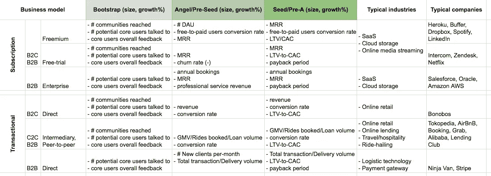

# 用三分法跟踪早期 KPI 指标

> 原文：<https://medium.datadriveninvestor.com/tracking-early-stage-kpi-metrics-with-the-rule-of-three-439ef4fc96e0?source=collection_archive---------3----------------------->

[商业战略](https://en.wikipedia.org/wiki/Strategic_management)的关键原则之一是关于做出**的取舍**。CEO 和高管都很擅长。良好的权衡能力与果断相关，领导每天都在做决策。战略中的权衡意味着[一个公司应该选择*不做什么*而不是*做什么*](https://www.isc.hbs.edu/strategy/creating-a-successful-strategy/Pages/making-strategic-trade-offs.aspx)；这个想法是每个公司都有优势、劣势和有限的资源。这意味着做 3 到 4 件它擅长的事情比做 10 件它足够擅长的事情要好。

我认为这个想法很适合企业家精神。它可以发挥作用的一个领域是性能监控。如果你是一个刚起步的创始 CEO，你可能已经编制了一个你想要跟踪的 KPI 指标列表。在早期阶段(首轮融资前)，跟踪太多指标会适得其反。这种情况下的权衡有助于您考虑*不跟踪什么*而不是*跟踪什么*。

应用三个 的 [**法则实现了这样的权衡；强迫自己在每个阶段只选择 3 个最重要的 KPI 指标进行跟踪。**](https://en.wikipedia.org/wiki/Rule_of_three_(writing))

如何决定哪些是最重要的？

我建议通过思考*核心活动*和*特定阶段的目标*来实现这个目标*。*好的 KPI 应该很快告诉你那些*核心活动*如何让你在任何时间点更接近你的*目标*:

**①。自举(<)1k 资金。长度= 3-6 个月)**

*   **核心活动**:客户访谈、社区发展。
*   **不要:**产品开发(对于那些有技术背景，经常喜欢“弄脏手”，直接跳到编码的创始人来说，这一点我怎么强调都不为过)。
*   **KPI:**[**基于输入的 KPI**](https://www.deepsky.co/2016/06/input-metrics-vs-output-metrics/) **和定性 KPI 指标**(例如，拨打的电话数量、到达的社区数量、客户情绪)。更加重视定性 KPI 指标——客户对您的解决方案有多喜欢？
*   **目标:**融资天使/预种子(甚至种子)轮。

**②。天使投资/种子前期投资(约 1 万美元到 5 万美元的资金。长度= 3-6 个月)**

*   **核心活动**:产品开发(仅限 MVP)、客户入职(针对试点/测试用户)和客户获取(仅限目标用户)。
*   **不要:**全职招聘，收购成本优化——太早了。
*   **KPI:**[**基于产出的 KPI**](https://www.deepsky.co/2016/06/input-metrics-vs-output-metrics/) **指标**(如日活跃用户数、月经常性收入/MRR、商品总量/GMV)。根据你的商业模式，你的创业公司的价值主要由收入、活跃用户或 GMV 来驱动。就在你筹集种子资金之前，风投会用这些指标来衡量你的产品有多少需求。这些是牵引力。风险投资也关注质量方面，但重点更多的是你和你的团队的形象，而不是像客户情绪或净推介值这样的东西。
*   **目标:**从风投那里筹集种子资金。

**③。种子资金(约 50 万美元到 200 万美元。长度= 12-18 个月)**

*   **核心活动**:全职招聘(关键员工具备与你的创始团队互补的技能)、保留、实现[可重复的客户获取流程](https://mattermark.com/three-main-elements-building-repeatable-sales-process/) —实现*产品-市场*契合。
*   **不要:**过热。
*   **KPI:**[**基于产出的 KPI**](https://www.deepsky.co/2016/06/input-metrics-vs-output-metrics/) **和基于留存的 KPI 指标**(如 GMV、转换率、LTV-CAC/终身价值-获客成本)。在这个阶段，就在你准备筹集首轮资金的时候，风险投资想知道你是否达到了*产品-市场* *契合度。s*strong 基于产出的 KPI 和保留指标将是指标。
*   **目标:**从风投处融资 A 轮。

下面的矩阵显示了跨阶段和业务模型的三个应用的**规则示例。(有些只有两个指标):**

Rule of Three KPI-tracking: Possible top-3 early-stage Input-based, output-based, retention-based and qualitative KPI metrics across stages and business models.

**三法则**方法的简单性最终允许你在早期阶段更容易地与你的团队和投资者沟通绩效相关事宜，在早期阶段，紧密的反馈循环是首选。我很乐意听到一些想法，如果这在某种程度上是后首轮融资的相关方法。欢迎任何评论。

*您可以在* [*Twitter*](http://twitter.com/bennytjia) *上关注我，或者在*[*LinkedIn*](https://www.linkedin.com/in/tjhgie)*上与我联系。所有帖子都在我的* [*个人网页上索引。*](https://bennytjia.github.io/)