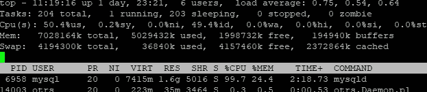
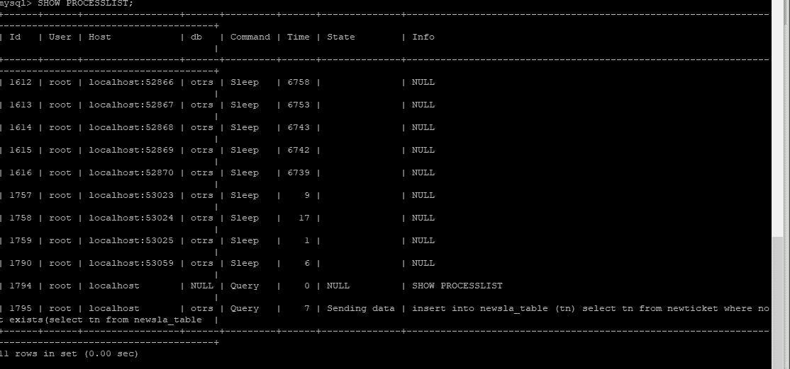
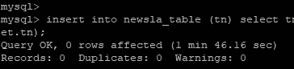
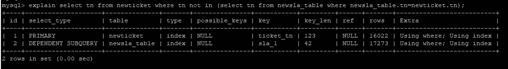
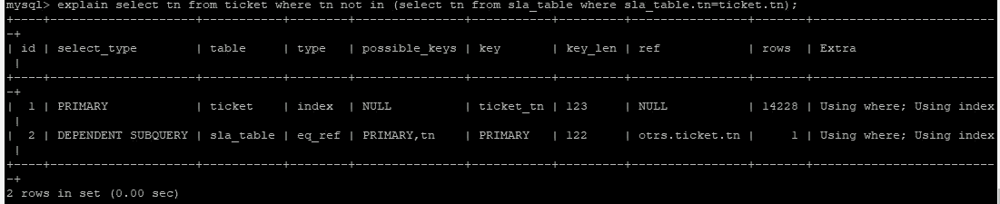
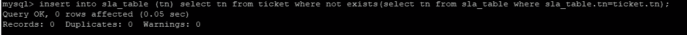

# 跟踪 MySql 中的 SQL 慢:OTRS

> 原文：<https://medium.datadriveninvestor.com/tracking-sql-slowness-in-mysql-otrs-8757c9b1cc97?source=collection_archive---------1----------------------->

嗯，我是 MySql 的新手，但我已经和其他数据库如 Ora、PG 和 Db2 分享了我的经验。与其他 RDBM 相比，我要与你们分享的结果对我来说有点新鲜。

我在一家为银行提供软件解决方案的公司工作，我们有一个客户记录问题的票务系统。为此，我们使用了一个名为 [OTRS](https://otrs.com/) 的开源产品。显然这个应用程序使用 mysql 作为其数据库。

据我所知，当用户执行一个特定的功能时，CPU 达到 100%,整个服务器冻结了足足 10 分钟。

我在 Linux 机器上使用了一个简单的“TOP”命令来识别这个进程，并认为它是进程 MYSQLD(MySQL DB 的进程名)。

然后，我必须确定在这个特定时间在数据库上运行的 SQL。

步骤:从 CMD 登录 mysql 用户并执行命令“显示进程列表”

如上图底部所示，负责的 SQL 是 Insert on select(如下所示)

*插入 sla_table (tn)在不存在的地方从 ticket 中选择 tn(从 sla_table 中选择 tn，其中 SLA _ table . TN = ticket . TN)；*

*(我的测试表在开始时会有一个‘new’)*

从表面上看，这对于 SQL 来说确实有点愚蠢，但是当你考虑到 OTRS 的功能时，这是有意义的。因此，微调或更改 SQL 是我最后的选择。

我在一个测试实例上手动运行 SQL，花了将近 2 分钟才完成。

最初，我认为这是一个索引级别的问题(tn 列已经被索引)，内存级别，缓冲级别的问题，其他配置级别的问题，将所有表更改为 InnoDB 等。相信我，我在 2 天内尝试了所有可能的事情。但影响最小。我只提高了 10 秒。

然后，作为最后一个选择，我走上了优化 SQL 的道路。和其他 RDBS 系统一样，MySQL 也有一个 SQL 解释计划。我摆弄了几个小时。(注意，我只推送了 select 部分，到现在为止，我已经发现 select 查询是一个需要时间的查询)

幸运的是，MySQL 在这方面有很好的文档，并且知道如何具体读取输出。我用了这个链接[https://dev . MySQL . com/doc/ref man/5.5/en/execution-plan-information . html](https://dev.mysql.com/doc/refman/5.5/en/execution-plan-information.html)。在经历了这一切之后，我想到了下面，

1.  TYPE : Column 的值为“Index ”,这意味着启用了全表扫描。全表扫描是通过从索引中读取数据来执行的，以便按索引顺序查找数据行。
2.  可能的关键字:NULL 表示没有相关的索引。在这种情况下，您可以通过检查`WHERE`子句来检查它是否引用了适合索引的一列或多列，从而提高查询的性能。
3.  REF:这也是空的。`ref`列显示哪些列或常数与`key`列中指定的索引进行比较，以从表中选择行。

总的来说，我认为即使已经有了索引，它们也没有被利用。所以我删除了索引并重新创建了它。但还是一样。

我试图阅读更多关于 SQL 行为的内容，并理解 SQL 在执行过程中的行为。我发现在服务器上运行的 SQL 与我通过客户端传递的略有不同。(这将打印在 mysql 日志中，并作为警告消息显示在解释计划输出中)

这个新的 SQL 如下所示，

*select ` otrs `.` ticket `.` TN ' AS ` TN ` from ` otrs `.` ticket ` where(不存在)(select ` otrs `.` SLA _ table `.` SLA _ table ` from ` otrs ` . ` SLA _ table ` where****)(convert(` otrs `.` SLA _ table `.`使用 utf8)****= ` otrs `.` ticket ` . ` TN `)))；*

当你与原文比较时，内部 where 子句有所不同。它试图将整个索引列转换成字符集 urf8。我没有立即得到这一点，但经过几分钟的阅读，我认为这可能是解释计划中忽略索引的原因。我想深入研究一下这两个表的结构，

显示创建表 sla _ table
创建表` SLA _ TABLE `(
` TN ` varchar(50)NOT NULL，
` SLA _ state ` varchar(45)DEFAULT ' 2 '，
` exception ` smallint(6)DEFAULT ' 0 '，
` queue _ id ` smallint(6)DEFAULT NULL，
` 1st _ ESC ` smallint(6)DEFAULT ' 0 '，
` 2nd _ ESC ` smallint(6)DEFAULT ' 0 '，

创建表` ticket `(
` id ` bigint(20)NOT NULL AUTO _ INCREMENT，
`tn` varchar(40) DEFAULT NULL，
` title ` varchar(255)DEFAULT NULL，
………………………………..跳过中间部分…………………..
关键字` ticket_user_id` (`user_id `)，
关键字` fk _ ticket _ service _ id `( ` service _ id `)，
关键字` fk _ ticket _ SLA _ id `( ` SLA _ id `)，
关键字` fk _ ticket _ create _ by _ id `( ` create _ by `)，
关键字` fk _ ticket _ change _ by _ id `( ` change _ by `)，

嘣..字符集是不同的。

我用下面的命令更改了初始表的字符集；

将表 sla_table 转换为字符集 utf8 然后再次运行解释计划。:)产生了我想要的影响。

看，TYPE 列已经更改为 eq_ref。这意味着 SQL 具有健康的索引。POSSIBLE_KEYS 列显示它使用' tn '列作为键。REF 列也显示“tn”被正确引用。最重要的部分 ROWS(MySQL 认为执行查询必须检查的行数)现在显示为 1。

最后，让我们运行最初的 insert 语句，看看这一变化对性能有多大影响

厉害哈？现在只需要 0.05 秒。

值得努力和满足。我们的支持团队负责人计划升级硬件，认为这是早期的硬件/操作系统问题。似乎根本不需要。:)

注意:ticket/sla_table 和 newticket/newsla_table 在结构和行数上是相同的。我创建这些是为了测试这个问题。

另外，我了解到当 where 子句中的索引具有相同的长度时，性能会有所提高。例:tickets 表中的 tn 列长度为 40。sla_table 的 tn 列长度为 50。根据 msql 文档，将两者都改为 40 似乎有所增加。