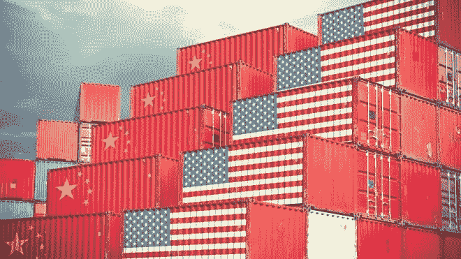
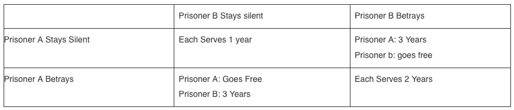

# 一位被遗忘的匈牙利经济学家解释了贸易战

> 原文：<https://medium.datadriveninvestor.com/trade-war-explained-by-a-forgotten-hungarian-economist-2c2e6280b05e?source=collection_archive---------3----------------------->

*原载于 2019 年 8 月 24 日*[*【rooneynotes.com】*](https://rooneynotes.com/blog/trade-war-explained-by-a-forgotten-hungarian-economist/)*。*

约翰·冯·诺依曼不是一个普通的孩子。六岁时，他就能用古希腊语进行对话，同时还能在脑中划分八位数。他是个怪人。

随着他的成长，他有了其他不太典型的成就。15 岁时，他展示了自己的才能，让他的微积分教授落泪。他就像《心灵捕手》里那个打着类固醇的天才看门人。

世界上充满了才华横溢却一事无成的人。但是约翰·冯·诺依曼不是这些人中的一员。他后来成为一名成功的数学家、经济学家和学者。他创造了一个全新的经济学领域，被称为博弈论，对经济学以外的许多领域产生了深远的影响和影响。作为曼哈顿计划的主要贡献者，他致力于制造第一颗核弹。许多人说，如果诺贝尔经济学奖在他活着的时候存在，他的名字将会是一只鞋。他是个大人物。

当一个人既是天才又成就非凡时，注意这些人并向他们学习通常是个好主意。诺伊曼就是这样一个人。

# 博弈论 101

在诺依曼的博弈论新领域中，你会学到的一个基本概念是[囚徒困境](https://www.investopedia.com/terms/p/prisoners-dilemma.asp)。囚徒困境是一个变幻无常的场景。在这种情况下，不按你的最佳利益行事实际上符合你的最佳利益。本质上，如果双方都只顾自己，情况会更糟。

囚犯困境的经典例子，恰当地命名为两个同谋(囚犯)因犯罪而被捕的场景。每个人都被提供了较少的监禁时间作为交换，以出卖对方并向警方提供信息。

每个囚犯都可以选择背叛对方，为了自己的利益接受交易，或者不接受交易，保持沉默。这给我们留下了如下所示的四个场景。

每一种情况都会对另一方产生影响，对双方来说，最好的结果是当他们实际上不为自己的利益而行动并保持沉默。

# 美中贸易战

美国卷入了一场激烈的贸易战，中国日益变得不稳定。它始于高调和强硬的言论，并升级为美国的大量关税和中国的货币贬值。贸易战似乎不太可能结束。双方都在坚持自己的立场，越来越坚定。

讽刺的事实是。很有可能，通过保护自己的利益和进行贸易战，双方最终都会变得更糟。这两个国家在贸易方面严重依赖对方，有着互惠互利的关系，尽管并非没有缺陷。美国享受着知识经济的成果，中国享受着廉价劳动力带来的工业和经济发展，以及美国消费者对其工厂产品的需求。

这是一个教科书般的比较优势定律的例子，在这个定律中，两国都通过参与自由贸易和专注于自己的优势而变得更好。

这也是一个囚徒困境的教科书式的例子，在这种困境中，两国都以牺牲合作和互利安排为代价追求自身利益，结果变得更糟。眼下，两国都有可能因贸易战升级和保护主义措施加强而遭受重创。

# 囚犯日常生活的困境

通常，当我们遇到一个不符合我们期望的个人情况时，我们会变得沮丧和对立。我们的立场和观点越来越根深蒂固，我们邀请其他人也这样做。接下来的非常像壕沟战，双方都不退让一步，但双方都不退让一步。

这是囚徒困境的一个变种。只为我们自己的最大利益而努力，我们不仅得不到我们想要的，而且我们实际上以断桥、怨恨、敌意、地狱、甚至是坏心情的形式结束了更糟的情况，尽管其他选择可能会更有利，即使它在我们眼中不是完美的情景。

总是追求我们自己的完美场景的问题是，这个世界充满了相互竞争的利益。其他人不想要和你一样的东西。事实上，这些利益往往是截然相反的。这并不坏，也不会让对方变坏或变邪恶。事情就是这样。

通过客观地看待世界，全心全意地拥抱现实，我们会成为生活舞台上更好的演员。我们不太受情绪的影响，能够看清一种情况的真实面目，既不好也不坏。很简单。

无论是在个人领域还是在国际舞台上，拥抱合作和共同的自我利益在大多数时候都是一件好事。通过合作而不是竞争和争斗，我们通常会比为了自己的利益而工作时过得更好。

美国和中国都应该从纽曼的剧本中吸取教训。竞争并不总是符合你的最佳利益。市场和经济不是零和游戏。尽管你最终可能不会得到你所期望的所有财富，但合作会带来比其他选择更好的结果。

*原载于 2019 年 8 月 24 日*[*【rooneynotes.com】*](https://rooneynotes.com/blog/trade-war-explained-by-a-forgotten-hungarian-economist/)*。*