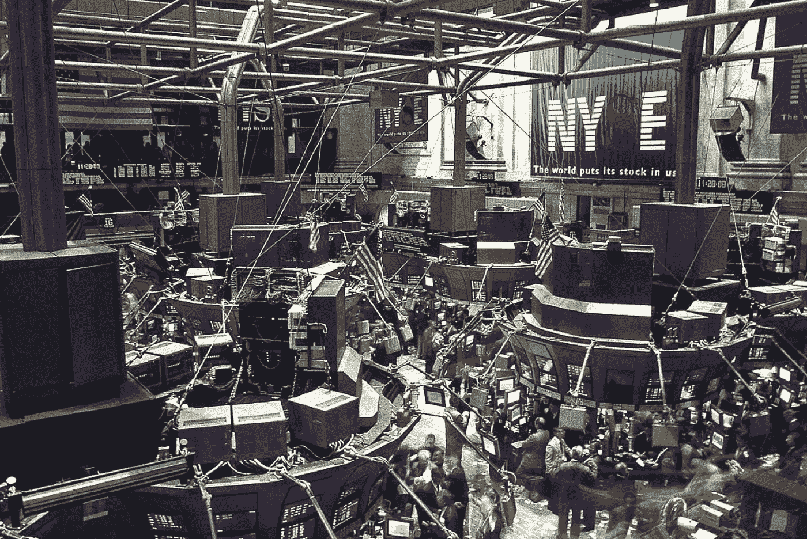
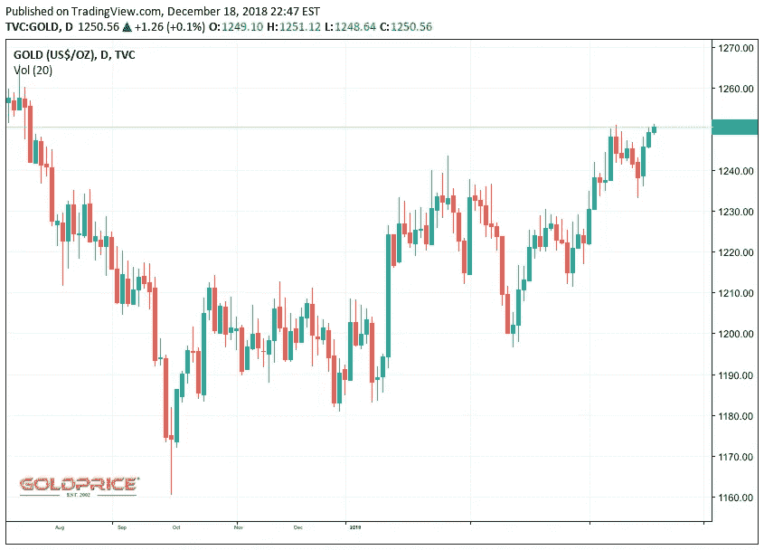

# 交易机器人、经济和你

> 原文：<https://medium.datadriveninvestor.com/trading-bots-the-economy-and-you-3d24a1032b3d?source=collection_archive---------9----------------------->

## 随着交易机器人变得越来越普遍，市场实际上代表了什么？

“The Pit” in the New York Stock Exchange.

震耳欲聋的吼声充满了整个地板。灵魂声嘶力竭地尖叫，以完成他们的财务交易。

> 以 10.50 美元的价格出售 2000 辆福特汽车！
> 
> 8 月份以 25 美元买入通用汽车的价格为 1 美元！
> 
> 一大杯咖啡，两杯奶油和糖，3.5 美元！

经典。传统上，数百名股票经纪人会在光滑的纽约证券交易所(NYSE)交易大厅喊单，以便开展业务。敏锐地观察股票行情自动收报机上的新鲜、粗糙的纸的价格，人们可以简单地催促他们的经纪人，从而使他们为最好的交易而战。

但是时代变了。[交易大厅不再是战区](https://qz.com/1078602/why-the-new-york-stock-exchange-nyse-still-has-human-brokers-on-the-trading-floor/)。我们不再生活在一个有机械报时器和电话接线员的时代。电话接线员被自动化系统取代，经纪人被程序取代。光纤电缆现在在世界范围内布下了一张大网，这个世界每天都在以更快的速度旋转。随着新锐和老派的差距缩小，老派就意味着慢，慢就意味着赔钱。

由此，交易不再由人类主导。懒惰，疏忽，人类。不靠谱。即使是最谨慎的投资者，一句听错的话或一个计划错误的需求也可能导致财务破产。

投资者要求计算机进行交易。快速，有条不紊，电脑。可靠。有时，[电脑完成 90%以上的交易](https://money.cnn.com/2018/02/06/investing/wall-street-computers-program-trading/index.html)。渴望挖掘算法脉络的公司已经打开了技术大门，鼓励有利可图的算法开发。就像淘金热一样，公司现在提供工具让勘探变得更加容易。

> Quantopian 允许您在他们的平台上使用简单的 Python 库进行开发。我用它做了些实验，但是要注意——写一个好的算法是很难的！[点击这里查看](https://www.quantopian.com/tutorials/getting-started)。

# 机器人变得更好？

自动化交易仍处于起步阶段。API 和库使得编写交易算法变得容易，但是编写好的交易算法却很难。任何有一点编程知识的人都可以轻而易举地开始制作一个定制的交易机器人，但需要一个精通金融的统计学家来真正确定一个杀手机器人。当然，其中一些机器人赚钱，但外行人是禁区。为什么富有的交易机器人所有者会与世界分享他们的源代码？这在市场内部埋下了不平等的种子。随着匿名机器人获取现金，市场变得越来越不民主。

Even gold, a physical commodity fluctuates based on human emotion. Courtesy of [goldprice.org](https://goldprice.org/).

准确地给公司股票定价是困难的；没有人知道任何特定公司的确切价值，因为它每天、每小时、每分钟都在变化。[不可预见的情况](https://www.cnbc.com/2018/10/24/tesla-earnings-q3-2018.html)可以在眨眼之间繁荣或萧条巨擘的股票。那么我们每股应该支付多少呢？答案是，通常情况下,*我们想支付什么*。

我们是情感动物。当我们想要投资我们相信的公司时，或者当我们相信我们可以快速赚钱时，我们的本能就会发挥作用。股票市场反映了人类对公司及其产品的情感。这些公司改变了我们的购买和生活方式。它们塑造了我们的日常生活，为我们提供了生计。尽管存在当代的敌意，但股票市场承载着人类的情感——对未来的信心。

多么讽刺的是，我们编写计算机程序来做出这些金融决策，根据一些数字汤和深奥的技术分析技术来预测可能发生的事情。从本质上讲，股票市场影响着人们的生活方式。

即使你放弃交易，它仍然影响着你。如果你最喜欢的咖啡馆因为一家连锁咖啡馆拥有更富有的股东而倒闭，那就会改变你每天早上去喝咖啡的路径。不管你喜不喜欢，市场力量拉走了无形的线，让我们成了牵线木偶。

那么，我们的生活是被交易算法，仅仅是几行代码控制的吗？这似乎并不代表我们对公司的信心，市场已经成为另一个可以利用的数据来源。这些算法不必要地辛苦工作，回避了市场本应服务的人类基础。

但是它们并不必须如此。请记住，这些数字和华而不实的标题来自潜在的错误算法。任何人都可以写，没有交易算法能够完全捕捉真实世界的复杂性。所以要保持头脑冷静。当一只股票暴跌，头条新闻听起来像世界末日时，呷一口咖啡，想想这可能只是一场虚惊。

感谢阅读！和平✌️✌️✌️