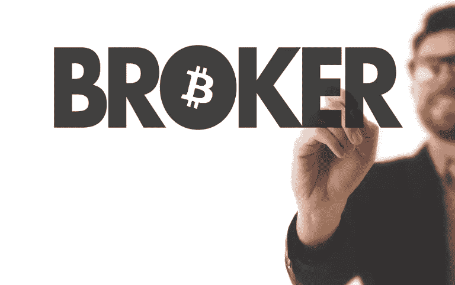

# 与 CFD 经纪人交易加密货币

> 原文：<https://medium.datadriveninvestor.com/trading-cryptocurrencies-with-a-cfd-broker-950a5b96c5e9?source=collection_archive---------6----------------------->

# 让我们直接进入基础，什么是 CFD 经纪人？

他们代表不同经纪人的合同。这些合同存在于两方之间，通常被描述为“买方”和“经纪人”，规定经纪人将向买方奖励硬币的当前价值与其在合同时间的价值之间的差额(如果差额为负，则买方改为向经纪人支付)。基本上，交易者购买了获得当前和未来资产价格之间差额的权利——但前提是趋势方向预测正确。否则，交易者自己将遭受与潜在收益相当的损失。差价合约也是杠杆资产，意味着你可以增加每个头寸(买方或卖方)的敞口，从而增加你的潜在利润。与传统交易不同，它还能让你从较小的市场波动中获利。

# 注意，这不适用于长期投资者。

自 2017 年加密热潮以来，这些数字已经逐渐减少，尽管投资加密货币的兴趣仍然广泛传播。在过去，公众只有两种投资选择，要么在加密货币交易所交易，要么用钱包进行长期投资。

# 为什么人们使用 CFD 进行加密货币交易？当然是为了安全。

在这样一个不受监管的市场中，消费者没有安全感，这让事情变得有点复杂。历史上，交易所一直被认为有些不可信，例如，自 2009 年以来，数百家交易所从网上消失，并带走了投资者的钱。交易所也受到黑客的攻击，其中一些黑客已经带走了数百万美元。基本上，对你和你的血汗钱来说，这不是最安全的游乐场。

这就是 CFD 交易的用武之地，作为一个已经被监管和控制了很多年的成熟市场。一些人会辩称，这违背了“区块链”的行事方式，因为权力下放和解除监管是游戏的名称，它不会帮助我们这些投资者晚上睡得更好。

# 有许多 CFD 经纪人是有信誉的和受监管的，他们在法律上有义务保护你和你的钱。

在交易所开户变得越来越容易，但是你唯一的获利途径就是低买高卖。尽管一些交易所已经开始考虑卖空机会的想法，但除非你利用 CFD，否则没有真正的办法。基本上，差价合约让你做空市场和投资一样容易。例如，如果你有预感明天 ETH 会暴涨，你就采取买入的立场。如果你的想法相反，那么就采取卖出的立场。这是为交易者创造更多投资选择的好方法，尤其是在如此动荡的市场中。

显然，像大多数事情一样，使用 CFD 有一些规则。确保使用有执照和受监管的人，因为他们在法律上有义务保护作为客户的你。做你的研究，和以前做过的人谈谈。

说到底，差价合约似乎适合加密市场，如果市场不尽快抬头，这可能是我们盈利的唯一机会。

**注:本文并非投资建议。对历史价格变动或水平的任何参考都是信息性的，并基于外部分析，我们不保证任何此类变动或水平在未来可能再次发生。**

从我这里阅读更多内容:

[3 皇冠营销](https://threecrownmarketing.com)

