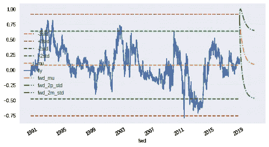

# 交易均值回归:

> 原文：<https://medium.datadriveninvestor.com/trading-mean-reversion-d72ced0d06a?source=collection_archive---------0----------------------->

# 全系列。

我已经针对从业者(不是学者)发表了四篇关于金融均值回归的博客。这里我会有完整的链接，加上一些提示，告诉你如果你对特定的金块感兴趣，是否可以跳过其中的一些。

我使用免费数据和公开的谷歌合作实验室笔记本，这样你就可以自己运行代码，把数据改成你想要的任何东西——而我使用美国汇率，你可以把它改成商品、股票、外汇、加密货币等等。

 [## 数据科学和软件工程哪个更有前途？-数据驱动型投资者

### 大约一个月前，当我坐在咖啡馆里为一个客户开发网站时，我发现了这个女人…

www.datadriveninvestor.com](https://www.datadriveninvestor.com/2019/01/23/which-is-more-promising-data-science-or-software-engineering/) 

[均值回复](https://medium.com/@gjlr2000/mean-reversion-in-finance-definitions-45242f19526f):这里我介绍均值回复信号的基本概念——如果你已经知道半衰期和均值回复速度的含义，可以跳过。

[寻找均值回复(第一部分)](https://medium.com/@gjlr2000/finding-mean-reverting-signals-part-1-43c1b7f9797a):我首先展示“测量”信号是否均值回复的方法，结合从业者的直觉和其他工具(PCA 和 Johansen 的方法)来寻找均值回复信号。即使你知道 PCA，我还是建议你读一下 Johansen 的部分。

[寻找均值回归(第二部分)](https://medium.com/@gjlr2000/finding-mean-reverting-signals-part-2-dac1350aac16):已经对股票对进行了大量的均值回归分析——在这里，我将展示如何在有多个时间序列时扩展搜索(term structure 就是一个很好的例子)，并深入研究 PCA 和 Johansen 方法之间的差异。

交易均值回归(Trading Mean Reversion):大多数算法使用“标准差倍数”作为交易的切入点，但我加入了事前夏普比率和凯利标准(对自主交易者有用)等概念。

[在 FX 中寻找均值回归](https://medium.com/@gjlr2000/finding-mean-reversion-in-fx-72fe70c8cc67):这里我应用了所有上述概念来寻找 FX 中的均值回归投资组合——我添加了一些“蛮力”来检查所有可能的组合。

[尼安德特人对 DeepQ 机器人交易者(有真实生活价格)——第一轮](https://medium.com/datadriveninvestor/neanderthals-versus-deepq-robotraders-with-real-life-prices-round-1-28ab9100a505):事实证明，一旦你发现均值回复信号，人工智能技术(强化学习)可以用来训练机器人交易者——这是当你让机器人交易者与“交易均值回复”中开发的规则进行对比时会发生的情况。