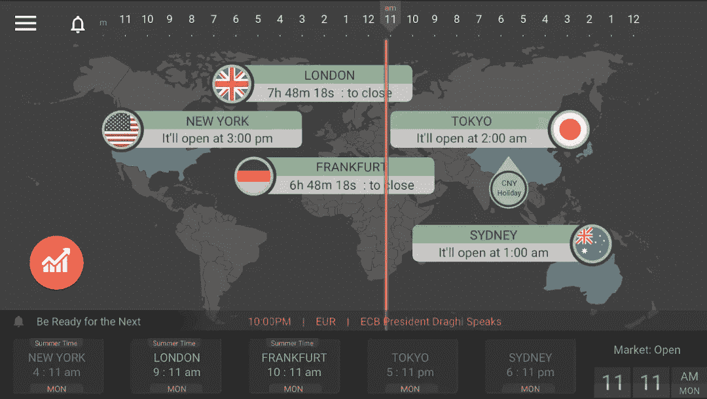

# 交易时段、交易日和交易时间。

> 原文：<https://medium.datadriveninvestor.com/trading-sessions-trading-days-and-trading-hours-2fc7862a145c?source=collection_archive---------0----------------------->

在金融市场，时间是至关重要的。在这篇文章中，我们将研究每个市场何时开放交易，以及交易的最佳时机。

# 会议

## 股票、期权、期货

对于股票，每个市场交易所在当地时间 08:00 开始交易，在当地时间 17:00 结束交易。例如，如果一个人想要交易在纽约证券交易所上市的股票，并且他或她也位于纽约，他或她需要从 08:00 到 17:00 进行交易。这段时间过后，市场关闭，他或她不能继续交易。

## 外汇

外汇市场交易每天 24 小时，每周 5 天。如果一个人在法兰克福，他可以在周日 23:00 开始交易，周五 23:00 结束交易。

## Cryptos

加密货币市场每周 7 天、每天 24 小时开放。

# 交易日

像其他市场一样，交易也有自己的开市和收盘时间。让我们从可以交易的日子开始。每年，瑞士交易所都会发布一份 PDF 文件，标明市场关闭的时间和地点。下面可以看到 2019 版。

# 每周时间。

各个国家的时区不同，所以让我们以洛杉矶、纽约、伦敦、苏黎世、新加坡、东京和悉尼等城市为例，建立一个 24 小时的时区。

## 洛杉矶(GMT-7)

外汇市场开放时间:周日 14:00

澳大利亚时段:周日 14:00

东京时段:周日 16:00 至周一 01:00，每天同一时间

法兰克福时段:周日 23:00

伦敦时段:周一 00:00 至周一 09:00，每天同一时间

纽约时段:周一 05:00 至周一 14:00，每天同一时间

外汇市场收盘时间:周五 14:00

## 纽约(GMT-4)

外汇市场开放时间:周日 17:00

澳大利亚时段:周日 17:00

东京时段:周日 19:00 至周一 04:00，每天同一时间

法兰克福时段:周一 02:00

伦敦时段:周一 03:00 至周一 12:00，每天同一时间

纽约时段:周一 08:00 至周一 17:00，每天同一时间

外汇市场收盘时间:周五 17:00

## 伦敦(GMT+1)

外汇市场开放时间:周日 22:00

澳大利亚时段:周日 22:00

东京时段:周一 00:00 至周一 09:00，每天同一时间

法兰克福时段:周一 07:00

伦敦时段:周一 08:00 至周一 17:00，每天同一时间

纽约时段:周一 13:00 至周一 22:00，每天同一时间

外汇市场收盘时间:周五 22:00

## 苏黎世(GMT+2)

外汇市场开放时间:周日 23:00

澳大利亚时段:周日 23:00

东京时段:周一 01:00 到周一 10:00，每天同一时间

法兰克福时段:周一 08:00

伦敦时段:周一 09:00 至周一 18:00，每天同一时间

纽约时段:周一 14:00 至周一 23:00，每天同一时间

外汇市场收市时间:周五 23:00

## 新加坡(GMT+8)

外汇市场开放时间:周一 05:00

澳大利亚时段:周一 05:00

东京时段:周一 07:00 至周一 16:00，每天同一时间

法兰克福时段:周一 14:00

伦敦时段:周一 15:00 至周二 00:00，每天同一时间

纽约时段:周一 20:00 至周二 05:00，每天同一时间

外汇市场关闭时间:周六 05:00

## 东京(GMT+9)

外汇市场开放时间:周一 06:00

澳大利亚时段:周一 06:00

东京时段:周一 08:00 至周一 17:00，每天同一时间

法兰克福时段:周一 15:00

伦敦时段:周一 16:00 至周二 01:00，每天同一时间

纽约时段:星期一 21:00 到星期二 06:00，每天同一时间

外汇市场关闭时间:周六 06:00

## 悉尼(格林威治时间+10)

外汇市场开放时间:周一 07:00

澳大利亚时段:星期一 08:00

东京时段:周一 09:00 至周一 18:00，每天同一时间

法兰克福时段:周一 16:00

伦敦时段:周一 17:00 至周二 02:00，每天同一时间

纽约时段:星期一 22:00 到星期二 07:00，每天同一时间

外汇市场关闭时间:周六 07:00

# 外汇交易、图表、金融和新闻

对于 Android 用户来说，FXhours 是一个很好的跟踪每个市场时段的应用。在里面你还可以找到宏观经济日历等等。

# 交易的最佳时机

交易股票、期权和期货的最佳时间是每个时段的 08:00 到 11:00。前一天或前几天的消息在这些天生效，波动性飙升。11 点交易者去吃午饭。大约 14:00 到 17:00 是一天中第二好的时间。

外汇市场上更大的玩家是伦敦，第二好的交易时间是在伦敦时段。纽约时段是第三好的。如果我们合并这些时段，我们会得到伦敦和纽约时段的重叠。这种重叠是外汇交易的最佳时机。