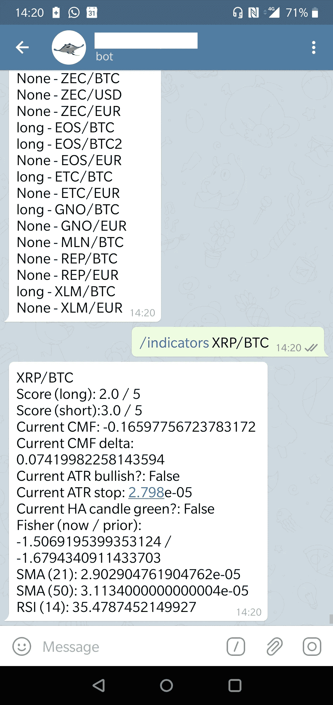

# 交易机器人系列——为你的机器人创建一个电报通道

> 原文：<https://medium.datadriveninvestor.com/tradingbot-series-create-a-telegram-channel-for-your-bot-36d8d01c8261?source=collection_archive---------0----------------------->

在这篇文章中，我们将展示如何为你的交易机器人建立一个简单的电报通道。当你在移动的时候，电报是一个和你的机器人交流的好方法。这也是与选定的合作者共享机器人活动的好方法。


# 为什么电报？

[Telegram](https://telegram.org/) 是一个带加密的跨平台消息服务，有很好的 [API](https://core.telegram.org/api) 。它使您能够为您的机器人建立一个通道，您可以使用它来与它交谈，或者它可以为您发布更新消息。



# 机器人能做什么？

我们的机器人应该使用户能够与交易机器人互动，了解状态和管理机器人。这包括:

*触发交易时发布消息。*

当被询问时，提供最新的位置。

当被询问时，提供最新的指标和状态。

*改变哪些资产正在进行实时交易而不是纸面交易。*

*也可能手动过账交易*

…

# 步伐

我们将首先使用电报工具在电报上创建一个机器人。

然后，我们将编写一些 Python 代码，通过它们的 API 与电报机器人通信，以创建向电报机器人发送消息的功能。

然后我们将创建一个监听器机器人，它将响应我们通过电报给机器人的命令。

# 关于隐私的说明

你的电报机器人默认是公开的。任何人都可以在搜索时找到它，并开始与它交谈。然而，你仍然可以锁定它，这样机器人将只与你通过添加他们的`chatID`预先批准的人交谈。

# 第一步——初始化你的电报机器人

在 Telegram 上为自己设置一个帐户，并使用**机器人父亲**在 Telegram 上设置一个新的机器人。我不会在这里重复这些步骤，因为在其他地方有很好的教程。

[](https://www.datadriveninvestor.com/2019/01/17/the-technologies-poised-to-change-the-world-in-2019/) [## 2019 年即将改变世界的技术|数据驱动的投资者

### 很难想象一项技术会像去年的区块链一样受到如此多的关注，但是……

www.datadriveninvestor.com](https://www.datadriveninvestor.com/2019/01/17/the-technologies-poised-to-change-the-world-in-2019/) 

这将为你提供电报机器人和代币

# 第二步 Python 项目设置

Python 有一个很好的 [Telegram API](https://github.com/python-telegram-bot/python-telegram-bot) 库，很好用。

在您的虚拟环境中:

```
pip install python-telegram-bot
```

在您的项目代码中，创建一个新的模块或文件来保存电报代码。

```
import telegramTOKEN = 'token_from_botfather_for_your_bot'CHAT_IDS = ['your_chat_id', ]
```

为自己或合作者获取`CHAT_IDS`有点麻烦，但是本教程展示了如何使用 getUpdates 方法来完成。也许有更简单的方法。

**注意**这里的`CHAT_IDS`被定义为一个*列表*，这样你可以为不同的人添加多个聊天 id。我们将设置下面的机器人，以便它只使用正确的电报聊天标识来响应用户。

# 第三步——用你的电报机器人广播信息

向电报机器人发送信息，很简单。这个机器人可以播放你想要的任何文本信息。

我们创建了一个 **post_message** 方法，然后可以将它导入到我们项目中的任何地方，并用于发送电报机器人消息。你可以像使用`print`语句一样使用它，并发送一串文本。这段文字将在你的电报机器人上向你和你的合作者广播。

```
#telegram_bot.pyimport telegramTOKEN = 'your_bot_token'
CHAT_IDS = ['your_chat_id', ]def post_message(message):
    *"""
    Posts a message to the telegram bot chats* ***:param*** *str message: A string message* ***:return****: None
    """* try:
        bot = telegram.Bot(token=TOKEN)
        for id in CHAT_IDS:
            bot.send_message(id, message)
    except:
        ... handle error ...
    return
```

每当我们的任何交易机器人有我们希望实时发送给电报机器人的交易信号时，我们导入并使用 post_message 方法:

```
from telegram_bot import post_message...post_message('I found a great trade! details ... blah-blah')
```

# 第四步——向你的电报机器人发出请求

使机器人能够响应请求和命令需要一个单独的**监听器**模块。这个想法是，你希望能够在你的电报应用程序中向你的机器人发布命令，然后它发布交易，向你显示你的余额，或者启动一些其他功能。

## 电报如何处理命令

1.  你可以使用电报应用程序中的命令向你的电报机器人发布命令，例如`/help`或`/trade buy XBT 3.0`
2.  您的 Python **监听器模块**(使用 Python 电报库)看到这个命令已经通过 API 发布，解析它，然后做出相应的反应。

## 创建监听器

我们启动**监听器**，监听电报命令并解析它们。当它识别一个命令时，它调用你指定的函数

```
#telegram_listener.pyfrom telegram.ext import Updater, CommandHandler, MessageHandler, FiltersCHAT_IDS = [ ... ]...
[functions to do things added here or imported]
...def main(): # Create an updater object using your bot's token
    updater = Updater(TOKEN)
    dp = updater.dispatcher # on /help call help function and respond to anyone
    dp.add_handler(CommandHandler("help", help)) # on /trade call trade function but only to CHAT_ID users
    dp.add_handler(CommandHandler("trade", trade,
            filters=Filters.chat(CHAT_IDS))) # log errors
    dp.add_error_handler(error) # Start the Bot
    updater.start_polling()
    updater.idle()if __name__ == '__main__':
    main()
```

可以添加多个`add_handler`来处理不同的命令。

`filters=Filters.chat()`选项使您能够保护您的机器人，以便它只响应那些`CHAT_ID`在列表中的人。

## 一个简单的帮助功能

这是一个当用户在电报机器人中发布`/help`时处理程序调用的`help`函数的例子。这将返回一个帮助屏幕，解释不同命令的作用。

```
#telegram_listener.py
...def help(bot, update):
    *"""Send a message when the command /help is issued."* 
    update.message.reply_text(
        'Try these commands:\n' +
        '/ticker [pair] - get latest ticker\n' +
        '/balance [currency] - get latest balance\n' +
        '/orderbook [pair] [depth] - get orderbook\n' +
        '/limit [buy/sell] [pair] [quantity] [price] - trade\n' +
        '/stop [buy/sell] [pair] [quantity] [price] - trade\n' +
        '/market [buy/sell] [pair] [quantity] - trade\n' +
        '/orders [pair] - show open orders\n' +
        '/cancel-all [pair] - cancel all orders\n' +
        '/cancel [order_id] - cancel one order\n' +
        '/tradehistory - show last few closed trades\n' +
        '/address [currency] - get address\n' +
        '/newaddress [currency] - create new address'
    )...
```

## 一个简单的余额显示功能

这是一个简单函数的例子，它在一个简单的列表中返回北海巨妖交易所账户的所有余额。用户在电报机器人中传递命令`/balance`。

```
#telegram_listener.py
...import krakenex
from pykrakenapi import KrakenAPI# Initialise kraken api as api
api = krakenex.API( ... )
k = KrakenAPI(api)def balance(bot, update):
    *"""Get balance """* try:
        response = api.api_get_all_balances()
        message = ""
        for balance in response["result"]["balances"]:
            if balance.get("available"):
                message = message + f'\n{balance.get("currency")}:'
                        + f'{float(balance.get("available"))}'
        update.message.reply_text(message)
    except:
        ... handle error ...
```

您还可以输入许多其他命令，例如:

*   `/indicators`显示最新的指标值
*   `/performance symbol`显示一个市场的最新业绩统计
*   `/orders`交易所未平仓订单列表
*   `/trades`最近交易列表
*   `/trade symbol amount price`添加交易
*   …

## 排除故障

Telegram 会无声地失败，因此当消息或命令失败时，调试正在发生的事情会有点痛苦。

Python 上的日志包很有帮助。这里有一个[很好的教程来开始](https://www.blog.pythonlibrary.org/2012/08/02/python-101-an-intro-to-logging/)日志记录。

# 第五步—启动机器人

要监听电报命令，需要运行 **telegram_listener** 模块。要测试它，从命令行运行`python telegram_listener.py`。试用你的电报机器人，并确认它工作正常。

# 部署

为了让您的电报机器人响应用户，您的电报监听器机器人需要全天候运行。

交易机器人和电报监听机器人通常会一起部署在一个小型虚拟机上，这样它就可以一直运行。每月 5 美元或 10 美元的虚拟机通常就足够了。

DigitalOcean 既简单易用，又物超所值。下面是一个[优惠的促销链接](https://m.do.co/c/8097937f782e)。

[](https://m.do.co/c/8097937f782e) [## 数字海洋——开发者云

### 帮助数百万开发人员以前所未有的速度轻松构建、测试、管理和扩展任何规模的应用程序…

m.do.co](https://m.do.co/c/8097937f782e)