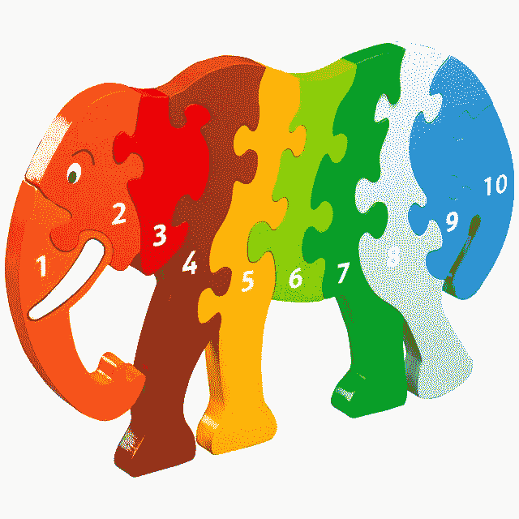

# 传统商业智能几乎扼杀了 Hadoop

> 原文：<https://medium.datadriveninvestor.com/traditional-business-intelligence-nearly-killed-hadoop-43699a90efbc?source=collection_archive---------0----------------------->

# **“传统商业智能工具正在扼杀 Apache Hadoop！”**

好了…我说了！(继续读……有解决办法)

传统的商业智能(BI)工具，如 Tableau、Qlik 等，是随着传统的关系数据库管理系统(RDBMSs)发展起来的。两者都使用 ANSI SQL 来查询(即检索)用于分析的数据。传统的 SQL 数据库包括 Netezza、Oracle 和 Microsoft SQL Server 等产品。那么，究竟为什么会有人认为传统的 BI 工具可以很好地与 Apache Hadoop 一起工作呢？我完全可以理解为什么人们会试图让它们工作，但简单地说，传统的 BI 工具不是为大数据和现代数据平台而设计的！

BI 工具和数据平台工具的结合定义了 BI 和数据仓库堆栈。它们需要独立的服务器和网络基础设施，这意味着您不能直接在数据仓库系统中运行您的 BI 解决方案。考虑到当今 JSON、XML 和其他复杂数据格式的采用，这些数据平台被认为是昂贵且不灵活的。虽然数据平台使用 Apache Hadoop 和基于云的存储等技术发展成为今天的数据湖，但 BI 工具集并没有随之发展。 ***传统 BI 工具集几乎扼杀了 Apache Hadoop，因为传统 BI 性能缓慢，缺乏可扩展性，并且在实时和复杂数据用例方面完全缺乏灵活性。*** 在本文中，我们将回顾 Tableau、Qlik 等传统商务智能工具如何让客户失望，并几乎摧毁他们在 Hadoop 这一现代数据平台上的投资。我们将完成解决方案！

**性能:传统的商业智能在 Apache Hadoop 上运行缓慢**

过去的 BI 解决方案是针对 Teradata、Oracle、Netezza 等关系数据平台构建和优化的。让我们不要忘记在数据模型、索引和分区方案上做了多少工作来提高这些数据平台的速度。遗留商业智能工具是专门为这些遗留数据平台构建的。随着 Apache Hadoop 的出现，IT 组织欢呼雀跃，认为他们已经找到了 Netezza 和其他 ANSI SQL 平台的高价格的替代品。因此，他们将传统的 BI 工具捆绑到 Apache Hive 上，很快发现速度非常慢。事实上，他们非常慢，以至于他们将数据拷贝到第三方平台，如 MicroStrategy Intelligence Server 或 Tableau Server、Apache Spark(在内存中)以及其他性能优化手段中。虽然查询性能可能会提高，但这些解决方案大多依赖于单个服务器或内存执行，严重限制了可分析数据的规模。由于陈旧的数据，这些系统还会产生延迟问题，更不用说这些方法产生的管理开销、数据治理和安全问题了。根据我的经验，传统的 BI 工具性能问题是 Apache Hadoop 缺乏采用和成功的关键因素。

为什么？传统的商业智能工具不是 Apache Hadoop 和云平台的“原生”第一方公民。我们需要专为现代数据平台打造的产品！

**架构:相对于 Apache Hadoop 而言，传统商业智能是一个不完整的解决方案**

相对于 Apache Hadoop，传统的 BI 是不完整的。Apache Hadoop 是一个商用服务器集群，利用存储和计算来处理非常大且有时非常复杂的数据类型。它们存储了大量数据！许多基于 Hadoop 的 SQL 技术不提供过去的数据平台所提供的优化功能，如索引和主键。Apache Hive 和其他基于 SQL 的 Hadoop 解决方案是面向批处理的，因此对于复杂的 SQL 操作并不是最佳的，而且 SQL 方言也有限。当这些传统 BI 解决方案在 Hadoop 上运行时，这导致了缓慢的性能和缺乏可扩展性。传统 BI 拥有自己的一套服务，这些服务运行在 Hadoop 集群之外，并且没有针对利用 Hadoop 集群进行优化。Hadoop 的一个关键价值主张是，如果你想要更大的能力，你可以添加更多的节点，因为它是线性扩展的。因为传统 BI 不是 hadoop 集群的原生产品，所以它无法利用这种可扩展性和功能。

我们需要什么？我们需要轻量级的东西，不强迫你将数据移动到另一个平台，如 Apache Spark，并在 Apache Hadoop 堆栈上运行。我们需要为 Hadoop 设计的东西！

**实时性:传统商业智能在实时性和复杂类型上较弱**

大数据和分析中最有价值的用例之一是物联网实时事件处理。Apache Kafka 在 Hadoop 平台上越来越受欢迎，以便能够利用流分析。针对 Apache Kafka 构建分析不是传统 BI 工具擅长的事情，或者根本不是。大多数流数据以 JSON 的形式出现，这种数据结构不容易使用传统的 BI 工具进行查询或解析。很少有商业智能供应商能够查询复杂的数据结构，而不将其简化为行列表格格式。让业务分析师参与流数据应用程序实际上是不存在的，因为 Apache Kafka 需要大量的技术知识。

赚大钱，赚大钱，各种晦气！事件和流分析需要 Apache Kafka，传统的 BI 工具无法胜任这项任务。像 JSON 和 parquet 这样的复杂数据类型，需要 ETL 程序员将它们展平成大多数遗留 BI 工具可以处理的结构。拿出你的支票簿:E-T-L，是三个最贵的字母！我们需要的是一个能够自动处理流数据及其复杂类型的 BI 工具。

解决方案:那么我们要做什么？

Apache Hadoop 的承诺是数据访问和分析将比现有的遗留数据平台更快、更灵活、更经济。客户渴望另一种体验，以满足组织对信息和数据访问的渴望。传统的商业智能工具在 Apache Hadoop 上遭遇了巨大的失败，我认为这也是导致采用问题的原因之一。我们需要的是为 Hadoop 和其他现代数据平台构建的东西。如果您想了解更多关于使用 Apache Hadoop 从大数据中创造商业价值的信息，我推荐您阅读来自[企业解决方案小组的这篇文章。](https://www.arcadiadata.com/lp/accelerating-business-insights-whitepaper-registration/)本文档将帮助您设计一个“利用 Hadoop 加速业务洞察”的计划

*原载于 2018 年 8 月 14 日*[*www.arcadiadata.com*](https://www.arcadiadata.com/blog/how-traditional-bi-nearly-killed-hadoop/)*。*