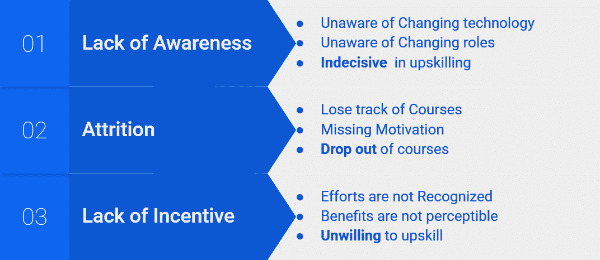
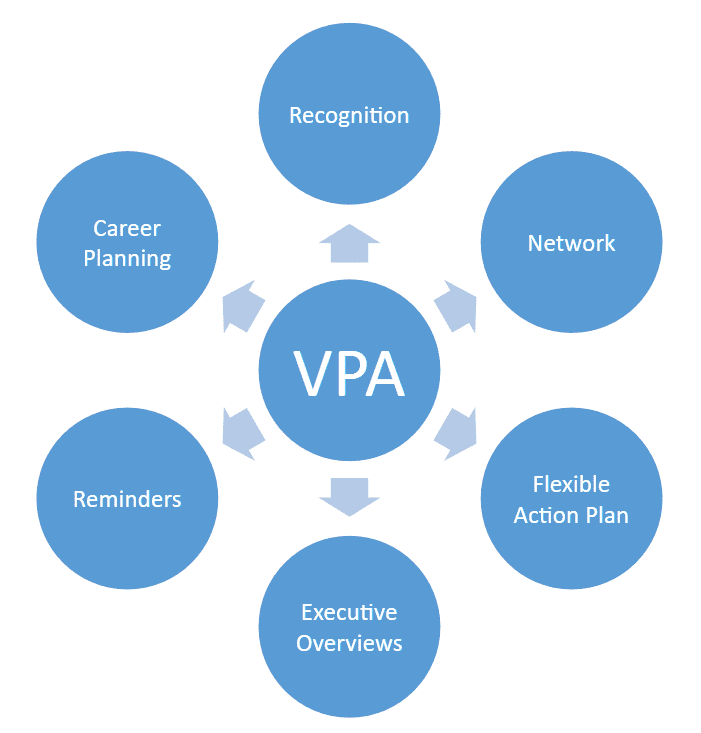
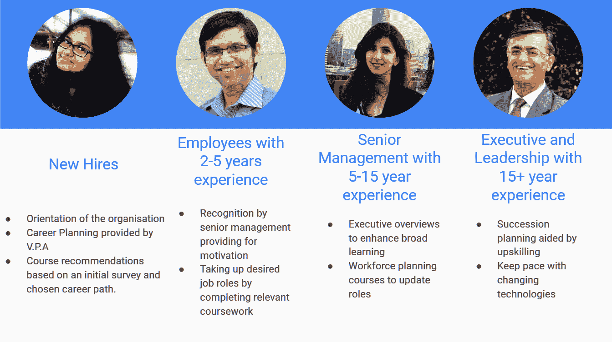
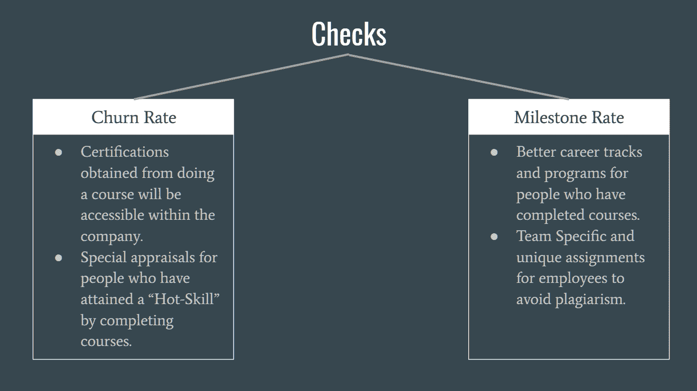

# 培训和保留:建立一支面向未来的员工队伍

> 原文：<https://medium.datadriveninvestor.com/train-and-retain-building-a-future-ready-workforce-7ca3211dfd06?source=collection_archive---------14----------------------->

人工智能和自动化的出现导致了工作性质的巨大转变。 ***麦肯锡*** 预测 ***今天工人从事的将近一半*** 活动甚至现在都可以自动化，取代多达 **14%** 的劳动力。这种变革的氛围理所当然地赢得了“工业革命 4.0”(IR 4.0)这个名字。为了避免成为主动破坏的目标，公司及其员工必须适应不断变化的时代。

[Image Credits](https://www.google.co.in/url?sa=i&rct=j&q=&esrc=s&source=images&cd=&cad=rja&uact=8&ved=2ahUKEwi4hJWL3PvdAhUMO48KHQe9DG0QjRx6BAgBEAU&url=https%3A%2F%2Fwww.autodesk.com%2Fredshift%2Fthe-future-of-work%2F&psig=AOvVaw3ITiWIftx2a_keRm7LQYcg&ust=1539255562164851)

> 一个独立的组织如何在这里化险为夷？

[***Coursera for Business***](https://www.coursera.org/business)，从其过去的联想来看，已经显示出在这个领域的无价性。通过专注于响应性、规模和访问，Coursera 为全球数百家企业增加了价值。像 BCG、Pfizer 和 Phillips 这样的客户对其内容的质量、使用的便利性及其在终身学习体系中的作用表示赞赏。Coursera 的大学水平认证创造了一种行业公认的提升技能的方式。对于这家专注于提升技能的全球领先专业服务公司来说，Coursera 有潜力通过按照我们的思路改进他们的产品来帮助他们适应。

> **问题分析—**

这个问题可以通过考虑四组成员来解决，即:

1.  *新员工*
2.  *有 2 至 5 年工作经验的员工*
3.  *具有 5-15 年经验的高级管理人员*
4.  *拥有 15 年以上经验的高管和领导层*

这项研究揭示了阻碍他们提高技能的三个主要因素:

*   *缺乏意识*
*   *减员*
*   *缺乏激励*

***意识缺失:-*** 在这个 IR 4.0 时代，工作角色和要求都在快速变化。新的、颠覆性的技术和模式出现在舞台上，几年后就被淘汰了。这种快速变化让大多数员工意识不到不断变化的技术以及他们未来可能要承担的角色。对于前两个梯队的员工来说，这个问题体现在 ***职业规划*** 不好。这些员工通常不确定他们的长期计划，他们现有的技能如何适应这些计划，以及需要什么技能才能跟上世界的步伐。即使是高级管理人员也可能会对时代的变化缺乏了解。这种知识的缺乏使他们在追求技能提升时犹豫不决。

***自然减员* :-** Coursera 大学期间的课程自然减员率很高，10%的学生完成了课程。造成这种损耗率的一些因素是:

*   迷失了航向，
*   缺乏与其他学生的联系，
*   动力减弱

缺乏激励和兴趣会进一步加剧这一问题。由于高级员工的时间有限，他们的要求与新员工不同。因此，强大的 ***需要有针对性的交战*** 来打击消耗战。

***缺乏激励* :-** 员工发现很难看到自己在提高技能方面的进步有助于他们在公司的成长。这是因为公司管理层可能无法给予正在重新获得或提升技能的员工足够的 ***认可*** 。这也可能驱使高技能员工离开公司去寻找更好的工作。在高层，经理们可能不理解为什么他们要把有限的时间花在学习课程上。因此，员工可能不会积极追求再培训或提升技能，因为他们看不到*****这样做的好处*** 。**

**我们认为，我们上面概述的所有主要问题都与所有 4 类员工相关。 ***然而，每个群组的方法必须记住他们的需求是不同的。年轻员工有很高的技能提升潜力，而资深员工需要适应不断变化的时代。因此，在为每个员工群体创造个性化体验的同时，必须解决所有这些问题。*****

> ****解决方案—****

*****【VPA】(虚拟私人助理):-*** 我们解决方案的核心是一个 ***虚拟私人助理(VPA)*** 系统，该系统紧密集成到 Coursera 和公司中。VPA 是推动员工在公司内重新获得或提高技能的个性化指南。VPA 最吸引人的地方在于它的持久性。**

**坚持代表了 VPA 不断互动的本质。例如，Google Assistant 使用我们在 Google 上的数字档案来满足我们的请求，并提前做出识别我们需求的个性化建议。这种**稳定的双向**互动模式推动了长期参与。**

*****意识:-***Coursera VPA 指导员工进行职业再培训或技能提升。根据对员工兴趣、技能背景和当前角色的初步调查，VPA 会为 **IR4.0 就绪角色**生成建议，员工可以**探索**并设定目标。一旦他们设定了目标，VPA 就会产生一个包含相关课程和证书的**行动计划**。然后鼓励员工开始制定行动计划。**

**如果员工对某个课程或赛道不感兴趣，VPA 会根据他们的使用数据、他们的新兴趣和公司的要求更新他们的行动计划。有了切实可行的行动计划，员工将有动力提升技能并实现目标。我们调查了 400 名已经参加工作的直属上司，他们喜欢有一名专职助理帮助他们保持职业发展的想法。**

*****敬业度:-*** 员工开始学习课程后，VPA 会监控他们的进度，并与他们保持互动，以防止流失。在课程中，VPA 将:**

1.  ***提醒他们课程截止日期，***
2.  ***如果他们对课程的兴趣下降，给他们一些鼓励***
3.  ***祝贺他们完成课程或行动计划里程碑***

**有了 ***的持续投入*** ，员工慢慢退出课程或者忘记*就更难了。***

****

**如果一名员工正在努力学习一门课程，或者他们的兴趣正在下降，VPA **会将他们**与其他已经完成或正在学习同一门课程的员工联系起来。员工可以与其他学生进行面对面的互动，因此更有动力完成课程。**

**对于可能需要会见来自不同背景的团队和客户的管理层员工，VPA 会为相关领域的**高管概览**提供建议。概述包括相关课程的重要材料，如基本定义、复习测验和复习视频。VPA 可以使用员工日历和 LinkedIn 个人资料中的约会来适当地生成和安排推荐时间。**

*****激励:-*** 对于管理者来说，当向他们汇报的员工在某个过程或他们的行动计划中取得了重大的阶段性成果时，VPA 还会 ***通知他们*** 。经理会意识到他们手下的员工能够 ***担任更新的角色*** ，因此他们将能够提拔技能更高的员工去执行更有趣的任务。经理也可以祝贺员工的进步。这样，员工将会确信他们的进步得到了公司 的认可。**

**对于高层员工来说，这种认可对于晋升尤其有用。在继任计划期间，人力资源官员可能会对哪些高级管理人员在积极追求技能提升感兴趣。他们将能够使用 VPA 来 ***跟踪此类员工的*** ，从而激励上层的两个团队提高技能。**

**因此，VPA 有效地促进了所有四类员工的再培训或技能提升。**

****

***All images have been taken from LinkedIn.***

> **没有建议的实施途径，任何解决方案都是不完整的。**

> ****实施路径—****

**如上所述，我们已经确定了建立 VPA 系统的三种主要实施途径。它们是:**

1.  ***创建一个完全的内部实施，VPA 的所有组件都在 Coursera 的服务器上运行。***
2.  ***在其他机器学习(ML)服务(如 IBM Watson、谷歌云引擎或 Azure ML 服务)的基础上构建 VPA。***
3.  **给像 Cortana 这样已经存在的 VPA 增加一个技能。**

*****完全内部实现* :** 在这个场景中，Coursera 启动了一个内部项目来创建 VPA 及其所有的先决条件。这包括必要的 ML 服务、培训数据和语音识别系统。这种方法给了 Coursera 对实现的最大控制权，因为 VPA 可以根据公司的想法从头开始设计。这种方法的缺点在于这种项目的高成本和极长的启动时间。**

*****使用 ML 服务* :** 在以前的方法中，很大一部分初始设置成本和时间可以通过使用像 IBM Watson、Google Cloud Engine 或 Azure ML Services 这样的云机器学习服务来削减。因此，虽然 VPA 的实施将在 Coursera 的手中，但一些基本功能可以卸载给这些服务。这三种服务的价格都很有竞争力。然而，如果我们预计大量使用，这种方法可能不经济。**

*****为 Cortana 这样的现有 VPA 创造技能:*** 考虑到公司的规模，我们发现假设他们使用微软企业解决方案和 Windows 机器是合理的。因此，Coursera 可以为 Cortana 创建一种实现所有所需功能的“技能”。由于不需要创建新的 VPA，项目成本和设置时间将大幅减少。这种方法的缺点包括缺乏灵活性，例如另一家公司可能不使用 Cortana，以及 VPA 的可定制性。**

****

> **[**【迪肯精灵】**](http://www.deakin.edu.au/life-at-deakin/why-study-at-deakin/deakin-genie)**——****
> 
> **为了了解 Coursera 应该采取哪种方法，我们研究了澳大利亚迪肯大学为其学生开发的 VPA**迪肯精灵**的案例。Genie 可以提醒学生重要的日期，帮助他们找到学习资源并回答基本问题。**
> 
> **最初，迪肯大学使用 IBM Watson 创建了一个可以全天候回答问题的聊天机器人。然后，他们转向了一个专门为他们的大学构建的系统。他们的新系统与他们的学习管理系统有更紧密的互动，并且更有能力帮助学生。从这个案例中，我们可以看到迪肯的团队选择了第二条实施路径，但是**转向了**第一条路径以克服第二条路径的局限性。**
> 
> *****推荐:-*****

**我们认为 Coursera 应该选择第二条实施路径，即建立在云 ML SaaS 服务之上。鉴于我们提出的功能集和公司的规模(大约 200，000 名员工)，使用这种服务的成本不太可能超过创建和运行完全内部解决方案的成本。VPA 也不太可能像第三条道路那样在灵活性和功能集方面受到限制。由于设置时间缩短，Coursera 将能够快速满足公司的需求，并获得竞争优势。**

****

**为了确保 VPA 按预期运行，Coursera 应该关注两个重要指标:**

*   ******流失率*** *，即高技能员工离开公司的比率。****
*   ******里程碑率*** *，即员工达到其行动计划里程碑的比率。****

**流失率将表明 VPA 是否能够激励员工留在公司，而里程碑率是员工是否首先被驱动提升技能的指标。应根据这些指标进一步调整 VPA 的功能。**

**工作一直并将永远以人为中心。人们有一种与生俱来的能力——管理多方面的挑战和应对复杂的挑战。因此，现在是组织重新想象其员工的人力潜力并采取措施组建一支为未来做好准备的员工队伍的时候了。随着 VPA 的到位，我们有信心 Coursera 将能够帮助任何合作伙伴公司进行有效的重组和升级。**

> **我与 Shrikanth Upadhayaya 和 Kirti Dhawaj Singh 共同撰写了这篇文章。这是我们对未来工作场所性质的多次头脑风暴的结果。我们是瓦拉纳西印度理工学院的一群工程本科生。**
> 
> **我们希望得到您的反馈。请在评论区留下你对这篇文章或主题的看法。这篇文章是作者的财产，没有他们明确的书面许可不得使用。**