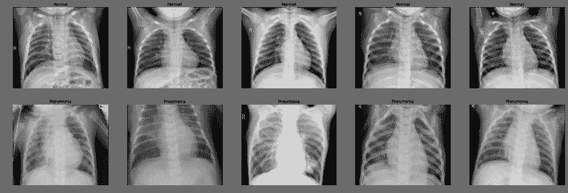
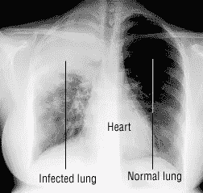
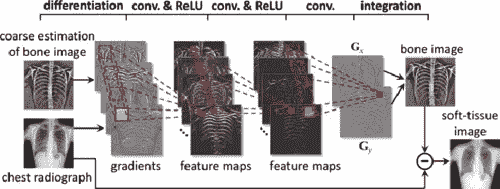
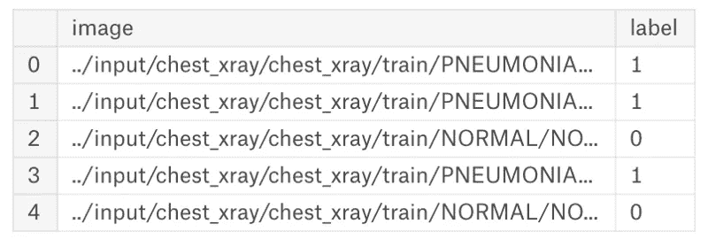
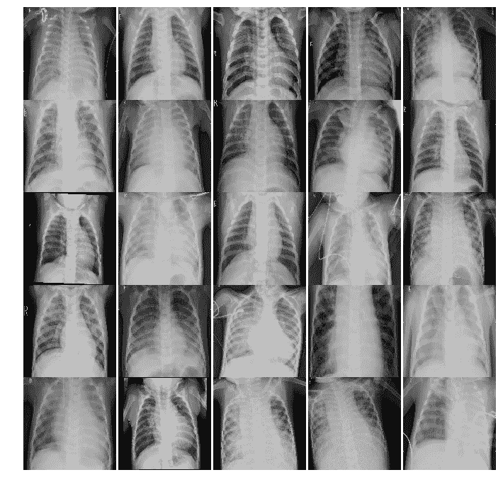
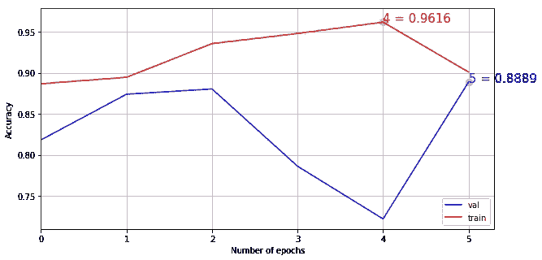

# 训练 CNN 检测肺炎

> 原文：<https://medium.datadriveninvestor.com/training-a-cnn-to-detect-pneumonia-c42a44101deb?source=collection_archive---------1----------------------->

我清楚地记得那一天。我的祖父开始胡乱咳嗽，并开始出现呼吸困难的 T2。随着日子一天天过去，他变得越来越虚弱。我们家的每个人都很担心，所以我们赶紧把他送到最近的医生办公室。这是一个漫长而紧张的过程，巴基斯坦的医生**无法对他进行诊断。**

让我为后面的人再说一遍… **他们无法诊断他。**太疯狂了！我简直不敢相信。我总是听说我们的研究和医疗保健方法在过去十年里有了多大的发展和改进，但这些医生甚至不能诊断我的祖父。我的祖父一直是一个健康、强壮的人，他知道自己甚至不能得到诊断和适当的治疗，这让我很难过。

My grandfather

幸运的是，我们去看了其他几个医生，直到他被确诊为肺炎。但这并不是重点，因为事实是:

1.  不是所有的医生都有合适的诊断工具来诊断病人。
2.  或者诊断不太准确。

不仅是我的祖父，每年有 20 亿人患肺炎！**肺炎**是一种肺部感染，可能由细菌、病毒或真菌引起。胸部 x 光检查是目前诊断肺炎的最佳方法**。**

但是……仍然缺乏获取途径，世界上几乎三分之二的人口无法获得放射学诊断。与 CT 或 MRI 等其他成像方式相比，使用胸部 X 射线进行临床诊断也要困难得多。这导致**不准确的**结果。

pneumonia vs. normal lung

而且……因为这种肺炎导致的死亡人数比,**还要多，仅在美国，每年就有 100 万人住院治疗, **5 万人死亡。****

肺炎是一种常见疾病，我们已经与之斗争了几千年。是时候结束这一切了。自动化这种检测任务将极大地提高放射科医生的效率。

那么…从哪里开始呢？

# 解决方案:卷积神经网络(CNN)

我开发了一个卷积神经网络(CNN ),能够根据患者胸部的 x 光图像检测出患者是否患有细菌性和病毒性肺炎。

## 分析 x 光

我开始是通过 CNN 分析几张 x 光片。与传统的神经网络相比，*卷积*神经网络在处理图像数据方面要高效得多。

在卷积中，我们使用“过滤器”来分析图像的各个部分，而不是逐个像素。这是一个如此强大的模型，它可以将简单网络中的操作数量从数亿减少到不到一千万。使用 CNN 的，我对我所有的数据进行了分类。

## 组织我们的数据

我用的是 [Kaggle 的](https://www.kaggle.com/paultimothymooney/chest-xray-pneumonia)胸透数据。数据集分为 3 个文件夹(训练、测试、val ),并包含每个图像类别(肺炎/正常)的子文件夹。有 5863 个 x 光图像(JPEG)和肺炎或正常的两个类别。

在 x 光扫描中检测肺炎是一个简单的**二元**分类问题:要么我们检测肺炎，要么我们不检测。我用数字提供了这个表示！ **0** 表示正常， **1** 表示肺炎。使用 Python，我为每个图像创建了一个数据框，根据其文件夹标记为 0 或 1，并将它们混在一起:

**0:正常患者 X 射线**

**1:肺炎影响的 x 光图像**

## 分类图像:**Keras 中的 VGG19 模型**

我实现了迁移学习，使用一个**预训练的牛津 VGG19 网络**的前 16 层来识别图像类别。来自[牛津视觉几何小组](http://www.robots.ox.ac.uk/~vgg/) (VGG)的研究人员参加了 ILSVRC 挑战，VGG [开发的卷积神经网络模型(CNN)赢得了图像分类任务](http://image-net.org/challenges/LSVRC/2014/results)。这对于用我们的数据进行图像分类来说是完美的。

我加载了 VGG 模型，并在 Keras 深度学习库中使用，因为 Keras 提供了使用预训练模型的应用程序接口。使用这个接口，我使用牛津小组提供的预训练权重创建了一个 VGG 模型，并将其用作直接对图像进行分类的模型。

**工作原理:**

1.  获取 x 光样本
2.  加载 VGG 模型
3.  装载并准备 X 射线
4.  做一个预测

你可以在这里了解更多关于这个模型如何运作的信息[。](https://machinelearningmastery.com/use-pre-trained-vgg-model-classify-objects-photographs/)

## **训练和测试网络**

我的网络从一些随机的**权重**和零**偏差**开始。这些“参数”将影响我们网络对一幅图像是否是肺炎扫描图像的决定。一旦输入数据通过我的网络使用这些权重和偏差进行处理，它将使用一个激活函数，该函数将返回 0(正常)或 1(检测到肺炎)。

然后，我使用损失函数将预测与实际答案进行比较，以计算预测的误差幅度。然后经过[反向传播](https://en.wikipedia.org/wiki/Backpropagation)，它将调整网络的权重和偏差，以做出更好的预测。我不断迭代，直到得到最准确的结果。

VVG16 Accuracy — 88%

**来测试一下吧！**

当我进行测试时，我为训练好的模型提供了更多的输入数据(x 射线),但是数据的标签是未知的。基本上是在不调整参数的情况下做预测，看看神经网络的准确程度。当我完成测试后，我看到了准确率:

我的模型是 88%准确的！对于第一次尝试来说还不错。如果我继续迭代，我完全可以让这个接近 100%准确。

# 光明的未来:深度学习

这种肺炎探测器可能还不是一种市场现成的产品，但它让我兴奋地看到它是多么容易上手。有了更多的迭代、数据和层，**我很乐观，我们可以有一个接近 100%准确的产品。**

像我祖父这样的人将永远不会因为得不到诊断或准确的诊断而痛苦。这将有助于我们更早地进行诊断，并创造有助于拯救生命的治疗方法。**这就是今天深度学习令人兴奋的地方:障碍都被消除了。**

***我是区块链、VR 和机器学习开发者。如果你想了解我的最新进展，请随时关注我的***[***LinkedIn***](https://www.linkedin.com/in/alishba-imran-847271169/)***和 Medium！***

***如果你喜欢读这篇文章，请按👏按钮，别忘了分享！***

# DDI 特色数据科学课程:

*   [**用于数据科学的 Python**](http://go.datadriveninvestor.com/intro-python/mb)
*   [**Scikit-Learn**](http://go.datadriveninvestor.com/scikitlearn/mb)
*   [**深度学习**](http://go.datadriveninvestor.com/deeplearningpython/mb)

**DDI 可能会从这些链接中收取会员佣金。我们感谢你一直以来的支持。*