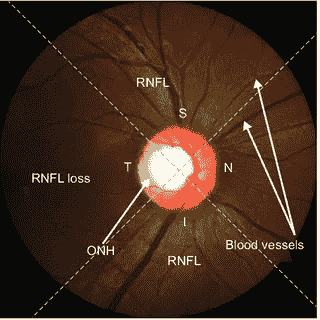
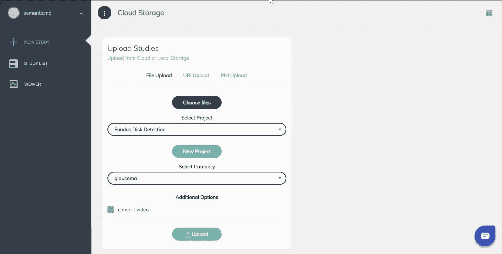
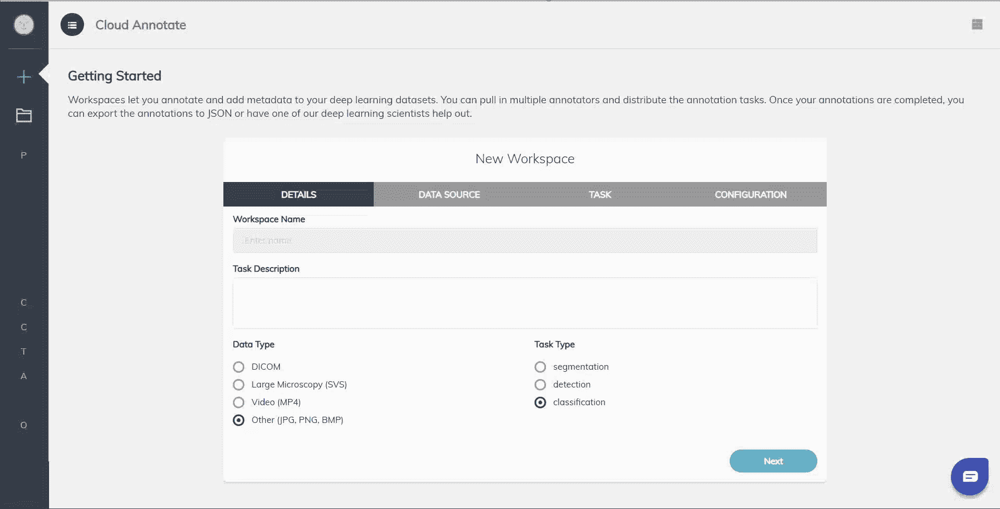
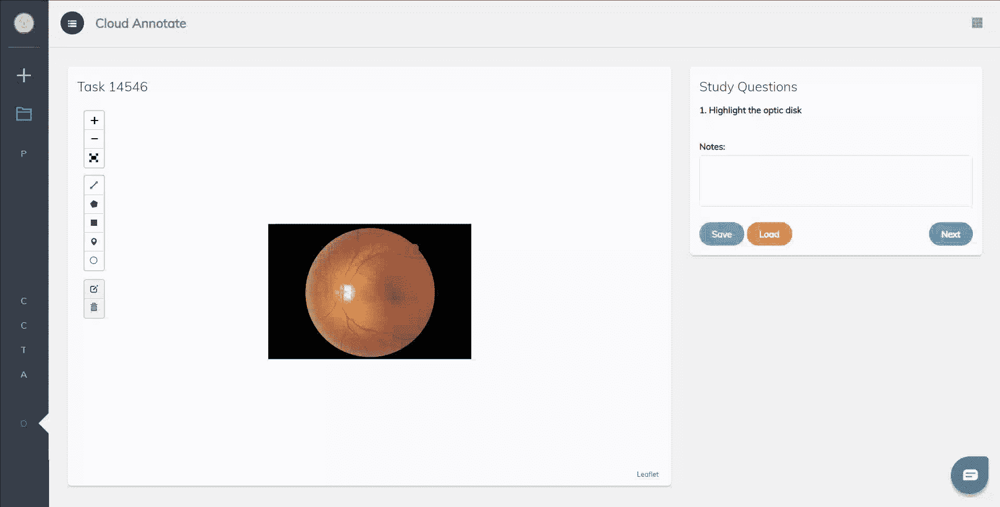
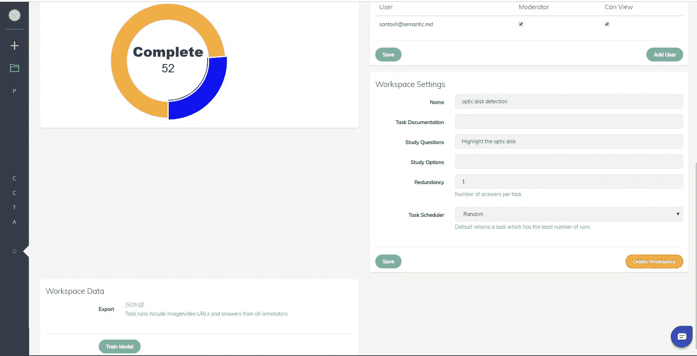
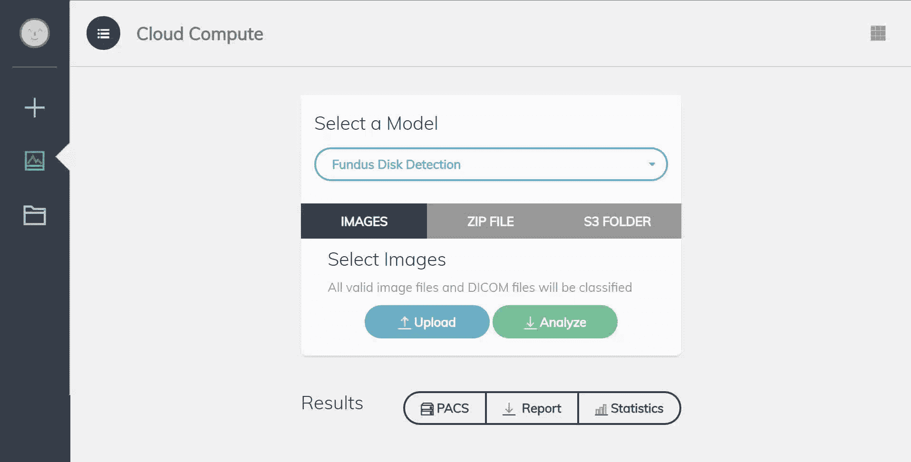

# 训练用于眼底图像的无编码物体检测器

> 原文：<https://medium.datadriveninvestor.com/training-a-no-code-object-detector-for-fundus-eye-images-3c73510bd2f7?source=collection_archive---------8----------------------->

数据是 AI 的基础。没有良好注释的数据，就没有人工智能。尤其是在这个深度学习时代，数据的[不合理的有效性是很好理解的，因为当前这一代人工智能算法是由大量公共和私人数据集推动的[1]。虽然医学成像数据在世界各地的诊所和医院中广泛可用，但创建人工智能算法的工具并不在医生和领域专家的手中。](https://arxiv.org/abs/1707.02968)

之前，我们浏览了在 [SemanticMD](https://semantic.md/) 开发的工具，以帮助医学成像研究人员管理和注释数据。在本教程中，您将学习如何应用深度学习来训练眼底图像的对象检测器。具体来说，您将发现如何从原始数据到训练和服务对象检测器，所有这些都不需要编码！

# 背景

青光眼是一种慢性眼病，会导致视神经损伤和视力丧失。尽管建议有风险的患者至少每年进行一次眼部检查，但由于不方便以及在一些发展中国家缺乏训练有素的眼科医生，许多有风险的患者没有得到足够早的识别。人工智能有可能提供一种快速、经济、方便的筛查解决方案，帮助识别这些高危患者。

一种流行的青光眼筛查技术是视神经乳头(ONH)评估，其包括围绕视盘和视杯的测量。为了自动获取这些测量值，我们需要首先分割出视盘(下面明亮的黄色区域)。

Optic Nerve Head (ONH) Measurement

虽然已经开发了许多方法，包括颜色/对比度阈值处理、轮廓检测和区域分割方法，但是这些方法需要花费大量精力来开发手工制作的特征。深度学习已被证明是一种更容易和更有效的方法，用于开发具有高灵敏度和特异性的模型。虽然神经网络架构是高度可定制的，并且可以设计成适合成像数据的独特属性(例如眼底成像中视盘和视杯的联合分割[2])，但在本教程中，我们将重点关注将带注释的数据与更通用的对象检测器相结合，以快速产生实用的模型。这种方法的好处是，它为领域专家创建了一个简单的反馈循环，以开始利用深度学习模型。

# 步骤 1:上传数据

第一步是拍摄任何格式的图像(PNG、JPG、SVS、DICOM 等),并通过网络界面上传。如果你有大量或千兆像素的图像，你可以使用我们的 [native client](http://developer.semantic.md/docs/data-upload#section-2-native-client) 更快地上传到网络。

# 步骤 2:创建工作区

下一步是提供一个 web 界面，用于从众包领域专家那里收集注释。在这里，您可以从多个来源获取数据，并决定要问的问题的数量和种类。例如，您可以要求注释者对眼底图像是否异常进行分类，然后让他们标记异常。

# 步骤 3:注释图像

最后，您已经准备好开始注释了！对于对象检测，许多算法建议最少 30-50 张图像。正如你在上面的演示中所看到的，每幅图像不超过 8 秒，所以你可以在 10 分钟内收集最少的训练集！您还可以邀请多个注释者，并基于主动学习算法来调度任务，以加速这个过程。

# 第四步:训练一个模型

现在你已经准备好训练一个物体探测器了。只需点击“训练模型”按钮，当您的模型完成训练后，我们将在 30 分钟内给您发送一封电子邮件。如果您喜欢使用自己的算法，可以单击 JSON 链接导出所有数据和注释以及我们提供的脚本，以便在格式(PASCAL VOC、MS COCO、CSV)之间进行转换。在我们的下一个版本中，我们计划允许研究人员选择他们最喜欢的对象检测算法，以便于测试和原型制作[3]。

# 第五步:评估新图片

现在，您已经拥有了一个可通过 web 界面或 API 访问的光盘实时对象检测器。从这里开始，您可以集成到您自己的应用程序中，并总是回来注释更多的数据以改进模型。

在 [SemanticMD 云](https://app.semantic.md/classify/fundus)上尝试演示和其他眼底算法。

# 参考

[1]孙，陈等.“再论深度学习时代数据的不合理有效性”*计算机视觉(ICCV)，2017 年 IEEE 国际会议上*。IEEE，2017。

[2]傅，，等.“基于多标记深度网络和极坐标变换的视盘和视杯联合分割” *arXiv 预印本 arXiv:1801.00926* (2018)。

[https://github.com/facebookresearch/Detectron](https://github.com/facebookresearch/Detectron)

*需要一个定制模型或关于如何利用数据构建的建议？请随时与我们的一位深度学习科学家预约* [*通话。*](http://calendly.com/semanticmd)