# 使用 RL 训练机器人手臂完成类似人类的任务

> 原文：<https://medium.datadriveninvestor.com/training-a-robotic-arm-to-do-human-like-tasks-using-rl-8d3106c87aaf?source=collection_archive---------0----------------------->

[](http://www.track.datadriveninvestor.com/1B9E)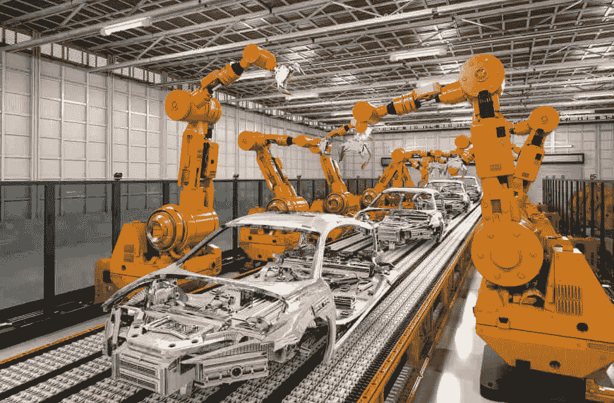

如今部署在各行各业的工业机器人大多在做重复性的工作。基本上，在*预定义的轨迹*中移动或放置物体。但现实是，在当今的制造业中，机器人处理不同或复杂环境的能力确实有限。

[](http://go.datadriveninvestor.com/5ML1) [## DDI 编辑推荐:5 本机器学习书籍，让你从新手变成数据驱动专家…

### 机器学习行业的蓬勃发展重新引起了人们对人工智能的兴趣

go.datadriveninvestor.com](http://go.datadriveninvestor.com/5ML1) 

我们必须克服的主要挑战是设计能够轻松适应新环境的适应性控制算法。

幸运的是，我们可以使用人工智能中一个叫做**强化学习(RL)** 的领域来克服这样的挑战。

## 强化学习

强化学习(RL)是一种机器学习，我们可以通过执行动作并查看结果来教代理如何在环境中行为。

强化学习的概念已经存在了一段时间，但该算法适应性不强，无法完成连续任务。理查德·萨顿的书中有一个经典的例子。

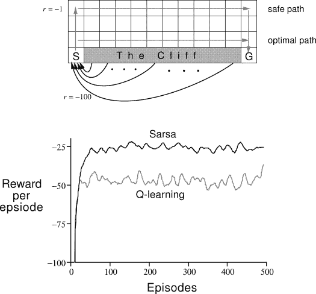

在深度 Q 网络开始变得更加流行之后，人们意识到深度学习方法可以用来解决高维问题。

直到最近几年，我们才看到这方面有了很大的改进。我们有很酷的公司，如 2014 年的 [DeepMind 和 Deep Q 学习架构](https://deepmind.com/research/dqn/)，2016 年的[击败了 AlphaGo 的冠军](https://deepmind.com/research/alphago/)，2017 年的 [OpenAI 和 PPO](https://blog.openai.com/openai-baselines-ppo/) ，等等。

## 我的刺激:OpenAi 的机器人环境

去年，OpenAi 放弃了八个新的模拟机器人环境。我使用 Fetch 并训练它做以下事情:

1.  **FetchReach-v0:** 将其末端执行器移动到所需的目标位置。

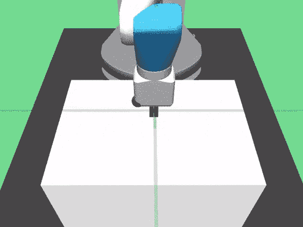

2. **FetchSlide-v0:** 在一张长桌上击打一个冰球，使其滑向每次都会改变的目标。

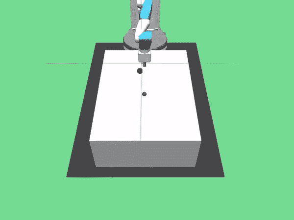

3. [FetchPush-v0](https://gym.openai.com/envs/FetchPush-v0/) :通过推动移动盒子，直到它到达期望的目标。

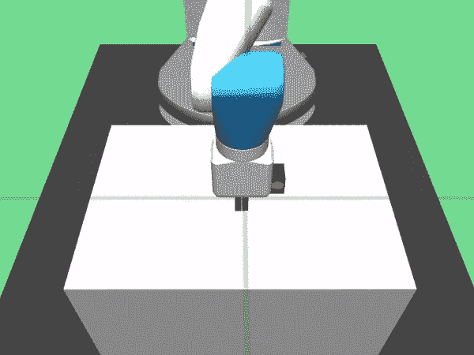

4. **FetchPickAndPlace-v0:** 拿起一个盒子，用它的夹子把它移动到一个目标。

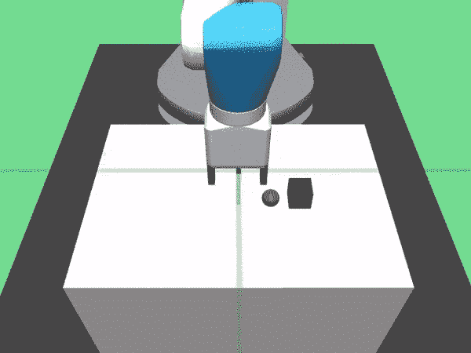

在这篇文章中，我将解释这背后的工作原理。这些是我将介绍的主要组件:

1.  RL 基础
2.  q 学习
3.  深度 Q 网络(DQN)
4.  深度确定性政策梯度(DDPG)
5.  马后炮经验回放:她
6.  密码

# RL 基础

## 马尔可夫决策过程(MDP)——主体、行动、回报

对于 RL，我们使用一个称为**马尔可夫决策过程(MDP)** 的框架，它为一个真正复杂的问题提供了一个简单的框架。一个**代理**(例如机械臂)会首先观察它所处的环境，并相应地采取**行动**。根据结果给予奖励。

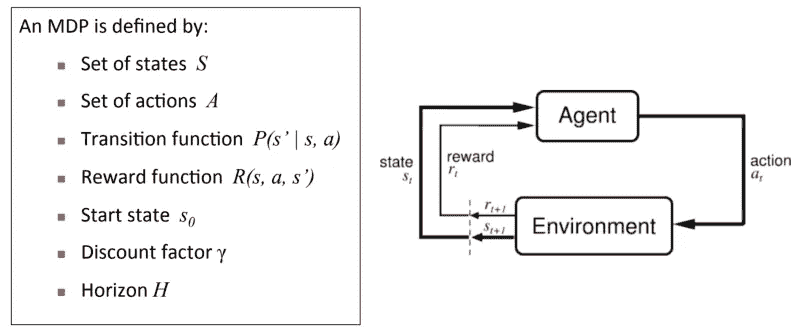

对于机器人控制，通过使用传感器测量关节角度、速度和末端执行器姿态来测量状态:

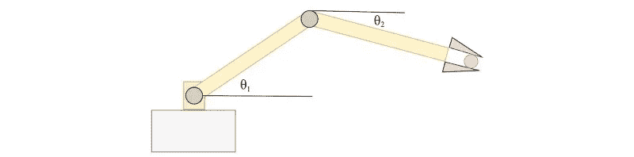

## 政策

主要目标是找到一个**政策。策略是告诉我们在特定状态下如何行动的东西。目标是找到一个能做出最有益决策的政策:**

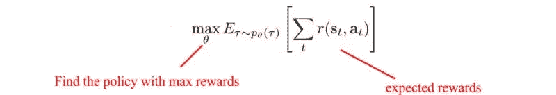

现在，你把目标放在一起。我们希望找到一系列行动，最大化预期回报或最小化成本。

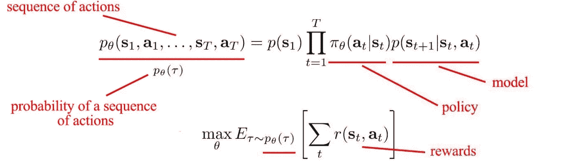

这是强化学习的总体思路，如果你想了解 RL 中的更多细节，请查看文章[这里](https://medium.com/@jonathan_hui/rl-introduction-to-deep-reinforcement-learning-35c25e04c199)或者观看我对 Alp 的评论

# q 学习

Q-learning 是一种**无模型**强化学习算法，这意味着它不需要环境模型。它特别有效，因为它可以处理随机转换和奖励的问题，而不需要适应。

最常见的 Q 学习方法包括以下步骤:

1.  尝试一个动作。
2.  观察奖励和下一个状态。
3.  采取 q 值最高的动作。

## q 表

Q-Table 只是一个简单的 lookout 表，在这里我们可以计算每个状态下的最佳行动。

您可以在 Q 表中模拟您的环境。列是动作，行是状态。

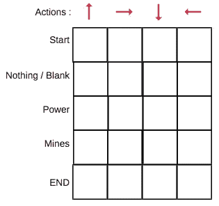

每个 Q-table 分数将是机器人在该状态下采取行动时将获得的最大预期未来奖励。你不断迭代，直到找到最佳答案。

为了学习 *Q 表*的每个值，我们使用 **Q 学习算法。**

## Q 学习算法: **Q 函数**

**Q 函数**使用贝尔曼方程并接受两个输入:状态( **s** )和动作( **a** )。

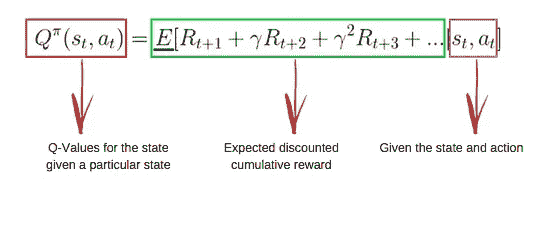

基本上，我们可以得到表中单元格的值 **Q** ，因为 Q-table 中的所有值都是从零开始的。

当我们开始探索环境**，**时，Q 函数通过不断更新表中的 Q 值，为我们提供了越来越好的近似值。

现在，让我们了解更新是如何发生的。

# q-学习算法过程

## 步骤 1:初始化 Q 表

首先，你必须建立一个 Q 表。有 n 列，其中(n=动作数)和 m 行(m=状态数)。所有值都从 0 开始。

## 步骤 2 和 3:选择并执行一个动作

你在基于 Q 表的状态中选择一个动作。 *Q* 初始化为零。这意味着没有已经完成的特定动作。你可以用一个探索和开发权衡的概念来解决这个问题([查看更多细节](https://medium.freecodecamp.org/a-brief-introduction-to-reinforcement-learning-7799af5840db))。

现在，我们可以使用称为**ε贪婪策略**的东西。在游戏开始时，epsilon 比率会更高，因为机器人不太了解环境，所以需要采取很多行动来了解它。随着机器人探索环境，ε速率降低，机器人开始利用环境。

现在，您更新 q 值并采取行动。

## 步骤 4 和 5:评估

现在，我们已经采取了一项行动，并观察到了一个结果/回报。我们需要更新函数 Q(s，a)。


基本上，我们只是一遍又一遍地重复这个过程，直到机器人学会了，Q 表就会更新。这些是我们已经完成的所有步骤:

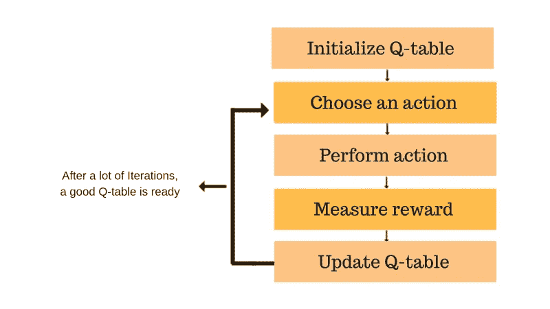

# 深度 Q 网(DQN)

DQN 对于 *Q* 真的很重要——通过使用深度网络学习，我们可以逼近 *Q.* 在 RL 中，机器搜索得越多越好，但这是不好的，因为输入空间和动作在不断变化，这就是我们如何更新 *Q* 的目标值。

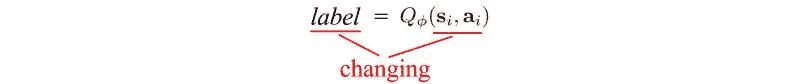

这就是为什么我们需要 DQN，因为我们可以利用它的经验回放和目标网络来减缓变化，并且我们可以逐渐学习。

## 政策梯度

三种 RL 方法:

1.  基于模型的 RL 使用模型和成本函数来寻找最优路径。
2.  价值学习使用 *V* 或 *Q* 值来推导最优策略。
3.  *政策梯度法重点在于政策。*

政策梯度的概念非常简单。我们基本上是用更好的奖励来优化行动。政策梯度是这样计算的:

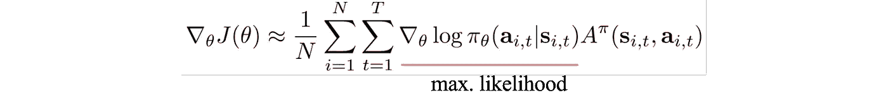

我们使用这个梯度来更新使用梯度上升的策略。

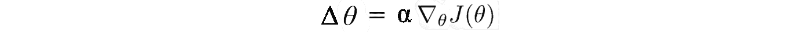

## 演员-评论家方法

每次更新策略时，我们都需要重新采样。计算模型需要多次迭代。

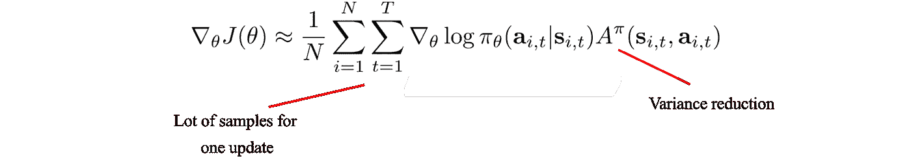

在参与者-批评家方法中，我们使用**参与者**来建模政策，使用**批评家**来建模 *V* 。通过引入一个批评家，我们减少了为每次策略更新收集的样本数量。所有的样本直到一集结束才被收集。

行动者-批评家的算法与政策梯度法非常相似:

*   第二步:拟合*V*-值函数(critic)。
*   第三步:TD 计算 ***A*** 。
*   步骤 5:更新我们的策略(参与者)。

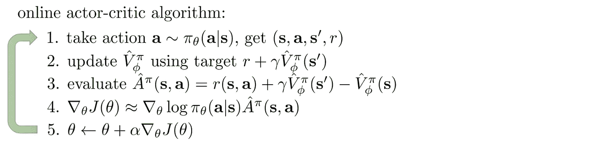

# 深度确定性政策梯度(DDPG)

谷歌 DeepMind 设计了一个可靠的算法来解决连续动作空间问题。他们已经开发了一个**策略梯度** **行动者-批评家**算法，叫做深度确定性策略梯度(DDPG)，它是**非策略**和**无模型**，并且使用了一些来自深度 Q 网络(DDPG)的相同方法。

## 政策外与政策内

强化学习算法是脱离策略的，这仅仅意味着它们有一个独立的行为策略(用于模拟轨迹),独立于正在改进的策略。Q-learning 是一种偏离策略的算法，因为它更新 Q 值，而不对所遵循的实际策略做出任何假设。Q 学习算法简单地陈述了对应于状态 s(t)s(t)和动作 a(t)a(t)的 Q 值使用下一个状态 s(t+1)s(t+1)和动作 a(t+1)a(t+1)的 Q 值来更新，该动作使状态 s(t+1)s(t+1)处的 Q 值最大化。

## 无模型算法

无模型 RL 算法是那些不使用任何东西来确定代理如何与环境交互的算法。

无模型算法通过**策略迭代或价值迭代**等算法直接估计最优策略或价值函数。这在计算上要高效得多，但也需要大量的训练样本。

# 马后炮经验回放:她


[后见之明经验回放](https://arxiv.org/abs/1707.01495) (HER)，是一种新的强化学习算法，可以**从失败中学习**。她也可以从稀疏的奖励中学习成功的政策。

我们可以通过 [FetchSlide](https://gym.openai.com/envs/FetchSlide-v0) (将冰球滑过桌子并击中目标)来理解这一点。最初的几次尝试不会很成功。典型的强化学习算法不会从这种经历中学到任何东西，因为它们只是获得不包含任何学习信号的恒定奖励(在这种情况下:`-1`)。

她凭直觉做人类做的事情:即使我们没有得到具体的目标，我们也假装我们已经到达了冰球所在的那个目标。通过这样做，强化学习算法获得某种学习信号，因为它已经实现了*某个*目标。

后见之明经验重放重放经验(经常用在非策略 RL 算法中，如 [DQN](https://blog.openai.com/openai-baselines-dqn/#dqn) 和 [DDPG](https://arxiv.org/abs/1509.02971) )。HER 可以与任何非策略 RL 算法(DDPG + HER)相结合，以使其更加准确。

## 她:结果

在做了一些试验后，我测试了她+DDPG 和 DDPG。我发现她的+DDPG 在实现目标方面要快得多。

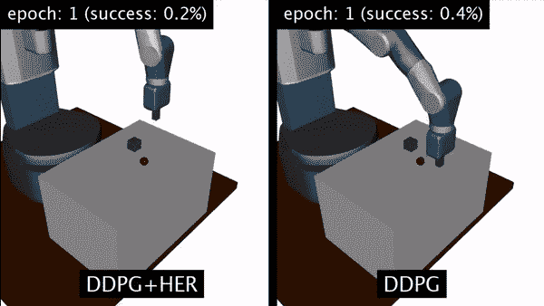

My results

# 密码

这是我在 OpenAI gym 中使用钟摆环境的示例代码。目标是了解在一个简单的实现中，一切是如何协同工作的。这些是主要步骤:

1.  设置一个数据结构来表示您的重放缓冲区。当被询问时，重放缓冲器返回随机选择的一批体验。

下面是一些可能的示例代码:

```
from collections import deque
import random
import numpy **as** np

**class** **ReplayBuffer**(object):

    **def** **__init__**(self, buffer_size):
        self**.**buffer_size **=** buffer_size
        self**.**count **=** 0
        self**.**buffer **=** deque()

    **def** **add**(self, s, a, r, t, s2):
        experience **=** (s, a, r, t, s2)
        **if** self**.**count **<** self**.**buffer_size: 
            self**.**buffer**.**append(experience)
            self**.**count **+=** 1
        **else**:
            self**.**buffer**.**popleft()
            self**.**buffer**.**append(experience)

    **def** **size**(self):
        **return** self**.**count

    **def** **sample_batch**(self, batch_size):
        '''     
        batch_size specifies the number of experiences to add 
        to the batch. If the replay buffer has less than batch_size
        elements, simply return all of the elements within the buffer.
        Generally, you'll want to wait until the buffer has at least 
        batch_size elements before beginning to sample from it.
        '''
        batch **=** []

        **if** self**.**count **<** batch_size:
            batch **=** random**.**sample(self**.**buffer, self**.**count)
        **else**:
            batch **=** random**.**sample(self**.**buffer, batch_size)

        s_batch **=** np**.**array([_[0] **for** _ **in** batch])
        a_batch **=** np**.**array([_[1] **for** _ **in** batch])
        r_batch **=** np**.**array([_[2] **for** _ **in** batch])
        t_batch **=** np**.**array([_[3] **for** _ **in** batch])
        s2_batch **=** np**.**array([_[4] **for** _ **in** batch])

        **return** s_batch, a_batch, r_batch, t_batch, s2_batch

    **def** **clear**(self):
        self**.**buffer**.**clear()
        self**.**count **=** 0
```

2.定义演员和评论家网络。

```
**class** **ActorNetwork**(object):

    **...**

    **def** **create_actor_network**(self):
        inputs **=** tflearn**.**input_data(shape**=**[None, self**.**s_dim])
        net **=** tflearn**.**fully_connected(inputs, 400)
        net **=** tflearn**.**layers**.**normalization**.**batch_normalization(net)
        net **=** tflearn**.**activations**.**relu(net)
        net **=** tflearn**.**fully_connected(net, 300)
        net **=** tflearn**.**layers**.**normalization**.**batch_normalization(net)
        net **=** tflearn**.**activations**.**relu(net)
        *# Final layer weights are init to Uniform[-3e-3, 3e-3]*
        w_init **=** tflearn**.**initializations**.**uniform(minval**=-**0.003, maxval**=**0.003)
        out **=** tflearn**.**fully_connected(
            net, self**.**a_dim, activation**=**'tanh', weights_init**=**w_init)
        *# Scale output to -action_bound to action_bound*
        scaled_out **=** tf**.**multiply(out, self**.**action_bound)
        **return** inputs, out, scaled_out

**class** **CriticNetwork**(object):

    **...**

    **def** **create_critic_network**(self):
        inputs **=** tflearn**.**input_data(shape**=**[None, self**.**s_dim])
        action **=** tflearn**.**input_data(shape**=**[None, self**.**a_dim])
        net **=** tflearn**.**fully_connected(inputs, 400)
        net **=** tflearn**.**layers**.**normalization**.**batch_normalization(net)
        net **=** tflearn**.**activations**.**relu(net)

        *# Add the action tensor in the 2nd hidden layer*
        *# Use two temp layers to get the corresponding weights and biases*
        t1 **=** tflearn**.**fully_connected(net, 300)
        t2 **=** tflearn**.**fully_connected(action, 300)

        net **=** tflearn**.**activation(
            tf**.**matmul(net, t1**.**W) **+** tf**.**matmul(action, t2**.**W) **+** t2**.**b, activation**=**'relu')

        *# linear layer connected to 1 output representing Q(s,a)*
        *# Weights are init to Uniform[-3e-3, 3e-3]*
        w_init **=** tflearn**.**initializations**.**uniform(minval**=-**0.003, maxval**=**0.003)
        out **=** tflearn**.**fully_connected(net, 1, weights_init**=**w_init)
        **return** inputs, action, out
```

演员网络:

```
*# This gradient will be provided by the critic network*
self**.**action_gradient **=** tf**.**placeholder(tf**.**float32, [None, self**.**a_dim])

*# Combine the gradients, dividing by the batch size to* 
*# account for the fact that the gradients are summed over the* 
*# batch by tf.gradients* 
self**.**unnormalized_actor_gradients **=** tf**.**gradients(
    self**.**scaled_out, self**.**network_params, **-**self**.**action_gradient)
self**.**actor_gradients **=** list(map(**lambda** x: tf**.**div(x, self**.**batch_size), self**.**unnormalized_actor_gradients))

*# Optimization Op*
self**.**optimize **=** tf**.**train**.**AdamOptimizer(self**.**learning_rate)**.**\
    apply_gradients(zip(self**.**actor_gradients, self**.**network_params))
```

评论家网络:

`*# Network target (y_i)* *# Obtained from the target networks* self**.**predicted_q_value **=** tf**.**placeholder(tf**.**float32, [None, 1]) *# Define loss and optimization Op* self**.**loss **=** tflearn**.**mean_square(self**.**predicted_q_value, self**.**out) self**.**optimize **=** tf**.**train**.**AdamOptimizer(self**.**learning_rate)**.**minimize(self**.**loss) *# Get the gradient of the net w.r.t. the action* self**.**action_grads **=** tf**.**gradients(self**.**out, self**.**action)`

我的完整项目 GitHub 代码可以在这里找到:

# 展望未来

强化学习现在可能不是 100%可部署的，但随着像她这样的方法在研究中每天都在进步，我乐观地认为，我们更接近于使用 RL 来优化工业中的机器人。


# 我是阿利什巴·伊姆兰。

*我是区块链、VR 和机器学习开发者。如果你想了解我的最新进展，请随时关注我的*[*【LinkedIn】*](https://www.linkedin.com/in/alishba-imran-847271169/)*】和 Medium！如果你喜欢阅读这篇文章，请按👏按钮，并分享！*