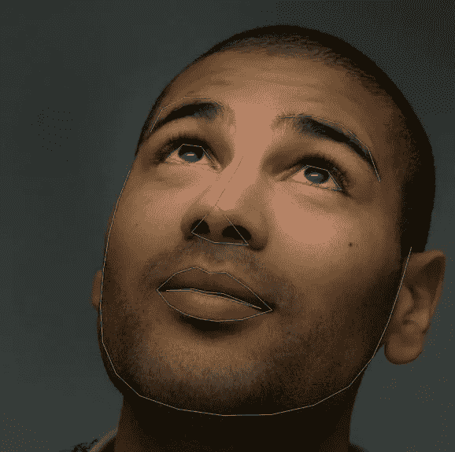
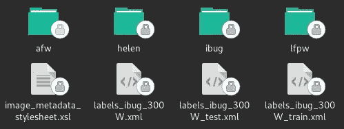
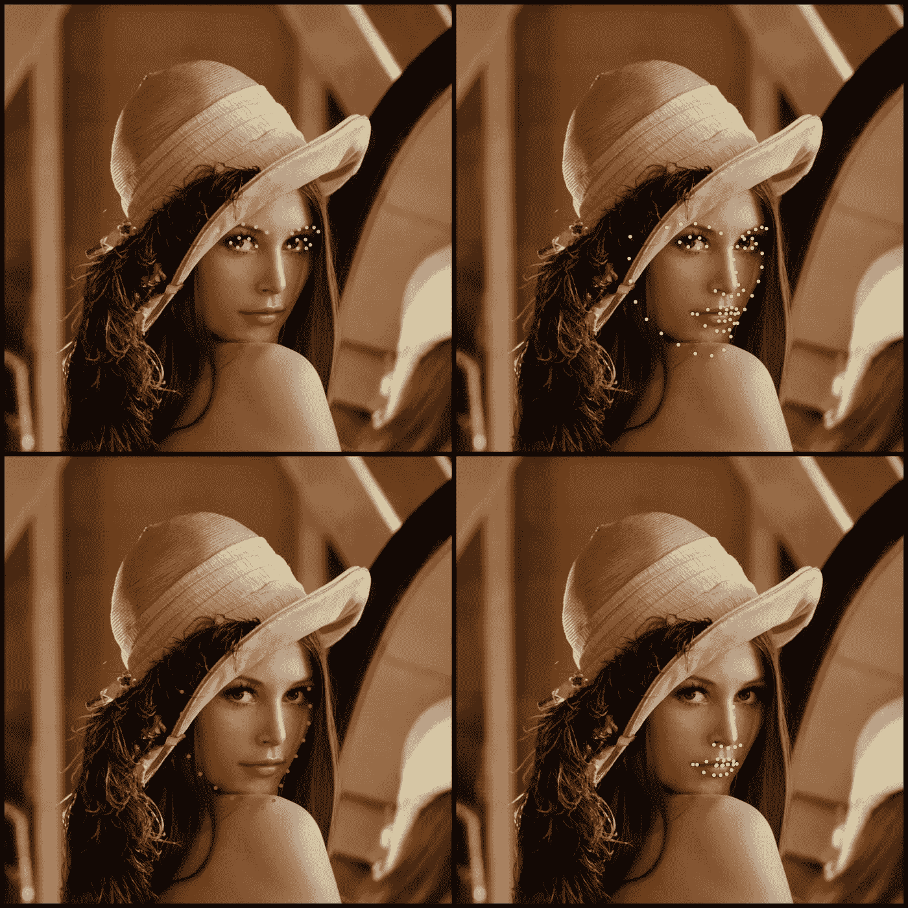

# 使用 Python 训练备选 Dlib 形状预测器模型

> 原文：<https://medium.datadriveninvestor.com/training-alternative-dlib-shape-predictor-models-using-python-d1d8f8bd9f5c?source=collection_archive---------0----------------------->

## 我们将讨论如何训练用于检测一组面部标志的替代模型(Dlib 提出的模型)。

Example of the 68 facial landmarks detected by the Dlib pre-trained shape predictor

Dlib 是一个非常著名和令人敬畏的机器学习库，用 C++编写，带有方便的 Python APIs。它实现了广泛的机器学习算法，可以在桌面和移动平台上使用。

# 人脸标志点定位

能够从给定的人脸图像外推一组关键点的过程称为*人脸标志点定位*(或人脸对齐)*。*

我们感兴趣的 ***界标*** (关键点)，是描述人脸形状属性的界标，如: ***眼睛*** ， ***眉毛*** ， ***鼻子*** ， ***嘴*** ，以及 ***下巴*** 。这些点对所分析的人脸结构给出了很好的见解，这对于广泛的应用非常有用，包括:****【人脸动画】******情感识别*******眨眼检测*****和****

***有许多方法能够检测这些点:其中一些方法通过分析从 2D 图像中提取的 3D 人脸模型来实现卓越的准确性和鲁棒性，其他方法依赖于 CNN(*卷积神经网络*或 RNNs ( *递归神经网络*)的能力，其余方法利用简单(但快速)的特征来估计点的位置。***

**Dlib 提供的*人脸地标检测*算法是[卡泽米和沙利文](https://www.cv-foundation.org/openaccess/content_cvpr_2014/html/Kazemi_One_Millisecond_Face_2014_CVPR_paper.html)于 2014 年提出的**回归树(ERT)** 集成的实现。该技术利用简单快速的特征(*像素亮度差*)来直接估计标志点位置。这些估计位置随后通过*级联回归器完成的迭代过程进行细化。*回归器根据先前的估计产生新的估计，试图在每次迭代中减少估计点的对齐误差。该算法速度极快，事实上，在给定的人脸上检测(对齐)一组 68 个标志大约需要 1-3 毫秒(在桌面平台上)。**

# **Dlib 预训练模型**

**Dlib 库的作者(Davis King)在 iBug 300-W 数据集上训练了两个形状预测器模型(此处可用[此处为](https://github.com/davisking/dlib-models)),这两个模型分别定位了人脸图像中的 68 个和 5 个标志点。**

****

**The set of 68-points detected by the pre-trained Dlib shape_predictor_68**

**在本文中，我们将只考虑`shape_predictor_68`模型(为简单起见，我们称之为 **SP68** )。**

**基本上，可以从一组图像、*注释*、**、*训练选项*中生成形状预测器。单个注释由**面部区域**和我们想要定位的**标记点**组成。**人脸区域**可以通过任何人脸检测算法(如 OpenCV HaarCascade、Dlib HOG Detector、CNN detectors 等)轻松获得，而这些点必须手动标记或通过现有的地标检测器和模型(如带 SP68 的 ERT)进行检测。最后，**训练选项**是一组定义训练模型特征的参数。这些参数可以被适当地微调，以便或多或少地获得所生成模型的期望行为:)****

**Dlib 训练过程的官方例子可以在[这里](http://dlib.net/train_shape_predictor_ex.cpp.html) (C++)和[这里](http://dlib.net/train_shape_predictor.py.html) (Python)找到。**

# **1.了解培训选项**

**模型的训练过程由一组参数控制。这些参数影响生成模型的**尺寸**、**精度**和**速度**。**

**Default shape predictor training options**

**最重要的参数是:**

*   **`**tree_depth**` : 指定每个层叠中使用的树的深度。该参数代表模型的**【容量】**。最佳值(就精度而言)是 **4** ，而不是值 **3** 是精度和模型尺寸之间的良好折衷。**
*   **`**nu**` : 是*正则化参数*。**它决定了模型泛化和学习模式的能力，而不是固定的数据。**接近 1 的值将强调固定数据而不是模式的学习，因此增加了**过拟合**发生的机会。相反，最佳 nu 值(例如 **0.1** ) 将使模型识别模式而不是固定情况，完全消除过拟合问题。训练样本的数量在这里可能是一个问题，事实上，在较低的 nu 值下，模型需要大量(数千个)训练样本才能表现良好。**
*   **`**cascade_depth**`:用于训练模型的级联数。该参数影响模型的**尺寸**和**精度**。一个好的值大约是 **10-12** ，而 **15** 的值是最大精度和合理模型尺寸的完美平衡。**
*   **`**feature_pool_size**`:表示在每个级联中用于生成随机树特征的像素数。更大的像素数量将导致算法更健壮和更精确，但是执行更慢。 **400** 的值实现了很高的精度和良好的运行速度。相反，如果速度不成问题，将参数值设置为 **800** (甚至 1000)会导致更高的精度。有趣的是，在 **100** 和 **150** 之间的值仍然可以获得相当好的精度，但运行速度令人印象深刻。最后一个值特别适合移动和嵌入式设备应用。**
*   **`**num_test_splits**`:每个节点采样的分割特征数。该参数负责在训练过程中选择每个级联的最佳特征。该参数影响**训练速度**和**模型精度**。该参数的默认值为 20。这个参数非常有用，例如，当我们希望训练一个具有良好精度的模型并保持其较小的尺寸时。这可以通过增加`num_split_test`到 **100** 或者甚至 **300** 的数量来实现，以便增加模型精度而不是其尺寸。**
*   **`**oversampling_amount**` : 指定应用于训练样本的随机选择的变形数量。对训练图像应用随机变形是有效增加训练数据集大小的简单技术。只有在小数据集的情况下才需要将参数值增加到 **20** 甚至 **40** ，这也会大大增加训练时间(因此要小心)。在 Dlib 库的最新版本中，有一个新的训练参数:**过采样抖动量**，它对给定的边界框应用一些平移变形，以便使模型对最终错位的人脸区域更加鲁棒。**

# **2.获取数据**

**为了复制 Dlib 结果，我们必须利用 **iBug 300W 数据集**内的图像和注释(此处[可用](http://dlib.net/files/data/ibug_300W_large_face_landmark_dataset.tar.gz)，文件大小约为 **1.7 Gb** )。数据集由四个主要数据集组合而成: **afw** 、 **helen** 、 **ibug** 和 **lfpw** 。**

****

**Files and folders inside the dataset**

**我们需要*训练*和*测试*的文件(注释)模型是:`labels_ibug_300W_train.xml`和`labels_ibug_300W_test.xml`。**

> **在开始编码之前，记得将脚本放在数据集的同一个目录中！**

# **3.训练模型**

**假设我们对训练一个模型感兴趣，该模型能够仅定位左眼和右眼的界标。为此，我们必须通过仅选择相关点来编辑 iBug 训练注释:**

**Editing an xml file by selecting only the desired parts (landmarks)**

**这可以通过调用`slice_xml()`函数来完成，该函数创建一个新的 xml 文件，其中只包含选定的地标。**

**设定好训练参数后，我们终于可以训练我们的**眼模**了。**

**当训练完成后，我们可以通过调用`measure_model_error()`函数轻松评估模型精度。**

# **结论**

**通过适当地微调培训选项，以满足我们正在开发的系统的约束的方式定制培训过程是可能的。**

**这样的约束可以是关于**执行速度**、**内存**和**存储消耗、**和**总体精度**和**健壮性**。这是我们正在开发的平台的特征(桌面、移动和嵌入式——一般来说，不同的平台有不同的质量要求)。**

**此外，通过仅选择相关界标，可以创建定位特定界标子集的特定模型，从而消除不必要的点。**

****

**Example of alternative shape predictors. The model in the first quarter, detects the eyes and eyebrows. The model on its left, localize the entire set of landmarks with a faster execution speed and a reduced size (compared to SP68). The last two models detect respectively: the face contour, nose and mouth.**

**总之，我已经训练了一些模型(如上图所示)来定位一组特定的点。该型号可在[本次回购](https://github.com/Luca96/dlib-minified-models/tree/master/face_landmarks)中取回。此外，我还开发了一个 Android 应用程序，在持续检测过程中显示这些模型的功能(此处[可用](https://github.com/Luca96/android-face-landmarks))。**

**如果你想知道如何将 Dlib 嵌入到你 Android 应用中，你可以阅读这篇文章。**

**我希望你觉得这篇文章有用而且有趣。**

****【新】**98-地标模型在 [WLFW](https://wywu.github.io/projects/LAB/WFLW.html) 上预训，此处[可用](https://github.com/Luca96/dlib-minified-models/tree/master/face_landmarks/wflw)。**