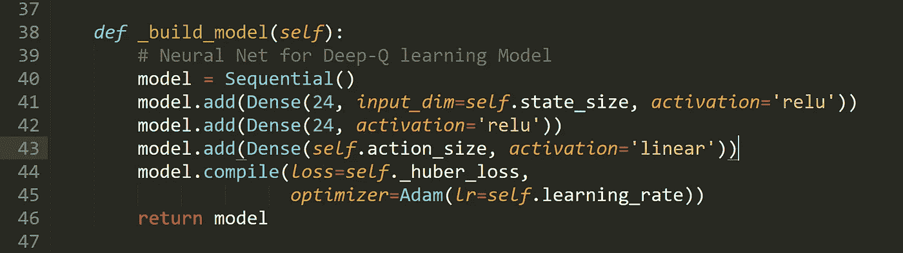
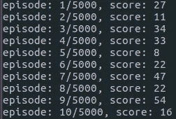
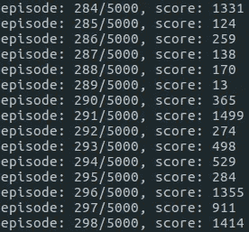
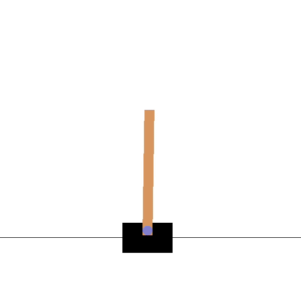

# 训练人工智能玩 OpenAI 的翻筋斗

> 原文：<https://medium.datadriveninvestor.com/training-an-ai-to-play-openais-cartpole-395e17db847f?source=collection_archive---------7----------------------->

Photo by [Robert Bye](https://unsplash.com/@robertbye?utm_source=medium&utm_medium=referral) on [Unsplash](https://unsplash.com?utm_source=medium&utm_medium=referral)

你第一次学会骑自行车是极不可能的。和其他人一样，你也经历了一个过程。有些人可能称之为“T1”的学习过程。第一次的时候，你不停的尝试，摔，哭，笑，然后突然你就没手骑自行车了！这种学习方法被称为试错法。事实上，机器可以像人类一样通过使用强化学习来学习。

**强化学习**是一种机器学习，让你把一个人工智能代理放到任何环境中，并对它进行编程，使它能够自己从环境中学习。每一个动作之后，人工智能都会收到反馈。反馈包括奖励和环境的下一个状态。RL 算法中的代理人受到激励，对不好的行为进行惩罚，对好的行为进行奖励。

# **翻筋斗**

Carpole 是 OpenAI 庞大游戏集合中较为简单的环境之一。

正如你从上面的动画中看到的，Cartpole 的目标是平衡连接到底部移动平板的连接处的杆子。由于平板只能向左或向右两个方向移动，代理可以通过执行一系列 0 或 1 来移动零件，从而推动汽车向任一方向移动。

# **马尔可夫链**

为了理解马尔可夫链，我们需要理解马尔可夫模型。马尔可夫模型要求人们需要考虑他们的当前状态和你选择执行的动作来预测你的未来状态。马尔可夫模型的关键是，你不需要考虑你以前的状态。

Markov Chain

我们开始的初始环境只包括一个状态(S_t)。然后，对于每次迭代，代理获取当前状态(S_t)，选择最佳动作(A_t)，并在环境上执行它。之后，环境为执行的动作和新状态(S_t+1)返回一个奖励(R_t+1)。横竿游戏实际上是建立在马尔可夫链上的。

# **使用简单的神经网络**

Simple Neural Network

如果您不知道什么是神经网络，在这个特定的项目中，神经网络用于从输入和输出数据中学习成对的示例，检测不同类型的问题，并基于看不见的数据预测结果。

我使用的神经网络实际上与上图不同，因为它在输出层使用了两个节点，0 和 1，它们是用于游戏的。我使用了一个从四个节点接收信息的输入层，还使用了三个隐藏层。

下面的代码包括空神经网络模型的代码:

# **实施 DQN**

通常在游戏中，**奖励**通常指游戏的整体得分。假设杆子向右倾斜，向右移动石板的回报更高，因为这会使杆子存活更长时间，从而导致更高的分数。

为了从逻辑上证明这个函数，我们需要把它表达成一个可以优化的公式。损失是预测与实际目标之间的距离值。例如，如果模型预测杆子应该更向右移动，但如果在现实中，如果它向左移动会有更大的回报，那么模型会处理损失。我们想尽量缩小预测和损失之间的差距。我们将损失函数定义如下:

*A mathematical representation of Q-learning from Taehoon Kim’s* [*slides*](https://www.slideshare.net/carpedm20/ai-67616630)

我们首先有一个动作 *a，*观察奖励 *r* 以及由此产生的新状态， *s* 。基于这个结果，我们计算出最大目标 Q，然后去掉它，这样未来的回报就比现在的回报要少。随后，我们将当前奖励与贴现的未来奖励相加，得到目标值。从目标值中减去目标预测值将得到我们的损失。最重要的是，如果我们将所有这些平方，我们将能够更多地惩罚大的损失价值，并将负值视为正值。

本质上，Q-Learning 是一种寻找最优策略的方法。通过反复试验，你可以为每个状态-动作对找到一个 Q 值。这个 Q 值表示在当前状态下动作的可取性。

# **结果**

当程序第一次运行时，代理正在探索它的选项和操作:

代理经历多个学习阶段，包括平衡极点、出界和控制极点。这将是当一个人第一次尝试骑自行车，摔倒，并发现技术。

在数百集之后，我们开始看到代理开始学习不同的控件以及如何实际玩游戏。这是一个人学习如何骑自行车，了解自行车实际上是如何工作的，以及不同的技术。

我用于这个项目的代码可以在我的 [GitHub](https://github.com/NoumaanKaleem/cartpole_ddqn) 页面上找到，那里也有我的许多其他很酷的项目。

最后的结果是这样的！！！

# **参考文献**

*   [揭秘深度强化学习](https://www.intel.ai/demystifying-deep-reinforcement-learning/)
*   [用深度强化学习玩雅达利](https://arxiv.org/abs/1312.5602)
*   [通过 RLCode 的强化学习示例](https://github.com/rlcode/reinforcement-learning)
*   [通过深度强化学习的人类级控制](http://home.uchicago.edu/~arij/journalclub/papers/2015_Mnih_et_al.pdf)

还有对 Keon 的博客大呼一声，它帮了我这么大的忙！

一定要在 [linkedin](https://www.linkedin.com/in/noumaan-kaleem-a13948159/) 上加我！

给这篇文章一些掌声！

并分享给朋友:)