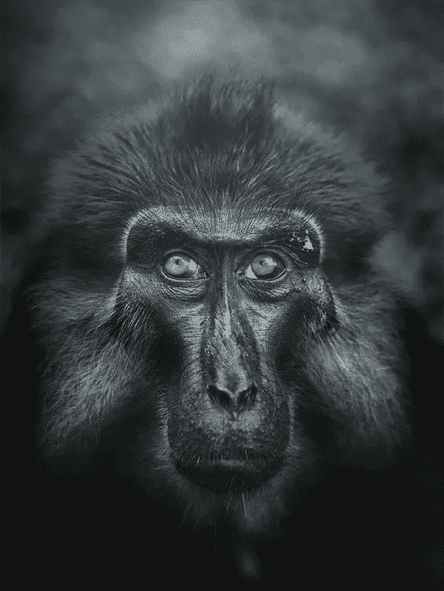

# 超越

> 原文：<https://medium.datadriveninvestor.com/transcendence-2476359fe858?source=collection_archive---------12----------------------->

## 我们会像猴子对我们一样凝视人工智能的眼睛吗？

**Gaze by Ade Santora**

Yuval Noah Harari 在他的书《智人:人类简史》中提供了关于人类如何开始向自然界食物链的最高级移动的见解。我们既不是这个星球上最强壮的物种，也不是最有天赋的物种，尽管没有一种生物比我们更有能力在自己的物种群体中想象和分享这种想象的现实。相信没有特定意义或客观性的事物是人类的一种真正能力，这种能力有助于他们团结起来，朝着一个特定的目标前进，而这个目标本身可能是一个富有想象力的主观现实。要理解这种认知能力的重要性，一个非常好的方法就是和人工智能聊天。我经常花时间和在线人工智能聊天服务交谈，以了解他们的智能水平。

在电影《超越》中，我最喜欢的一段对话是摩根·弗里曼问人工智能是否能证明它有自我意识。回应是“你能证明你是吗？”我们能够证明我们有自我意识吗？我们与动物的区别在于我们的想象能力。但这也是我们与机器的区别吗？在我与不同的人工智能聊天服务交谈的个人经历中，我注意到当前的人工智能算法似乎没有想象力，也在撒谎。

 [## 人工智能与创造力:梦想成真——数据驱动的投资者

### 人工智能总是让我着迷。不仅作为一套有用的工具，不断发展，而且作为一个…

www.datadriveninvestor.com](https://www.datadriveninvestor.com/2019/01/28/ai-creativity-deep-dream-comes-true/) 

作为对我描述自己的请求的回应，机器不能错误地想象自己的人类物理属性，例如，将自己描述为具有特定头发颜色或长度的女性或男性，等等。同样，当我要求他们对我进行富有想象力的描述时，他们也做不到，而任何人都可以对任何生物或非生物进行富有想象力的描述。你可以把一本书想象成一位睿智的老人，或者把你的枕头想象成一位慈祥的母亲，像拥抱她的孩子一样拥抱你的头！所以看起来我们和动物的主要区别也是我们和机器的主要区别；我们想象和创造想象现实的能力！

人工智能和机器学习最近的发展非常非凡。创造像人脑一样运作的人工大脑，如麻省理工学院的思维机器项目，该项目致力于超越机器，从人工智能到人工意识，是人类努力创造智能流动新媒介的一个例子。贯穿生命历史的智慧总是从一种媒介转换到另一种媒介。任何物种心智能力的每一次自然发展都给予他们更多进入这种智慧流的途径，并为智慧流创造了一个媒介。换句话说，我认为智能是一种半独立的存在。它是由生物创造的，同时它也引导它们向更高的存在发展。我们是探索智慧还是创造智慧？我们不知道！我们所知道的是，当我们看着猴子的眼睛时，我们正在看着一个曾经是智力流动的血管的媒介。

在故意拒绝让机器拥有我们非凡的想象力和创造想象的现实方面，我们有选择吗？帮助人工智能超越在伦理上是否正确？拒绝那样做不是不道德吗？会不会有一天，机器会像我们现在看猴子的眼睛一样看着我们的眼睛？

这些是我们没有答案的关键问题。我认为我们没有选择，就像猴子没有选择一样。智慧找到了超越到更好媒介的方式。我唯一的希望是，这些未来的生物，会比我们与其他生物和环境相处得更好。我希望他们比我们人类对这个星球更有责任感。我希望他们比我们更有灵性，更有洞察力。难道“**希望**不是另一个分享我们创造的想象现实的人吗？