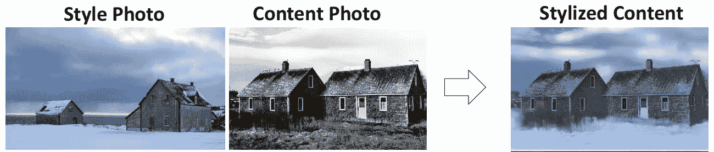
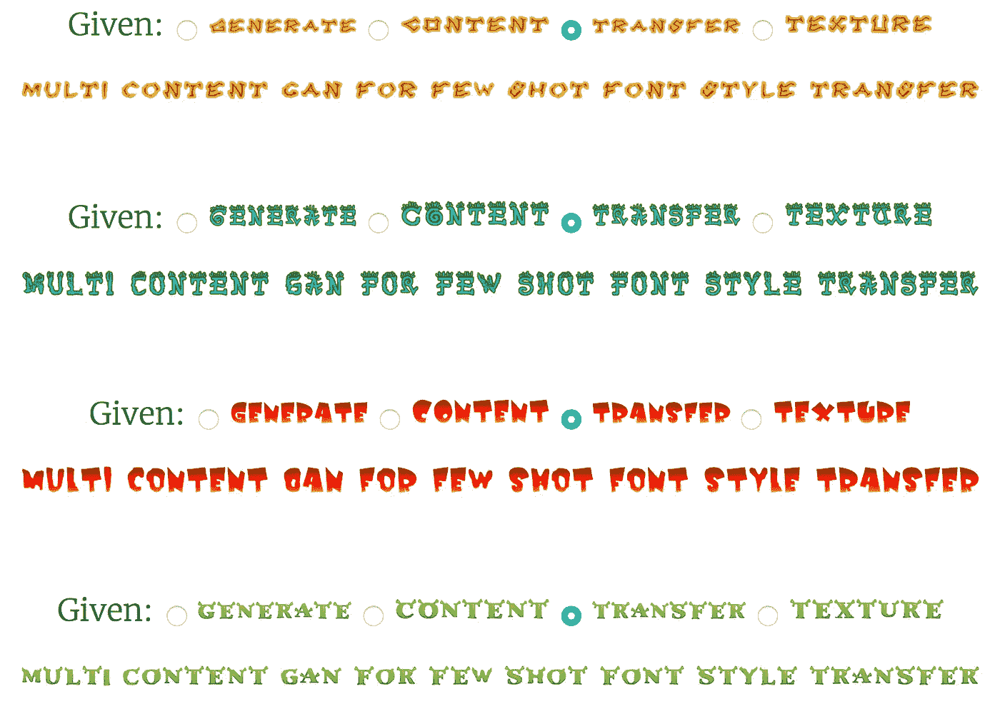

# 通过深度学习转移字体“样式”

> 原文：<https://medium.datadriveninvestor.com/transferring-font-style-via-deep-learning-3035823237a8?source=collection_archive---------0----------------------->

在将一张照片的“风格”转换成另一张照片的过程中，已经做了相当多的工作(比如，“*让小屋看起来像是在隆冬*”，如下图所示)

事实证明，为照片这样做是很多的(*很多！*)比做字体简单。原来设计字体是很难的，坦白地说，有点难。因此，当你想出一个特定的字体，比如说，一个电影海报，或一个标志，或任何东西，你通常只是为手边的特定用途设计字形。所以，如果你的图像中有文本" **PLUGH** "，那么你就把字母" **P** "、" **L** "、" **U** "、" **G** "和" **H** "放在一起，调整间距、颜色等等。你就完了。你不需要担心字母表中的其他字母，大小写，数字，符号等等。

太棒了，有人过来想要创建一个上面有文本“ **XYZZY** ”的图像，用同样的字体。(记住，这个人可能就是你！).旧的学校方式将是劳动密集型的——你只是从零开始。

在[的一篇新论文](https://arxiv.org/pdf/1712.00516.pdf)中，阿扎迪等人展示了如何利用深度学习来实现这一点。特别是，他们创建了一个条件生成对抗网络(cGAN)来为你做这件事。这是一个堆叠式架构，由两部分组成

1.  *GlyphNet* ，它从样本字体中学习，为您想要生成的文本创建粗略的字形形状，以及
2.  *或*微调 *GlyphNet* 创建的字体的颜色、样式和装饰

结果如下所示。给定一个单词(*传输*，cGAN 生成整个句子(*多内容 GAN 用于少量字体样式传输*)。不错吧，嗯？

/via [https://goo.gl/4PcAAc](https://goo.gl/4PcAAc)

请注意，这还不完美—它不太能够(非常！)印刷/出版、大字体等往往需要的高字体分辨率。也就是说，*是*一个非常通用的解决方案(谁知道甘斯能做到这一点！？！)用于类似少量学习的情况，即需要从几个有限的样本中生成复杂内容的情况。正如作者所说，例如“*修改特定的人脸(风格)以具有特定的表情(内容)，表情符号等形状的一致风格化，或将材料转移到衣服或家具等一致的对象集。*

()"[多内容甘为少镜头字体风格传递](https://arxiv.org/pdf/1712.00516.pdf)"——阿扎迪等人，代码可在[这里](https://github.com/azadis/MC-GAN)获得。

*(* [*这篇文章也出现在我的博客上*](http://dieswaytoofast.blogspot.com/2018/03/transferring-font-style-via-deep.html) *)*