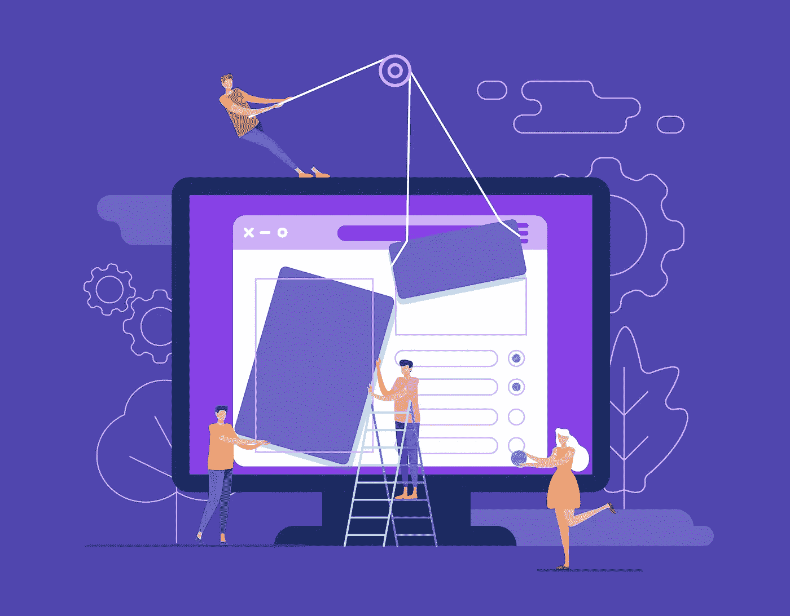

# 借助 3D 网站转变您的业务

> 原文：<https://medium.datadriveninvestor.com/transform-your-business-with-the-help-of-a-3d-website-eb10e2c0941?source=collection_archive---------25----------------------->

大多数人都听说过 3D 电视，你戴上特殊的眼镜，图像就会从电视跳到你的客厅。现在，想象一下在 3D 模式下浏览网页。如果您想知道这是如何实现的，或许更重要的是，它能为您的业务带来什么，让我们仔细看看。

# 什么是 3D 网站？

目前，当你打开一个网页时，你看到的基本上是一个平面，上面有文字和图片。现在想象一下，你可以跳进你正在浏览的网页，体验 3D 的一切。例如，假设你想买一个新的手提包。你访问商家的网站，它会把你带到虚拟展厅。有了 3D 网站，你就可以走进展厅，四处走动，看看所有的手袋，就像在现实生活中的展厅一样。你将能够打开手提包，看到所有不同的隔间，确保它与你最喜欢的衣服相匹配，确定它是否能处理你的日常事务等等。

更好的是，这种[商业网站开发](https://skywell.software/web-development/)技术也将是移动的。据《华尔街日报》报道，亚马逊目前正在开发生产 3D 屏幕的技术。

# 如何制作一个 3D 网站

创建 3D 网页有三种方式:

*   自包含 HTML 文件
*   一个 web 播放器和 JSON
*   交互式 3D 网络应用

然而，一切都取决于你将如何使用你的网站。如果你计划展示一个 3D 模型，访问者可以从任何角度观看，像这样的技术是在 WebGL 中开发的，内容可以像普通的 YouTube 视频一样处理。如果你想为你的访问者提供 3D 场景，比如虚拟旅游和产品展示，事情会变得有点复杂。最大的复杂性不是对开发者，而是对观众，因为它要求用户下载一个插件，而大多数用户不愿意这样做。

如果您计划使用 JavaScript 进行 3D 网页设计，我们建议您使用以下库:

*   三. js
*   巴比伦. js
*   Cannon.js

你会惊喜地发现现代 JavaScript 的强大，尤其是在 WebGL 和 SVG/Canvas 元素的支持下。

# 实际应用

上面提到的所有技术都将从根本上改变我们看待网站的方式。实际应用是无止境的。除了上面提到的购物和 3D 旅游，还有商务会议和最终的工作方式。如今，如果有人不能参加会议，他们能做的最好的事情就是用 Skype 打电话。3D 网络将允许每个参与者。虚拟出席会议，在大楼的大厅里走动，参与项目，就好像每个人都在办公室里一样。

基于目前 3D 网络浏览器的原型，它们不仅将在不久的将来提供给消费者，而且将改变从网页设计到用户交互的一切。从商业角度来看，它将提高员工的生产力和协作，并通过给潜在客户带来难忘的体验来帮助推动销售。即使在今天的技术时代，消费者对网上购物也很谨慎，即使是从业内最值得信赖的公司购买。究其原因，与其说是他们害怕骗局或赔钱，不如说是他们害怕在判断上犯下哪怕是很小的错误，以及处理退货的麻烦。他们明白他们会拿回他们的钱和所有东西，但将物品重新包装在盒子里，开车去邮局，等待你的钱被退回，这仍然是一个麻烦。有些东西，比如衣服和鞋子，即使有标准的尺码表，也几乎不可能猜对尺码。3D 网站将消除购买者的懊悔，并促使顾客回到你的网站。

*最初发表于*[*sky well . software*](https://skywell.software/blog/transform-your-business-with-the-help-of-a-3d-website/)*。*