# 转变金融体验

> 原文：<https://medium.datadriveninvestor.com/transforming-financial-experience-f51a5d9795b0?source=collection_archive---------6----------------------->

**UX 战略&开放银行业务的架构**

# 战略联盟

## 开放银行业务概述

开放银行业务是一项**战略转变**，它打开了银行市场，并提供银行客户期望从现代银行业务中获得的服务和功能，包括即时交易、增强的安全性、简化的启动、预测、个性化以及通过单一服务访问多个账户。开放银行在欧洲是最先进的，因为 PSD2 带来了 API 规范的标准化。这使得银行走上了从私有封闭 API 到公共开放 API 的道路，并允许它们成为 **API 经济**的功能元素。在美国，市场力量推动着开放的银行业，而快速发展的全球金融科技公司和转型的欧盟竞争对手带来了竞争压力。

# 需要 UX 优化

为了在这种新的环境中蓬勃发展，金融平台需要重新调整其 UX 和设计愿景，使组织和客户能够从合作生态系统中的创新和共享价值中互惠互利。这是推动创新采用的业务目标和技术发生更深层次转变的基础，包括预测和自动化解决方案。我们将着眼于跨多个项目、概念和协作洞察的成功方法，这些方法可识别所有接触点的用户目标和痛点，综合、优先排序并快速实施以客户为中心的解决方案，在所有市场中保持适应性和一致性。有关优化流程的详细回顾[，请参见本案例研究](https://wademoss.com/index.php/portfolio/venture-2/)。

# 不断变化的全球竞争格局

**客户期望的变化影响了消费者的信任。** B2B 客户体验研究证实，包括投资银行在内的许多 B2B 公司面临着客户更高的期望。本次调查的受访者中:

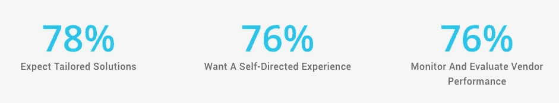

他们期望无摩擦、直观的解决方案，跨渠道的一致服务水平，以及解决方案提供商超越并保持他们的业务。近年来全球固定收益电子交易的兴起反映了这一趋势。虽然它的增长可以归因于监管的变化，但固定收益交易商正在为投资者提供一个高效、无摩擦的过程。

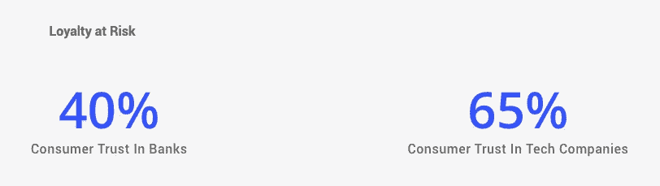

顾客的忠诚度也岌岌可危。银行面临着越来越多的新竞争对手。从长期来看，支付宝、亚马逊现金、Facebook Messenger P2P、微信和其他擅长客户便利和体验的服务公司的进入可能会使传统银行脱离客户关系，降低银行的分销利润。另一个方面是，金融服务以外的公司开始为银行业的客户体验设定基准。数字零售商和电子商务企业的客户满意度排名很高，而银行排在中下水平。

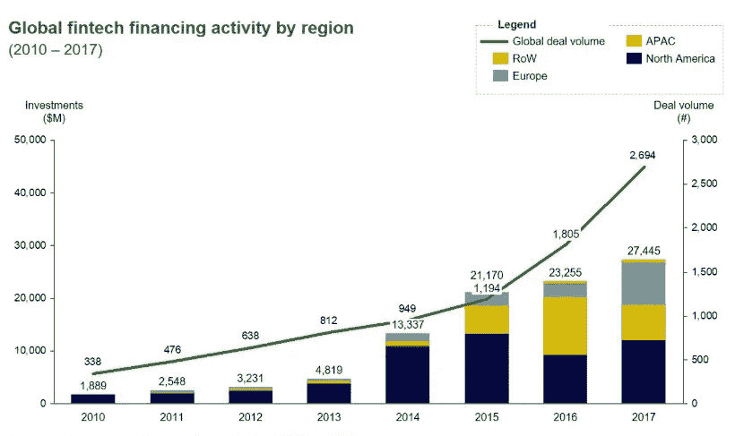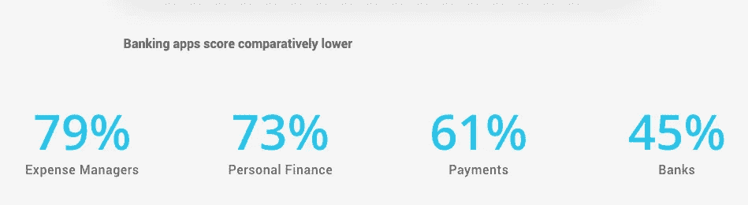

**如今，客户忠诚度和信任度是由数字渠道体验驱动的。**由于对金融机构缺乏信任，千禧一代越来越倾向于积极寻找其他银行业务。他们期望获得与苹果、优步或亚马逊服务同等水平的创新和便利。

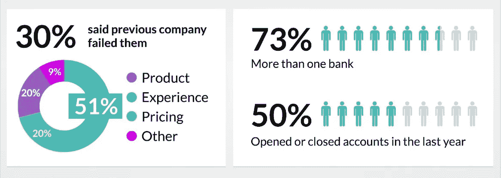

# 银行业 UX 挑战赛

# 当今天的服务标准是超流体时，投资银行如何满足客户的期望？

企业对消费者(B2C)的体验是围绕直观的自助服务和无摩擦的交互构建的，这也塑造了企业对企业(B2B)领域的客户期望。随着投资银行转变其服务和产品，他们面临着在新的 API 经济中满足不断变化的客户期望的挑战，这种经济消除了他们过去所依赖的许多竞争优势。

**寻找 UX 方案**

在 [M-One Studio](https://m-onestudio.com/sc) daily，多个行业案例证实，实施强大的用户体验战略和架构将使银行在协作创新和共享价值的新世界中走向成功。

客户看重什么:

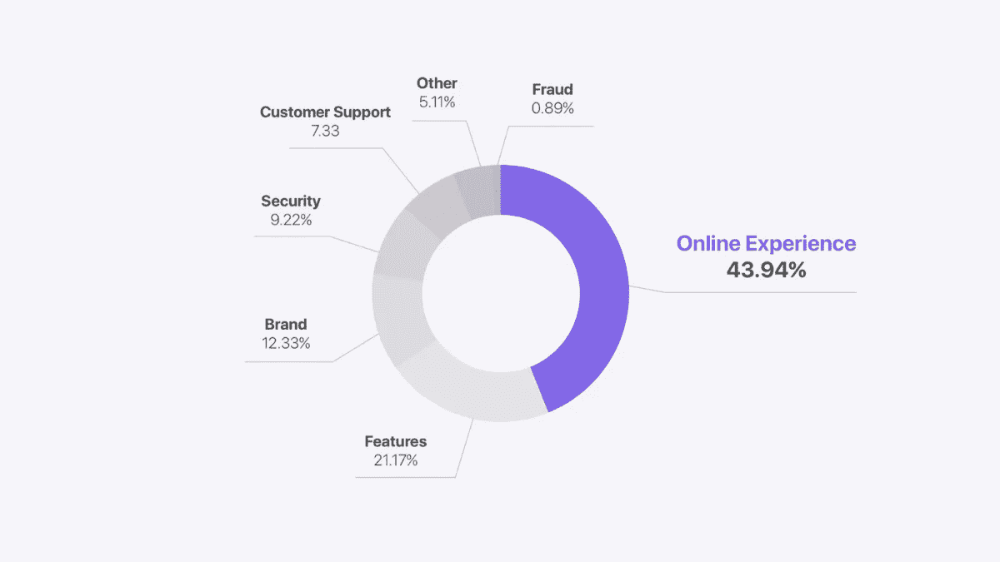

# 以客户为中心棱镜

# 掌握基本知识

UX 变换的一个常见谬误是不顾用户的直接需求而追求深刻的影响。在许多情况下，这可能会脱离客户并破坏转型，从而危及其长期目标。

我们生活在一个移动优先的世界，90%的 35 岁以下的人不再使用电脑。然而，大多数银行仍然缺乏开设银行账户、再融资或简单的移动交易等功能。银行需要优先了解移动平台及其用户的行为。对许多人来说，银行应用太重要了，不能半堆着开发。

# 用户研究

用户研究是银行业 UX 转型的关键基础，因为它通过实现以下设计活动来解决真实的人的问题:

*   构建人物角色和行为细分
*   识别现有产品和服务中的难点
*   定义用户目标并确定其优先级
*   利用整体旅程地图分析和优化用户旅程

## 解决方法

基于用户研究的数据驱动方法将使银行能够:

*   综合、优化并快速实施 UX 解决方案，以实现持续的可持续影响。
*   提供上下文故障安全架构和设计，同时在防止攻击和利用的安全限制内工作。

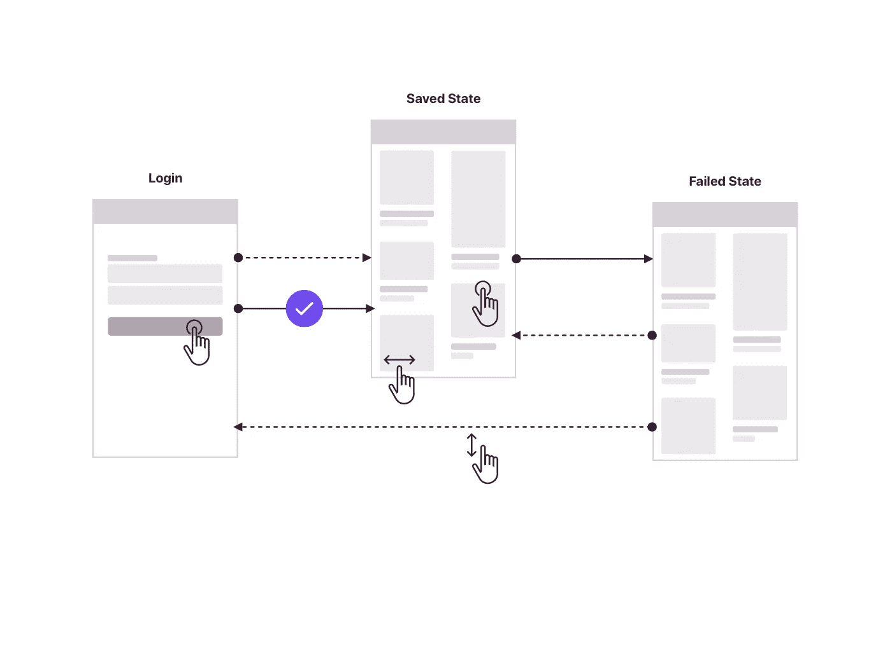

# 总而言之

银行业的 UX 转型意味着:使用设计思维产生协作见解，并与客户、设计、技术和数据利益相关方合作，以确定所有接触点的用户目标和痛点，综合、优先排序并快速实施优化的 UX 解决方案，在所有产品中自适应和一致地实现更高水平的以客户为中心。

## 订婚悖论

使用分析的深度和广度显示，70%的数字银行客户仅使用 2 到 4 种主要银行产品，专注于一小部分功能，忽视或没有意识到其他产品的价值。这种行为有几个原因:过度分割、中介和过度拟合。

**过度分割**
过度分割是由作用于用户数据中的尖峰引起的。从短期来看，这似乎是有益的，但是，简单的统计分析可以证明，这种方法是不可持续的，可能会导致孤岛，容易受到全方位服务多渠道竞争的影响。

**过度适应**
同样，专注于今天将 KPI 带回家的一小部分功能，可能会导致客户对未开发功能和产品的价值越来越不感兴趣

**中介**
特别是投资经理可能会脱离产品和服务，并通过中层经理或分析师行事，从而难以提供多层次的参与。

解决方案包括拆除尽可能多的设计、技术、数据和社会学孤岛，关注动态多层行为细分，增加使用的广度和深度，同时注意简单性和上下文架构。

有时优化投资产品 UX 意味着通过允许用户更快地实现他们的目标来最小化参与度。这通常被称为参与悖论。这同时创造了挑战和机遇，通过定制和预测技术的集成解决了这一矛盾。例如，为投资组合经理注入上下文分析和添加“微观彭博经验”可以扩大和深化参与度，同时支持他们的主要目标。构建智能工作流极具挑战性，随着人工智能黑盒因素的增加，通过减少步骤/任务比率和学习时间来优化认知负载分布变得势在必行。阅读[案例研究](https://wademoss.com/index.php/portfolio/aiuxn/)中关于认知 UX 优化的更多信息。

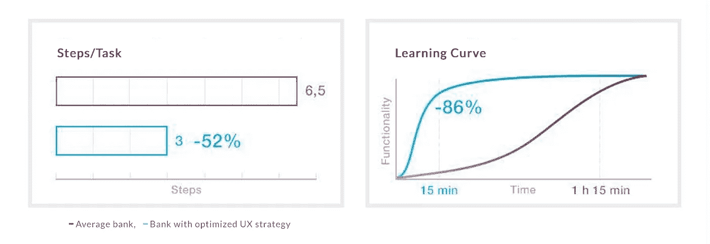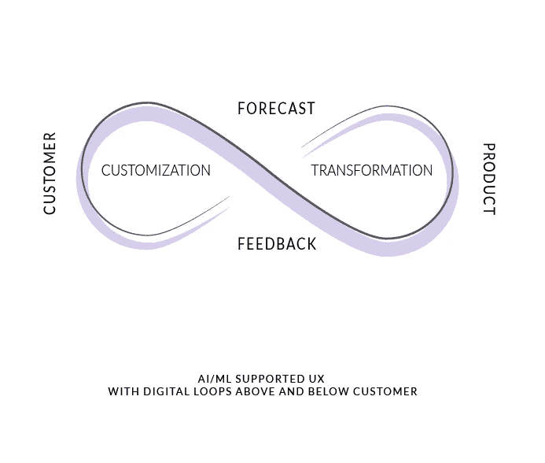

无论是在智能新闻馈送还是定制投资组合构成以及预测现金流和投资层的层面，AI/ML 技术都正在成为金融领域 UX 转型的驱动因素之一，许多组织都在客户上下实施数字循环。

## 设计

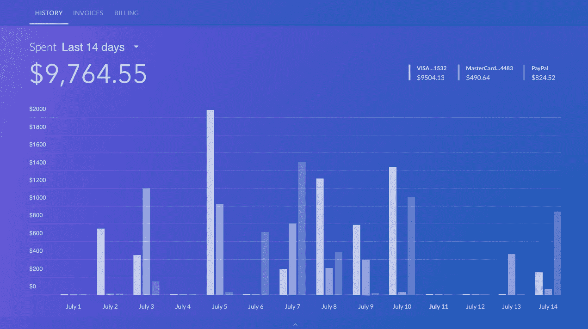

以客户为中心的设计是投资和银行业变革的焦点。他们在个人和 B2B 层面实施预测现金流和投资组合服务、风险和绩效管理定制，以及充分满足不断变化的客户需求和提供满足并超越预期的体验所需的其他功能。

## 获得竞争优势

通过实施优化的 UX 战略和架构，并减少过度细分，银行和其他金融服务能够更好地应对开放 API 经济中不断增长的全球金融科技带来的聚合威胁。

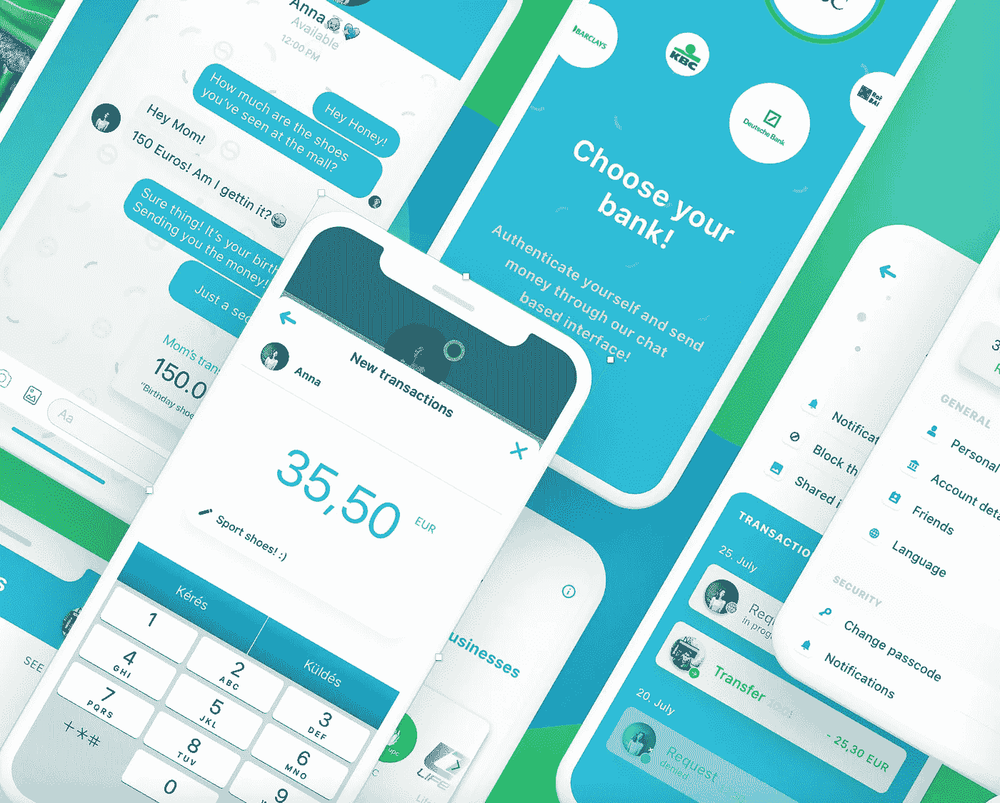

通过交付具有有意义的微上下文(阅读:**维度和运动感知**)工作流的原生多模态解决方案和应用，银行将满足当前的体验期望，并使用敏捷迭代构建可持续的**协作生态系统**，增加共享价值并赢得客户的信任和忠诚度。

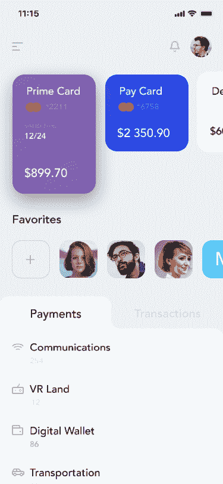

了解并解决不断变化的人们的需求和当今的社会技术标准，为开发持续的、经得起未来考验的全渠道金融体验奠定了坚实的 **UX 基础**。

# 结果

提供跨产品和市场的持续可持续体验有助于增强信任和忠诚度，从而提高使用率和采用率:这是金融服务在高度流动的市场中取得成功的关键要素。

这就是为什么通过创新实现高质量体验也意味着创新成功指标本身。按照微软 CEO 塞特亚·纳德拉的说法:*“收入是一个滞后指标……使用率是一个领先指标”。*

在这方面，核心(快乐、参与度、采用保持率、任务成功)框架有助于保持产品健康，而将 KPI 直接插入 UX 战略可确保收入会随着使用情况而增加。

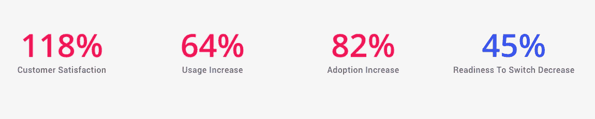