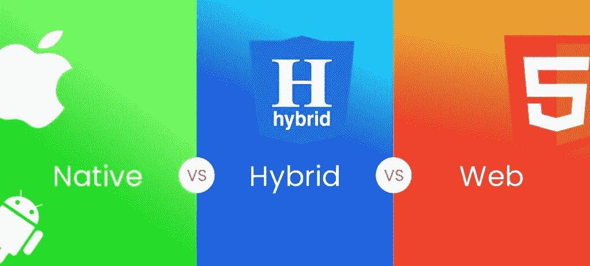
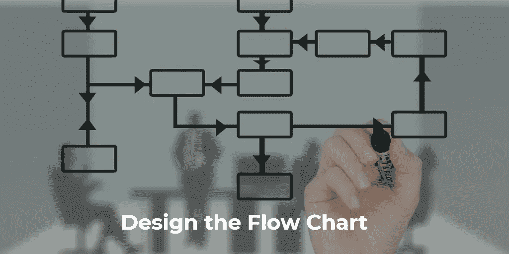
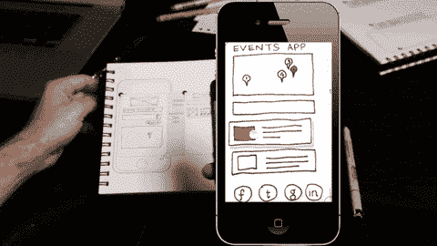
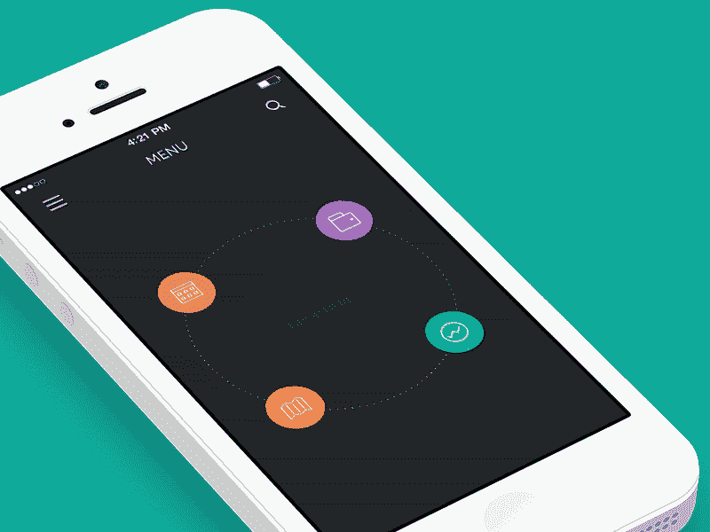
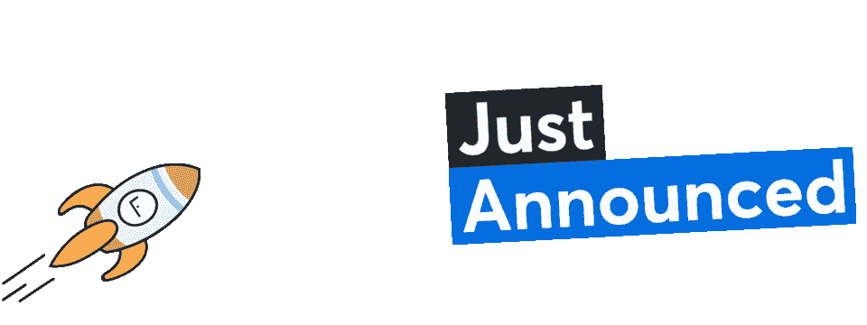

# 将您的应用理念转化为现实

> 原文：<https://medium.datadriveninvestor.com/transforming-your-app-idea-into-reality-2140934fb8e?source=collection_archive---------3----------------------->

每一个成功的申请都曾经是一个*想法*！

有这么多的想法准备改变世界！

人们忘记了，想法不足以发展成货币业务。当然不是靠他们自己。他们需要被处决。

 [## 2019 年移动应用开发之路|数据驱动的投资者

### 任何在移动应用程序开发行业工作的人，无论他们是专注于在伦敦开发 iOS 应用程序还是…

www.datadriveninvestor.com](https://www.datadriveninvestor.com/2019/01/15/the-path-of-mobile-app-development-in-2019/) 

如果你不知道从哪里开始&你不知道编程，那么你在正确的页面！

与其直接搜索**“如何将你的想法转化为移动应用”**不如浏览这个博客，我非常确定你会获得足够的知识和如何开始的流程！

在这里，我们提出的行动计划将启动你的思想之轮！

## 我有一个应用程序的想法！我现在该怎么办？

干杯！你对即将到来的最佳应用程序有一个惊人的想法，现在怎么办？

在投入时间、金钱和精力之前，你首先需要考虑的是**创建和发布一个应用**需要什么！

你应该意识到 [**手机 App 开发**](https://www.kunshtech.com/services/mobile-app-development/) 的风险！这不仅仅是关于尝试你的创造力，更是向你的事业迈进了一步，这有两种可能性。风险&回报*能改变你的人生*！

## 让我们开始吧！

我们为那些希望从零开始创建一个没有编程经验的应用程序的人提供了最好的技巧。

为了**将你的应用变成现实**你有两个*选择！*

*   雇佣一个移动应用开发者——把它外包出去！*(不要低估你的口径)*
*   学& *自己动手*！谷歌有所有的东西！*(尝试&尝试直到你赢)*

让我们接受挑战，不断尝试，直到成功！让我们在后台保留另一个选项。

我的好建议——“知道你在做什么。”！！

然而，知道还不够。正如阿尔伯特·爱因斯坦所说，“任何傻瓜都能知道。重点是*了解*。”

从以下几点开始，我相信在这篇博客结束时，你会获得很多知识！

# 研究

***第一个应该打到你头上的问题*****——“市场上已经有类似的 App 了吗？”**

在您继续前进之前，请查看由**移动应用程序开发机构开发的现有市场。**

如果有人已经做了和你类似的事情，不要沮丧！有许多应用程序，做同样类型的事情。只要你的应用是独一无二的，有很好的品质，你的用户肯定会喜欢它！

研究不是为了发现你的想法的独特性，而是为了得到一个教训，什么是最好的，什么是不可行的！

如果应用程序是相似且成功的，问自己以下问题:-

1.如何让你的应用做得更好？

2.你的竞争对手缺什么？

3.你能向市场提供什么？

***第二个问题*** 是**“你的目标受众是谁？”**

有不同的方法来确定你的目标受众。四种最受欢迎的方法是:

*   受众群体
*   调查
*   小组讨论
*   市场研究数据

受众群体只是为可能对你的应用感兴趣的*不同人群*建立不同的档案:

*   他们是男的还是女的？
*   他们的兴趣是什么？
*   他们是专业工作人员吗？
*   他们多大了？

建立自己的受众群体，这样你就可以从第一天开始就明确目标受众，这可以进一步帮助你进行营销和推广！

# 你的预算是多少

您的预算取决于以下几点:-

*   你准备用哪个移动平台(原生还是混合(*不知道什么是混合移动开发？是跨平台的移动开发。*
*   自行开发或雇佣移动应用程序开发公司
*   应用程序中的功能阶段(级别)
*   营销/促销策略

在决定预算之前，考虑以上每一点都是有益的。

> *阅读更多:* [***如何降低手机 App 开发成本***](https://blog.creative-tim.com/web-design/how-to-reduce-mobile-app-development-cost/)

# 兼容的移动应用平台

你会开发哪种类型的应用？ [*iOS app*](https://www.kunshtech.com/technologies/iphone/) *还是*[*Android app*](https://www.kunshtech.com/technologies/android/)*？*

*你的应用会是什么？混合 App 开发还是**原生 App 开发**？一旦你回答了这些问题，你就有了一个基础！*

**

*在最初阶段决定应用程序的平台是非常重要的，因为它决定了制作应用程序的预算、时间和应用程序将包含的功能类型。*

*一般来说，Android 和 iOS 比 windows 更受**应用公司**的青睐，因为它们覆盖了移动应用的最高市场。要记住的一点是，移动应用程序平台之间不可能有重叠！*

*每一个操作系统或平台都工作在与特定设备和平台兼容的不同语言组上。*

*如果你的目标是 iPhone 用户，那么你应该知道为这个人群开发应用程序所使用的语言。*

*[**手机 App 开发**](https://www.kunshtech.com/services/mobile-app-development/) 的技术非常多，为每个平台呈现一些非常最新的词汇。*

## *最流行的 Android 应用程序开发编程语言和平台:-*

*   ***C/c++**——支持 Android Studio 和 Java NDK。*
*   *Java 是 Android 开发的官方语言。*
*   ***kot Lin**–kot Lin 设计为在 JVM 上运行&创建跨平台软件的简单方法。*
*   ***PhoneGap**——用于构建原生移动应用，就像创建网站一样。*

***最新的 iPhone 应用开发编程语言***

*   ***Swift**–Swift 是 iOS 操作系统的主要编程语言。*
*   ***Objective C** —它是 C 编程语言的超集，支持面向对象功能和动态运行时 Swift。*
*   *c++-它是最古老和最流行的编程语言之一。许多著名的内置 C++库可用于 iOS*
*   ***html 5**——它结合 CSS 和其他技术&用于构建 iOS 混合应用。*

***最新混合/跨平台移动应用开发语言***

*跨平台用于开发高性能的移动应用程序，这些应用程序可以在使用单一代码库的多个平台上使用。*

*一个代码库，任何平台，这给了开发者重用代码的优势。*

*“一次学习，随处书写”，这节省了大量的时间和成本，因为没有必要为不同的平台开发单独的应用程序。*

> **阅读更多:* [***10 款牛逼的跨平台 App 开发工具打造令人印象深刻的移动 App***](https://www.kunshtech.com/blog/10-awesome-cross-platform-app-development-tools-to-build-impressive-mobile-apps/)*

***反应原生***

*   *这是一款由脸书赞助的移动应用开发工具，用于开发 iOS、Android 和 UWP(通用 Windows 平台)上的跨平台应用。*
*   *React Native 使用 *React 库和 JavaScript* 在 iOS 和 Android 上提供原生体验。*
*   *像*热重装*这样的原生 UI 组件使它成为最好的跨平台应用程序开发工具之一，也提高了它的性能。*
*   *React 我们在优步、Vogue、Skype、Salesforce、脸书、Pinterest、Instagram、Tesla、Walmart 等品牌的生产领域使用 React Native。*

***离子型***

*   *它有助于为 web、原生 iOS 和 Android 平台开发跨平台的混合应用程序。*
*   *Ionic 最大限度地利用 HTML、CSS 和 JavaScript 等 web 技术来创建跨平台的混合应用程序，并且也需要一个 Cordova 插件。*
*   *我们也可以将 ionic 与 React、JavaScript、Angular 或 Vue 一起使用。*
*   *Sworkit、MarketWatch、Nationwide 等一直在用 Ionic。*

***颤动***

*   *当我们谈到 Android 上出色的原生体验时，Flutter 是最强大的。*
*   *它使用“Dart ”,这是 Google 开发的一种现代面向对象编程语言。Dart 用于构建 web、移动和桌面应用程序，增强了 Flutter 应用程序的执行能力，因为没有原生转换，所以领先于其他应用程序。*
*   *Google Ad、阿里巴巴、Musically、Greentea 等一直在使用 Flutter。*

***C#与 Xamarin(跨平台/混合)***

*   *Xamarin 是开源的 c#。基于. NET 的开发平台，允许你用 C#和. NET 为 iOS、Android 和 Windows Phone 编写跨平台的本地应用程序。*
*   *Xamarin 是作为 Visual Studio 一部分的工具。*
*   *它可以访问 iOS、Android 或 Windows 等每个平台的特定于平台的本机 API。*

*由于跨平台应用的趋势，有大量的[**跨平台移动应用开发服务**](https://www.kunshtech.com/services/cross-platform-mobile-development/) 正在蓬勃发展。*

# *指定您的应用程序开发要求*

*在应用程序开始开发之前，最重要的一步是写下你的需求。*

*可以准备一个需求文档，其中包含所有问题的深入知识，这些问题将通过您的应用程序以最简单的方式解决。*

*如果你想把你的开发/编码部分交给某个**移动应用开发公司**，这个人会很容易通过**需求文档**理解你的应用。*

# *应用程序的流程图设计*

*一旦你对你的应用程序的外观和每个元素的功能有了概念&用户如何与你的应用程序交互。*

*现在让我们从头到尾设计一个用户应该如何使用你的应用程序的流程图！*

**

*画出他们走的每一步，他们可能面临的每一个场景！考虑每一个用户案例！*

*好吧。你很清楚你的应用看起来会是什么样子，每个元素应该做什么，以及用户如何与你的应用交互。现在是时候弄清楚你的应用的 UI 流程了。意思是，用户应该如何从头到尾使用你的应用。*

*列出他们必须采取的每一步，以及他们可能遇到的每一种情况。尝试考虑每一个用例。*

# *创建路线图！*

*这一步的目的是了解你的应用有朝一日会成为什么样的*以及在第一天取得成功需要什么样的*。***

**这个版本的*第一天*也被称为**“最小可行产品(MVP)”。****

**让我们采取支持措施，在白板上记下您希望您的应用程序执行的所有事情。**

**根据优先顺序排列这些项目。**

****

**理想化你的应用程序的核心功能，获得用户的要求和以后要添加的东西。如果你觉得你的用户可能需要某些功能；它们可以成为你以后版本的强大投影。**

**用 App 向你解释 MVP 最好的例子就是 Instagram。它从上传带有一些过滤器的图片开始——它的 MVP。**

**后来它通过 MVP 在更新版本中开发了如此多的功能。**

# **线框化你的应用**

**从头开始开发移动应用程序时，创建“线框”(模型或原型)是必须的。**

**“草图”想法以更清晰和详细的方式汇集在一起的过程，就像你的应用程序的图片一样。**

**想想你的手机应用程序将包含的各种功能，这样你就可以创建一个详细的线框了！**

****

**通过许多原型和线框工具，线框化是可能的。这些工具的几个例子是:-**

*   **Adobe XD**
*   **素描**
*   **视觉工作室**
*   **HotGloo**
*   **巴尔萨米克**
*   **Axure**
*   **皮多科**
*   **iPlotz**
*   **格利菲**
*   **模拟流**
*   **框架箱**
*   **购买凭证（proof of purchase）**

**有了线框之后，你可以离开地面&选择去**移动应用开发技术**，以防你想把它交给第三方开发！**

# **设计用户界面**

**网站最吸引人的部分是 UI，它增加了网站的重要性。人们对应用程序中事物的显示方式和导航的灵活性着迷！**

****

**有两种方法可以做到:**

## **图形模板**

**如果你想自己动手，使用设计模板可以节省时间！**

**使用模板构建块创建您自己的设计&以后根据您的方式定制它们！几个例子是:-**

*   **[现在](https://www.invisionapp.com/now)、[栓](https://www.invisionapp.com/tethr)和[通过视觉做](https://www.invisionapp.com/do)**
*   **[Adobe XD UI 套件](https://www.adobe.com/products/xd.html?sdid=12B9F15S&mv=Search&ef_id=EAIaIQobChMI0YXdjqHf5AIV2A0rCh0Pewz8EAAYASAAEgL6WfD_BwE:G:s&s_kwcid=AL!3085!3!315272242747!e!!g!!adobe%20xd)**
*   **[草图 UI 套件](https://www.sketch.com/)**
*   **拜安纳特公司的 Stark UI 套件**
*   **莉娜·塞列兹尼奥娃缝制**
*   **阿德里安·奇兰的《凤凰城》**

## **图形工具**

**像 *Photoshop、Sketch、Adobe Experience Design CC、UXPin、***InVision、* *和 Affinity Designer* 等工具都可以用于你的 app 的平面设计。设计不能直接导入，您必须在界面构建器中重新建立。***

# **构建和测试您的应用**

**从这里开始，有两条路可以走——自己开发或者外包给移动应用开发专家。你也可以做同样的设计，但是编码/应用程序开发更复杂。**

**假设您已经学习了任何一种移动开发平台，那么您就可以开始自己的移动开发了。**

**然而，如果你还没有学会，或者觉得很难，或者不是你喜欢的东西， [**雇佣移动应用程序开发公司**](https://www.kunshtech.com/hire/mobile-developer/) 来开发你预想的应用程序。你必须每周查看应用程序，并向他们询问任何你认为需要更改的地方。**

****

**当应用程序公司在开发你的应用程序时，要检查质量保证。这对你管理成本和时间会有很大的帮助。**

**接受你的朋友的支持进行测试是最好的主意，因为你知道用户有什么问题，你可以解决这些问题！如果你想灌输新的功能，和移动应用开发者 T21 讨论，并进行成本和时间的估算。**

# **启动应用程序并开始营销**

**当你对你的网站满意后，将它发布到 iTunes App Store 和谷歌 Play 商店。没有比**脸书**、**推特**、 **Instagram** 更强大的平台了，开始推广吧。联系记者&博主也容易壮大你的品牌。**

****

**关注你周围即将发生的事件，社交也是促进促销的一个好方法。此外，不要忘记实施营销实践，如**应用商店优化** (ASO)，专门向目标受众宣传您的应用！如果你不是营销方面的专家，你可以雇佣适合你的数字营销机构。**

# **记下评论，以便进一步改进**

**在你的应用推广完成后，认真考虑用户数据、市场需求和反应！在收到对你的应用程序下一步改进工作的积极回应后，如果没有，深入了解你的应用程序缺乏的地方。我们可以 [**应用内反馈**](https://www.kunshtech.com/blog/5-quick-and-easy-ways-to-get-in-app-feedback/) 通过弹窗或者邮件。真实的评论将支持你攀登成功的阶梯，并最终帮助你实现将**创意转化为应用的目标。****

# **送行:**

**你喜欢我们把想法变成应用的方法吗？你觉得我们遗漏了什么吗？请将您的建议或反馈写给我们。我们会很乐意地添加您的建议！感谢您的阅读。**

> **来源: [**将 App 想法转化为现实**](https://www.kunshtech.com/blog/transforming-your-mobile-app-idea-into-reality/)**