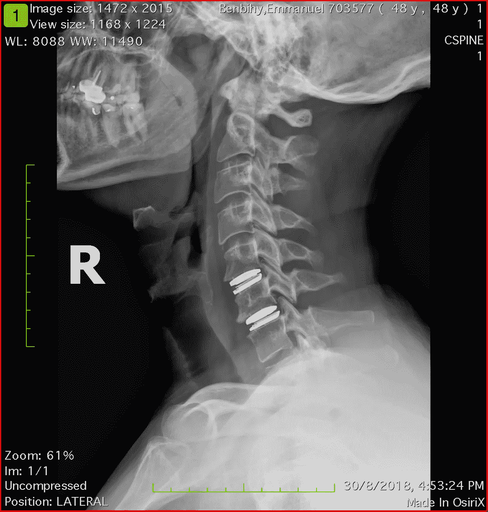

# 超人类不平等

> 原文：<https://medium.datadriveninvestor.com/transhuman-inequalities-bf180c6d9195?source=collection_archive---------16----------------------->

受文章“[启发的反应机器人革命即将到来。为什么我们不为它做父母？和超人类学家 Zoltan Istvan 的采访。](https://www.fatherly.com/love-money/robot-revolution-parenting-zoltan-istvan/)

**“谁最有钱，谁就能接触到最好的技术。”**

阅读这个超人类主义者的世界和日常愿景，他已经像超人类一样生活和思考。

My new neck and my lower back in titianium are a humble beginning!

人类的不平等。你不想知道他们的真相。

在未来的超人类看来，这个难题已经解决了。

在超级富豪的心目中也是如此。观看《疯狂富裕的亚洲人》:你会得到真正的娱乐，但你会感到比以前更穷。你会觉得被落下了…带着很多希望。希望绝对是娱乐大众的鸦片。

尽管整部电影是一个被白马王子选中加入他的世界的女人的童话，带着极度的浪漫和简单。是的，这家伙简直不可思议地像你我一样。他让梦想成真。他是希望的守护者。他不是别人，只是一个超级英雄。

这个故事有腿，对不对？这几乎是他们为我们服务的唯一一个。这个故事会越来越多。穿越的梦想对普通人来说必须是可能的。

奇点即将到来，当它到来时，超级富豪和其他人在技术方面的差距将创造出一种新的人类。一个如此不同的物种，人类将在几个月内永远分裂成两部分。

毫无疑问，在那些预见自己属于超人类的人和其他人之间，对可持续性的定义是不一样的。它将永远改变。谁想拖在一群看不见、不知道、不可能的人后面，这些人总是迟到，而且追不上。一群注定要毁灭的生物，它们延缓了人类走向未来的道路。

人类依赖于赋予他们生命的生态系统，而非人则不会。他们获得技术、知识和资源的机会将是前所未有的:这将从根本上改变他们对人类优先事项的看法。通过资本主义自我实现，你不能体面地要求超人类的精英对剩余人类的未来感到太尴尬。“很公平”，我一直很喜欢这句话。有些人应该成为变异的一部分。

劳动力将永远被改变，大多数人将没有工作。不要担心:普遍基本收入的梦想正在进行中，它是呈现在你面前的解决方案。美丽的海市蜃楼，仿佛人类是一个建立在同情和共鸣基础上的大国。

伦理。道德。价值观。未来的超人类喜欢相信这个参数将是他们生活的一部分，但不要对未来的公平定义期望过高。这不是关于帮助别人:而是关于不要摧毁他们。这是关于不要根除超人类的人性因素。

他们最大的恐惧是:一个没有道德的机器人接管并抛弃人类，包括超人类。因为很遗憾地说，但超人类知道他们的人性使他们永远不完美，在某个时候会成为一个障碍。

无论如何，保护我们的生态系统，保护我们所知道的生命从来没有像现在这样重要。超人类议程是迷人的，我们都想成为它的一部分。然而我们没有。有些人已经知道了这一点，他们正在很好地告诉你。

我们所拥有的是自然，一种我们人类无法构建的力量。

让我们确保大自然继续保护我们。让我们确保保护自然，使它不会像往常一样抛弃我们当中最弱小的人……因为在未来的岁月里，弱小的定义将会急剧扩大。

与我们的世界和谐相处，确保大自然不会对我们发怒，这是我们生存的唯一保证……大规模生存。

人类绝对是在和命运下棋。我们还在游戏中。

兄弟姐妹们，别搞砸了。❤️