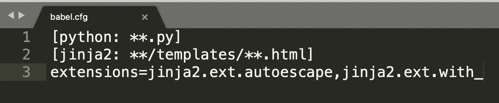
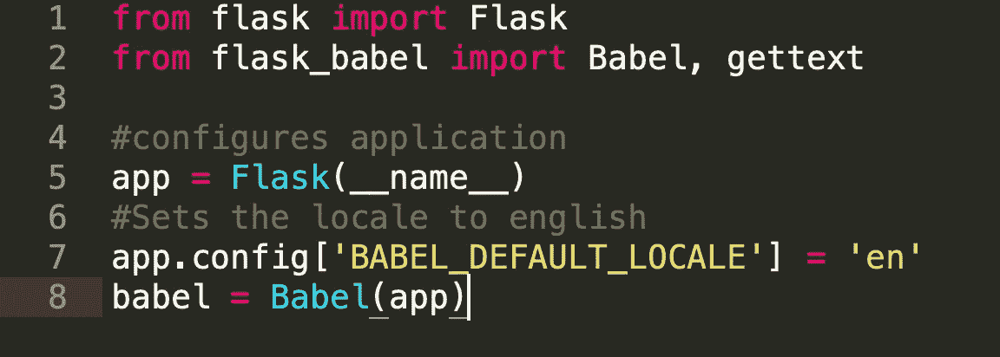
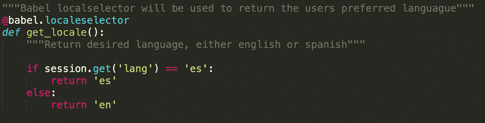
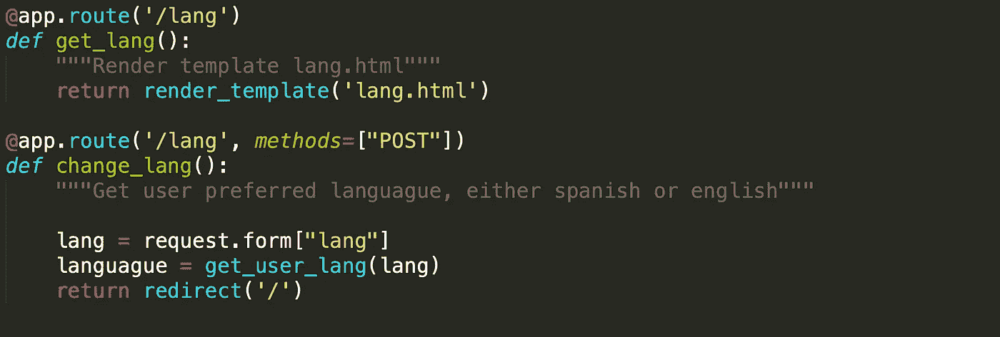
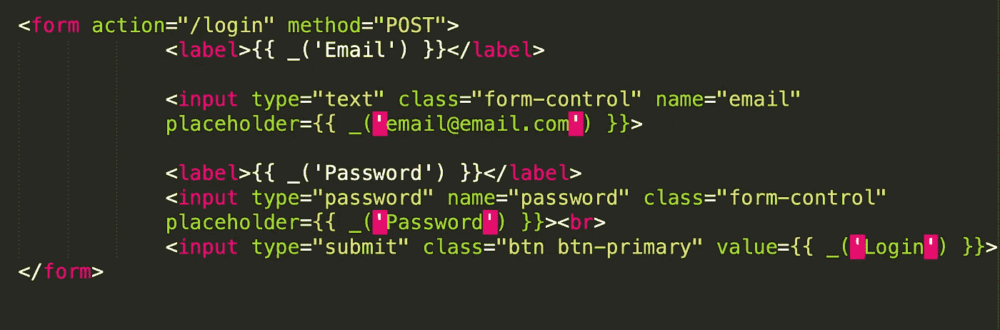
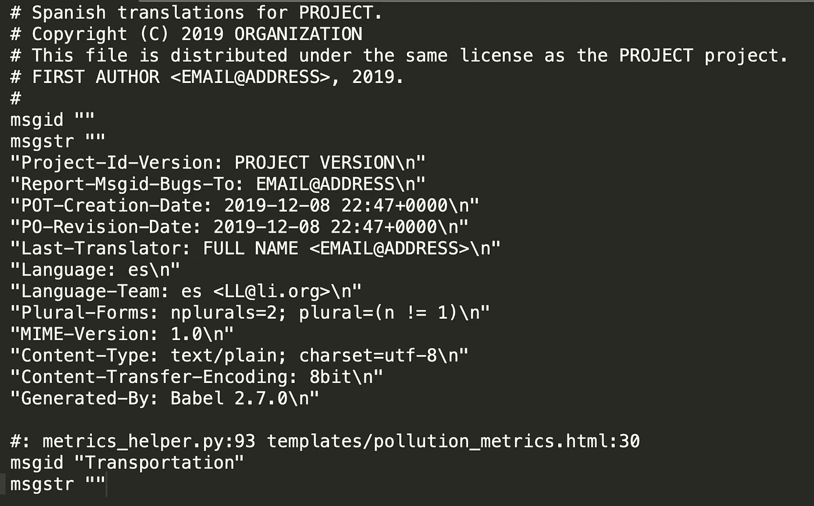
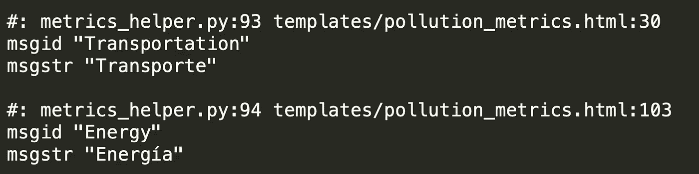

# 通过 Flask-Babel 翻译您的 Web 应用程序🌎

> 原文：<https://medium.datadriveninvestor.com/translating-your-web-app-via-flask-babel-a1561376256c?source=collection_archive---------0----------------------->

在构建我的第一个 web 应用程序时，我决定增加一个语言功能，允许用户在西班牙语和英语之间进行选择。由于这是我第一次使用 Flask-Babel 文档，所以对我来说很困惑。现在我已经实现了这个库，我想创建一个博客，供也在学习 Babel 的开发人员使用。重要的是要知道这个博客是针对那些可以手动创建翻译的开发者和那些使用 Flask 作为框架的人的，所以我们开始吧！

## 装置🚀

`$ easy_install Flask-Babel`

或者

`$ pip3 install Flask_Babel`

## 配置文件📁

一旦安装了 Babel，您将继续创建一个 ***babel.cfg*** 配置文件，并添加以下内容:

babel.cfg 让 babel 知道在哪里可以找到你的翻译。

在您的服务器文件中，您将添加以下内容来实例化 flask 和 babel。我只对 flash 消息使用了 ***gettext()*** ，所以我也导入了它。

# 后端🔙

通过 Babel，您可以根据用户的语言环境或用户偏好的浏览器语言进行翻译。然而，我设计了我的 web 应用程序，允许用户进行这些更改。为此，我创建了以下 POST 请求，然后使用***babel . locale selector***来进行这些更改。

> 有很多方法可以做到这一点，所以你可以在你的 web 应用中随意使用有意义的东西。

## gettext()

任何通过 Flask(后端)呈现给用户的消息都将以这种方式格式化。

 [## 2019 年最值得学习的编码语言|数据驱动的投资者

### 在我读大学的那几年，我跳过了很多次夜游去学习 Java，希望有一天它能帮助我在…

www.datadriveninvestor.com](https://www.datadriveninvestor.com/2019/02/21/best-coding-languages-to-learn-in-2019/) 

以下是一些例子:

# 前端(HTML 和 Jinja)

您将向 Babel 传达您希望在前端翻译某些内容的方式是使用以下格式(括号前面有下划线)，

***{{ _('翻译我')}}***

> 以下是我翻译的一些例子。您可以翻译占位符、标签、标题和输入。一切！只要您用示例格式包装它。不要翻译“name ”,因为这会导致 POST 和 GET 请求出错。

# 创建 messages.pot & messages.po💻

现在你已经安排了所有你想要翻译的字符串，我们将编译它们并创建我们的翻译文件夹。为此，我们将返回终端并键入以下内容。

> ***确保你在你的项目总监*** *y* 中做到这一点。这将允许 babel 提取您想要翻译的所有字符串(在您的服务器文件和 Jinja 模板中)

`$ pybabel extract -F babel.cfg -o messages.pot`

> 这将创建一个名为 messages.pot 的新文件作为模板。

然后，在您的终端上键入以下内容

`$ pybabel init -i messages.pot -d translations -l es`

***es 是西班牙语，但是你可以选择你喜欢的语言***

以下是其他可以选择的语言:[https://flask-user . readthedocs . io/en/v 0.6/国际化. html](https://flask-user.readthedocs.io/en/v0.6/internationalization.html)

这将创建一个名为 messages.po 的新文件，该文件将位于翻译文件夹中。Messages.po 将包含您想要翻译的所有字符串。看起来是这样的:

Looks very similar to messages.pot but it is not the same. Here you will make translations.

> 在这个文件中，您将在 **msgstr** 中进行翻译。

## 翻译完成✅

一旦你翻译了所有的字符串，你就可以用 pybabel 编译它们

`$ pybabel compile -d translations`

耶！您已经翻译了您的 Web 应用程序！😁