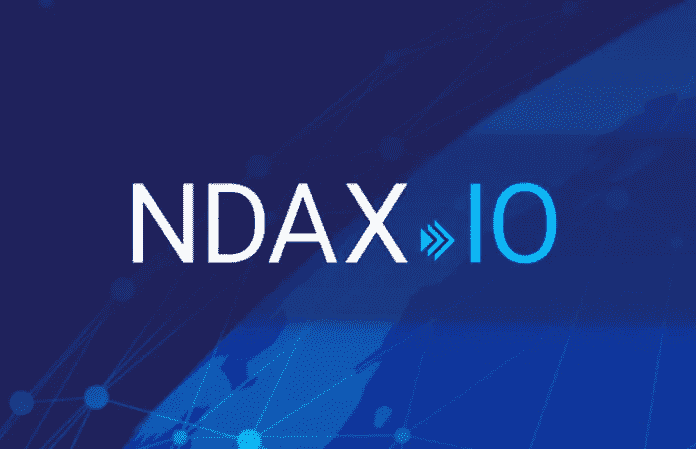

# 加密货币的透明度、流动性和信任

> 原文：<https://medium.datadriveninvestor.com/transparency-liquidity-trust-coming-to-cryptocurrency-28cd970644b?source=collection_archive---------4----------------------->

Liquidity and Transparency in Cryptocurrency

***加密货币交易所***

似乎加密交易所有两个主要问题——透明度和流动性。在发给 13 家加密货币交易所的一封信中，纽约司法部长 Eric Schneiderman 在要求提供一些主题的信息时提到了透明度问题。虽然承认加密货币代表着投资机会、技术进步，并对企业家、投资者和创新者具有启发意义，但施耐德曼也称加密货币具有“高度投机性”。此外，施奈德曼指出，除了创新和机遇，虚拟货币还会带来风险、不稳定和波动。

***纽约州总检察长推动加密交易透明化***

施奈德曼发出的每封信都包含一份 34 点深入问卷，内容涉及保险、贸易和银行关系的具体政策。Schneiderman 对透明度的推动是虚拟市场完整性倡议的关键组成部分，该倡议旨在保护投资者，同时保持加密货币市场的完整性。纽约对涉及加密货币的企业的监管框架已经相当严格——这些企业需要在该州运营之前从纽约 DFS 获得“比特许可证”。
 ***流动性或缺乏流动性***

缺乏流动性，即市场允许资产以稳定价格买卖的能力或缺乏流动性，是与加密货币相关的另一个主要问题。例如，加密货币的流动性远不如美元。市场可以轻松吸收数百万美元的交易，而不会影响美元的价值。然而，比特币的数量有限，永远不会超过 2100 万，其供应受到严格控制，并不总是可以通过一个交易所进行大量交易。一家交易所要实现高交易量，就必须拥有并保持其交易产品的足够流动性。比特币和替代币并不总是如此。
 ***加密货币交易员对加密交易所的流动性不满***

最近对加密货币交易员的一项调查发现，超过三分之一的人对主流交易所的流动性问题不满。为了应对流动性问题，加密货币需要足够有前途，以吸引那些能够积极参与交易的投资者。此外，每个密码交易所的提供商必须充分研究，以确定哪些硬币应该添加到列表中。换句话说，硬币的未来在被加入交易之前必须被彻底评估。
 ***区块流和 ICE 数据服务致力于为投资者提供“深度数据”***

ICE Data Services 与区块链技术的领先提供商 Blockstream 一起，正致力于提供有关各个加密交易所流动性的“深度数据”。Blockstream 将从各种场所接收的数据标准化，根据时间戳排序，然后转换为 FIX 消息(机器可读贸易消息传递的领先金融行业标准)。这使得交易者可以很容易地定位密码交易所之间的价格差异。由于目前投资者很难进行价格发现，Blockstream 正在为加密货币交易者带来一项受欢迎的服务。

***虚拟商品协会工作组***——***bit trex、bitFlyer USA、Bitstamp 联合双子星制定行业新标准***

虚拟商品协会工作组由 Gemini 创始人卡梅隆和泰勒·文克莱沃斯创立，其主要目标是为加密货币和区块链行业提出规则、规范和法规，并为加密货币交易领域制定新的监管标准。

> *“通过一个由行业发起的标准、合理实践和监督组成的系统，促进价格发现、效率和透明度，从而培养财务稳健、负责任和创新的虚拟商品市场……激励对操纵和欺诈行为和实践的检测和威慑，包括与监管机构合作，特别是与 CFTC 合作，以酌情共享或参考信息。”卡梅隆·文克莱沃斯*

**与此同时在加拿大……**

我采访了 T2 国家数字资产交易公司的联合创始人兼首席投资官 Omar Abbas。(NDAX。IO)，一家总部位于加拿大的数字资产交易所，关于这些问题，奥马尔不得不说…

**加密货币市场存在流动性问题吗？**

对于加密货币来说，流动性的一个重要方面是能够在需要时毫无困难地转换为法定货币。今天，全球有一个强大的可信交易所网络，这是决定加密货币流动性水平的关键因素。当比特币在 2009 年推出时，它最初几乎没有价值。在撰写本文时，比特币的市值约为 1100 亿美元，是过去十年中表现最好的资产之一。作为一种价值储存手段和一种被接受的支付方式，比特币的势头越来越大。然而，尽管如此，比特币仍未被银行、机构和政府监管机构完全接受。尽管比特币是一种主要的资产类别，但许多政府选择不支持它，这对其流动性产生了负面影响。大多数主要银行，尤其是北美的银行，不会为与比特币或任何加密货币有任何关联的公司开设银行账户。

**交易所如何提高流动性？**

融入银行系统将显著提高资金进出的速度、安全性和可负担性——这些因素增加了交易量，最终提高了流动性。赢得银行的信任和关系的一个关键方面是交易所实施符合“了解你的客户”( KYC)和反洗钱(AML)程序的健全的合规制度。一家交易所应该对其上市的替代硬币承担多大责任？

在选择一枚硬币在交易所上市时，重要的是要考虑以下风险管理因素:

**市值**:在选择一枚硬币/代币上市时，流动性是一个非常重要的品质。一般来说，我们列出的硬币的最低市值为 5 亿美元。它确保对特定资产有足够大的需求，并将折价出售的风险降至最低。

**安全**:执行技术安全评估，包括强大的 bug bounty 程序和在漏洞被披露后改进其源代码的跟踪记录，以及由第三方进行的安全审计。

**法规**:作为注册的货币服务企业(MSB)，上市硬币不能影响我们履行 FINTRAC 合规义务的能力，包括反洗钱(AML)和反恐怖融资程序。

**效用**:应该有与购买、持有或花费硬币/代币相关的效用。创始团队和执行领导层应该能够清楚地阐明其业务运营、战略和愿景，并提供数字资产存在的令人信服的理由。假设这些信息是公开的，NDAX 也将 KYC 要求应用于创始人和/或领导者。

NDAX.io

**什么步骤都有 NDAX。IO 被用来保护投资者？**

**加拿大银行:** NDAX 完全集成到加拿大银行系统中，确保客户存款留在加拿大，并允许用户以最安全、高效和合规的方式立即向其账户注入资金。

**监管框架**:我们是加拿大金融情报机构 FINTRAC 的持牌货币服务企业(MSB)。我们严格执行符合所有适用法律法规要求的反洗钱(AML)和反恐融资合规制度。

**热钱包保险** : NDAX 以热钱包存储方式(线上)持有约 2%的客户资金，其余 98%以冷存储方式(线下)持有。所有存储在网上的数字资产都是完全保险的。这意味着，如果我们的在线资产遭遇安全漏洞，我们的保险单将涵盖任何客户资产的损失。

**机构级安全**:对于离线存储，我们实施极端的安全措施。我们将加密货币存放在全球各地的安全保管库中——完全与互联网断开连接。此外，我们对用户实施了双因素授权(“2-FA”)，增加了一层额外的安全性。
T17**NDAX。IO 目前在交易所提供 5 枚硬币。有计划在不久的将来增加这个数字吗？**

我们目前提供以下 5 种币:比特币(BTC)、莱特币(LTC)、以太坊(ETH)、比特币现金(BCH)和瑞波(XRP)。作为我们正式发布的一部分，我们计划在不久的将来添加 Stellar 和 NEO。我们也在考虑增加 EOS 和 DASH。我们计划每季度增加一种新的加密货币。

**关于加密货币交易，有什么给投资者的建议吗？**

**多元化**:俗话说，不要把所有的鸡蛋放在一个篮子里。加密货币应被视为其自身的资产类别。为了最大限度地降低投资于单一市场的风险，你的投资组合应该多元化，并保持对不同资产类别的配置。

***有趣的时代***

2018 年绝对是加密市场有趣的一年。撰写本文时，加密货币正处于熊市——许多报告创下了纪录。一些分析师预测未来几个月将出现熊市，而其他分析师则预测顶级加密货币将强劲反弹。

不管怎样，我们正处于一个有趣的时代。

***“愿你永远生活在有趣的时代。”——中国诅咒***

Pexels.com — Worldspectrum

# 奥黛丽·奈斯比特

[奥黛丽·奈斯比特在领英上](https://www.linkedin.com/in/audrey-nesbitt-0388a52a/)

[@ audreynesbit 11 在推特上](https://twitter.com/AudreyNesbitt11)